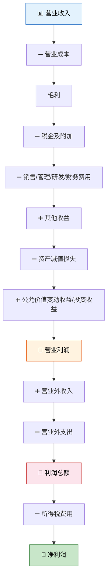

# 利润表

> 利润表是企业的"录像带"——资产负债表是某一天的快照，利润表则是一段时间内的"赚钱故事"。它告诉你：收入从哪来、费用往哪去、最后赚了多少。就像柠檬水站一天下来，数数卖了多少钱、花了多少成本，算算净赚多少。

---

## 一、利润表的概念与作用

### 1.1 什么是利润表？

利润表是反映企业在**一定会计期间**经营成果的报表，其核心等式：

$$
利润 = 收入 - 费用
$$

::: tip 利润表 vs 资产负债表
| 对比项 | 资产负债表 | 利润表 |
|-------|-----------|-------|
| 时间特征 | 时点报表（某一天） | 期间报表（某段时期） |
| 核心等式 | 资产 = 负债 + 权益 | 利润 = 收入 − 费用 |
| 提供信息 | 财务状况 | 经营成果 |
:::

### 1.2 利润表的作用

| 作用 | 说明 |
|------|------|
| 评价盈利能力 | 营业利润率、销售净利率 |
| 分析利润构成 | 主营业务 vs 非经常性损益 |
| 预测未来收益 | 历史趋势推断 |
| 评估管理绩效 | 收入增长、成本控制 |

---

## 二、利润表的结构与格式——多步式

我国利润表采用**多步式**格式，分步计算各层次利润：



**三步核心：**

| 步骤 | 计算关系 | 含义 |
|------|---------|------|
| 第一步 | 营业利润 | 日常经营活动的成果 |
| 第二步 | 利润总额 | 考虑营业外收支的成果 |
| 第三步 | 净利润 | 扣除所得税后的最终利润 |

---

## 三、利润表各项目的填列

### 3.1 营业收入

$$
营业收入 = 主营业务收入 + 其他业务收入
$$

### 3.2 营业成本

$$
营业成本 = 主营业务成本 + 其他业务成本
```

### 3.3 税金及附加

包括消费税、城市维护建设税、教育费附加、资源税、房产税、城镇土地使用税、车船税、印花税等。

::: important 增值税不在利润表中！
增值税是**价外税**，不通过"税金及附加"科目核算，不在利润表中体现。只有价内税（消费税、城建税等）才影响利润。
:::

### 3.4 期间费用

| 费用项目 | 核算内容 |
|---------|---------|
| **销售费用** | 广告费、运输费、专设销售机构经费 |
| **管理费用** | 行政管理部门费用、业务招待费、研究费用（费用化部分） |
| **研发费用** | 研究阶段支出+开发阶段不符合资本化条件的支出 |
| **财务费用** | 利息支出（减利息收入）、汇兑损益、手续费 |

### 3.5 资产减值损失

反映企业计提各项资产减值准备所形成的损失：

```text
借：资产减值损失
    贷：坏账准备 / 存货跌价准备 / 固定资产减值准备 / 无形资产减值准备
```

::: warning 减值准备不可转回
长期资产（固定资产、无形资产、长期股权投资等）的减值准备一经计提，**不得转回**。但存货跌价准备和坏账准备可以转回。
:::

### 3.6 公允价值变动收益

反映企业交易性金融资产等公允价值变动形成的收益（损失以"−"号填列）。

### 3.7 投资收益

反映企业对外投资所取得的收益（损失以"−"号填列），包括：

- 权益法核算的长期股权投资收益
- 成本法核算的股利收入
- 处置投资的损益

### 3.8 营业利润

$$
营业利润 = 营业收入 - 营业成本 - 税金及附加 - 销售费用 - 管理费用 - 研发费用 - 财务费用 + 其他收益 - 资产减值损失 + 公允价值变动收益 + 投资收益
$$

### 3.9 营业外收入与营业外支出

| 项目 | 营业外收入 | 营业外支出 |
|------|-----------|-----------|
| 内容 | 非流动资产毁损报废收益、债务重组利得、政府补助（与日常活动无关的）、盘盈利得 | 非流动资产毁损报废损失、债务重组损失、公益性捐赠支出、非常损失、盘亏损失 |

::: important 营业外 ≠ 营业
营业外收支与**日常经营活动无关**，具有偶发性。一个健康的企业，营业利润应占利润总额的绝大比重。如果营业外收入占利润总额比例过高，需警惕"主业不赚钱，靠变卖资产过日子"的风险。
:::

### 3.10 所得税费用

$$
所得税费用 = 利润总额 \times 适用税率 + 递延所得税
$$

注意：所得税费用 ≠ 应交所得税。所得税费用遵循**资产负债表债务法**，考虑暂时性差异的递延所得税影响。

### 3.11 每股收益

| 指标 | 公式 |
|------|------|
| **基本每股收益** | 归属于普通股股东的净利润 ÷ 发行在外普通股加权平均数 |
| **稀释每股收益** | 考虑可转换公司债券、认股权证等稀释性潜在普通股 |

---

## 四、利润表的编制实例

### 4.1 已知数据

某公司 2025 年度有关损益类科目累计发生额：

| 科目 | 借方发生额 | 贷方发生额 |
|------|-----------|-----------|
| 主营业务收入 | | 5,000,000 |
| 其他业务收入 | | 600,000 |
| 主营业务成本 | 3,200,000 | |
| 其他业务成本 | 400,000 | |
| 税金及附加 | 120,000 | |
| 销售费用 | 350,000 | |
| 管理费用 | 480,000 | |
| 研发费用 | 200,000 | |
| 财务费用 | 80,000 | |
| 其他收益 | | 50,000 |
| 资产减值损失 | 60,000 | |
| 公允价值变动收益 | | 30,000 |
| 投资收益 | | 100,000 |
| 营业外收入 | | 80,000 |
| 营业外支出 | 30,000 | |
| 所得税费用 | 237,500 | |

### 4.2 分步计算

**第一步：营业利润**

| 项目 | 金额 |
|------|------|
| 营业收入 | 5,000,000 + 600,000 = 5,600,000 |
| 减：营业成本 | 3,200,000 + 400,000 = 3,600,000 |
| 减：税金及附加 | 120,000 |
| 减：销售费用 | 350,000 |
| 减：管理费用 | 480,000 |
| 减：研发费用 | 200,000 |
| 减：财务费用 | 80,000 |
| 加：其他收益 | 50,000 |
| 减：资产减值损失 | 60,000 |
| 加：公允价值变动收益 | 30,000 |
| 加：投资收益 | 100,000 |
| **营业利润** | **990,000** |

**第二步：利润总额**

| 项目 | 金额 |
|------|------|
| 营业利润 | 990,000 |
| 加：营业外收入 | 80,000 |
| 减：营业外支出 | 30,000 |
| **利润总额** | **1,040,000** |

**第三步：净利润**

| 项目 | 金额 |
|------|------|
| 利润总额 | 1,040,000 |
| 减：所得税费用 | 237,500 |
| **净利润** | **802,500** |

### 4.3 完整利润表

**利润表**

编制单位：某公司　　2025年度　　单位：元

| 项目 | 本期金额 | 上期金额（略） |
|------|---------|--------------|
| 一、营业收入 | 5,600,000 | |
| 减：营业成本 | 3,600,000 | |
| 税金及附加 | 120,000 | |
| 销售费用 | 350,000 | |
| 管理费用 | 480,000 | |
| 研发费用 | 200,000 | |
| 财务费用 | 80,000 | |
| 加：其他收益 | 50,000 | |
| 投资收益 | 100,000 | |
| 公允价值变动收益 | 30,000 | |
| 信用减值损失 | | |
| 资产减值损失 | -60,000 | |
| 资产处置收益 | | |
| **二、营业利润** | **990,000** | |
| 加：营业外收入 | 80,000 | |
| 减：营业外支出 | 30,000 | |
| **三、利润总额** | **1,040,000** | |
| 减：所得税费用 | 237,500 | |
| **四、净利润** | **802,500** | |
| （一）持续经营净利润 | 802,500 | |
| （二）终止经营净利润 | — | |
| **五、其他综合收益的税后净额** | — | |
| **六、综合收益总额** | **802,500** | |
| **七、每股收益** | | |
| 基本每股收益（元/股） | 0.80 | |
| 稀释每股收益（元/股） | 0.80 | |

> 注：假设发行在外普通股 1,000,000 股，无稀释性潜在普通股。

---

## 五、练习题

### 练习1：利润表填列

某企业2025年度损益类科目累计发生额：主营业务收入 ¥3,000,000，其他业务收入 ¥200,000，主营业务成本 ¥1,800,000，其他业务成本 ¥120,000，税金及附加 ¥80,000，销售费用 ¥200,000，管理费用 ¥300,000，财务费用 ¥50,000，投资收益 ¥60,000，营业外收入 ¥40,000，营业外支出 ¥20,000，所得税税率 25%。

要求：计算营业利润、利润总额和净利润。

::: details 参考答案
- **营业收入** = 3,000,000＋200,000 = 3,200,000
- **营业成本** = 1,800,000＋120,000 = 1,920,000
- **营业利润** = 3,200,000−1,920,000−80,000−200,000−300,000−50,000＋60,000 = **¥710,000**
- **利润总额** = 710,000＋40,000−20,000 = **¥730,000**
- **所得税费用** = 730,000×25% = ¥182,500
- **净利润** = 730,000−182,500 = **¥547,500**
:::

### 练习2：判断题

1. 增值税应交金额应在利润表"税金及附加"项目中列示。（　）
2. 营业利润包含营业外收入。（　）
3. 固定资产减值准备一经计提不得转回。（　）
4. 利润表是反映企业某一时点经营成果的报表。（　）

::: details 参考答案
1. **×**　增值税是价外税，不在利润表中列示
2. **×**　营业利润不含营业外收入，营业外收入在计算利润总额时才加入
3. **√**　长期资产减值准备不得转回
4. **×**　利润表是期间报表，反映一段时间（而非某一时点）的经营成果
:::

### 练习3：综合计算

某公司 2025 年度营业收入 ¥10,000,000，营业成本 ¥6,500,000，税金及附加 ¥200,000，期间费用合计 ¥1,800,000，投资收益 ¥150,000，资产减值损失 ¥100,000，营业外收入 ¥50,000，营业外支出 ¥80,000。所得税税率 25%。

要求：
1. 计算营业利润
2. 计算利润总额
3. 计算净利润
4. 如果发行在外普通股 500 万股，计算基本每股收益

::: details 参考答案
1. **营业利润** = 10,000,000−6,500,000−200,000−1,800,000＋150,000−100,000 = **¥1,550,000**
2. **利润总额** = 1,550,000＋50,000−80,000 = **¥1,520,000**
3. **净利润** = 1,520,000×(1−25%) = **¥1,140,000**
4. **基本每股收益** = 1,140,000÷5,000,000 = **¥0.228/股**
:::

---

::: tip 面试速查
1. **利润表是期间报表**，不是时点报表
2. **多步式三步**：营业利润 → 利润总额 → 净利润
3. **营业利润公式**：营业收入−营业成本−税金及附加−四项期间费用＋其他收益−资产减值损失＋公允价值变动＋投资收益
4. **增值税不在利润表**——它是价外税
5. **长期资产减值不得转回**，存货跌价和坏账可以转回
6. **营业外收支**与日常经营无关，占比过高需警惕
7. **基本每股收益** = 归属于普通股股东的净利润 ÷ 加权平均股数
:::

---

::: info 原著参考
- 《基础会计第7版》第九章"财务报告"：详细阐述了利润表的多步式结构及各项目填列方法
- 《世界上最简单的会计书》：柠檬水站每天结账——卖出多少杯、材料花了多少、净赚多少，就是最朴素的利润表
:::
