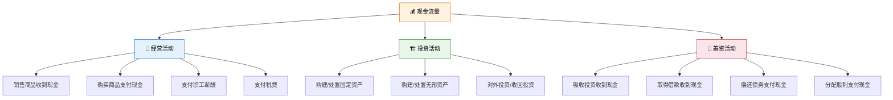
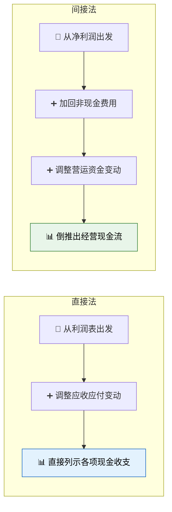
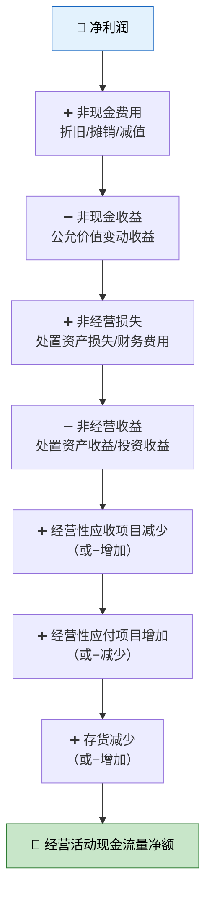

# 现金流量表

> 利润表告诉你"赚了多少"，但不一定等于"到手多少"——因为利润可以挂在应收账款上，而现金流量表只认一个字：**钱到账了没有？** 它是企业的"现金流体温计"，有利润没现金流的企业，就像纸上富贵的柠檬水站——账面赚钱，口袋空空。

---

## 一、现金及现金等价物

### 1.1 概念界定

| 项目 | 定义 | 举例 |
|------|------|------|
| **现金** | 库存现金 + 可随时用于支付的存款 | 库存现金、银行活期存款 |
| **现金等价物** | 期限短（≤3个月）、流动性强、价值变动风险小 | 3个月内到期的国库券、商业汇票 |

::: important 现金 ≠ 货币资金
现金流量表中的"现金"范围不同于资产负债表的"货币资金"：定期存款如果不能随时支取，则不属于现金；而3个月内到期的短期债券投资则属于现金等价物。
:::

### 1.2 现金流量的概念

现金流量是指**现金及现金等价物的流入和流出**。现金流量表排除非现金交易（如折旧、摊销），只关注真正的"钱"的流动。

---

## 二、现金流量的三大分类

### 2.1 经营活动现金流量

经营活动是企业**投资活动和筹资活动以外的所有交易和事项**，即日常经营活动。

| 流入 | 流出 |
|------|------|
| 销售商品、提供劳务收到的现金 | 购买商品、接受劳务支付的现金 |
| 收到的税费返还 | 支付给职工以及为职工支付的现金 |
| 收到其他与经营活动有关的现金 | 支付的各项税费 |
| | 支付其他与经营活动有关的现金 |

### 2.2 投资活动现金流量

投资活动是企业**长期资产的购建和不包括在现金等价物范围内的投资及其处置**。

| 流入 | 流出 |
|------|------|
| 收回投资收到的现金 | 购建固定资产、无形资产支付的现金 |
| 取得投资收益收到的现金 | 投资支付的现金 |
| 处置固定资产等收回的现金净额 | 取得子公司支付的现金净额 |
| 收到其他与投资活动有关的现金 | 支付其他与投资活动有关的现金 |

::: warning 投资活动的易混淆点
- **购买股票债券**：属于投资活动（但如果期限≤3个月，属于现金等价物，不产生现金流量）
- **应收股利和应收利息**：经营活动的债权（与投资收益配对），但**收到的股利和利息**归属要看情况：股利收入通常属于投资活动，利息收入通常属于经营活动
- **融资租入固定资产**：租赁付款额属于筹资活动，不属于投资活动
:::

### 2.3 筹资活动现金流量

筹资活动是导致企业**资本及债务规模和构成发生变化**的活动。

| 流入 | 流出 |
|------|------|
| 吸收投资收到的现金 | 偿还债务支付的现金 |
| 取得借款收到的现金 | 分配股利、利润或偿付利息支付的现金 |
| 收到其他与筹资活动有关的现金 | 支付其他与筹资活动有关的现金 |

### 2.4 特殊项目的分类

| 特殊项目 | 分类 | 原因 |
|---------|------|------|
| 增值税 | 经营活动 | 日常经营中产生 |
| 罚款收支 | 经营活动 | 与日常经营相关 |
| 捐赠收支 | 经营或筹资活动 | 与日常经营相关的计入经营活动 |
| 融资租赁付款 | 筹资活动 | 本质是融资行为 |

---

## 三、直接法与间接法

### 3.1 编制方法对比

| 对比项 | 直接法 | 间接法 |
|-------|--------|--------|
| 起点不同 | 从营业收入出发 | 从净利润出发 |
| 列示方式 | 直接列示各项现金流入/流出 | 通过调整项目倒推 |
| 优点 | 直观反映现金来源与用途 | 揭示净利润与经营现金流的差异 |
| 缺点 | 编制工作量大 | 不直观 |
| 报表位置 | 正表 | 补充资料 |

::: important 我国规定
我国企业会计准则要求：**正表采用直接法**编制经营活动现金流量，**补充资料采用间接法**将净利润调节为经营活动现金流量。两种方法的结果必须一致。
:::

### 3.2 直接法关键调整公式

| 项目 | 调整公式 |
|------|---------|
| 销售商品收到的现金 | 营业收入 + 应收账款减少（−增加）+ 预收账款增加（−减少） |
| 购买商品支付的现金 | 营业成本 + 存货增加（−减少）+ 应付账款减少（−增加）+ 预付账款增加（−减少） |

### 3.3 间接法调整步骤

---

## 四、经营活动现金流量各项目

### 4.1 销售商品、提供劳务收到的现金

$$
= 营业收入 + 应交税费（增值税销项税额） + 应收账款（期初−期末） + 应收票据（期初−期末） + 预收账款（期末−期初） − 本期核销的坏账
$$

### 4.2 购买商品、接受劳务支付的现金

$$
= 营业成本 + 应交税费（增值税进项税额） + 存货（期末−期初） + 应付账款（期初−期末） + 应付票据（期初−期末） + 预付账款（期末−期初） − 计入生产成本的职工薪酬 − 计入制造费用的折旧
$$

### 4.3 支付给职工以及为职工支付的现金

$$
= 生产成本/管理费用/销售费用中的职工薪酬 + 应付职工薪酬（期初−期末） − 在建工程人员薪酬
$$

::: warning 在建工程人员薪酬
在建工程人员的薪酬属于**投资活动**（购建固定资产），不属于经营活动，需要从"支付给职工"中剔除。
:::

### 4.4 支付的各项税费

$$
= 所得税费用 + 税金及附加 + 应交税费（期初−期末） − 不涉及现金的部分
$$

---

## 五、现金流量表编制实例

### 5.1 已知资料

某公司 2025 年度有关资料：

**利润表数据：**

| 项目 | 金额 |
|------|------|
| 营业收入 | 8,000,000 |
| 营业成本 | 5,000,000 |
| 税金及附加 | 100,000 |
| 销售费用 | 300,000 |
| 管理费用 | 500,000（含折旧 200,000） |
| 财务费用 | 80,000（全部为利息支出） |
| 投资收益 | 50,000 |
| 营业外收入 | 30,000（处置固定资产净收益） |
| 所得税费用 | 525,000 |
| 净利润 | 1,275,000 |

**资产负债表变动：**

| 项目 | 期末 | 期初 | 变动 |
|------|------|------|------|
| 应收账款 | 500,000 | 400,000 | +100,000 |
| 预收账款 | 200,000 | 150,000 | +50,000 |
| 存货 | 600,000 | 500,000 | +100,000 |
| 应付账款 | 350,000 | 300,000 | +50,000 |
| 预付账款 | 100,000 | 80,000 | +20,000 |
| 应付职工薪酬 | 50,000 | 40,000 | +10,000 |
| 应交税费 | 80,000 | 100,000 | −20,000 |

**其他信息：**
- 增值税销项税额 ¥680,000，进项税额 ¥520,000
- 本期购建固定资产支付现金 ¥600,000
- 本期取得借款 ¥500,000，偿还借款 ¥300,000
- 本期支付现金股利 ¥400,000

### 5.2 直接法计算

**经营活动：**

| 项目 | 计算过程 | 金额 |
|------|---------|------|
| 销售商品收到现金 | 8,000,000+680,000−100,000+50,000 | 8,630,000 |
| 购买商品支付现金 | 5,000,000+520,000+100,000−50,000+20,000−200,000 | 5,390,000 |
| 支付给职工的现金 | 500,000−200,000−10,000（应付增加）≈290,000 | 290,000 |
| 支付的各项税费 | 100,000+525,000+20,000 | 645,000 |

**经营活动现金流量净额** = 8,630,000−5,390,000−290,000−645,000 = **3,305,000**

> 注：上述为简化计算，实际中需更细致地分离各费用中的现金与非现金部分。

**投资活动：**

| 项目 | 金额 |
|------|------|
| 购建固定资产支付的现金 | −600,000 |
| 取得投资收益收到的现金 | 50,000 |
| 处置固定资产收回的现金净额 | 30,000（营业外收入） |
| **投资活动现金流量净额** | **−520,000** |

**筹资活动：**

| 项目 | 金额 |
|------|------|
| 取得借款收到的现金 | 500,000 |
| 偿还债务支付的现金 | −300,000 |
| 分配股利、偿付利息支付的现金 | −400,000−80,000 = −480,000 |
| **筹资活动现金流量净额** | **−280,000** |

### 5.3 完整现金流量表（简化版）

**现金流量表**

编制单位：某公司　　2025年度　　单位：元

| 项目 | 金额 |
|------|------|
| **一、经营活动产生的现金流量** | |
| 销售商品、提供劳务收到的现金 | 8,630,000 |
| 收到的税费返还 | — |
| 收到其他与经营活动有关的现金 | — |
| **经营活动现金流入小计** | **8,630,000** |
| 购买商品、接受劳务支付的现金 | 5,390,000 |
| 支付给职工以及为职工支付的现金 | 290,000 |
| 支付的各项税费 | 645,000 |
| 支付其他与经营活动有关的现金 | — |
| **经营活动现金流出小计** | **6,325,000** |
| **经营活动产生的现金流量净额** | **2,305,000** |
| | |
| **二、投资活动产生的现金流量** | |
| 收回投资收到的现金 | — |
| 取得投资收益收到的现金 | 50,000 |
| 处置固定资产等收回的现金净额 | 30,000 |
| **投资活动现金流入小计** | **80,000** |
| 购建固定资产、无形资产支付的现金 | 600,000 |
| **投资活动现金流出小计** | **600,000** |
| **投资活动产生的现金流量净额** | **−520,000** |
| | |
| **三、筹资活动产生的现金流量** | |
| 取得借款收到的现金 | 500,000 |
| **筹资活动现金流入小计** | **500,000** |
| 偿还债务支付的现金 | 300,000 |
| 分配股利、偿付利息支付的现金 | 480,000 |
| **筹资活动现金流出小计** | **780,000** |
| **筹资活动产生的现金流量净额** | **−280,000** |
| | |
| **四、汇率变动对现金的影响** | — |
| **五、现金及现金等价物净增加额** | **1,505,000** |
| 加：期初现金及现金等价物余额 | 500,000 |
| **六、期末现金及现金等价物余额** | **2,005,000** |

---

## 六、补充资料——间接法

### 6.1 将净利润调节为经营活动现金流量

| 项目 | 金额 |
|------|------|
| 净利润 | 1,275,000 |
| 加：资产减值准备 | — |
| 固定资产折旧 | 200,000 |
| 无形资产摊销 | — |
| 长期待摊费用摊销 | — |
| 处置固定资产损失（−收益） | −30,000 |
| 财务费用 | 80,000 |
| 投资损失（−收益） | −50,000 |
| 递延所得税资产减少 | — |
| 存货的减少（−增加） | −100,000 |
| 经营性应收项目的减少（−增加） | −100,000 |
| 经营性应付项目的增加（−减少） | 30,000 |
| **经营活动产生的现金流量净额** | **1,305,000** |

::: tip 间接法核心逻辑
净利润是按**权责发生制**算的，现金流量是按**收付实现制**算的。间接法就是在两者之间搭桥：
1. **加回非现金费用**：折旧、摊销、减值（扣了利润但没付钱）
2. **剔除非经营损益**：投资收益、处置收益（不是经营活动）
3. **调整营运资金变动**：应收增加→钱没收回来、应付增加→钱没付出去
:::

---

## 七、练习题

### 练习1：现金流量分类

判断下列交易属于经营活动（O）、投资活动（I）还是筹资活动（F）：

1. 销售商品收到货款（　）
2. 购买设备支付现金（　）
3. 向银行借款收到现金（　）
4. 支付员工工资（　）
5. 收到现金股利（　）
6. 支付现金股利（　）
7. 偿还银行借款（　）
8. 出售旧设备收到现金（　）

::: details 参考答案
1. **O** 经营活动
2. **I** 投资活动
3. **F** 筹资活动
4. **O** 经营活动
5. **I** 投资活动（股利收入属于投资活动）
6. **F** 筹资活动
7. **F** 筹资活动
8. **I** 投资活动
:::

### 练习2：直接法计算

某企业营业收入 ¥5,000,000，应收账款期初 ¥600,000、期末 ¥400,000，预收账款期初 ¥100,000、期末 ¥200,000，增值税销项税额 ¥400,000。

要求：计算"销售商品、提供劳务收到的现金"。

::: details 参考答案
销售商品收到现金 = 5,000,000 + 400,000 +（600,000−400,000）+（200,000−100,000）= **¥5,700,000**
:::

### 练习3：间接法调整

某企业净利润 ¥800,000，管理费用中含折旧 ¥120,000，财务费用（利息）¥60,000，投资收益 ¥40,000，应收账款增加 ¥100,000，存货减少 ¥50,000，应付账款增加 ¥30,000。

要求：用间接法计算经营活动现金流量净额。

::: details 参考答案

| 项目 | 金额 |
|------|------|
| 净利润 | 800,000 |
| 加：折旧 | 120,000 |
| 加：财务费用 | 60,000 |
| 减：投资收益 | −40,000 |
| 减：应收增加 | −100,000 |
| 加：存货减少 | 50,000 |
| 加：应付增加 | 30,000 |
| **经营活动现金流量净额** | **920,000** |
:::

---

::: tip 面试速查
1. **三大分类**：经营活动（日常）、投资活动（长期资产/投资）、筹资活动（资本/借款）
2. **直接法**→正表：从收入出发，逐项列示现金收支
3. **间接法**→补充资料：从净利润出发，加回非现金费用，调整营运资金
4. **关键公式**：销售收到现金 = 收入 + 销项税 + 应收减少 + 预收增加
5. **在建工程人员薪酬**属于投资活动，不在经营活动中
6. **增值税**属于经营活动现金流
7. **有利润没现金流**是危险信号——可能是应收膨胀、存货积压
:::

---

::: info 原著参考
- 《基础会计第7版》第九章"财务报告"：详细阐述了现金流量表的结构、编制方法及三大分类
- 《世界上最简单的会计书》：柠檬水站现金收入 vs 利润的区别——赊销给邻居2杯柠檬水，利润表确认了收入，但口袋里没多一分钱，这就是为什么需要现金流量表
:::
