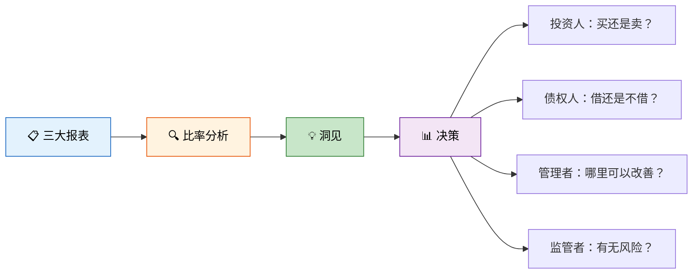
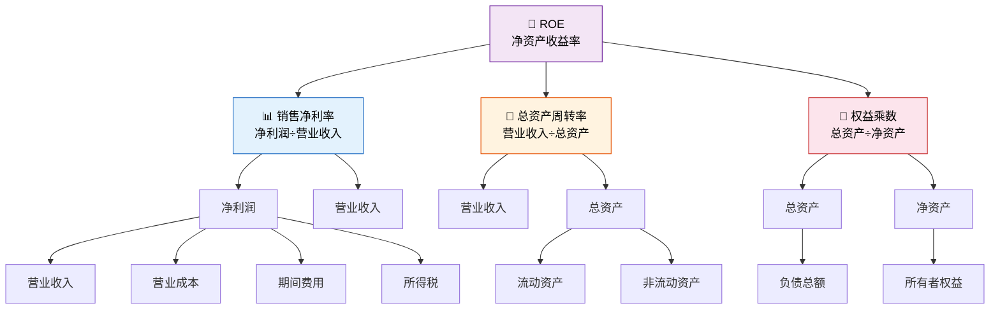

# 财务报表分析

> 财务报表是企业的"体检报告"，但体检报告本身只是数据——报表分析才是"诊断"。就像两个柠檬水站，一家收入高但欠一屁股债，另一家收入一般但现金流充裕，谁更健康？比率分析就是那把"听诊器"，杜邦分析则是"X光片"，帮你看清利润的骨骼结构。

---

## 一、财务分析的目的

### 1.1 为什么需要财务分析？

财务报表是历史数据的汇总，但决策需要**洞见**——财务分析就是从数字中提取信息的过程。



### 1.2 分析框架——四维评估

| 维度 | 核心问题 | 对应比率 |
|------|---------|---------|
| **偿债能力** | 还得起钱吗？ | 流动比率、资产负债率 |
| **营运能力** | 资产转得快吗？ | 应收账款周转率、存货周转率 |
| **盈利能力** | 赚得多吗？ | 销售净利率、ROE |
| **发展能力** | 未来能增长吗？ | 营收增长率、净利增长率 |

---

## 二、偿债能力分析

### 2.1 短期偿债能力

#### （1）流动比率

$$
流动比率 = \frac{流动资产}{流动负债}
$$

| 判断标准 | 含义 |
|---------|------|
| > 2 | 短期偿债能力较强 |
| 1.5~2 | 较为合理 |
| < 1.5 | 可能存在短期偿债风险 |

::: warning 流动比率的局限
流动比率高不一定好——可能是存货积压或应收账款膨胀导致的。要结合存货和应收账款的质量判断。
:::

#### （2）速动比率

$$
速动比率 = \frac{速动资产}{流动负债} = \frac{流动资产 - 存货 - 预付款项}{流动负债}
$$

| 判断标准 | 含义 |
|---------|------|
| > 1 | 短期偿债能力有保障 |
| 0.8~1 | 尚可 |
| < 0.8 | 风险较大 |

::: tip 为什么剔除存货？
存货是流动资产中**变现速度最慢**的项目，而且可能存在跌价风险。速动比率剔除了存货的"水分"，更能反映企业"立刻能还钱"的能力。
:::

#### （3）现金比率

$$
现金比率 = \frac{货币资金 + 交易性金融资产}{流动负债}
$$

现金比率是最保守的短期偿债指标，反映企业不动用任何应收款项和存货就能偿还短期债务的能力。

### 2.2 长期偿债能力

#### （1）资产负债率

$$
资产负债率 = \frac{负债总额}{资产总额} \times 100\%
```

| 判断标准 | 含义 |
|---------|------|
| < 40% | 偿债风险低，但可能财务杠杆不足 |
| 40%~60% | 较为合理 |
| > 70% | 偿债风险较高 |

::: important 不同角色的视角
- **债权人**：希望资产负债率越低越好（安全）
- **股东**：适度负债可以利用财务杠杆提高ROE
- **经营者**：在收益与风险之间权衡
:::

#### （2）产权比率

$$
产权比率 = \frac{负债总额}{所有者权益总额} \times 100\%
$$

产权比率反映企业资本结构中负债与权益的比例关系，是资产负债率的补充。

#### （3）利息保障倍数

$$
利息保障倍数 = \frac{息税前利润}{利息费用} = \frac{利润总额 + 利息费用}{利息费用}
$$

利息保障倍数反映企业用经营利润支付利息的能力。倍数越大，付息能力越强。

---

## 三、营运能力分析

营运能力分析衡量企业资产的管理效率——**同样的资产，转得越快，赚得越多**。

### 3.1 应收账款周转率

$$
应收账款周转率 = \frac{营业收入}{应收账款平均余额}
$$

$$
应收账款周转天数 = \frac{365}{应收账款周转率}
$$

| 判断 | 说明 |
|------|------|
| 周转率高 | 收账速度快、坏账损失少 |
| 周转率低 | 收账慢、资金被占用、坏账风险大 |

::: tip 应收账款平均余额
$$
应收账款平均余额 = \frac{期初应收账款 + 期末应收账款}{2}
$$
注意：应收账款应包含坏账准备前的金额，并考虑重分类（预收账款的借方余额）。
:::

### 3.2 存货周转率

$$
存货周转率 = \frac{营业成本}{存货平均余额}
$$

$$
存货周转天数 = \frac{365}{存货周转率}
$$

| 判断 | 说明 |
|------|------|
| 周转率高 | 存货变现快、占用资金少 |
| 周转率低 | 存货积压、资金效率低 |

::: warning 存货周转率的行业差异
超市的存货周转率可能高达20次/年，而房地产公司可能不到0.5次/年。跨行业比较无意义，同行业对比才有价值。
:::

### 3.3 总资产周转率

$$
总资产周转率 = \frac{营业收入}{总资产平均余额}
$$

反映企业全部资产的利用效率，综合衡量"1元资产能产生多少收入"。

### 3.4 营运能力指标汇总

| 指标 | 公式 | 周转天数 |
|------|------|---------|
| 应收账款周转率 | 营业收入÷应收账款平均余额 | 365÷周转率 |
| 存货周转率 | 营业成本÷存货平均余额 | 365÷周转率 |
| 流动资产周转率 | 营业收入÷流动资产平均余额 | 365÷周转率 |
| 总资产周转率 | 营业收入÷总资产平均余额 | 365÷周转率 |

---

## 四、盈利能力分析

### 4.1 销售净利率

$$
销售净利率 = \frac{净利润}{营业收入} \times 100\%
$$

反映每1元营业收入最终能带来多少净利润。

### 4.2 资产净利率（ROA）

$$
资产净利率 = \frac{净利润}{总资产平均余额} \times 100\%
$$

反映企业利用全部资产获取利润的能力。

### 4.3 净资产收益率（ROE）

$$
净资产收益率 = \frac{净利润}{净资产平均余额} \times 100\%
$$

ROE是衡量股东投资回报的核心指标，也是**杜邦分析**的起点。

### 4.4 毛利率

$$
毛利率 = \frac{营业收入 - 营业成本}{营业收入} \times 100\%
$$

---

## 五、杜邦分析法

### 5.1 杜邦分析的核心思想

杜邦分析法将ROE拆解为三个驱动因素，揭示利润的**来源结构**：

$$
ROE = 销售净利率 \times 总资产周转率 \times 权益乘数
$$



### 5.2 三个驱动因素的含义

| 驱动因素 | 衡量什么 | 高值意味着 |
|---------|---------|----------|
| **销售净利率** | 盈利能力 | 产品附加值高、成本控制好 |
| **总资产周转率** | 营运能力 | 资产利用效率高、周转快 |
| **权益乘数** | 财务杠杆 | 负债比例高、杠杆效应大 |

### 5.3 杜邦分析的实战解读

**三种赚钱模式：**

| 模式 | 代表企业 | 特点 |
|------|---------|------|
| 高净利率型 | 奢侈品、软件 | 卖得贵、毛利高 |
| 高周转率型 | 超市、快消品 | 薄利多销、转得快 |
| 高杠杆型 | 银行、房地产 | 借钱生钱、杠杆放大 |

::: important 杠杆是把双刃剑
权益乘数越高，ROE可能越高，但风险也越大——赚的时候放大收益，亏的时候同样放大亏损。健康的ROE应主要由**销售净利率**和**总资产周转率**驱动，而非过度依赖杠杆。
:::

### 5.4 权益乘数的推导

$$
权益乘数 = \frac{总资产}{净资产} = \frac{1}{1 - 资产负债率}
$$

资产负债率越高 → 权益乘数越大 → 财务杠杆效应越强。

---

## 六、发展能力分析

| 指标 | 公式 | 含义 |
|------|------|------|
| 营业收入增长率 | （本期收入−上期收入）÷上期收入 × 100% | 市场拓展能力 |
| 净利润增长率 | （本期净利−上期净利）÷上期净利 × 100% | 盈利增长能力 |
| 总资产增长率 | （期末资产−期初资产）÷期初资产 × 100% | 规模扩张速度 |
| 资本积累率 | （期末净资产−期初净资产）÷期初净资产 × 100% | 所有者权益增长 |

---

## 七、综合实例——某公司财务分析

### 7.1 基础数据

某公司 2025 年度财务数据汇总：

**利润表摘要：**

| 项目 | 金额（万元） |
|------|------------|
| 营业收入 | 10,000 |
| 营业成本 | 6,500 |
| 净利润 | 1,200 |

**资产负债表摘要：**

| 项目 | 期初（万元） | 期末（万元） |
|------|------------|------------|
| 流动资产 | 4,000 | 4,500 |
| 其中：货币资金 | 800 | 1,000 |
| 应收账款 | 1,200 | 1,500 |
| 存货 | 1,500 | 1,600 |
| 非流动资产 | 6,000 | 6,500 |
| 资产总计 | 10,000 | 11,000 |
| 流动负债 | 2,500 | 3,000 |
| 负债合计 | 4,500 | 5,000 |
| 所有者权益 | 5,500 | 6,000 |

### 7.2 偿债能力分析

| 指标 | 计算 | 结果 | 判断 |
|------|------|------|------|
| 流动比率 | 4,500÷3,000 | **1.50** | 适中 |
| 速动比率 | （4,500−1,600）÷3,000 | **0.97** | 偏低，关注存货占比 |
| 资产负债率 | 5,000÷11,000×100% | **45.45%** | 合理 |
| 产权比率 | 5,000÷6,000×100% | **83.33%** | 杠杆适中 |

### 7.3 营运能力分析

| 指标 | 计算 | 结果 |
|------|------|------|
| 应收账款周转率 | 10,000÷[（1,200+1,500）÷2] | **7.41次** |
| 应收账款周转天数 | 365÷7.41 | **49.3天** |
| 存货周转率 | 6,500÷[（1,500+1,600）÷2] | **4.19次** |
| 存货周转天数 | 365÷4.19 | **87.1天** |
| 总资产周转率 | 10,000÷[（10,000+11,000）÷2] | **0.95次** |

### 7.4 盈利能力分析

| 指标 | 计算 | 结果 |
|------|------|------|
| 毛利率 | （10,000−6,500）÷10,000×100% | **35%** |
| 销售净利率 | 1,200÷10,000×100% | **12%** |
| 资产净利率 | 1,200÷[（10,000+11,000）÷2]×100% | **11.43%** |
| 净资产收益率 | 1,200÷[（5,500+6,000）÷2]×100% | **20.87%** |

### 7.5 杜邦分析

$$
ROE = 12\% \times 0.95 \times 1.83 = 20.87\%
$$

| 驱动因素 | 数值 | 分析 |
|---------|------|------|
| 销售净利率 | 12% | 产品有一定附加值，成本控制尚可 |
| 总资产周转率 | 0.95 | 资产周转偏慢，有提升空间 |
| 权益乘数 | 1.83 | 适度杠杆，权益乘数 = 11,000÷6,000 = 1.83 |

**改进方向：**
- 总资产周转率偏低（<1），可优化存货管理和应收账款回收
- 销售净利率有提升空间，可控制费用或提升产品定价
- 杠杆水平适中，不建议进一步加杠杆

---

## 八、所有比率公式汇总

### 偿债能力

| 指标 | 公式 |
|------|------|
| 流动比率 | 流动资产÷流动负债 |
| 速动比率 | （流动资产−存货−预付）÷流动负债 |
| 现金比率 | （货币资金+交易性金融资产）÷流动负债 |
| 资产负债率 | 负债总额÷资产总额×100% |
| 产权比率 | 负债总额÷所有者权益×100% |
| 利息保障倍数 | （利润总额+利息费用）÷利息费用 |

### 营运能力

| 指标 | 公式 |
|------|------|
| 应收账款周转率 | 营业收入÷应收账款平均余额 |
| 存货周转率 | 营业成本÷存货平均余额 |
| 流动资产周转率 | 营业收入÷流动资产平均余额 |
| 总资产周转率 | 营业收入÷总资产平均余额 |

### 盈利能力

| 指标 | 公式 |
|------|------|
| 毛利率 | （营业收入−营业成本）÷营业收入×100% |
| 销售净利率 | 净利润÷营业收入×100% |
| 资产净利率 | 净利润÷总资产平均余额×100% |
| 净资产收益率 | 净利润÷净资产平均余额×100% |

### 发展能力

| 指标 | 公式 |
|------|------|
| 营业收入增长率 | （本期−上期）÷上期×100% |
| 净利润增长率 | （本期−上期）÷上期×100% |
| 总资产增长率 | （期末−期初）÷期初×100% |
| 资本积累率 | （期末−期初）÷期初×100% |

---

## 九、练习题

### 练习1：偿债能力计算

某企业流动资产 ¥2,400,000（其中存货 ¥900,000，预付款项 ¥100,000），流动负债 ¥1,500,000。

要求：计算流动比率和速动比率。

::: details 参考答案
- **流动比率** = 2,400,000÷1,500,000 = **1.60**
- **速动比率** = （2,400,000−900,000−100,000）÷1,500,000 = 1,400,000÷1,500,000 = **0.93**
:::

### 练习2：营运能力计算

某企业营业收入 ¥6,000,000，营业成本 ¥4,200,000，应收账款期初 ¥500,000、期末 ¥700,000，存货期初 ¥600,000、期末 ¥800,000。

要求：计算应收账款周转率、应收账款周转天数、存货周转率、存货周转天数。

::: details 参考答案
- **应收账款周转率** = 6,000,000÷[（500,000+700,000）÷2] = 6,000,000÷600,000 = **10次**
- **应收账款周转天数** = 365÷10 = **36.5天**
- **存货周转率** = 4,200,000÷[（600,000+800,000）÷2] = 4,200,000÷700,000 = **6次**
- **存货周转天数** = 365÷6 = **60.8天**
:::

### 练习3：杜邦分析

某企业营业收入 ¥20,000,000，净利润 ¥2,000,000，总资产平均余额 ¥16,000,000，净资产平均余额 ¥8,000,000。

要求：
1. 计算销售净利率、总资产周转率、权益乘数
2. 用杜邦公式验证 ROE
3. 分析该企业 ROE 的驱动因素

::: details 参考答案
1. **销售净利率** = 2,000,000÷20,000,000 = **10%**
   **总资产周转率** = 20,000,000÷16,000,000 = **1.25次**
   **权益乘数** = 16,000,000÷8,000,000 = **2**

2. **ROE** = 10%×1.25×2 = **25%**
   验证：ROE = 净利润÷净资产 = 2,000,000÷8,000,000 = 25% ✓

3. **分析**：
   - 销售净利率10%：中等水平，有提升空间
   - 总资产周转率1.25：资产利用效率较高
   - 权益乘数2：资产负债率50%，杠杆适中
   - ROE 25%较高，三个因素贡献均衡。若要进一步提升，优先提升销售净利率（降本增效）或加速资产周转
:::

### 练习4：综合分析

A公司和B公司同行业数据如下：

| 指标 | A公司 | B公司 |
|------|-------|-------|
| 销售净利率 | 15% | 8% |
| 总资产周转率 | 0.8 | 2.0 |
| 权益乘数 | 1.5 | 2.0 |

要求：分别计算两家公司的 ROE，并分析其赚钱模式。

::: details 参考答案
- **A公司 ROE** = 15%×0.8×1.5 = **18%**
- **B公司 ROE** = 8%×2.0×2.0 = **32%**

**分析**：
- A公司：**高净利率模式**（奢侈品型）——产品附加值高，但周转慢、杠杆低
- B公司：**高周转+高杠杆模式**（薄利多销型）——虽然利润薄，但靠快速周转和适度杠杆放大回报
- B公司ROE更高，但权益乘数为2意味着资产负债率50%，风险也更大
:::

---

::: tip 面试速查
1. **偿债能力三件套**：流动比率（>2）、速动比率（>1）、资产负债率（40%~60%）
2. **营运能力**：周转率越高越好、周转天数越短越好
3. **盈利能力核心**：ROE = 净利润÷净资产
4. **杜邦分析**：ROE = 销售净利率 × 总资产周转率 × 权益乘数
5. **三种赚钱模式**：高利润（奢侈品）、高周转（超市）、高杠杆（银行）
6. **权益乘数** = 1÷（1−资产负债率），杠杆是双刃剑
7. **速动比率剔除存货**——存货变现最慢且有跌价风险
8. **存货周转率用营业成本**，不用营业收入（成本配成本）
9. 跨行业比较比率无意义，同行业对比才有价值
:::

---

::: info 原著参考
- 《基础会计第7版》第九章"财务报告"：介绍了财务报表分析的基本方法与常用比率
- 《世界上最简单的会计书》：柠檬水站虽小，同样适用杜邦分析——销售净利率取决于定价和成本控制，周转率取决于每天能卖多少杯，杠杆取决于借了多少钱进货
:::
