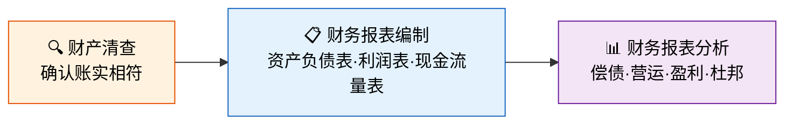

# 财产清查与报表

> 账本是企业的"日记"，但日记也可能记错——财产清查就是那把尺子，量出虚实之间的距离；而财务报表，则是把厚厚的日记翻译成一张张"体检报告"，让所有人一眼看懂企业的健康状况。

## 章节概述

本阶段是会计循环的"收官之作"：先用财产清查确认账实相符，再据此编制三大财务报表，最后通过报表分析洞察企业经营质量。

## 文章目录

| 序号 | 文章 | 核心内容 |
|------|------|---------|
| 1 | [财产清查](01_财产清查.md) | 清查种类、货币资金清查、存货清查、固定资产清查、往来款项函证、清查结果账务处理 |
| 2 | [财务报表编制](02_财务报表编制.md) | 资产负债表编制、利润表编制、现金流量表编制、报表附注 |
| 3 | [财务报表分析](03_财务报表分析.md) | 偿债能力、营运能力、盈利能力、杜邦分析法 |

---

## 学习目标

完成本阶段学习后，你应该能够：

1. **独立完成财产清查**——从盘点到调账全流程
2. **编制三大财务报表**——资产负债表、利润表、现金流量表
3. **读懂财务报表**——运用比率分析评估企业偿债能力、营运能力与盈利能力
4. **运用杜邦分析法**——拆解ROE，定位业绩驱动因素

::: info 原著参考
本阶段内容主要参考《基础会计第7版》第八章"财产清查"及第九章"财务报告"，同时结合《世界上最简单的会计书》中柠檬水站期末盘点的叙事。
:::
