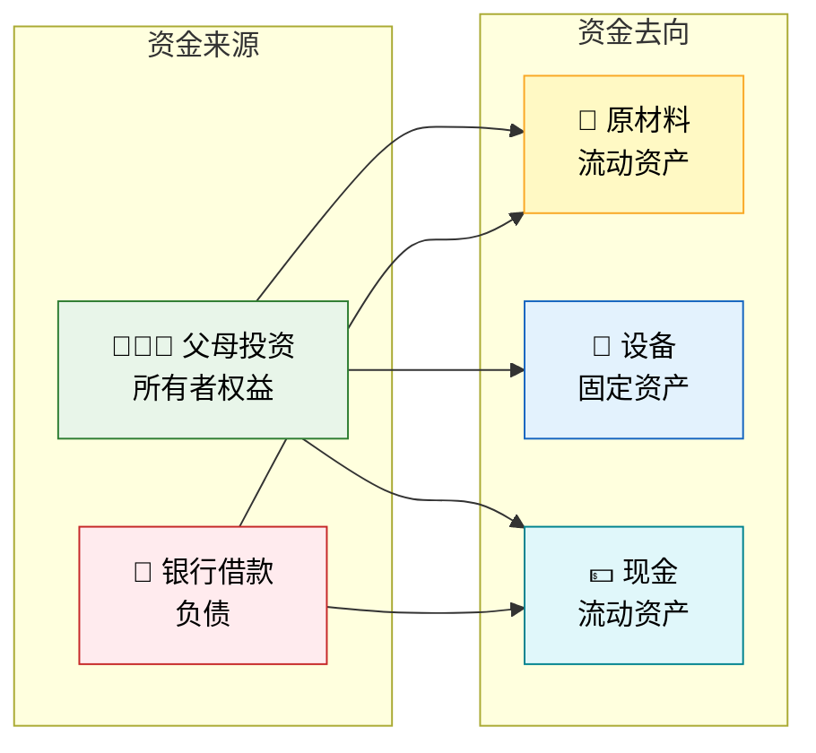
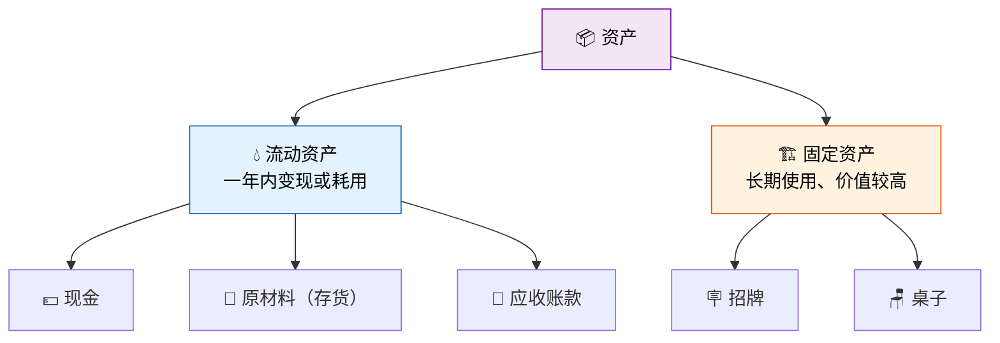
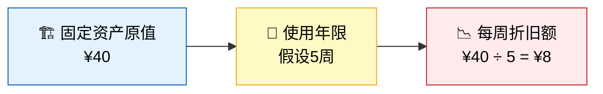
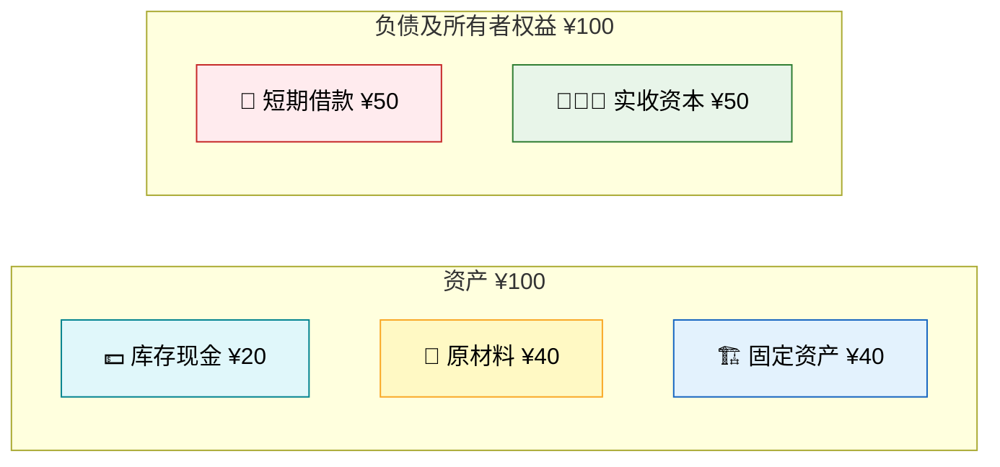
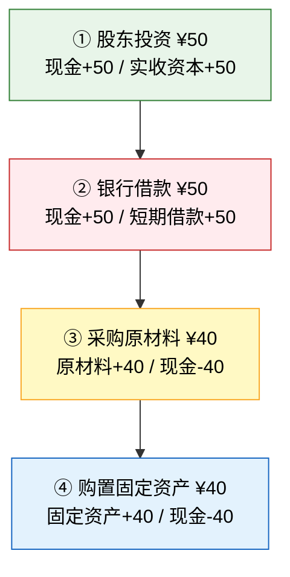
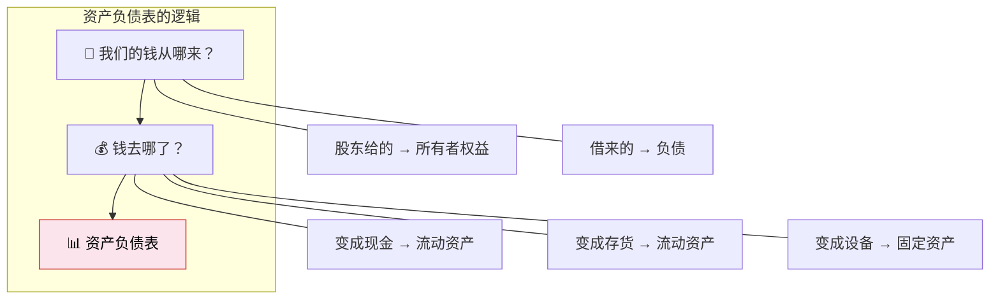

> 小明站在自家门口，手里攥着从爸妈那里争取来的启动资金，面前是一张空荡荡的小桌——这是他的柠檬水站，一切从零开始。但"零"在会计的世界里，恰恰是最美的起点。

## 一、故事开始：小明的创业梦

暑假到了，10岁的小明决定在自家门口开一个柠檬水站。他需要解决两个最基本的问题：

1. **钱从哪里来？** ——筹资
2. **钱花到哪里去？** ——投资

这恰恰是会计的第一课：**资产 = 负债 + 所有者权益**。



---

## 二、第一笔交易：股东投资

### 故事

小明跟爸妈商量："我想开柠檬水站，需要启动资金！"爸妈同意了，从储蓄罐里拿出 **¥50** 给小明，说："这是你的本钱，好好干！"

### 会计分析

- **谁投的？** 爸妈（股东）→ 所有者权益增加
- **拿到什么？** 现金 → 资产增加
- **会计等式**：资产↑ = 负债 + 所有者权益↑

### 会计分录

```
借：库存现金              50
    贷：实收资本（股东投资）    50
```

### T字账

```
库存现金                    实收资本
─────────────              ─────────────
借方    |    贷方          借方    |    贷方
  50    |                   |      50
```

### 此时的资产负债表

| 资产 | 金额 | 负债及所有者权益 | 金额 |
|------|------|-----------------|------|
| 库存现金 | 50 | 负债 | 0 |
| | | **实收资本** | **50** |
| **资产合计** | **50** | **负债及所有者权益合计** | **50** |

::: tip 关键理解
股东投资是企业的"血源"——钱进来时，资产和所有者权益同时增加，等式永远平衡。这笔钱不需要"还"，但股东期待回报。
:::

---

## 三、第二笔交易：银行借款

### 故事

¥50不够用！小明又去了隔壁的"小银行"（其实是邻居张叔叔），借了 **¥50**，约定暑假结束还本付息。

### 会计分析

- **向谁借的？** 银行（债权人）→ 负债增加
- **拿到什么？** 现金 → 资产增加
- **会计等式**：资产↑ = 负债↑ + 所有者权益

### 会计分录

```
借：库存现金              50
    贷：短期借款              50
```

### T字账

```
库存现金                    短期借款
─────────────              ─────────────
借方    |    贷方          借方    |    贷方
  50    |                   |
  50    |                   |      50
余额:100|                  余额:  |     50
```

### 此时的资产负债表

| 资产 | 金额 | 负债及所有者权益 | 金额 |
|------|------|-----------------|------|
| 库存现金 | 100 | **短期借款** | **50** |
| | | 实收资本 | 50 |
| **资产合计** | **100** | **负债及所有者权益合计** | **100** |

::: important 股东投资 vs 银行借款
| 对比项 | 股东投资 | 银行借款 |
|--------|---------|---------|
| 会计科目 | 实收资本 | 短期/长期借款 |
| 是否需要还 | 否（但需分红回报） | 是（还本付息） |
| 在报表中的位置 | 所有者权益 | 负债 |
| 风险 | 股东承担经营风险 | 企业承担还款义务 |
:::

---

## 四、第三笔交易：采购原材料

### 故事

小明拿着 ¥100 去超市采购：柠檬 ¥20、糖 ¥10、纸杯 ¥10，共花费 **¥40**，全部用现金支付。

### 会计分析

- **买什么？** 柠檬、糖、纸杯 → 原材料（存货）增加
- **用什么买？** 现金 → 资产减少
- **会计等式**：资产一增一减，总额不变 = 负债 + 所有者权益（不变）

### 会计分录

```
借：原材料                  40
    贷：库存现金              40
```

### T字账

```
原材料                      库存现金
─────────────              ─────────────
借方    |    贷方          借方    |    贷方
  40    |                  50    |
        |                  50    |   40
        |                 余额:60|
```

### 此时的资产负债表

| 资产 | 金额 | 负债及所有者权益 | 金额 |
|------|------|-----------------|------|
| 库存现金 | 60 | 短期借款 | 50 |
| **原材料** | **40** | 实收资本 | 50 |
| **资产合计** | **100** | **负债及所有者权益合计** | **100** |

::: tip 资产内部的"此消彼长"
现金变成原材料，资产总额不变，只是**形态转换**——从"最流动的现金"变成了"待加工的存货"。这就像水变成冰，总量没变，只是形态不同。
:::

---

## 五、第四笔交易：购置固定资产

### 故事

柠檬水站还需要一个**招牌**（¥15）和一张**桌子**（¥25），共计 **¥40**，现金支付。这些物品可以用很久，不会在一天内消耗掉。

### 会计分析

- **买什么？** 招牌和桌子 → 固定资产增加
- **用什么买？** 现金 → 资产减少
- **关键区别**：原材料（流动资产）vs 固定资产

### 会计分录

```
借：固定资产                40
    贷：库存现金              40
```

### 流动资产 vs 固定资产



| 对比项 | 流动资产 | 固定资产 |
|--------|---------|---------|
| 示例 | 现金、原材料、应收账款 | 设备、房屋、车辆 |
| 变现周期 | ≤1年 | >1年 |
| 价值变动 | 直接转入成本 | 通过折旧逐步摊销 |
| 柠檬水站例子 | 柠檬、糖、纸杯 | 招牌、桌子 |

### 此时的资产负债表

| 资产 | 金额 | 负债及所有者权益 | 金额 |
|------|------|-----------------|------|
| 库存现金 | 20 | 短期借款 | 50 |
| 原材料 | 40 | 实收资本 | 50 |
| **固定资产** | **40** | | |
| **资产合计** | **100** | **负债及所有者权益合计** | **100** |

---

## 六、初识折旧

### 故事

桌子用了一天，虽然看起来还是新的，但它终究会旧、会坏。会计上，我们不等到桌子坏掉那天才记账，而是**在使用期间逐步确认价值的减少**——这就是**折旧**。

### 折旧的基本概念



### 第一天简化处理

::: info 说明
折旧通常按月/年计提，本节第一天暂不计提折旧。后续章节会详细讲解折旧的会计处理。这里先建立概念：固定资产的价值不是一次性消耗，而是随时间逐步减少。
:::

---

## 七、开张第一天的完整资产负债表

经过四笔交易，我们来看小明的柠檬水站在第一天结束时的"家底"：



### 完整资产负债表（第一天）

| | 资产 | 金额 | | 负债及所有者权益 | 金额 |
|---|------|------|---|-----------------|------|
| | **流动资产：** | | | **负债：** | |
| | 库存现金 | 20 | | 短期借款 | 50 |
| | 原材料 | 40 | | | |
| | 流动资产小计 | 60 | | 负债合计 | 50 |
| | **固定资产：** | | | **所有者权益：** | |
| | 固定资产 | 40 | | 实收资本 | 50 |
| | | | | 所有者权益合计 | 50 |
| | **资产总计** | **100** | | **负债及所有者权益总计** | **100** |

### 四笔交易汇总



---

## 八、资产负债表的本质

### 什么是资产负债表？

> **资产负债表是一张"快照"**——它告诉你某个时点企业"有什么"和"欠谁的"。



### 资产负债表的三大要素

| 要素 | 含义 | 柠檬水站例子 |
|------|------|-------------|
| **资产** | 企业拥有或控制的、能带来经济利益的资源 | 现金、柠檬、桌子、招牌 |
| **负债** | 企业承担的、会导致经济利益流出的现时义务 | 银行借款 |
| **所有者权益** | 资产减去负债后的剩余权益（净资产） | 爸妈的投资 |

### 恒等式：资产 = 负债 + 所有者权益

$$\text{资产} = \text{负债} + \text{所有者权益}$$

每笔交易，等式两边要么同时增减，要么一边内部此消彼长——**等式永远平衡**，这是复式记账的基石。

---

## 九、练习题

### 练习1：判断交易影响

请判断以下交易对会计等式（资产 = 负债 + 所有者权益）各要素的影响（增加↑、减少↓、不变—）：

| 交易 | 资产 | 负债 | 所有者权益 |
|------|------|------|-----------|
| （1）收到股东投资 ¥100 | ? | ? | ? |
| （2）用现金购买原材料 ¥30 | ? | ? | ? |
| （3）向银行借款 ¥50 | ? | ? | ? |
| （4）用现金购买设备 ¥60 | ? | ? | ? |

### 练习2：编制资产负债表

小红开了一家文具店，第一天发生了以下交易：

1. 自己出资 ¥200 存入银行
2. 向朋友借款 ¥100 收到现金
3. 用现金 ¥80 购买文具（存货）
4. 用现金 ¥50 购买书架（固定资产）

请编制小红文具店第一天的资产负债表。

### 练习3：编制会计分录

为以上四笔交易编制会计分录。

---

### 详细解答

#### 练习1答案

| 交易 | 资产 | 负债 | 所有者权益 |
|------|------|------|-----------|
| （1）收到股东投资 ¥100 | ↑ | — | ↑ |
| （2）用现金购买原材料 ¥30 | — | — | — |
| （3）向银行借款 ¥50 | ↑ | ↑ | — |
| （4）用现金购买设备 ¥60 | — | — | — |

> 解析：（2）和（4）都是资产内部一增一减，总额不变。

#### 练习2答案

| | 资产 | 金额 | | 负债及所有者权益 | 金额 |
|---|------|------|---|-----------------|------|
| | 流动资产： | | | 负债： | |
| | 库存现金 | 170 | | 短期借款 | 100 |
| | 存货 | 80 | | | |
| | 流动资产小计 | 250 | | 负债合计 | 100 |
| | 固定资产： | | | 所有者权益： | |
| | 固定资产 | 50 | | 实收资本 | 200 |
| | | | | 所有者权益合计 | 200 |
| | **资产总计** | **300** | | **负债及所有者权益总计** | **300** |

> 计算：现金 = 200 + 100 - 80 - 50 = 170

#### 练习3答案

```
（1）借：库存现金          200
        贷：实收资本          200

（2）借：库存现金          100
        贷：短期借款          100

（3）借：原材料（存货）      80
        贷：库存现金           80

（4）借：固定资产            50
        贷：库存现金           50
```

---

::: tip 面试速查
- **资产负债表**是时点报表，反映某一时点的财务状况
- **会计恒等式**：资产 = 负债 + 所有者权益，任何交易都不会打破平衡
- **流动资产** vs **固定资产**的核心区别：变现/耗用周期是否超过一年
- **股东投资**增加所有者权益，**银行借款**增加负债——资金来源不同，性质不同
- 折旧是固定资产价值随时间逐步减少的过程，不是一次性费用
:::

::: info 原著参考
本节内容对应《世界上最简单的会计书》第1-3章：从零开始，通过股东投资、银行借款、采购原材料和固定资产，逐步搭建出第一张资产负债表。
:::
