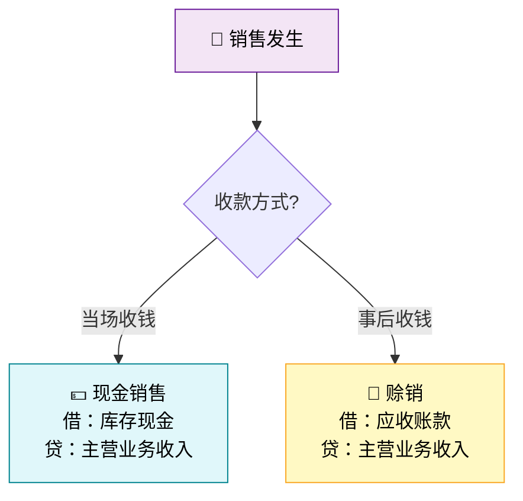
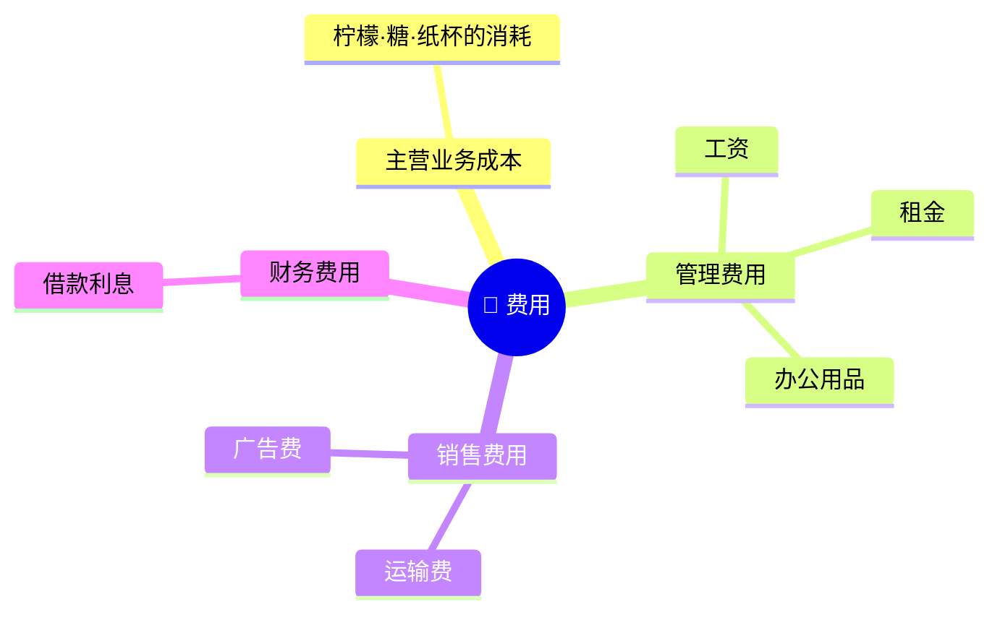
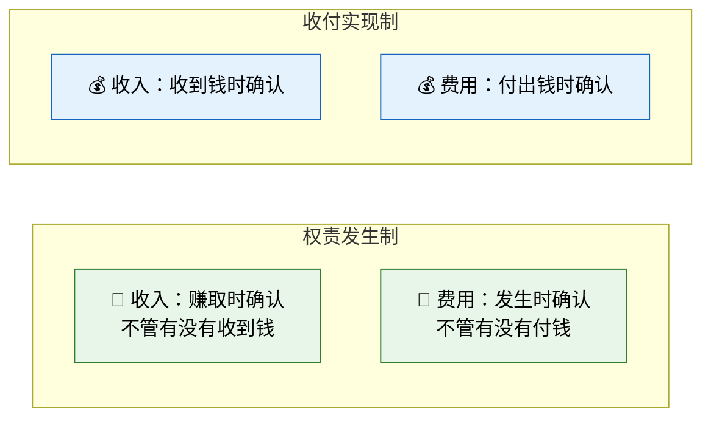
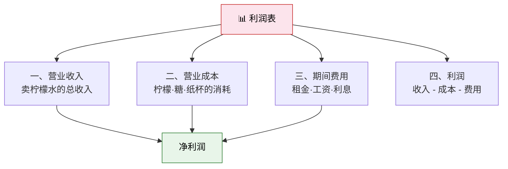
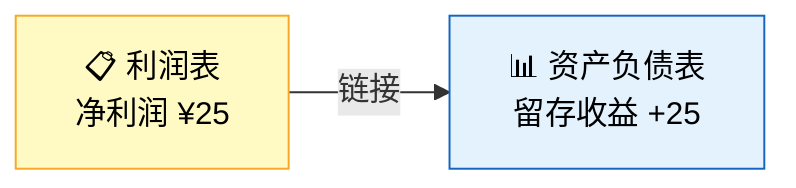
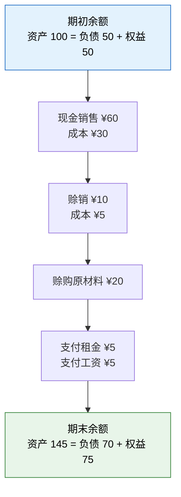
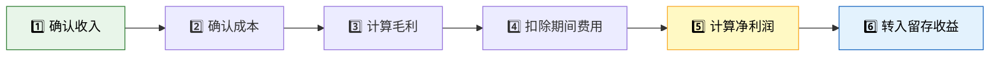

> 柠檬水站开张了！小明每天早起挤柠檬、兑糖水、摆好纸杯，等着路过的客人。赚到的每一块钱，在会计里都有它的名字。

## 一、故事继续：柠檬水站开始营业

第一天结束后，小明的柠檬水站"家底"如下：

| 资产 | 金额 | 负债及所有者权益 | 金额 |
|------|------|-----------------|------|
| 库存现金 | 20 | 短期借款 | 50 |
| 原材料 | 40 | 实收资本 | 50 |
| 固定资产 | 40 | | |
| **合计** | **100** | **合计** | **100** |

现在，真正的经营开始了。

---

## 二、现金销售：柠檬水卖出去了

### 故事

第二天，阳光灿烂，小明卖出 30 杯柠檬水，每杯 ¥2，全部收到现金，共 **¥60**。

但卖柠檬水是有成本的！每杯消耗原材料约 ¥1（柠檬、糖、纸杯），30 杯共消耗 **¥30** 原材料。

### 会计分析——两步走

**第一步：确认收入**

- 收到现金 → 资产增加
- 实现销售 → 收入增加（收入最终增加所有者权益）

**第二步：确认成本**

- 原材料被消耗 → 资产减少
- 消耗的物料转化为成本 → 费用增加（费用最终减少所有者权益）

### 会计分录

```
（1）确认收入
借：库存现金              60
    贷：主营业务收入          60

（2）结转销售成本
借：主营业务成本            30
    贷：原材料                30
```

### T字账

```
库存现金                    主营业务收入
─────────────              ─────────────
借方    |    贷方          借方    |    贷方
余额:20 |                   |
   60   |                   |      60
余额:80 |                  余额:  |     60

原材料                      主营业务成本
─────────────              ─────────────
借方    |    贷方          借方    |    贷方
余额:40 |                  30     |
        |    30            余额:30|
余额:10 |
```

::: important 收入 ≠ 利润
小明收到 ¥60，但利润不是 ¥60！要扣除卖出去的那部分成本（¥30），才是真正的赚头。**收入 - 费用 = 利润**，这是利润表的核心逻辑。
:::

---

## 三、赊销：先卖后收的钱

### 故事

第三天，隔壁班的同学小红说："我也想喝，但我今天没带钱，明天给你行不行？"小明同意了，小红赊账买了 5 杯，共 **¥10**。

### 会计分析

- 小明还没拿到现金，但已经**赚到了收款的权利** → 应收账款（资产）增加
- 收入已经实现 → 收入增加
- 消耗原材料 ¥5

### 会计分录

```
（1）确认赊销收入
借：应收账款              10
    贷：主营业务收入          10

（2）结转销售成本
借：主营业务成本             5
    贷：原材料                 5
```

### 现金销售 vs 赊销对比



| 对比项 | 现金销售 | 赊销 |
|--------|---------|------|
| 借方科目 | 库存现金 | 应收账款 |
| 收入确认时点 | 销售时 | **销售时**（不是收款时） |
| 风险 | 无 | 对方可能不付款（坏账风险） |

---

## 四、应付账款：先买后付

### 故事

第四天，原材料快用完了，小明又去超市买了 ¥20 的柠檬和糖。但这次他忘带钱包了，超市老板说："没关系，下次一起给。"

### 会计分析

- 拿到了原材料 → 存货增加
- 但没付钱 → 产生了一笔"欠条" → 应付账款（负债）增加

### 会计分录

```
借：原材料                  20
    贷：应付账款              20
```

### 应收 vs 应付

| 对比项 | 应收账款 | 应付账款 |
|--------|---------|---------|
| 性质 | 资产 | 负债 |
| 含义 | 别人欠我的 | 我欠别人的 |
| 柠檬水站例子 | 小红欠小明 ¥10 | 小明欠超市 ¥20 |
| 对企业的影响 | 未来现金流入 | 未来现金流出 |

---

## 五、经营费用：租金和工资

### 故事

第五天，小明需要付两笔费用：
- 门口场地的**租金** ¥5
- 请小伙伴帮忙的**工资** ¥5

### 会计分录

```
（1）支付租金
借：管理费用——租金          5
    贷：库存现金               5

（2）支付工资
借：管理费用——工资          5
    贷：库存现金               5
```

### 费用的分类



::: warning 成本 vs 费用
- **主营业务成本（COGS）**：与生产/采购商品直接相关的支出（柠檬、糖、纸杯）
- **期间费用**：与具体商品无关，按期间确认的支出（租金、工资、利息）

两者都会减少利润，但性质不同。
:::

---

## 六、权责发生制 vs 收付实现制

### 核心区别

这是会计中最容易混淆的概念之一。小明的故事是最直观的解释：



### 用柠檬水站来理解

| 事件 | 权责发生制 | 收付实现制 |
|------|-----------|-----------|
| 小红赊购 ¥10 | 当天确认收入 ¥10 | 等小红付钱才确认 |
| 赊购原材料 ¥20 | 当天确认费用（通过存货转成本） | 等小明付钱才确认 |
| 预付下月租金 ¥5 | 下月才确认费用 | 付钱当月确认 |
| 本月电费 ¥3（下月付） | 本月确认费用 | 下月付钱才确认 |

::: important 企业会计准则规定
我国《企业会计准则》要求企业采用**权责发生制**。这意味着：收入和费用的确认取决于**权利/义务是否发生**，而非现金是否收付。
:::

---

## 七、编制利润表

### 故事阶段总结

经过几天的经营，让我们汇总小明的经营成果：

| 项目 | 金额 |
|------|------|
| 主营业务收入 | 60 + 10 = 70 |
| 主营业务成本 | 30 + 5 = 35 |
| 管理费用（租金） | 5 |
| 管理费用（工资） | 5 |

### 利润表（柠檬水站）

```
╔══════════════════════════════════════╗
║      柠檬水站利润表（本期）          ║
╠══════════════════════════════════════╣
║ 一、营业收入                   70   ║
║    减：营业成本               (35)   ║
║    减：管理费用               (10)   ║
╠══════════════════════════════════════╣
║ 三、利润总额                  25    ║
║    减：所得税费用              (0)   ║
╠══════════════════════════════════════╣
║ 四、净利润                    25    ║
╚══════════════════════════════════════╝
```

### 利润表的结构



::: tip 利润表的阅读口诀
**收入减成本得毛利，毛利减费用得净利**。

- 毛利 = 营业收入 - 营业成本 = 70 - 35 = **35**
- 净利润 = 毛利 - 期间费用 = 35 - 10 = **25**
:::

---

## 八、留存收益：利润的去向

### 利润去哪了？

小明赚了 ¥25 净利润，这笔钱属于谁？——属于**股东**（爸妈）。但小明不打算把钱还给爸妈，而是留在生意里继续发展，这就是**留存收益**。

### 会计等式的扩展

$$\text{资产} = \text{负债} + \text{所有者权益}$$

$$\text{所有者权益} = \text{实收资本} + \text{留存收益}$$

$$\text{留存收益} = \text{期初留存收益} + \text{本期净利润} - \text{本期分红}$$

### 利润表与资产负债表的联系



::: important 利润表与资产负债表的关系
利润表的**净利润**是资产负债表中**留存收益**的本期增加额。利润表是"流量"概念，资产负债表是"存量"概念。利润流入留存收益，像河流注入湖泊。
:::

---

## 九、更新后的资产负债表

### 计算各账户余额

| 账户 | 计算 | 余额 |
|------|------|------|
| 库存现金 | 20 + 60 - 5 - 5 = | 70 |
| 应收账款 | 10 | 10 |
| 原材料 | 40 - 30 - 5 + 20 = | 25 |
| 固定资产 | 40 | 40 |
| 短期借款 | 50 | 50 |
| 应付账款 | 20 | 20 |
| 实收资本 | 50 | 50 |
| 留存收益 | 25 | 25 |

### 更新后的资产负债表

| | 资产 | 金额 | | 负债及所有者权益 | 金额 |
|---|------|------|---|-----------------|------|
| | **流动资产：** | | | **负债：** | |
| | 库存现金 | 70 | | 短期借款 | 50 |
| | 应收账款 | 10 | | 应付账款 | 20 |
| | 原材料 | 25 | | 负债合计 | 70 |
| | 流动资产小计 | 105 | | | |
| | **固定资产：** | | | **所有者权益：** | |
| | 固定资产 | 40 | | 实收资本 | 50 |
| | | | | 留存收益 | 25 |
| | | | | 所有者权益合计 | 75 |
| | **资产总计** | **145** | | **负债及所有者权益总计** | **145** |

**验算**：资产 145 = 负债 70 + 所有者权益 75 ✅

### 交易追踪全景图



---

## 十、利润表的完整编制流程



| 步骤 | 公式 | 柠檬水站数值 |
|------|------|-------------|
| 1. 确认收入 | 现金销售 + 赊销 | 60 + 10 = 70 |
| 2. 确认成本 | 消耗的原材料 | 30 + 5 = 35 |
| 3. 计算毛利 | 收入 - 成本 | 70 - 35 = 35 |
| 4. 扣除费用 | 租金 + 工资 | 5 + 5 = 10 |
| 5. 计算净利润 | 毛利 - 费用 | 35 - 10 = 25 |
| 6. 转入留存收益 | 净利润 → 留存收益 | +25 |

---

## 十一、练习题

### 练习1：会计分录

小明接下来又发生了以下交易，请编制会计分录：

1. 小红还来赊欠的 ¥10 现金
2. 小明用现金 ¥20 偿还超市的应付账款
3. 现金销售柠檬水 20 杯，每杯 ¥2，成本 ¥20
4. 支付银行借款利息 ¥3

### 练习2：编制利润表

基于以上交易，加上之前的经营数据，编制更新后的利润表。

### 练习3：编制资产负债表

基于以上所有交易，编制更新后的资产负债表。

### 练习4：判断题

1. 赊销时，因为没有收到现金，所以不应确认收入。（　）
2. 利润表是时点报表，反映某一天的财务状况。（　）
3. 净利润最终会增加所有者权益中的留存收益。（　）
4. 在权责发生制下，预收的款项应确认为收入。（　）

---

### 详细解答

#### 练习1答案

```
（1）借：库存现金          10
        贷：应收账款          10

（2）借：应付账款          20
        贷：库存现金          20

（3）借：库存现金          40
        贷：主营业务收入      40

    借：主营业务成本      20
        贷：原材料           20

（4）借：财务费用——利息     3
        贷：库存现金           3
```

#### 练习2答案

| 项目 | 金额 |
|------|------|
| 一、营业收入 | 70 + 40 = 110 |
| 减：营业成本 | 35 + 20 = 55 |
| 减：管理费用 | 10 |
| 减：财务费用 | 3 |
| **四、净利润** | **110 - 55 - 10 - 3 = 42** |

#### 练习3答案

| 资产 | 金额 | 负债及所有者权益 | 金额 |
|------|------|-----------------|------|
| 库存现金 | 70+10-20+40-3 = 97 | 短期借款 | 50 |
| 应收账款 | 10-10 = 0 | 应付账款 | 20-20 = 0 |
| 原材料 | 25-20 = 5 | 实收资本 | 50 |
| 固定资产 | 40 | 留存收益 | 42 |
| **资产总计** | **142** | **负债及所有者权益总计** | **142** |

#### 练习4答案

1. **×** — 赊销时收入已赚取，应确认收入（权责发生制）
2. **×** — 利润表是**期间报表**，反映一段时期的经营成果；资产负债表才是时点报表
3. **✓** — 净利润转入留存收益，增加所有者权益
4. **×** — 预收款项是负债（递延收入），尚未赚取，不应立即确认为收入

---

::: tip 面试速查
- **利润表**是期间报表，反映一段时期的经营成果（收入 - 费用 = 利润）
- **权责发生制**：收入在赚取时确认，费用在发生时确认，与现金收付无关
- **现金销售**借记库存现金，**赊销**借记应收账款——收入确认时点相同
- **毛利** = 营业收入 - 营业成本；**净利润** = 毛利 - 期间费用
- **留存收益** = 净利润的累积，是利润表与资产负债表的桥梁
- **应收账款**是资产（别人欠我），**应付账款**是负债（我欠别人）
:::

::: info 原著参考
本节内容对应《世界上最简单的会计书》第4-6章：从销售到费用，从利润表到留存收益，展示利润表如何与资产负债表关联。
:::
