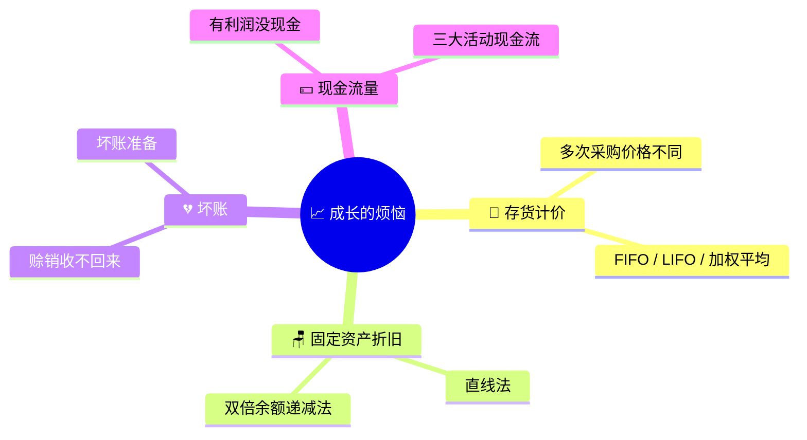
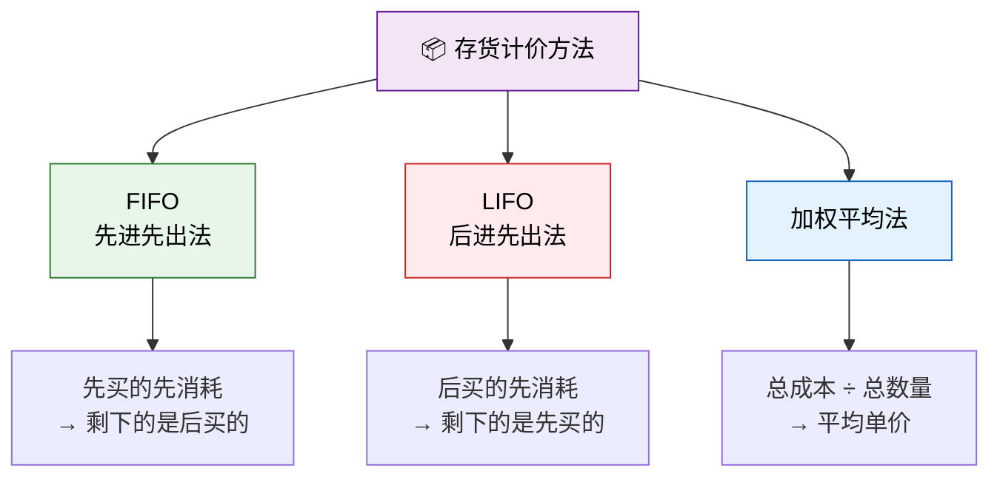
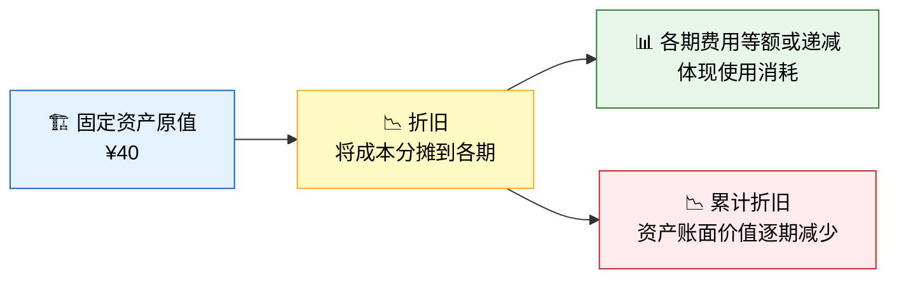
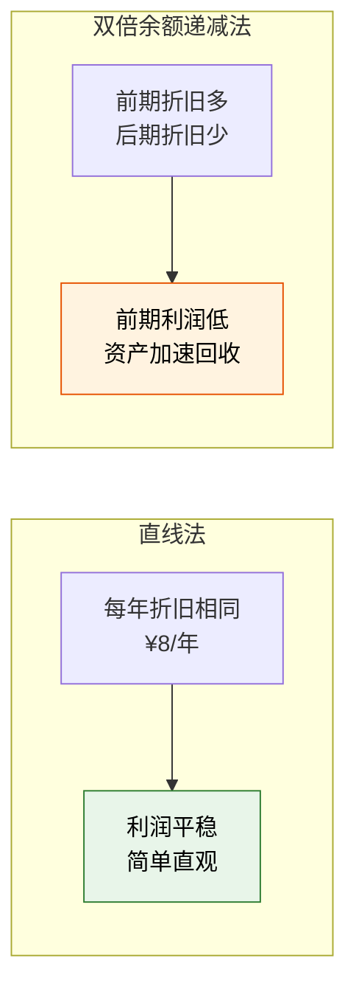
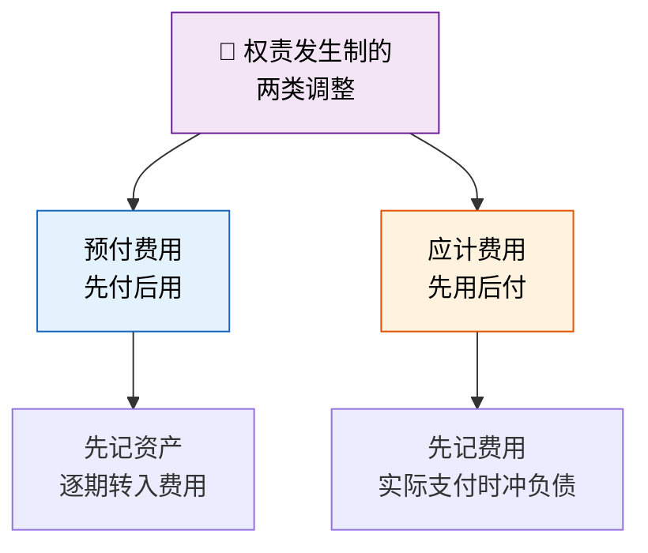
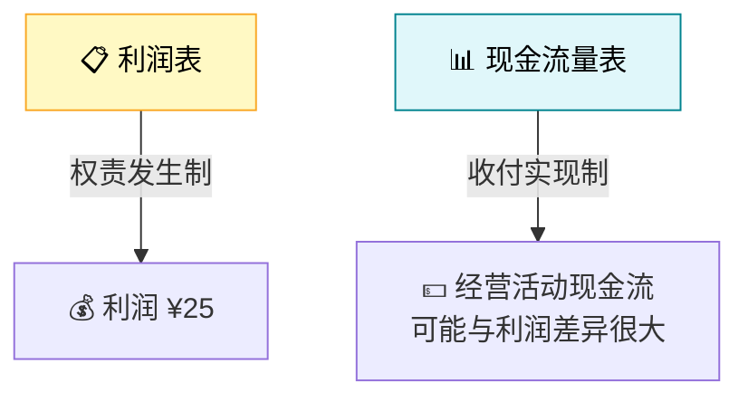
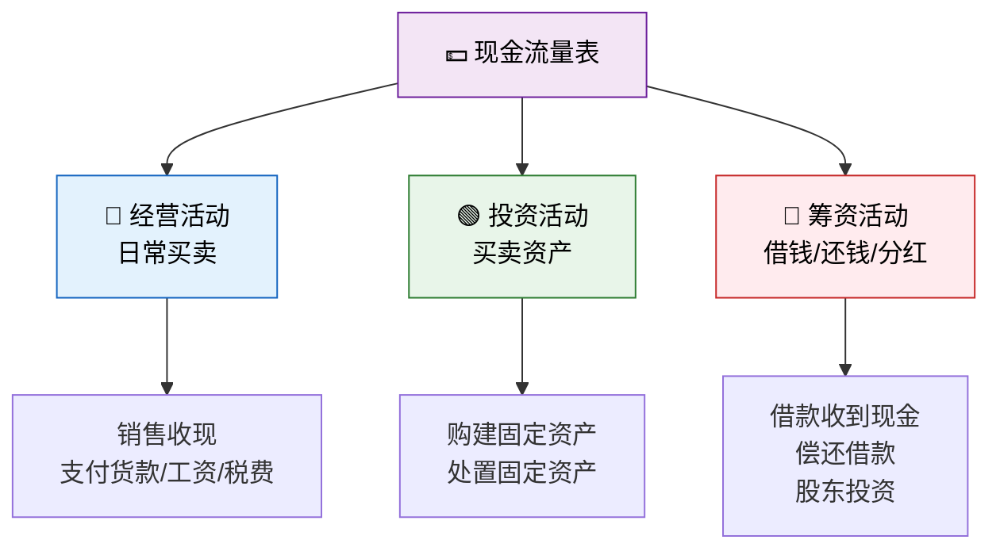
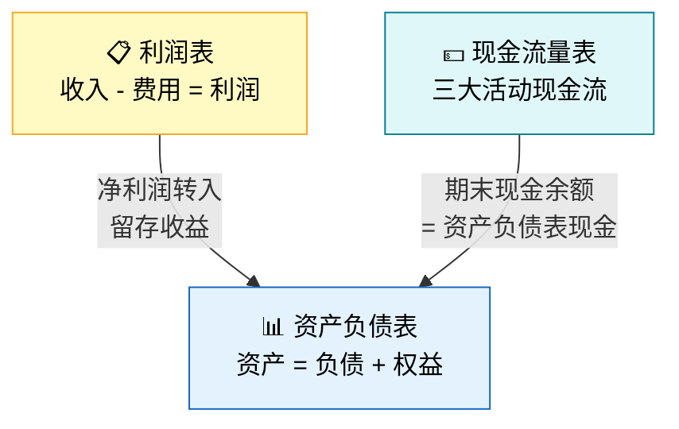

> 生意越做越大，问题也越来越多——柠檬买多了怎么算成本？桌子旧了怎么记账？有人赖账怎么办？明明赚了钱，口袋里却没有现金？成长，就是面对这些"烦恼"的过程。

## 一、故事升级：柠檬水站扩张了

小明的柠檬水站生意红火，但经营越久，会计问题越复杂：



---

## 二、存货计价：柠檬买贵了还是买便宜了？

### 故事

小明分三批采购柠檬：

| 批次 | 数量（斤） | 单价（¥/斤） | 总金额 |
|------|-----------|-------------|--------|
| 第一批 | 10 | 2 | 20 |
| 第二批 | 10 | 3 | 30 |
| 第三批 | 10 | 4 | 40 |
| **合计** | **30** | | **90** |

到了月底，小明卖出了 **20 斤**柠檬（用于制作柠檬水）。问题是：这 20 斤柠檬的成本是多少？

### 三种计价方法



### 方法一：先进先出法（FIFO）

**假设先购入的存货先发出。**

| 发出批次 | 数量 | 单价 | 金额 |
|---------|------|------|------|
| 第一批 | 10 | 2 | 20 |
| 第二批 | 10 | 3 | 30 |
| **发出合计** | **20** | | **50** |
| **期末剩余** | **10** | 4 | **40** |

> 销售成本 = ¥50，期末存货 = ¥40

### 方法二：后进先出法（LIFO）

::: warning 注意
我国《企业会计准则》**不允许**使用后进先出法。此处仅为教学对比。
:::

**假设后购入的存货先发出。**

| 发出批次 | 数量 | 单价 | 金额 |
|---------|------|------|------|
| 第三批 | 10 | 4 | 40 |
| 第二批 | 10 | 3 | 30 |
| **发出合计** | **20** | | **70** |
| **期末剩余** | **10** | 2 | **20** |

> 销售成本 = ¥70，期末存货 = ¥20

### 方法三：加权平均法

**加权平均单价 = 总成本 ÷ 总数量**

$$\text{加权平均单价} = \frac{90}{30} = 3 \text{ 元/斤}$$

| 项目 | 数量 | 单价 | 金额 |
|------|------|------|------|
| 发出存货 | 20 | 3 | 60 |
| 期末存货 | 10 | 3 | 30 |

> 销售成本 = ¥60，期末存货 = ¥30

### 三种方法对比

| 对比项 | FIFO | LIFO | 加权平均 |
|--------|------|------|---------|
| 销售成本 | 50（最低） | 70（最高） | 60（中间） |
| 期末存货 | 40（最高） | 20（最低） | 30（中间） |
| 当期利润 | 最高 | 最低 | 中间 |
| 物价上涨时 | 利润偏高 | 利润偏低 | 折中 |
| 中国准则 | ✅ 允许 | ❌ 不允许 | ✅ 允许 |

::: tip 物价上涨时的"幻觉"
当物价持续上涨时（如柠檬从 ¥2 涨到 ¥4）：
- **FIFO**：用早期的低成本计算销售成本 → 利润偏高 → 但期末存货更接近当前市价
- **加权平均**：折中处理，利润和存货价值都比较平稳
:::

---

## 三、固定资产折旧：桌子越来越旧

### 故事

小明的柠檬水站有一张桌子和一个招牌，原值合计 ¥40。假设：
- 使用年限：5 年（为简化，用"年"而非"周"）
- 预计净残值：¥0（5 年后桌子一文不值）

### 折旧的本质



### 方法一：直线法（年限平均法）

**每期折旧额 = （原值 - 净残值）÷ 使用年限**

$$\text{年折旧额} = \frac{40 - 0}{5} = 8 \text{ 元/年}$$

| 年份 | 年折旧额 | 累计折旧 | 账面价值 |
|------|---------|---------|---------|
| 第1年 | 8 | 8 | 32 |
| 第2年 | 8 | 16 | 24 |
| 第3年 | 8 | 24 | 16 |
| 第4年 | 8 | 32 | 8 |
| 第5年 | 8 | 40 | 0 |

### 方法二：双倍余额递减法

**年折旧率 = 2 ÷ 使用年限 = 2 ÷ 5 = 40%**

**年折旧额 = 期初账面价值 × 年折旧率**

| 年份 | 期初账面价值 | 折旧率 | 年折旧额 | 累计折旧 | 期末账面价值 |
|------|------------|--------|---------|---------|------------|
| 第1年 | 40 | 40% | 16 | 16 | 24 |
| 第2年 | 24 | 40% | 9.6 | 25.6 | 14.4 |
| 第3年 | 14.4 | 40% | 5.76 | 31.36 | 8.64 |
| 第4年 | 8.64 | — | 4.32* | 35.68 | 4.32 |
| 第5年 | 4.32 | — | 4.32* | 40 | 0 |

> *最后两年改为直线法，将剩余账面价值平均摊销。

### 两种方法对比



| 对比项 | 直线法 | 双倍余额递减法 |
|--------|--------|---------------|
| 每年折旧额 | 固定不变 | 前多后少 |
| 对利润的影响 | 平稳 | 前期低后期高 |
| 适用场景 | 使用均匀的资产 | 技术更新快的资产 |
| 复杂程度 | 简单 | 较复杂 |

### 折旧的会计分录

```
借：管理费用——折旧费        8
    贷：累计折旧                8
```

::: important 累计折旧是"备抵账户"
- **固定资产**：借方余额，反映原值
- **累计折旧**：贷方余额，反映已计提的折旧总额
- **账面价值** = 固定资产原值 - 累计折旧 = 40 - 8 = 32

这就像车的里程表：车还是那辆车（原值不变），但累计跑的里程（累计折旧）越来越多，车的"剩余价值"越来越少。
:::

---

## 四、坏账：有人不还钱

### 故事

之前小红赊购了 ¥10 的柠檬水，后来小红转学了，钱还不上了！小明只能认栽——这就是**坏账**。

### 坏账的会计处理

#### 方法一：直接转销法

```
借：管理费用——坏账损失      10
    贷：应收账款                10
```

> 简单粗暴：发现收不回来时直接冲销。

#### 方法二：备抵法（准则要求）

**在赊销时就预估可能收不回来的金额，提前计提坏账准备。**

```
（1）赊销时计提坏账准备（假设估计坏账率 5%）
借：信用减值损失              0.5
    贷：坏账准备                0.5

（2）实际发生坏账时
借：坏账准备                  10
    贷：应收账款                10
```

### 两种方法对比

| 对比项 | 直接转销法 | 备抵法 |
|--------|-----------|--------|
| 确认时点 | 坏账实际发生时 | 赊销时预估 |
| 是否符合配比原则 | ❌ 不符合 | ✅ 符合 |
| 准则要求 | 不允许 | **必须使用** |
| 对利润的影响 | 坏账年份集中冲击 | 各期均衡分摊 |

::: warning 备抵法的核心逻辑
**配比原则**要求：与赊销相关的费用（坏账损失）应在同一期间确认，而不是等到实际发生时。备抵法做到了"收入与费用配比"。
:::

---

## 五、预付费用与应计费用

### 预付费用

**故事**：小明预付了两个月的场地租金 ¥10，本月只用了一个月。

```
（1）预付租金
借：预付账款（待摊费用）      10
    贷：库存现金                10

（2）月末摊销本月租金
借：管理费用——租金            5
    贷：预付账款（待摊费用）     5
```

### 应计费用

**故事**：小明请人帮忙发传单，约定工资 ¥5，但还没支付。

```
借：管理费用——工资            5
    贷：应付职工薪酬             5
```

### 对比



| 类型 | 付款时 | 消耗时 | 核心原则 |
|------|--------|--------|---------|
| 预付费用 | 借记预付账款（资产） | 贷记预付账款，借记费用 | 费用归属受益期间 |
| 应计费用 | 借记费用，贷记应付 | 借记应付，贷记现金 | 费用归属发生期间 |

---

## 六、有利润没现金？——现金流量表

### 故事

小明看了一眼利润表：净利润 ¥25。再看一眼钱箱：现金怎么没增加多少？

**原因**：
- 赊销 ¥10 → 利润表确认了收入，但没收到现金
- 赊购原材料 ¥20 → 利润表不体现（还没卖出去），但也没付现金
- 折旧 ¥8 → 利润表扣除了费用，但没有现金流出！

### 利润 ≠ 现金流



### 现金流量表的三大活动



### 柠檬水站的现金流量表

假设本期所有交易汇总如下：

| 活动 | 项目 | 金额 |
|------|------|------|
| **经营活动** | 销售商品收到的现金 | +60 |
| | 支付给供应商的现金 | -40 |
| | 支付租金 | -5 |
| | 支付工资 | -5 |
| | **经营活动现金流量净额** | **+10** |
| **投资活动** | 购建固定资产 | -40 |
| | **投资活动现金流量净额** | **-40** |
| **筹资活动** | 股东投资收到现金 | +50 |
| | 银行借款收到现金 | +50 |
| | **筹资活动现金流量净额** | **+100** |
| | **现金净增加额** | **+70** |

::: important 为什么利润 ¥25 但经营现金流只有 ¥10？
| 差异原因 | 对利润的影响 | 对现金流的影响 |
|---------|------------|--------------|
| 赊销 ¥10 | +10 | 0（没收到钱） |
| 赊购 ¥20 | 0（存货未售出） | 0（没付钱） |
| 折旧 ¥8 | -8 | 0（没有现金流出） |
| **净差异** | | 利润比经营现金流多 ¥15 |

折旧是**非付现成本**——它减少了利润，但没有减少现金。所以：**经营现金流 ≈ 净利润 + 折旧 - 应收增加 + 应付增加**
:::

---

## 七、完整的财务报表体系

### 三大报表的关系



| 报表 | 核心问题 | 时间属性 | 编制基础 |
|------|---------|---------|---------|
| 利润表 | 赚了还是亏了？ | 期间 | 权责发生制 |
| 资产负债表 | 家底有多少？ | 时点 | 权责发生制 |
| 现金流量表 | 钱从哪来、到哪去？ | 期间 | 收付实现制 |

---

## 八、练习题

### 练习1：存货计价

小明的柠檬水站采购了三批糖：

| 批次 | 数量（斤） | 单价 |
|------|-----------|------|
| 第一批 | 5 | 6 |
| 第二批 | 8 | 7 |
| 第三批 | 7 | 8 |

月末卖出了 15 斤糖。请分别用 FIFO 和加权平均法计算销售成本和期末存货价值。

### 练习2：折旧计算

小明新购了一台榨汁机，原值 ¥100，预计使用 4 年，净残值 ¥20。请分别用直线法和双倍余额递减法计算各年折旧额和账面价值。

### 练习3：坏账处理

小明期末应收账款余额为 ¥50，估计坏账率为 5%。期初坏账准备余额为 ¥1。请编制计提坏账准备的会计分录。

### 练习4：利润与现金流差异

某企业本期净利润 ¥100，折旧费用 ¥20，应收账款增加 ¥30，应付账款增加 ¥10，存货增加 ¥15。请计算经营活动现金流量净额。

---

### 详细解答

#### 练习1答案

**FIFO：**

| 发出批次 | 数量 | 单价 | 金额 |
|---------|------|------|------|
| 第一批 | 5 | 6 | 30 |
| 第二批 | 8 | 7 | 56 |
| 第三批 | 2 | 8 | 16 |
| **合计** | **15** | | **102** |

期末存货 = 5 × 8 = **40**

**加权平均法：**

加权平均单价 = (30 + 56 + 56) ÷ 20 = 142 ÷ 20 = **7.1**

销售成本 = 15 × 7.1 = **106.5**

期末存货 = 5 × 7.1 = **35.5**

#### 练习2答案

**直线法：**

年折旧额 = (100 - 20) ÷ 4 = **¥20/年**

| 年份 | 折旧额 | 累计折旧 | 账面价值 |
|------|--------|---------|---------|
| 第1年 | 20 | 20 | 80 |
| 第2年 | 20 | 40 | 60 |
| 第3年 | 20 | 60 | 40 |
| 第4年 | 20 | 80 | 20 |

**双倍余额递减法：**

折旧率 = 2 ÷ 4 = 50%

| 年份 | 期初账面价值 | 折旧额 | 累计折旧 | 期末账面价值 |
|------|------------|--------|---------|------------|
| 第1年 | 100 | 50 | 50 | 50 |
| 第2年 | 50 | 25 | 75 | 25 |
| 第3年 | 25 | 2.5* | 77.5 | 22.5 |
| 第4年 | 22.5 | 2.5* | 80 | 20 |

> *最后两年改为直线法：(25 - 20) ÷ 2 = 2.5/年，确保最终账面价值等于净残值。

#### 练习3答案

期末应提坏账准备 = 50 × 5% = 2.5

期初已有坏账准备 = 1

本期应补提 = 2.5 - 1 = **1.5**

```
借：信用减值损失            1.5
    贷：坏账准备                1.5
```

#### 练习4答案

经营现金流 = 净利润 + 折旧 - 应收增加 + 应付增加 - 存货增加

= 100 + 20 - 30 + 10 - 15 = **¥85**

| 调整项 | 金额 | 说明 |
|--------|------|------|
| 净利润 | 100 | 起点 |
| + 折旧 | 20 | 非付现成本加回 |
| - 应收增加 | -30 | 应收增加意味着没收回来的现金 |
| + 应付增加 | 10 | 应付增加意味着没付出去的现金 |
| - 存货增加 | -15 | 存货增加意味着买货付了现金 |
| **经营活动现金流** | **85** | |

---

::: tip 面试速查
- **存货计价**：中国准则允许 FIFO 和加权平均，不允许 LIFO；物价上涨时 FIFO 利润最高
- **折旧**：直线法每年等额；双倍余额递减法前多后少，最后两年改直线法
- **累计折旧**是备抵账户，账面价值 = 原值 - 累计折旧
- **坏账**：准则要求使用备抵法，计提时借记信用减值损失，贷记坏账准备
- **预付费用**先记资产后转费用，**应计费用**先记费用后付现金
- **利润 ≠ 现金**：折旧是非付现成本，应收/应付/存货变动也会导致差异
- **现金流量表**分三类：经营、投资、筹资；经营活动现金流 ≈ 净利润 + 折旧 ± 营运资本变动
:::

::: info 原著参考
本节内容对应《世界上最简单的会计书》第7-10章：深入存货计价、折旧方法、坏账处理和现金流量表，揭示利润与现金的差异。
:::
