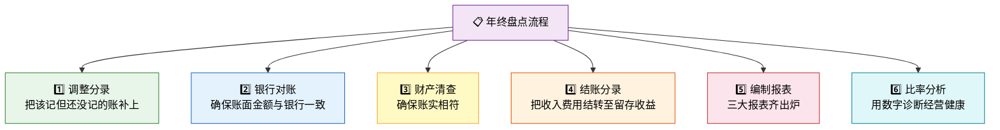
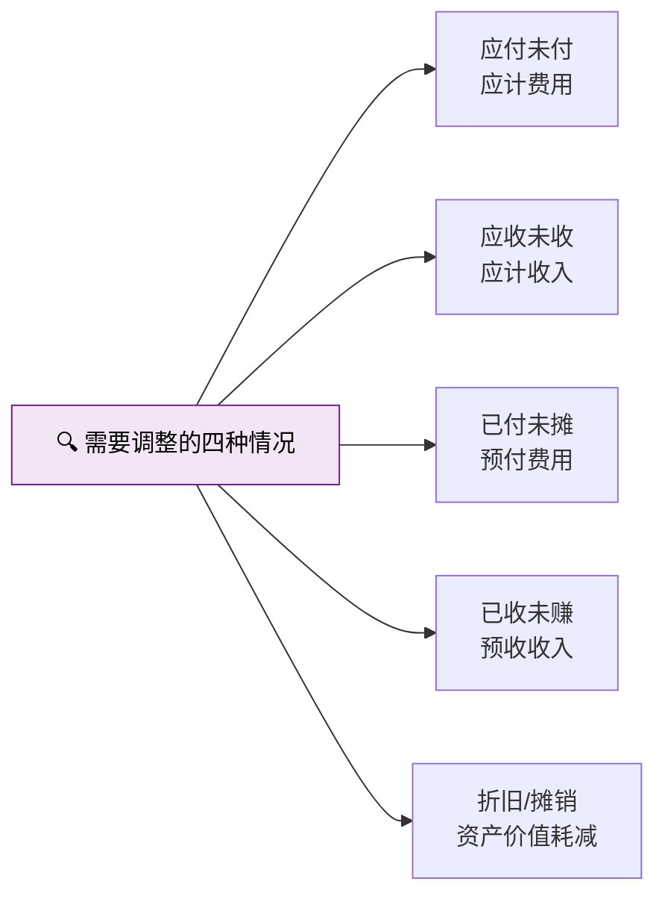
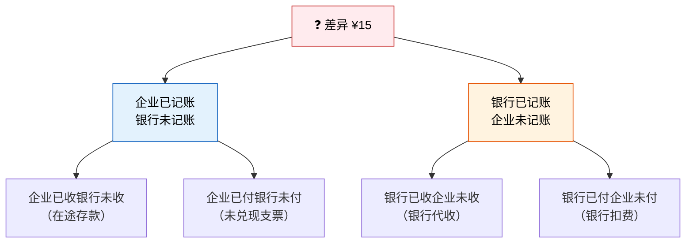
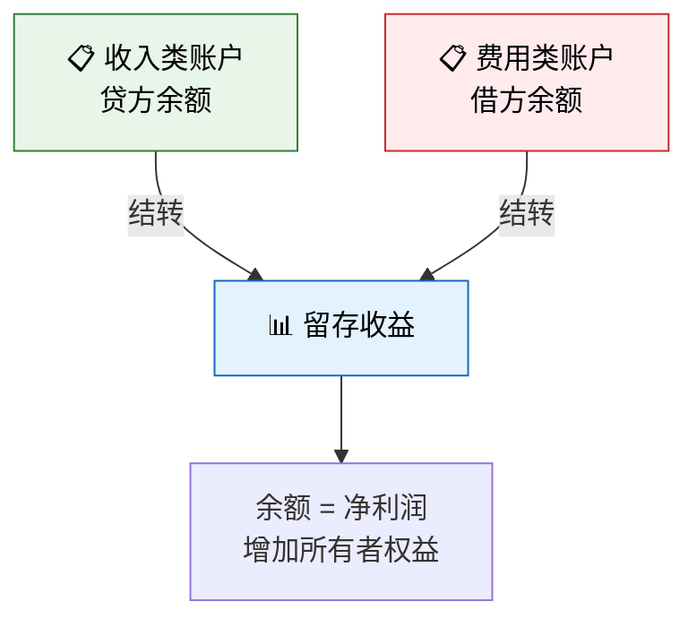
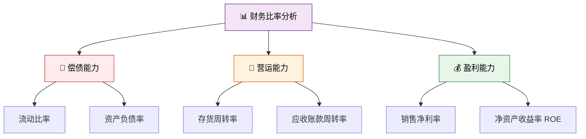
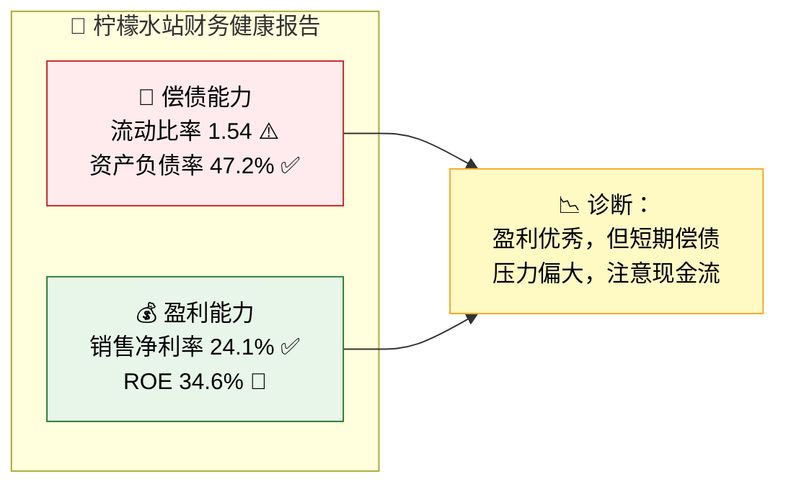
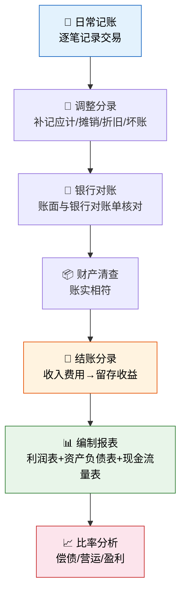

> 暑假快结束了，小明要给柠檬水站做一个完整的年终总结。这不仅是对过去经营的交代，更是对未来的规划。年终盘点，就是把一年的故事翻译成数字。

## 一、年终要做什么？



---

## 二、调整分录：年终"补账"

### 为什么需要调整？

日常记账中，有些事项**已经发生但还没入账**，或者**已入账但金额需要分摊**。调整分录就是把这些"遗漏"或"偏差"补上，确保财务报表反映真实情况。



### 调整一：计提折旧

**故事**：小明年末需要对桌子和招牌计提折旧。原值 ¥40，使用年限 5 年，直线法，年折旧 ¥8。

```
借：管理费用——折旧费          8
    贷：累计折旧                  8
```

### 调整二：应计利息

**故事**：小明向张叔叔借款 ¥50，约定年利率 10%，年末应付利息 ¥5，但还没实际支付。

```
借：财务费用——利息支出        5
    贷：应付利息                  5
```

### 调整三：预付费用摊销

**故事**：小明之前预付了两个月租金 ¥10，本月应摊销 ¥5。

```
借：管理费用——租金            5
    贷：预付账款                  5
```

### 调整四：计提坏账准备

**故事**：年末应收账款余额 ¥10，坏账率估计 5%，应提坏账准备 ¥0.5。

```
借：信用减值损失              0.5
    贷：坏账准备                  0.5
```

### 调整分录汇总

| 序号 | 调整事项 | 借方 | 贷方 | 金额 |
|------|---------|------|------|------|
| ① | 计提折旧 | 管理费用——折旧 | 累计折旧 | 8 |
| ② | 应计利息 | 财务费用——利息 | 应付利息 | 5 |
| ③ | 摊销预付租金 | 管理费用——租金 | 预付账款 | 5 |
| ④ | 计提坏账准备 | 信用减值损失 | 坏账准备 | 0.5 |

---

## 三、银行对账：账面与银行要对得上

### 故事

小明翻看银行对账单，发现对账单余额是 ¥55，但自己账上现金是 ¥70。差了 ¥15，怎么回事？

### 差异原因分析



### 银行存款余额调节表

| 项目 | 金额 | 项目 | 金额 |
|------|------|------|------|
| **企业账面余额** | 70 | **银行对账单余额** | 55 |
| 加：银行已收企业未收 | 0 | 加：企业已收银行未收 | 20 |
| 减：银行已付企业未付 | 5 | 减：企业已付银行未付 | 10 |
| **调节后余额** | **65** | **调节后余额** | **65** |

::: important 银行对账的关键
调节后余额**必须相等**。如果不等，说明有错误需要查找。调节表不改变账面记录，只是用于验证，实际入账需要根据银行已记账企业未记账的项目编制调整分录。
:::

---

## 四、财产清查：账实相符

### 故事

小明数了一下钱箱里的现金，发现只有 ¥63，但账上是 ¥70。少了 ¥7！

### 清查结果处理

```
（1）发现现金短缺
借：待处理财产损溢            7
    贷：库存现金                  7

（2）查明原因后（假设 ¥2 是找零错误，¥5 无法查明原因）
借：管理费用                  5
    其他应收款——责任人        2
    贷：待处理财产损溢            7
```

### 清查的种类

| 类型 | 范围 | 时间 | 目的 |
|------|------|------|------|
| 全面清查 | 全部财产 | 年末/清算 | 全面核实 |
| 局部清查 | 部分财产 | 定期/不定期 | 重点监控 |
| 实地盘点 | 现金/存货/固定资产 | 定期 | 确认实物数量 |
| 函证核对 | 应收/应付 | 年末 | 确认债权债务 |

---

## 五、结账分录：收入费用的"清零仪式"

### 什么是结账？

年末，需要把所有**收入和费用账户的余额**转入**留存收益**，让这些账户余额归零，为下一年开始新的记录。



### 结账分录（基于全年汇总数据）

假设全年汇总后的收入和费用（含调整分录）：

| 收入类 | 金额 | 费用类 | 金额 |
|--------|------|--------|------|
| 主营业务收入 | 110 | 主营业务成本 | 55 |
| | | 管理费用（含租金、工资、折旧） | 23 |
| | | 财务费用（利息） | 5 |
| | | 信用减值损失 | 0.5 |
| **合计** | **110** | **合计** | **83.5** |

```
（1）结转收入
借：主营业务收入            110
    贷：本年利润                110

（2）结转费用
借：本年利润                83.5
    贷：主营业务成本            55
        管理费用                23
        财务费用                 5
        信用减值损失            0.5

（3）结转净利润至留存收益
借：本年利润                26.5
    贷：利润分配——未分配利润    21.5
```

::: tip 结账的本质
- **收入和费用账户**是"临时账户"，年末必须清零
- **资产、负债、所有者权益账户**是"永久账户"，余额结转至下年
- **本年利润**是过渡科目，最终余额转入"利润分配——未分配利润"
:::

---

## 六、编制三大财务报表

### 全年交易汇总（含调整）

为了编制完整的报表，我们汇总柠檬水站全年的所有数据：

| 交易类型 | 详情 |
|---------|------|
| 股东投资 | 收到 ¥50 现金 |
| 银行借款 | 收到 ¥50 现金 |
| 采购原材料 | 现金采购 ¥40 + 赊购 ¥20 = ¥60 |
| 购置固定资产 | 现金支付 ¥40 |
| 现金销售 | 收到 ¥100 |
| 赊销 | ¥10 |
| 收回赊销款 | ¥10 |
| 偿还应付账款 | ¥20 |
| 支付租金 | ¥10 |
| 支付工资 | ¥5 |
| 支付利息 | ¥5 |
| 计提折旧 | ¥8 |
| 计提坏账准备 | ¥0.5 |

### 利润表

```
╔═══════════════════════════════════════════╗
║       柠檬水站利润表（本年度）            ║
╠═══════════════════════════════════════════╣
║ 一、营业收入                          110 ║
║    减：营业成本                       (55) ║
║    减：税金及附加                       (0) ║
║ 二、营业利润                           55  ║
║    减：管理费用                       (23) ║
║    减：财务费用                        (5) ║
║    减：信用减值损失                   (0.5)║
║ 三、利润总额                         26.5  ║
║    减：所得税费用                       (0) ║
║ 四、净利润                           26.5  ║
╚═══════════════════════════════════════════╝
```

### 资产负债表

| | 资产 | 金额 | | 负债及所有者权益 | 金额 |
|---|------|------|---|-----------------|------|
| | **流动资产：** | | | **负债：** | |
| | 货币资金 | 80 | | 短期借款 | 50 |
| | 应收账款 | 10 | | 应付账款 | 0 |
| | 减：坏账准备 | (0.5) | | 应付利息 | 5 |
| | 应收账款净额 | 9.5 | | 负债合计 | 55 |
| | 原材料 | 5 | | | |
| | 流动资产小计 | 94.5 | | **所有者权益：** | |
| | **固定资产：** | | | 实收资本 | 50 |
| | 固定资产原值 | 40 | | 未分配利润 | 21.5 |
| | 减：累计折旧 | (8) | | 所有者权益合计 | 71.5 |
| | 固定资产净值 | 32 | | | |
| | **资产总计** | **126.5** | | **负债及所有者权益总计** | **126.5** |

> **验算**：资产 116.5 = 负债 55 + 权益 76.5 ✅

### 现金流量表

| 项目 | 金额 |
|------|------|
| **一、经营活动产生的现金流量** | |
| 销售商品收到的现金 | 100 |
| 购买商品支付的现金 | -60 |
| 支付给职工的现金 | -5 |
| 支付其他与经营有关的现金 | -10 |
| **经营活动现金流量净额** | **25** |
| **二、投资活动产生的现金流量** | |
| 购建固定资产支付的现金 | -40 |
| **投资活动现金流量净额** | **-40** |
| **三、筹资活动产生的现金流量** | |
| 吸收投资收到的现金 | 50 |
| 取得借款收到的现金 | 50 |
| 偿还债务支付的现金 | 0 |
| 分配股利支付的现金 | 0 |
| 偿还利息支付的现金 | -5 |
| **筹资活动现金流量净额** | **95** |
| **四、现金净增加额** | **80** |
| 加：期初现金余额 | 0 |
| **五、期末现金余额** | **80** |

::: tip 验证平衡
现金流量表期末现金余额 ¥80 = 资产负债表货币资金 ¥80，三大报表钩稽关系一致。资产负债表资产总计 = 负债及所有者权益总计 = ¥126.5，等式平衡。
:::

---

## 七、比率分析：数字会说话

### 故事

小明拿着报表问爸爸："我做得怎么样？"爸爸说："光看数字看不出名堂，得算比率！"



### 偿债能力比率

#### 1. 流动比率

$$\text{流动比率} = \frac{\text{流动资产}}{\text{流动负债}} = \frac{84.5}{55} \approx 1.54$$

| 指标 | 数值 | 判断 |
|------|------|------|
| 流动比率 | 1.54 | 一般认为 ≥ 2 较安全，1.54 偏低 |

::: tip 解读
小明每欠 ¥1 的短期债务，只有 ¥1.54 的流动资产可以还。虽然没到"危险线"，但也不算宽裕——主要是因为借了 ¥50 占了流动负债的大头。
:::

#### 2. 资产负债率

$$\text{资产负债率} = \frac{\text{负债总额}}{\text{资产总额}} \times 100\% = \frac{55}{116.5} \times 100\% \approx 47.2\%$$

| 指标 | 数值 | 判断 |
|------|------|------|
| 资产负债率 | 47.2% | 一般 40%-60% 较合理 |

### 盈利能力比率

#### 3. 销售净利率

$$\text{销售净利率} = \frac{\text{净利润}}{\text{营业收入}} \times 100\% = \frac{26.5}{110} \times 100\% \approx 24.1\%$$

| 指标 | 数值 | 判断 |
|------|------|------|
| 销售净利率 | 24.1% | 每卖出 ¥100，净赚 ¥24.1，利润率不错 |

#### 4. 净资产收益率（ROE）

$$\text{ROE} = \frac{\text{净利润}}{\text{所有者权益}} \times 100\% = \frac{26.5}{76.5} \times 100\% \approx 34.6\%$$

| 指标 | 数值 | 判断 |
|------|------|------|
| ROE | 34.6% | 每 ¥100 股东投资赚 ¥34.6，回报率很高 |

### 综合诊断



| 维度 | 指标 | 数值 | 评价 | 建议 |
|------|------|------|------|------|
| 短期偿债 | 流动比率 | 1.54 | 偏低 | 减少短期借款或增加流动资产 |
| 长期偿债 | 资产负债率 | 47.2% | 合理 | 维持当前杠杆水平 |
| 盈利能力 | 销售净利率 | 24.1% | 优秀 | 保持成本控制 |
| 股东回报 | ROE | 34.6% | 优秀 | 适度扩张可进一步提升 |

---

## 八、综合练习：从头到尾做一套

### 题目

小红开了一家果汁站，以下是第一个月的全部交易：

1. 自己出资 ¥300 现金
2. 向银行借款 ¥200
3. 现金采购水果 ¥150
4. 购买榨汁机一台 ¥100，现金支付（使用5年，净残值 ¥0，直线法）
5. 现金销售果汁 ¥250，销售成本 ¥120
6. 赊销果汁 ¥50，销售成本 ¥30
7. 支付店面租金 ¥30
8. 支付员工工资 ¥20
9. 计提本月折旧
10. 借款年利率 6%，计提一个月利息
11. 计提坏账准备（坏账率 5%，按应收账款余额）

**要求**：
1. 编制所有会计分录（含调整分录）
2. 编制利润表
3. 编制资产负债表
4. 编制现金流量表
5. 计算流动比率、资产负债率、销售净利率、ROE

---

### 详细解答

#### 1. 会计分录

```
（1）借：库存现金          300
        贷：实收资本          300

（2）借：库存现金          200
        贷：短期借款          200

（3）借：原材料            150
        贷：库存现金          150

（4）借：固定资产          100
        贷：库存现金          100

（5）借：库存现金          250
        贷：主营业务收入      250

    借：主营业务成本      120
        贷：原材料           120

（6）借：应收账款           50
        贷：主营业务收入       50

    借：主营业务成本       30
        贷：原材料             30

（7）借：管理费用——租金     30
        贷：库存现金            30

（8）借：管理费用——工资     20
        贷：库存现金            20

（9）借：管理费用——折旧   1.67
        贷：累计折旧          1.67
    [月折旧 = 100 ÷ 5 ÷ 12 ≈ 1.67]

（10）借：财务费用——利息    1
         贷：应付利息           1
    [月利息 = 200 × 6% ÷ 12 = 1]

（11）借：信用减值损失      2.5
         贷：坏账准备           2.5
    [坏账准备 = 50 × 5% = 2.5]
```

#### 2. 利润表

| 项目 | 金额 |
|------|------|
| 一、营业收入 | 250 + 50 = 300 |
| 减：营业成本 | 120 + 30 = 150 |
| 二、营业利润（毛利） | 150 |
| 减：管理费用 | 30 + 20 + 1.67 = 51.67 |
| 减：财务费用 | 1 |
| 减：信用减值损失 | 2.5 |
| 三、利润总额 | 95.83 |
| 减：所得税 | 0 |
| **四、净利润** | **95.83** |

#### 3. 资产负债表

| 资产 | 金额 | 负债及所有者权益 | 金额 |
|------|------|-----------------|------|
| 货币资金 | 300+200-150-100+250-30-20 = 450 | 短期借款 | 200 |
| 应收账款 | 50 | 应付利息 | 1 |
| 减：坏账准备 | (2.5) | **负债合计** | **201** |
| 应收账款净额 | 47.5 | | |
| 原材料 | 150-120-30 = 0 | 实收资本 | 300 |
| 流动资产小计 | 497.5 | 未分配利润 | 95.83 |
| 固定资产原值 | 100 | **所有者权益合计** | **395.83** |
| 减：累计折旧 | (1.67) | | |
| 固定资产净值 | 98.33 | | |
| **资产总计** | **595.83** | **负债及所有者权益总计** | **595.83** |

> **验算**：595.83 = 201 + 395.83 ✅

#### 4. 现金流量表

| 项目 | 金额 |
|------|------|
| **经营活动** | |
| 销售收现 | +250 |
| 购买商品付现 | -150 |
| 支付租金 | -30 |
| 支付工资 | -20 |
| **经营活动净额** | **+50** |
| **投资活动** | |
| 购建固定资产 | -100 |
| **投资活动净额** | **-100** |
| **筹资活动** | |
| 吸收投资 | +300 |
| 取得借款 | +200 |
| **筹资活动净额** | **+500** |
| **现金净增加额** | **+450** |

#### 5. 财务比率

| 比率 | 计算 | 结果 |
|------|------|------|
| 流动比率 | 497.5 ÷ 201 | **2.47** ✅ |
| 资产负债率 | 201 ÷ 595.83 | **33.7%** ✅ |
| 销售净利率 | 95.83 ÷ 300 | **31.9%** 🌟 |
| ROE | 95.83 ÷ 395.83 | **24.2%** ✅ |

---

## 九、年终盘点总结

### 全流程回顾



### 核心要点速记

| 环节 | 核心口诀 |
|------|---------|
| 调整分录 | 该记未记要补上，已记偏多要调回 |
| 银行对账 | 企业加银行已记，银行加企业已记，两边调到同一数 |
| 结账分录 | 收入贷方转借方，费用借方转贷方，差额就是净利润 |
| 三大报表 | 利润表管赚亏，资产负债管家底，现金流量管进出 |
| 比率分析 | 流动比率看安全，资产负债看杠杆，净利率看赚头，ROE 看回报 |

---

::: tip 面试速查
- **调整分录**四种类型：应计费用、应计收入、预付摊销、折旧/坏账——都是为了配比原则
- **结账分录**：收入费用→本年利润→利润分配（未分配利润），临时账户清零
- **三大报表关系**：利润表净利润→资产负债表留存收益；现金流量表期末现金→资产负债表货币资金
- **流动比率** ≥ 2 较安全，**资产负债率** 40%-60% 较合理
- **销售净利率** = 净利润 ÷ 收入，**ROE** = 净利润 ÷ 所有者权益
- **利润 ≠ 现金**的原因：折旧（非付现）、应收应付变动、存货变动
- **银行对账**：调节后余额必须相等，调节表本身不是记账凭证
:::

::: info 原著参考
本节内容对应《世界上最简单的会计书》第11-13章及后续内容：年终调整、结账、编制完整财务报表，并通过比率分析评估企业经营状况。将柠檬水站的故事从创业到年终总结完整闭环。
:::
