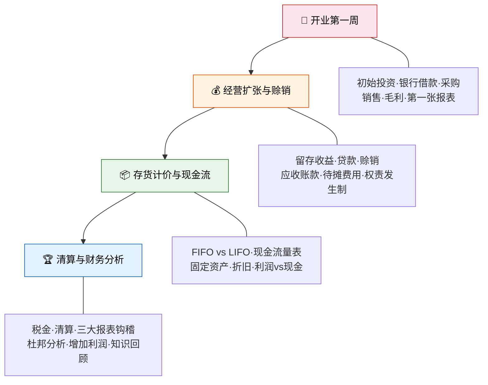

# 柠檬水站实战

> 如果会计是一座大厦，那前几章我们一直在看图纸；现在，是时候拿起砖头亲手砌墙了。跟着小明的柠檬水站，从开业到清算，完整走完一个会计周期。

## 为什么需要"实战"？

理论章节里，我们学过会计等式、复式记账、报表编制——但**知识到技能之间，隔着"动手"这道坎**。本章节用《世界上最简单的会计书》的经典方法，让你**跟着小明一起开一家柠檬水站**，从第一笔投资到年终报表，完整走过一个会计期间。

## 本章节特色

| 特色 | 说明 |
|------|------|
| 🍋 **柠檬水站叙事** | 全程以小明的柠檬水站为案例，让每个会计概念都有故事落脚点 |
| 📊 **逐步建表** | 每笔交易后展示资产负债表的变化，直观感受"等式永远平衡" |
| 📝 **T字账+分录** | 每笔交易同时给出会计分录和T字账，强化借贷思维 |
| 🧩 **练习题** | 每节配有练习题与详细解答，检验理解 |
| 📖 **原著对照** | 标注与《世界上最简单的会计书》的对应内容 |

## 学习路线

## 文章目录

| 序号 | 文章 | 对应原著 | 核心内容 |
|------|------|---------|---------|
| 1 | [开业第一周](01_开业第一周.md) | 第1-2章 | 初始投资、银行借款、采购销售、毛利与净利润、第一张资产负债表与利润表 |
| 2 | [经营扩张与赊销](02_经营扩张与赊销.md) | 第3-4章 | 留存收益、贷款、赊销与应收账款、坏账、待摊费用、权责发生制vs收付实现制 |
| 3 | [存货计价与现金流](03_存货计价与现金流.md) | 第5-8章 | FIFO vs LIFO、现金流量表、固定资产与折旧、资本化vs费用化 |
| 4 | [清算与财务分析](04_清算与财务分析.md) | 第9-10章 | 税金计算、企业清算、三大报表钩稽关系、杜邦分析、知识回顾 |

---

::: info 原著参考
本章节核心案例与教学思路源自 **《世界上最简单的会计书》**（The Accounting Game），作者：Judith Orloff & Darrell Mullis。该书以柠檬水站为线索，从零开始搭建会计知识体系，是全球最畅销的会计入门读物之一。
:::
