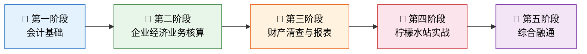
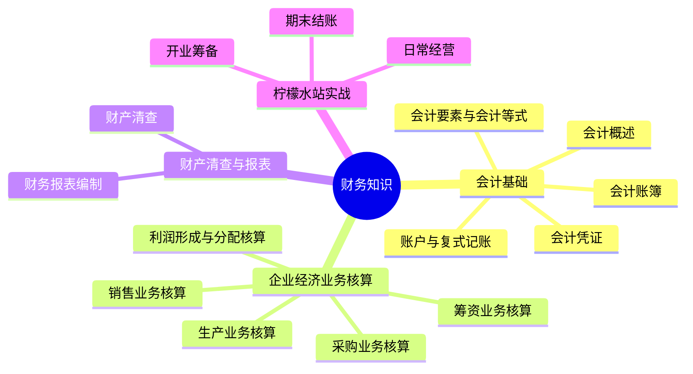

# 财务知识

> 会计不是枯燥的数字游戏，而是企业经营的"语言"——它把每一笔交易翻译成信息，让管理者看清企业的过去、现在和未来。

## 课程概述

本课程以**双轨并行**的方式讲授会计学基础：一条轨道是严谨的学术体系，另一条轨道是生动的柠檬水站经营故事。两条轨道相互印证，帮助你在理解原理的同时建立直觉。

## 参考教材

| 教材 | 特点 | 定位 |
|------|------|------|
| **《基础会计第7版》** | 中国高校会计学经典教材，体系完整、逻辑严密 | 理论主线——提供知识框架与学术规范 |
| **《世界上最简单的会计书》** | 以柠檬水站为隐喻，从一张资产负债表开始搭建整个会计体系 | 直觉主线——用故事建立"手感" |

---

## 学习路线图

| 阶段 | 内容 | 核心目标 |
|------|------|---------|
| 📘 会计基础 | 会计概述、要素与等式、复式记账、凭证、账簿 | 建立"借贷"思维框架 |
| 📗 企业经济业务核算 | 筹资、采购、生产、销售、利润分配全流程核算 | 掌握企业全业务循环的账务处理 |
| 📙 财产清查与报表 | 财产清查方法、资产负债表、利润表、现金流量表 | 学会"查账"和"出报表" |
| 📕 柠檬水站实战 | 用柠檬水站完整模拟一个会计期间 | 把理论变成"手艺" |
| 🎯 综合融通 | 全科串联、综合题、面试高频考点 | 从"学会"到"会用" |

---

## 章节目录

### [会计基础](01_会计基础/README.md)

| 文章 | 核心内容 |
|------|---------|
| [会计概述](01_会计基础/01_会计概述.md) | 会计定义、职能、对象、基本假设、信息质量要求 |
| [会计要素与会计等式](01_会计基础/02_会计要素与会计等式.md) | 六大要素、基本等式与扩展等式、9种经济业务影响 |
| [账户与复式记账](01_会计基础/03_账户与复式记账.md) | T字账、借贷记账法、会计分录、试算平衡 |
| [会计凭证](01_会计基础/04_会计凭证.md) | 原始凭证、记账凭证、填制与审核 |
| [会计账簿](01_会计基础/05_会计账簿.md) | 账簿种类、平行登记、对账结账、错账更正 |

### [企业经济业务核算](02_企业经济业务核算/README.md)

> 敬请期待

### [财产清查与报表](03_财产清查与报表/README.md)

> 敬请期待

### [柠檬水站实战](04_柠檬水站实战/README.md)

> 敬请期待
