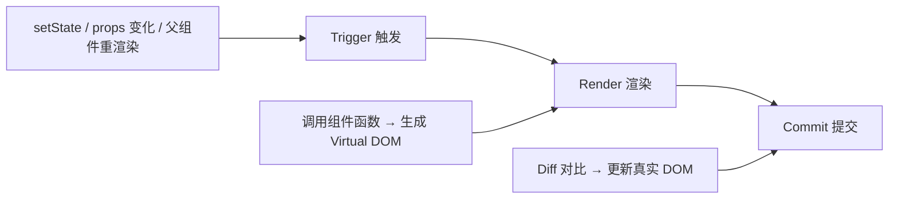
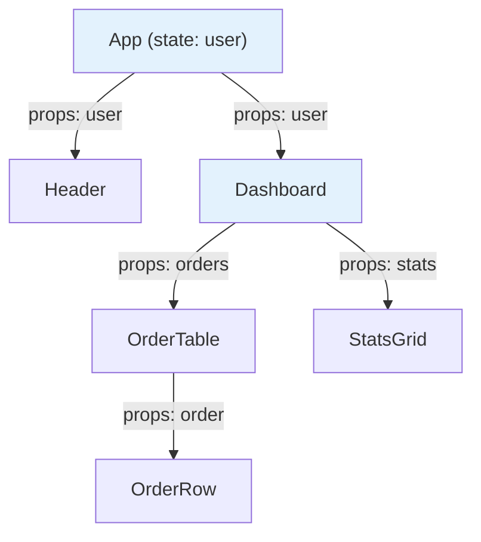
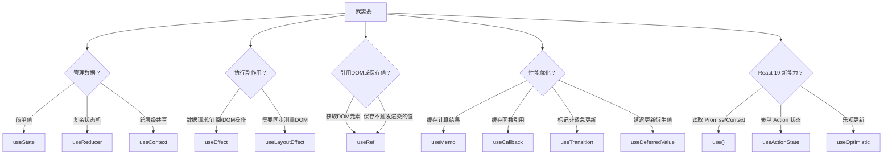

# React 心智模型速查：一篇讲透 React 的运行逻辑

> **TL;DR**
> 这不是入门教程，而是一份写给"会用 React 但说不清为什么"的开发者的**心智模型速查卡**。读完这篇，你应该能在脑中画出 React 从 JSX 到屏幕像素的完整流水线，并知道每个 Hook 在其中扮演什么角色。

## 1. React 的一句话公式

```
UI = f(state)
```

React 的核心承诺：**你只需要声明"状态是什么样的，UI 就应该是什么样的"，React 帮你搞定从状态到像素之间的所有脏活。**

这个 `f` 就是你的组件函数。每当 `state` 变化，React 重新调用 `f`，拿到新的 UI 描述（Virtual DOM），然后 Diff 出最小变更，更新真实 DOM。

## 2. 渲染的三个阶段



| 阶段 | 发生了什么 | 可以被打断吗 |
|------|-----------|:---:|
| **Trigger** | state 变化、props 变化、父组件重渲染——触发一次新的渲染 | — |
| **Render** | React 调用你的组件函数，生成新的 Virtual DOM 树 | 是（并发模式下） |
| **Commit** | React 对比新旧 Virtual DOM，只更新真实 DOM 中变化的部分 | 否（同步执行） |

**关键理解**：Render 阶段**不等于更新 DOM**。组件函数被调用了（Render），但如果输出没变化，DOM 不会被碰（Commit 被跳过）。这就是"无效重渲染"的含义——Render 了但没 Commit。

## 3. 组件树与数据流



**单向数据流的铁律**：
- 数据**只能**从父组件流向子组件（通过 Props）
- 子组件想"改"父组件的数据？父组件传一个**回调函数**下来
- 兄弟组件通信？把状态**提升**到它们共同的父组件

```tsx
// 状态提升示例：搜索框和列表是兄弟，搜索词状态放在父组件
function OrderPage() {
  const [keyword, setKeyword] = useState("");
  return (
    <>
      <SearchBox value={keyword} onChange={setKeyword} />
      <OrderList keyword={keyword} />
    </>
  );
}
```

## 4. JSX 模式速查

### 4.1 条件渲染

```tsx
// 三元表达式：二选一
{isAdmin ? <AdminPanel /> : <UserPanel />}

// 逻辑与：有就显示，没有就不渲染
{hasPermission && <DeleteButton />}

// 注意陷阱：0 是 falsy 但会被渲染为文本 "0"
{count && <Badge count={count} />}    // Bad: count=0 时渲染 "0"
{count > 0 && <Badge count={count} />} // Good: 显式布尔判断

// 复杂条件：提取变量或用 IIFE
const statusUI = (() => {
  switch (status) {
    case "loading": return <Spinner />;
    case "error":   return <ErrorTip />;
    case "empty":   return <EmptyState />;
    default:        return <DataView data={data} />;
  }
})();
```

### 4.2 列表渲染与 Key

```tsx
// Key 的黄金法则：用数据的唯一标识，永远不要用 index
{orders.map(order => (
  <OrderRow key={order.id} order={order} />
))}

// 为什么 index 不行？
// 当列表重新排序/插入/删除时，React 根据 key 匹配旧组件：
// - 用 id：React 精确识别每一行，只移动 DOM 节点
// - 用 index：所有行的 key 都变了，React 重建所有行（性能灾难 + 状态错乱）
```

### 4.3 Props 展开与透传

```tsx
// 展开 Props：适用于包装组件
interface ButtonProps extends React.ButtonHTMLAttributes<HTMLButtonElement> {
  loading?: boolean;
}

function LoadingButton({ loading, children, ...rest }: ButtonProps) {
  return (
    <button disabled={loading} {...rest}>
      {loading ? "处理中..." : children}
    </button>
  );
}

// children 模式：组件的"插槽"
function Card({ title, children }: { title: string; children: React.ReactNode }) {
  return (
    <div className="rounded-lg border p-4">
      <h3 className="font-bold">{title}</h3>
      <div className="mt-2">{children}</div>
    </div>
  );
}

// Fragment：包裹多个元素但不产生额外 DOM
function UserInfo() {
  return (
    <>
      <span>张三</span>
      <span>前端工程师</span>
    </>
  );
}
```

### 4.4 事件处理

```tsx
// 基础事件
function SearchBox() {
  function handleChange(e: React.ChangeEvent<HTMLInputElement>) {
    console.log(e.target.value);
  }

  function handleSubmit(e: React.FormEvent<HTMLFormElement>) {
    e.preventDefault(); // 阻止表单默认提交
  }

  return (
    <form onSubmit={handleSubmit}>
      <input onChange={handleChange} />
    </form>
  );
}

// 事件传参：不要在 JSX 里写箭头函数（频繁重渲染场景的性能问题）
// 可以接受的写法（大多数场景没有性能问题）：
<Button onClick={() => handleEdit(order.id)}>编辑</Button>

// 如果在大列表中，用 data attribute 避免创建闭包：
function OrderRow({ order }: { order: Order }) {
  return <button data-id={order.id} onClick={handleClick}>编辑</button>;
}
function handleClick(e: React.MouseEvent<HTMLButtonElement>) {
  const id = e.currentTarget.dataset.id;
}
```

## 5. 受控组件 vs 非受控组件

这是表单开发中**最重要的心智模型分界线**。

| 维度 | 受控组件 | 非受控组件 |
|------|---------|-----------|
| 数据源 | React state（`useState`） | DOM 自身（`ref.current.value`） |
| 每次输入 | 触发 setState → 重渲染 | 不触发重渲染 |
| 读取值 | `state` 变量 | `ref.current.value` |
| 适用场景 | 需要实时校验、联级依赖 | 简单表单、性能敏感的大型表单 |
| 典型方案 | 原生 useState | React Hook Form |

```tsx
// 受控：每输入一个字符都重渲染
function ControlledInput() {
  const [value, setValue] = useState("");
  return <input value={value} onChange={(e) => setValue(e.target.value)} />;
}

// 非受控：只在提交时读取值
function UncontrolledInput() {
  const inputRef = useRef<HTMLInputElement>(null);
  function handleSubmit() {
    console.log(inputRef.current?.value);
  }
  return <input ref={inputRef} defaultValue="" />;
}
```

## 6. Hooks 速查地图



### 核心 Hooks 一句话总结

| Hook | 一句话 | 触发重渲染？ |
|------|--------|:-----------:|
| `useState` | 组件的记忆，值变了就重渲染 | 是 |
| `useReducer` | useState 的"状态机版"，复杂状态用它 | 是 |
| `useEffect` | 渲染完成后执行副作用（请求、订阅、DOM 操作） | 否（但内部 setState 会） |
| `useLayoutEffect` | 和 useEffect 一样，但在浏览器绘制前同步执行 | 否 |
| `useRef` | 一个不触发重渲染的"盒子"，常用来引用 DOM | 否 |
| `useContext` | 读取最近的 Provider 的值 | 当 Provider value 变化时是 |
| `useMemo` | 缓存计算结果，依赖不变就不重新计算 | 否 |
| `useCallback` | `useMemo` 的函数版，缓存函数引用 | 否 |
| `useTransition` | 标记某个 setState 为"非紧急"，不阻塞用户输入 | 是（但低优先级） |
| `useDeferredValue` | 延迟更新某个值，让 UI 先响应用户操作 | 是（但延迟） |
| `useId` | 生成唯一 ID，用于 label-input 关联和 SSR 一致性 | 否 |
| `useImperativeHandle` | 配合 `forwardRef`，自定义暴露给父组件的 ref 方法 | 否 |

## 7. 状态更新的三大陷阱

### 陷阱一：setState 是异步的

```tsx
const [count, setCount] = useState(0);

function handleClick() {
  setCount(count + 1);
  setCount(count + 1);
  setCount(count + 1);
  // 结果：count 变成 1，不是 3！
  // 因为三次 setCount 都读到了同一个 count（闭包快照）

  // 修复：用函数式更新
  setCount(prev => prev + 1);
  setCount(prev => prev + 1);
  setCount(prev => prev + 1);
  // 结果：count 变成 3
}
```

### 陷阱二：对象和数组必须不可变更新

```tsx
const [user, setUser] = useState({ name: "张三", age: 25 });

// Bad: 直接修改原对象，React 检测不到变化
user.name = "李四";
setUser(user); // 引用没变，不重渲染！

// Good: 创建新对象
setUser({ ...user, name: "李四" });
// 或：
setUser(prev => ({ ...prev, name: "李四" }));

// 数组同理
const [list, setList] = useState([1, 2, 3]);
setList([...list, 4]);               // 添加
setList(list.filter(x => x !== 2));   // 删除
setList(list.map(x => x === 2 ? 20 : x)); // 修改
```

### 陷阱三：useEffect 的依赖项说谎

```tsx
// Bad: 依赖项缺失，effect 里读到的永远是初始值（闭包陷阱）
const [count, setCount] = useState(0);
useEffect(() => {
  const timer = setInterval(() => {
    console.log(count); // 永远是 0！
  }, 1000);
  return () => clearInterval(timer);
}, []); // 空依赖 → effect 只在 mount 时创建闭包，count 被冻结为 0

// Good: 要么加依赖，要么用函数式更新
useEffect(() => {
  const timer = setInterval(() => {
    setCount(prev => prev + 1); // 不依赖外部 count
  }, 1000);
  return () => clearInterval(timer);
}, []); // 这里空依赖是对的，因为 effect 不读取 count
```

## 8. 组件设计原则速查

| 原则 | 说明 | 违反的信号 |
|------|------|-----------|
| **单一职责** | 一个组件只做一件事 | 组件超过 300 行 |
| **Props 向下，Events 向上** | 数据通过 Props 传入，变更通过回调通知 | 子组件直接修改父组件的 ref |
| **状态就近原则** | 状态放在"需要它的最低公共祖先" | 全局 store 里放了只有一个组件用的状态 |
| **组合优于继承** | 用 `children` 和 Props 组合，不要用 class 继承 | 代码中出现 `extends Component` |
| **受控 = 可预测** | 能受控就受控，除非性能要求非受控 | 混用 value 和 defaultValue |

---

*这份速查卡覆盖了进入 [React 中后台架构知识库](../README.md) 所需的全部基础心智模型。如果某个概念还不熟悉，建议先阅读本站的 [React 19 从入门到精通](/前端开发/react19教程/) 对应章节。*
