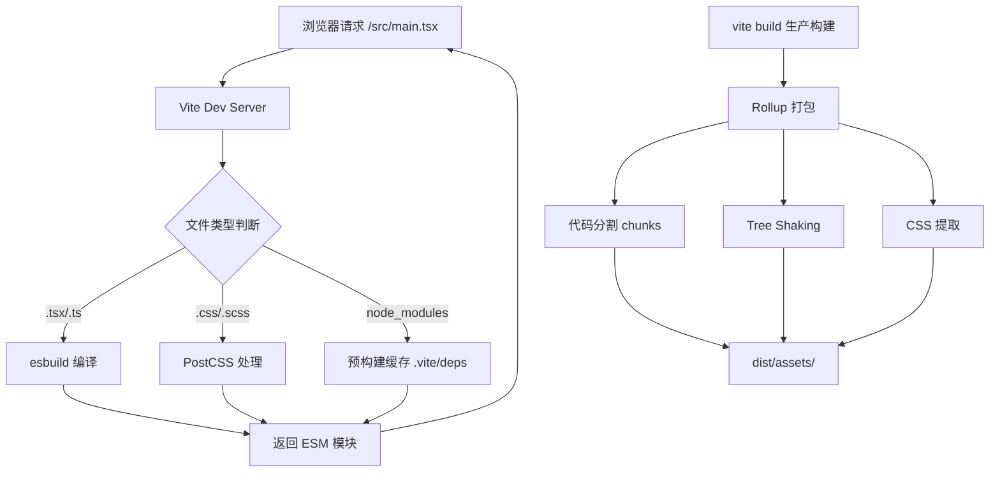

# Vite 引擎深度调教：从开发到生产的极致配置

> **TL;DR**
> Vite 不是"开箱即用就够了"的玩具，在中后台场景下，你需要深度定制环境变量策略、代理配置、构建分包规则和预构建缓存，才能撑起 200+ 页面的企业级 Admin 系统。

## 1. 核心顿悟：把原理拉下神坛

- **生动比喻**：Webpack 是一台巨型搅拌机——不管你要榨什么汁，它都要先把所有水果塞进去搅碎再倒出来。而 Vite 是一个智能冰箱——你要苹果就拿苹果，要橙子就拿橙子，按需取用，绝不浪费。
- **底层剖析**：Vite 开发模式的核心是 **原生 ESM**。浏览器通过 `<script type="module">` 直接请求每一个模块，Vite 的开发服务器充当一个"即时翻译官"——浏览器请求 `.tsx` 文件时，Vite 用 esbuild 以纳秒级速度将其编译成浏览器能运行的 JS。这意味着启动时不需要打包整个项目，只需要编译当前页面用到的模块。

```
传统 Webpack 流程：
[所有文件] → [解析依赖图] → [全量打包] → [Dev Server] → 浏览器
（等 30 秒...）

Vite 流程：
[Dev Server 启动] → 浏览器请求 → [按需编译单个文件] → 返回
（等 300 毫秒！）
```

## 2. 架构图解



## 3. 业务痛点与解决方案

- **Admin 痛点**：GlobalMart 运营大盘有 200+ 个页面，开发时 `npm run dev` 启动虽然快，但第一次访问某些深层页面时白屏长达 5 秒——因为浏览器要依次加载上百个依赖模块，形成"请求瀑布"。生产构建时，一个巨型 vendor.js 高达 3MB，用户首次加载苦不堪言。
- **破局思路**：开发环境通过 `optimizeDeps` 预构建消除请求瀑布；生产环境通过 `manualChunks` 手动分包，将 UI 库、图表库、工具库拆分到独立 chunk。

## 4. 生产级实战源码

### 4.1 项目初始化

```bash
# 使用 Vite 创建 React + TypeScript 项目
npm create vite@latest globalmart-admin -- --template react-ts

cd globalmart-admin
npm install

# 安装中后台常用依赖
npm install @tanstack/react-query @tanstack/react-table zustand
npm install react-router-dom react-hook-form zod @hookform/resolvers
npm install tailwindcss postcss autoprefixer
npm install -D @types/node
```

### 4.2 完整 vite.config.ts

```tsx
// vite.config.ts — GlobalMart 运营大盘的生产级配置
import { defineConfig, loadEnv, type UserConfig } from "vite";
import react from "@vitejs/plugin-react";
import path from "node:path";

// 构建分包策略：将大型依赖拆分到独立 chunk
interface ChunkGroup {
  name: string;
  includes: string[];
}

const chunkGroups: ChunkGroup[] = [
  { name: "vendor-react", includes: ["react", "react-dom", "react-router-dom"] },
  { name: "vendor-query", includes: ["@tanstack/react-query", "@tanstack/react-table"] },
  { name: "vendor-form", includes: ["react-hook-form", "@hookform/resolvers", "zod"] },
  { name: "vendor-ui", includes: ["@radix-ui", "class-variance-authority", "clsx", "tailwind-merge"] },
  { name: "vendor-utils", includes: ["date-fns", "lodash-es", "axios"] },
];

export default defineConfig(({ mode }): UserConfig => {
  // 根据当前模式加载对应的 .env 文件
  const env = loadEnv(mode, process.cwd(), "");

  return {
    plugins: [react()],

    // 路径别名：中后台项目模块多，层级深，别名是刚需
    resolve: {
      alias: {
        "@": path.resolve(__dirname, "src"),
        "@components": path.resolve(__dirname, "src/components"),
        "@hooks": path.resolve(__dirname, "src/hooks"),
        "@pages": path.resolve(__dirname, "src/pages"),
        "@api": path.resolve(__dirname, "src/api"),
        "@store": path.resolve(__dirname, "src/store"),
        "@utils": path.resolve(__dirname, "src/utils"),
        "@types": path.resolve(__dirname, "src/types"),
      },
    },

    // 开发服务器配置
    server: {
      port: Number(env.VITE_DEV_PORT) || 3000,
      open: true,
      // 代理配置：中后台项目通常需要同时对接多个后端服务
      proxy: {
        "/api": {
          target: env.VITE_API_BASE_URL || "http://localhost:8080",
          changeOrigin: true,
          rewrite: (p) => p.replace(/^\/api/, ""),
        },
        "/auth": {
          target: env.VITE_AUTH_URL || "http://localhost:8081",
          changeOrigin: true,
        },
        "/upload": {
          target: env.VITE_UPLOAD_URL || "http://localhost:8082",
          changeOrigin: true,
        },
      },
    },

    // 预构建优化：显式包含深层依赖，避免开发时"请求瀑布"
    optimizeDeps: {
      include: [
        "react",
        "react-dom",
        "react-router-dom",
        "@tanstack/react-query",
        "@tanstack/react-table",
        "zustand",
        "react-hook-form",
        "zod",
        "axios",
        "date-fns",
      ],
    },

    // CSS 配置
    css: {
      devSourcemap: true,
    },

    // 生产构建配置
    build: {
      target: "es2020",
      outDir: "dist",
      sourcemap: mode === "staging",
      // 触发 chunk 大小警告的阈值
      chunkSizeWarningLimit: 500,
      rollupOptions: {
        output: {
          // 手动分包：核心策略
          manualChunks(id: string): string | undefined {
            if (!id.includes("node_modules")) return undefined;
            for (const group of chunkGroups) {
              if (group.includes.some((pkg) => id.includes(pkg))) {
                return group.name;
              }
            }
            return undefined;
          },
          // 文件命名策略：带 hash 方便缓存
          chunkFileNames: "assets/js/[name]-[hash].js",
          entryFileNames: "assets/js/[name]-[hash].js",
          assetFileNames: "assets/[ext]/[name]-[hash].[ext]",
        },
      },
    },

    // 环境变量前缀：只有 VITE_ 开头的才会暴露给客户端
    envPrefix: "VITE_",
  };
});
```

### 4.3 多环境配置

```bash
# .env.development — 开发环境
VITE_DEV_PORT=3000
VITE_API_BASE_URL=http://localhost:8080
VITE_AUTH_URL=http://localhost:8081
VITE_UPLOAD_URL=http://localhost:8082
VITE_APP_TITLE=GlobalMart Admin (Dev)

# .env.staging — 预发布环境
VITE_API_BASE_URL=https://staging-api.globalmart.com
VITE_AUTH_URL=https://staging-auth.globalmart.com
VITE_UPLOAD_URL=https://staging-upload.globalmart.com
VITE_APP_TITLE=GlobalMart Admin (Staging)

# .env.production — 生产环境
VITE_API_BASE_URL=https://api.globalmart.com
VITE_AUTH_URL=https://auth.globalmart.com
VITE_UPLOAD_URL=https://upload.globalmart.com
VITE_APP_TITLE=GlobalMart Admin
```

### 4.4 类型安全的环境变量

```tsx
// src/env.d.ts — 让 TypeScript 认识你的环境变量
/// <reference types="vite/client" />

interface ImportMetaEnv {
  readonly VITE_DEV_PORT: string;
  readonly VITE_API_BASE_URL: string;
  readonly VITE_AUTH_URL: string;
  readonly VITE_UPLOAD_URL: string;
  readonly VITE_APP_TITLE: string;
}

interface ImportMeta {
  readonly env: ImportMetaEnv;
}
```

### 4.5 tsconfig 路径别名同步

```json
// tsconfig.json
{
  "compilerOptions": {
    "target": "ES2020",
    "lib": ["ES2020", "DOM", "DOM.Iterable"],
    "module": "ESNext",
    "moduleResolution": "bundler",
    "strict": true,
    "jsx": "react-jsx",
    "baseUrl": ".",
    "paths": {
      "@/*": ["src/*"],
      "@components/*": ["src/components/*"],
      "@hooks/*": ["src/hooks/*"],
      "@pages/*": ["src/pages/*"],
      "@api/*": ["src/api/*"],
      "@store/*": ["src/store/*"],
      "@utils/*": ["src/utils/*"],
      "@types/*": ["src/types/*"]
    }
  },
  "include": ["src"]
}
```

## 5. 避坑指南与反模式

### 坑一：代理配置不生效

**现象**：配了 proxy 但请求还是跨域报错。

**原因**：`rewrite` 写错了，或者后端接口的 base path 和你预期不一致。

```tsx
// Bad: 代理了但没重写路径，后端收到的还是 /api/users
proxy: {
  "/api": {
    target: "http://localhost:8080",
    changeOrigin: true,
    // 缺少 rewrite，后端收到 /api/users 而不是 /users
  },
}

// Good: 明确重写路径
proxy: {
  "/api": {
    target: "http://localhost:8080",
    changeOrigin: true,
    rewrite: (path) => path.replace(/^\/api/, ""),
  },
}
```

### 坑二：环境变量在客户端取不到

**现象**：`process.env.API_URL` 返回 `undefined`。

**原因**：Vite 不是 Webpack！它不注入 `process.env`，而是使用 `import.meta.env`，且只有 `VITE_` 前缀的变量才会暴露。

```tsx
// Bad: 这是 Webpack 的写法
const apiUrl = process.env.REACT_APP_API_URL;

// Good: Vite 的正确姿势
const apiUrl = import.meta.env.VITE_API_BASE_URL;
```

### 坑三：生产包体积失控

**现象**：`npm run build` 后 vendor.js 超过 2MB。

**原因**：没有做分包策略，所有第三方依赖挤在一个 chunk 里。

**解法**：使用上面配置中的 `manualChunks`，把依赖按功能分组。还可以配合 `rollup-plugin-visualizer` 分析包构成：

```bash
npm install -D rollup-plugin-visualizer
```

```tsx
// vite.config.ts 中添加
import { visualizer } from "rollup-plugin-visualizer";

// 在 plugins 数组中加入（仅分析时开启）
plugins: [
  react(),
  mode === "analyze" && visualizer({
    open: true,
    filename: "dist/stats.html",
    gzipSize: true,
  }),
],
```

---

*下一步预告：Vite 跑起来了，但你的 TypeScript 还在用 `any` 当万金油？下一章 [TypeScript 高级泛型体操](./02.TypeScript高级泛型体操.md) 将带你用类型系统给中后台代码穿上铠甲。*
