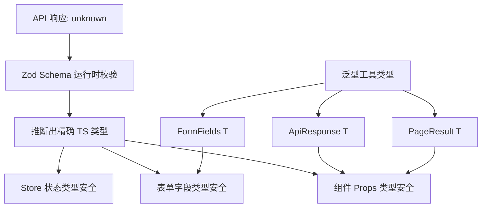

# TypeScript 高级泛型体操：给中后台代码穿上铠甲

> **TL;DR**
> 中后台系统中 80% 的运行时 Bug 都可以在编译期被 TypeScript 拦截——前提是你不写 `any`。本章教你用条件类型、映射类型和 infer 推断，构建"自文档化"的类型系统，让 API 响应、表单校验、路由参数全部类型安全。

## 1. 核心顿悟：把原理拉下神坛

- **生动比喻**：`any` 就像一把万能钥匙——什么门都能开，但也意味着你家的门对小偷形同虚设。泛型是定制钥匙——每把门都有专属的钥匙，既安全又灵活。
- **底层剖析**：TypeScript 的类型系统是**图灵完备**的，这意味着它理论上可以做任何计算。泛型（Generic）本质上是**类型层面的函数**：接收类型参数，返回新类型。条件类型 `T extends U ? X : Y` 就是类型层面的 `if-else`，映射类型 `{ [K in keyof T]: ... }` 就是类型层面的 `for` 循环。

## 2. 架构图解



## 3. 业务痛点与解决方案

- **Admin 痛点**：GlobalMart 有 60+ 个 API 接口，每个接口的请求参数和响应结构都不同。开发者要么给每个接口写一遍类型定义（重复劳动），要么偷懒用 `any`（运行时报错），两种选择都很痛苦。
- **破局思路**：构建一套泛型工具类型体系——`ApiResponse<T>`、`PageResult<T>`、`FormFields<T>` 等，让所有接口共享统一的"外壳"，只需要定义各自的"数据体"。

## 4. 生产级实战源码

### 4.1 基础泛型工具：API 响应类型

```tsx
// src/types/api.ts — GlobalMart 统一 API 类型体系

// 基础响应结构：所有 API 都遵循这个外壳
interface ApiResponse<TData> {
  code: number;
  message: string;
  data: TData;
  timestamp: number;
}

// 分页结果：列表接口的通用泛型
interface PageResult<TItem> {
  list: TItem[];
  total: number;
  page: number;
  pageSize: number;
  hasMore: boolean;
}

// 分页请求参数：所有分页接口共用
interface PageParams {
  page: number;
  pageSize: number;
  sortBy?: string;
  sortOrder?: "asc" | "desc";
}

// 带筛选条件的分页参数
type FilteredPageParams<TFilter> = PageParams & {
  filters: Partial<TFilter>;
};

// 实际使用：定义订单列表接口
interface Order {
  id: string;
  orderNo: string;
  customerName: string;
  amount: number;
  currency: string;
  status: "pending" | "processing" | "shipped" | "delivered" | "cancelled";
  createdAt: string;
}

interface OrderFilter {
  status: Order["status"];
  dateRange: [string, string];
  minAmount: number;
  maxAmount: number;
  country: string;
}

// 这行代码的类型信息就已经"自文档化"了：
// 请求参数是分页 + 订单筛选条件，响应是 API 包裹的分页订单列表
type GetOrderListParams = FilteredPageParams<OrderFilter>;
type GetOrderListResponse = ApiResponse<PageResult<Order>>;
```

### 4.2 条件类型：根据状态推断可用操作

```tsx
// src/types/permission.ts — 根据订单状态推断可执行的操作

// 不同状态下，订单允许的操作不同
type OrderAction<TStatus extends Order["status"]> =
  TStatus extends "pending"
    ? "confirm" | "cancel"
    : TStatus extends "processing"
      ? "ship" | "cancel"
      : TStatus extends "shipped"
        ? "deliver" | "return"
        : TStatus extends "delivered"
          ? "refund" | "review"
          : never; // cancelled 状态没有可执行操作

// 使用示例：TS 会自动推断出当前状态可用的操作
function handleOrderAction<TStatus extends Order["status"]>(
  status: TStatus,
  action: OrderAction<TStatus>
): void {
  // action 的类型会根据 status 自动收窄
  console.log(`执行操作: ${action} (当前状态: ${status})`);
}

// 编译通过
handleOrderAction("pending", "confirm");
handleOrderAction("shipped", "deliver");

// 编译报错！pending 状态不能执行 ship 操作
// handleOrderAction("pending", "ship");
```

### 4.3 映射类型：自动生成表单字段配置

```tsx
// src/types/form.ts — 从数据模型自动推导表单配置

// 将模型的所有字段映射为表单字段配置
type FormFieldConfig<TModel> = {
  [K in keyof TModel]: {
    name: K;
    label: string;
    required: boolean;
    defaultValue: TModel[K];
    // 根据字段的实际类型，推断适合的输入组件
    component: TModel[K] extends string
      ? "Input" | "Select" | "Textarea"
      : TModel[K] extends number
        ? "NumberInput" | "Slider"
        : TModel[K] extends boolean
          ? "Switch" | "Checkbox"
          : TModel[K] extends Array<infer _U>
            ? "MultiSelect" | "TagInput"
            : "Custom";
  };
};

// 创建订单表单的类型：字段配置完全由 Order 类型推导
interface OrderFormData {
  customerName: string;
  amount: number;
  currency: string;
  isUrgent: boolean;
  tags: string[];
}

// TS 自动知道每个字段该用什么组件
type OrderFormConfig = FormFieldConfig<OrderFormData>;
// 结果：
// {
//   customerName: { name: "customerName", component: "Input" | "Select" | "Textarea", ... }
//   amount: { name: "amount", component: "NumberInput" | "Slider", ... }
//   isUrgent: { name: "isUrgent", component: "Switch" | "Checkbox", ... }
//   tags: { name: "tags", component: "MultiSelect" | "TagInput", ... }
// }
```

### 4.4 infer 推断：从函数签名中提取类型

```tsx
// src/types/extract.ts — 从现有代码中"榨取"类型信息

// 提取 Promise 的内部类型
type UnwrapPromise<T> = T extends Promise<infer U> ? U : T;

// 提取 ApiResponse 的 data 字段类型
type ExtractApiData<T> = T extends ApiResponse<infer TData> ? TData : never;

// 提取函数的返回值类型（去掉 Promise 包装）
type AsyncReturnType<T extends (...args: never[]) => Promise<unknown>> =
  UnwrapPromise<ReturnType<T>>;

// 实际使用：从 API 函数中自动提取响应类型
async function fetchOrderList(
  params: GetOrderListParams
): Promise<GetOrderListResponse> {
  // ... 实际请求逻辑
  return {} as GetOrderListResponse;
}

// 自动提取：不需要手动写类型，从函数签名中推断
type OrderListData = ExtractApiData<AsyncReturnType<typeof fetchOrderList>>;
// 结果：PageResult<Order>

// 提取路由参数类型：从路径模板中推断参数
type ExtractRouteParams<TPath extends string> =
  TPath extends `${string}:${infer Param}/${infer Rest}`
    ? { [K in Param | keyof ExtractRouteParams<Rest>]: string }
    : TPath extends `${string}:${infer Param}`
      ? { [K in Param]: string }
      : Record<string, never>;

// 从路由路径自动推断参数
type OrderDetailParams = ExtractRouteParams<"/orders/:orderId/items/:itemId">;
// 结果：{ orderId: string; itemId: string }
```

### 4.5 实用工具类型集合

```tsx
// src/types/utils.ts — 中后台项目高频工具类型

// 深度 Partial：嵌套对象的所有字段都变为可选
type DeepPartial<T> = {
  [K in keyof T]?: T[K] extends object ? DeepPartial<T[K]> : T[K];
};

// 深度 Required：与 DeepPartial 相反
type DeepRequired<T> = {
  [K in keyof T]-?: T[K] extends object ? DeepRequired<T[K]> : T[K];
};

// 将指定字段变为必填，其余保持不变
type RequireFields<T, K extends keyof T> = T & Required<Pick<T, K>>;

// 将指定字段变为可选，其余保持不变
type OptionalFields<T, K extends keyof T> = Omit<T, K> & Partial<Pick<T, K>>;

// 表格列定义的类型安全版本
type TypedColumnDef<TData> = {
  [K in keyof TData]: {
    accessorKey: K;
    header: string;
    cell?: (value: TData[K], row: TData) => React.ReactNode;
    sortable?: boolean;
    filterable?: boolean;
  };
}[keyof TData];

// 使用：定义订单表格的列
const orderColumns: TypedColumnDef<Order>[] = [
  {
    accessorKey: "orderNo",
    header: "订单号",
    sortable: true,
  },
  {
    accessorKey: "amount",
    header: "金额",
    cell: (value) => `¥${value.toFixed(2)}`, // value 自动推断为 number
    sortable: true,
  },
  {
    accessorKey: "status",
    header: "状态",
    cell: (value) => value.toUpperCase(), // value 自动推断为 Order["status"]
    filterable: true,
  },
];
```

## 5. 避坑指南与反模式

### 坑一：滥用 `as` 类型断言

**现象**：到处写 `as SomeType`，看似没有类型错误，实际上只是把错误藏起来了。

```tsx
// Bad: as 断言只是"我保证没问题"，TS 不会真的检查
const order = response.data as Order; // 如果 data 结构不对，运行时爆炸

// Good: 用 Zod 做运行时校验，自动推断类型
import { z } from "zod";

const OrderSchema = z.object({
  id: z.string(),
  orderNo: z.string(),
  amount: z.number(),
  status: z.enum(["pending", "processing", "shipped", "delivered", "cancelled"]),
});

const order = OrderSchema.parse(response.data); // 运行时校验 + 类型推断
```

### 坑二：泛型约束太松

**现象**：泛型参数没有约束，导致类型推断退化为 `unknown`。

```tsx
// Bad: T 没有约束，TS 不知道 T 上有什么属性
function getField<T>(obj: T, key: string) {
  return (obj as Record<string, unknown>)[key]; // 被迫用 as
}

// Good: 用 extends 约束泛型，keyof 确保 key 合法
function getField<T extends Record<string, unknown>, K extends keyof T>(
  obj: T,
  key: K
): T[K] {
  return obj[key]; // 完美推断，零断言
}
```

### 坑三：枚举 vs 联合类型

**现象**：用 `enum` 定义状态值，但 enum 在打包时会产生额外代码，且与第三方库的类型对接不便。

```tsx
// Bad: enum 编译后产生双向映射对象，增大包体积
enum OrderStatus {
  Pending = "pending",
  Processing = "processing",
}

// Good: const 对象 + typeof 推断，零运行时开销
const ORDER_STATUS = {
  Pending: "pending",
  Processing: "processing",
  Shipped: "shipped",
  Delivered: "delivered",
  Cancelled: "cancelled",
} as const;

type OrderStatus = (typeof ORDER_STATUS)[keyof typeof ORDER_STATUS];
// 结果："pending" | "processing" | "shipped" | "delivered" | "cancelled"
```

---

*下一步预告：类型铠甲穿好了，但你的 UI 还是一团乱麻？下一章 [Tailwind CSS 架构化方案](./03.TailwindCSS架构化方案.md) 将教你用设计令牌和主题系统，让 200 个页面保持视觉一致性。*
