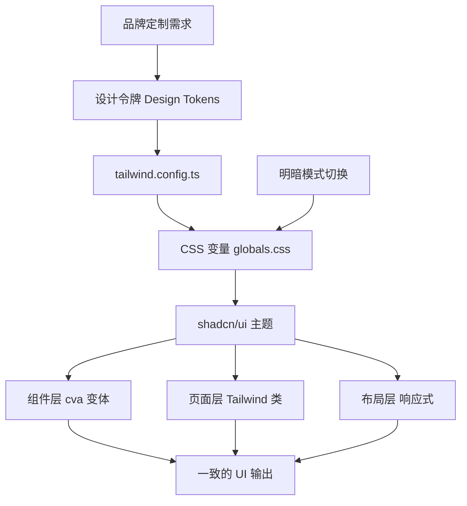

# Tailwind CSS 架构化方案：中后台 UI 一致性保障

> **TL;DR**
> Tailwind 不是"在 HTML 里写内联样式的框架"，在中后台场景下，你需要用**设计令牌（Design Tokens）**统一视觉语言，用 **CSS 变量 + shadcn/ui 主题系统**实现明暗切换，用 **cva（Class Variance Authority）**管理组件变体，才能让 200 个页面"看起来是同一个人写的"。

## 1. 核心顿悟：把原理拉下神坛

- **生动比喻**：原子化 CSS 就像乐高积木——每一块积木（`p-4`、`text-sm`、`rounded-lg`）都极其简单，但通过组合可以搭出任何形状。传统 CSS 像是雕刻——你为每个作品单独凿一块石头，好看但无法复用。
- **底层剖析**：Tailwind 在编译时通过 PurgeCSS 扫描你的源码，只保留**真正使用到的**原子类。一个拥有上千种组合的 Tailwind 配置，最终产出的 CSS 可能只有 10KB（gzip 后）。这是因为它利用了 CSS 类名的**幂律分布**——80% 的页面只用到 20% 的样式组合。

## 2. 架构图解



## 3. 业务痛点与解决方案

- **Admin 痛点**：GlobalMart 大盘有 6 个业务模块（订单、库存、用户、报表、设置、消息），每个模块由不同开发者负责。半年后发现——同样是"成功"状态，有人用 `green-500`，有人用 `emerald-600`，还有人用 `lime-400`。按钮的圆角有 `rounded`、`rounded-md`、`rounded-lg` 三种。用户觉得"系统看起来很山寨"。
- **破局思路**：从设计令牌出发，建立语义化的颜色、间距、圆角体系，开发者不再使用 `green-500` 这样的原始色值，而是使用 `text-success`、`bg-primary` 这样的语义化类名。

## 4. 生产级实战源码

### 4.1 设计令牌：globals.css

```css
/* src/styles/globals.css — GlobalMart 设计令牌 */
@tailwind base;
@tailwind components;
@tailwind utilities;

@layer base {
  /* 亮色主题令牌 */
  :root {
    /* 基础色系：HSL 格式，方便做透明度变体 */
    --background: 0 0% 100%;
    --foreground: 222.2 84% 4.9%;

    /* 卡片与弹窗 */
    --card: 0 0% 100%;
    --card-foreground: 222.2 84% 4.9%;

    /* 主要操作色：品牌蓝 */
    --primary: 221.2 83.2% 53.3%;
    --primary-foreground: 210 40% 98%;

    /* 次要操作色 */
    --secondary: 210 40% 96.1%;
    --secondary-foreground: 222.2 47.4% 11.2%;

    /* 危险/警告/成功 语义色 */
    --destructive: 0 84.2% 60.2%;
    --destructive-foreground: 210 40% 98%;
    --warning: 38 92% 50%;
    --warning-foreground: 48 96% 5%;
    --success: 142 76% 36%;
    --success-foreground: 210 40% 98%;

    /* 静音色：用于次要文字、禁用状态 */
    --muted: 210 40% 96.1%;
    --muted-foreground: 215.4 16.3% 46.9%;

    /* 边框与输入框 */
    --border: 214.3 31.8% 91.4%;
    --input: 214.3 31.8% 91.4%;
    --ring: 221.2 83.2% 53.3%;

    /* 圆角：统一全局圆角 */
    --radius: 0.5rem;

    /* 侧边栏专属令牌 */
    --sidebar-width: 260px;
    --sidebar-collapsed-width: 64px;
    --header-height: 56px;
  }

  /* 暗色主题令牌 */
  .dark {
    --background: 222.2 84% 4.9%;
    --foreground: 210 40% 98%;

    --card: 222.2 84% 4.9%;
    --card-foreground: 210 40% 98%;

    --primary: 217.2 91.2% 59.8%;
    --primary-foreground: 222.2 47.4% 11.2%;

    --secondary: 217.2 32.6% 17.5%;
    --secondary-foreground: 210 40% 98%;

    --destructive: 0 62.8% 30.6%;
    --destructive-foreground: 210 40% 98%;
    --warning: 38 92% 40%;
    --warning-foreground: 48 96% 89%;
    --success: 142 76% 26%;
    --success-foreground: 210 40% 98%;

    --muted: 217.2 32.6% 17.5%;
    --muted-foreground: 215 20.2% 65.1%;

    --border: 217.2 32.6% 17.5%;
    --input: 217.2 32.6% 17.5%;
    --ring: 224.3 76.3% 48%;
  }
}

@layer base {
  * {
    @apply border-border;
  }
  body {
    @apply bg-background text-foreground;
  }
}
```

### 4.2 tailwind.config.ts 配置

```tsx
// tailwind.config.ts — 将设计令牌映射到 Tailwind 类名
import type { Config } from "tailwindcss";

const config: Config = {
  darkMode: "class",
  content: ["./src/**/*.{ts,tsx}"],
  theme: {
    extend: {
      // 语义化颜色：开发者用 bg-primary、text-success，不再用 green-500
      colors: {
        border: "hsl(var(--border))",
        input: "hsl(var(--input))",
        ring: "hsl(var(--ring))",
        background: "hsl(var(--background))",
        foreground: "hsl(var(--foreground))",
        primary: {
          DEFAULT: "hsl(var(--primary))",
          foreground: "hsl(var(--primary-foreground))",
        },
        secondary: {
          DEFAULT: "hsl(var(--secondary))",
          foreground: "hsl(var(--secondary-foreground))",
        },
        destructive: {
          DEFAULT: "hsl(var(--destructive))",
          foreground: "hsl(var(--destructive-foreground))",
        },
        warning: {
          DEFAULT: "hsl(var(--warning))",
          foreground: "hsl(var(--warning-foreground))",
        },
        success: {
          DEFAULT: "hsl(var(--success))",
          foreground: "hsl(var(--success-foreground))",
        },
        muted: {
          DEFAULT: "hsl(var(--muted))",
          foreground: "hsl(var(--muted-foreground))",
        },
        card: {
          DEFAULT: "hsl(var(--card))",
          foreground: "hsl(var(--card-foreground))",
        },
      },
      borderRadius: {
        lg: "var(--radius)",
        md: "calc(var(--radius) - 2px)",
        sm: "calc(var(--radius) - 4px)",
      },
      // 中后台专属布局断点
      width: {
        sidebar: "var(--sidebar-width)",
        "sidebar-collapsed": "var(--sidebar-collapsed-width)",
      },
      height: {
        header: "var(--header-height)",
      },
      // 中后台专属动画
      keyframes: {
        "slide-in-from-left": {
          from: { transform: "translateX(-100%)" },
          to: { transform: "translateX(0)" },
        },
        "fade-in": {
          from: { opacity: "0" },
          to: { opacity: "1" },
        },
      },
      animation: {
        "slide-in": "slide-in-from-left 0.3s ease-out",
        "fade-in": "fade-in 0.2s ease-out",
      },
    },
  },
  plugins: [require("tailwindcss-animate")],
};

export default config;
```

### 4.3 cva 组件变体管理

```tsx
// src/components/ui/status-badge.tsx — 用 cva 管理状态徽章的所有变体
import { cva, type VariantProps } from "class-variance-authority";
import { cn } from "@/lib/utils";

// 定义徽章的所有变体：尺寸 × 状态 = 多种组合
const badgeVariants = cva(
  // 基础样式：所有变体共享
  "inline-flex items-center rounded-full font-medium transition-colors",
  {
    variants: {
      // 语义化状态变体
      variant: {
        default: "bg-primary/10 text-primary",
        success: "bg-success/10 text-success",
        warning: "bg-warning/10 text-warning",
        destructive: "bg-destructive/10 text-destructive",
        muted: "bg-muted text-muted-foreground",
      },
      // 尺寸变体
      size: {
        sm: "px-2 py-0.5 text-xs",
        md: "px-2.5 py-0.5 text-sm",
        lg: "px-3 py-1 text-sm",
      },
    },
    defaultVariants: {
      variant: "default",
      size: "md",
    },
  }
);

// Props 类型从 cva 变体中自动推断
interface StatusBadgeProps
  extends React.HTMLAttributes<HTMLSpanElement>,
    VariantProps<typeof badgeVariants> {
  children: React.ReactNode;
}

function StatusBadge({
  className,
  variant,
  size,
  children,
  ...props
}: StatusBadgeProps) {
  return (
    <span
      className={cn(badgeVariants({ variant, size }), className)}
      {...props}
    >
      {children}
    </span>
  );
}

// 业务封装：订单状态徽章
const ORDER_STATUS_MAP = {
  pending: { label: "待处理", variant: "warning" as const },
  processing: { label: "处理中", variant: "default" as const },
  shipped: { label: "已发货", variant: "default" as const },
  delivered: { label: "已签收", variant: "success" as const },
  cancelled: { label: "已取消", variant: "destructive" as const },
};

interface OrderStatusBadgeProps {
  status: keyof typeof ORDER_STATUS_MAP;
}

function OrderStatusBadge({ status }: OrderStatusBadgeProps) {
  const config = ORDER_STATUS_MAP[status];
  return <StatusBadge variant={config.variant}>{config.label}</StatusBadge>;
}

export { StatusBadge, OrderStatusBadge, badgeVariants };
```

### 4.4 主题切换 Hook

```tsx
// src/hooks/use-theme.ts — 明暗模式切换
import { useEffect, useState, useCallback } from "react";

type Theme = "light" | "dark" | "system";

function useTheme() {
  const [theme, setThemeState] = useState<Theme>(() => {
    if (typeof window === "undefined") return "system";
    return (localStorage.getItem("globalmart-theme") as Theme) || "system";
  });

  const applyTheme = useCallback((newTheme: Theme) => {
    const root = document.documentElement;
    const isDark =
      newTheme === "dark" ||
      (newTheme === "system" &&
        window.matchMedia("(prefers-color-scheme: dark)").matches);

    root.classList.toggle("dark", isDark);
  }, []);

  const setTheme = useCallback(
    (newTheme: Theme) => {
      setThemeState(newTheme);
      localStorage.setItem("globalmart-theme", newTheme);
      applyTheme(newTheme);
    },
    [applyTheme]
  );

  useEffect(() => {
    applyTheme(theme);

    if (theme === "system") {
      const mql = window.matchMedia("(prefers-color-scheme: dark)");
      const handler = () => applyTheme("system");
      mql.addEventListener("change", handler);
      return () => mql.removeEventListener("change", handler);
    }
  }, [theme, applyTheme]);

  return { theme, setTheme } as const;
}

export { useTheme, type Theme };
```

### 4.5 cn 工具函数

```tsx
// src/lib/utils.ts — shadcn/ui 标配工具函数
import { type ClassValue, clsx } from "clsx";
import { twMerge } from "tailwind-merge";

function cn(...inputs: ClassValue[]): string {
  return twMerge(clsx(inputs));
}

export { cn };
```

## 5. 避坑指南与反模式

### 坑一：直接使用原始色值

**现象**：不同开发者对"成功绿"用了不同的 Tailwind 色值，UI 不一致。

```tsx
// Bad: 每个人对"成功"的理解不同
<span className="text-green-500">成功</span>    // 开发者 A
<span className="text-emerald-600">成功</span>  // 开发者 B

// Good: 使用语义化令牌，统一来源
<span className="text-success">成功</span>
```

### 坑二：className 字符串冲突

**现象**：传入自定义 className 时，和组件内部的类名冲突，样式不生效。

```tsx
// Bad: Tailwind 类名有优先级问题，后写的不一定覆盖前写的
<Button className="bg-red-500" /> // 可能不生效，因为 bg-primary 也在

// Good: 使用 tailwind-merge（即 cn 函数）智能合并
<Button className={cn("bg-primary", customClassName)} />
// tailwind-merge 会识别冲突的类名，后面的覆盖前面的
```

### 坑三：暗色模式遗漏

**现象**：亮色模式完美，切到暗色模式一堆白底黑字的"闪光弹"。

```tsx
// Bad: 硬编码颜色值，暗色模式下刺眼
<div className="bg-white text-black">内容</div>

// Good: 使用语义化令牌，自动适配明暗模式
<div className="bg-card text-card-foreground">内容</div>
```

---

*下一步预告：地基打好了！下一卷 [React Router v6 嵌套路由](../02.路由与权限篇/01.ReactRouter嵌套路由.md) 将带你构建支撑 200+ 页面的中后台路由架构——中后台的命脉工程。*
