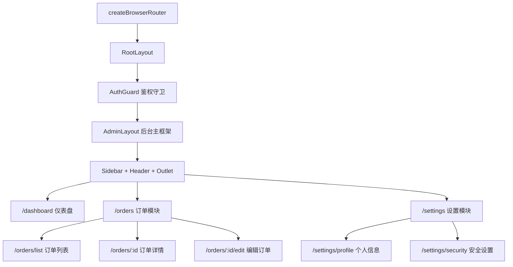

# React Router v6 嵌套路由：支撑 200+ 页面的中后台路由架构

> **TL;DR**
> 中后台路由不是"写几个 `<Route>` 就完事"——你需要嵌套布局、动态路由注册、路由守卫、面包屑自动生成和多标签页缓存。React Router v6 的 `createBrowserRouter` + `Outlet` 嵌套模式是基础，但真正的难点在路由配置的**数据驱动化**。

## 1. 核心顿悟：把原理拉下神坛

- **生动比喻**：中后台的路由系统就像一栋大楼的电梯调度系统。每个楼层（页面）有自己的门牌号（路径），电梯口（Layout）负责导航，而安保系统（路由守卫）决定你能不能进某一层。嵌套路由就是"楼中楼"——大楼里套着小楼，每层楼有自己独立的走廊和房间。
- **底层剖析**：React Router v6 的核心设计是**路由即组件树**。`<Outlet />` 是 React Router 的"插槽"——父路由通过 `<Outlet />` 为子路由预留渲染位置，形成布局嵌套。当 URL 变化时，Router 从路由配置树中自上而下匹配路径，每一层匹配到的路由组件都会渲染，最深层的组件出现在最内层的 `<Outlet />` 中。

## 2. 架构图解



## 3. 业务痛点与解决方案

- **Admin 痛点**：GlobalMart 运营大盘有 6 大模块、200+ 页面。最初所有路由写在一个 `router.tsx` 文件里，超过 800 行，每次加页面都要改这个文件，git 冲突不断。而且路由和左侧菜单是两套数据，经常出现"菜单有但页面 404"或"页面有但菜单没显示"的问题。
- **破局思路**：路由配置数据驱动化——用一个统一的路由配置数组同时生成路由和菜单，每个模块独立维护自己的路由配置，最后合并到主路由中。

## 4. 生产级实战源码

### 4.1 路由配置类型定义

```tsx
// src/types/router.ts — 路由配置的类型系统
import type { ComponentType, LazyExoticComponent } from "react";

interface RouteMetadata {
  title: string;
  icon?: string;
  hidden?: boolean;        // 是否在菜单中隐藏
  breadcrumb?: boolean;    // 是否显示在面包屑中（默认 true）
  keepAlive?: boolean;     // 是否缓存页面（多标签页场景）
  permissions?: string[];  // 需要的权限标识
  sort?: number;           // 菜单排序
}

interface AppRouteConfig {
  path: string;
  element?: ComponentType;
  lazy?: () => Promise<{ default: ComponentType }>;
  meta: RouteMetadata;
  children?: AppRouteConfig[];
  index?: boolean;
}

export type { AppRouteConfig, RouteMetadata };
```

### 4.2 模块化路由配置

```tsx
// src/routes/modules/order.routes.ts — 订单模块路由（独立维护）
import { lazy } from "react";
import type { AppRouteConfig } from "@/types/router";

const orderRoutes: AppRouteConfig[] = [
  {
    path: "orders",
    meta: {
      title: "订单管理",
      icon: "ShoppingCart",
      sort: 2,
    },
    children: [
      {
        path: "",
        index: true,
        lazy: () => import("@/pages/orders/OrderList"),
        meta: {
          title: "订单列表",
          icon: "List",
          keepAlive: true,
          permissions: ["order:view"],
        },
      },
      {
        path: ":orderId",
        lazy: () => import("@/pages/orders/OrderDetail"),
        meta: {
          title: "订单详情",
          hidden: true, // 不在菜单中显示，但出现在面包屑
        },
      },
      {
        path: ":orderId/edit",
        lazy: () => import("@/pages/orders/OrderEdit"),
        meta: {
          title: "编辑订单",
          hidden: true,
          permissions: ["order:edit"],
        },
      },
      {
        path: "create",
        lazy: () => import("@/pages/orders/OrderCreate"),
        meta: {
          title: "创建订单",
          icon: "PlusCircle",
          permissions: ["order:create"],
        },
      },
    ],
  },
];

export { orderRoutes };
```

```tsx
// src/routes/modules/dashboard.routes.ts — 仪表盘路由
import type { AppRouteConfig } from "@/types/router";

const dashboardRoutes: AppRouteConfig[] = [
  {
    path: "dashboard",
    lazy: () => import("@/pages/dashboard/Dashboard"),
    meta: {
      title: "运营大盘",
      icon: "LayoutDashboard",
      sort: 1,
    },
  },
];

export { dashboardRoutes };
```

### 4.3 路由聚合与生成

```tsx
// src/routes/index.tsx — 路由聚合中心
import { createBrowserRouter, Navigate, type RouteObject } from "react-router-dom";
import { Suspense, lazy, type ComponentType } from "react";
import type { AppRouteConfig } from "@/types/router";

// 导入所有模块路由
import { dashboardRoutes } from "./modules/dashboard.routes";
import { orderRoutes } from "./modules/order.routes";

// 导入布局组件（非懒加载，保证框架秒出）
import { RootLayout } from "@/layouts/RootLayout";
import { AdminLayout } from "@/layouts/AdminLayout";
import { AuthGuard } from "@/components/auth/AuthGuard";
import { PageLoading } from "@/components/ui/page-loading";

// 汇总所有业务路由
const businessRoutes: AppRouteConfig[] = [
  ...dashboardRoutes,
  ...orderRoutes,
].sort((a, b) => (a.meta.sort ?? 99) - (b.meta.sort ?? 99));

// 将自定义路由配置转换为 React Router 的 RouteObject
function transformRoutes(configs: AppRouteConfig[]): RouteObject[] {
  return configs.map((config) => {
    const route: RouteObject = { path: config.path };

    if (config.lazy) {
      const LazyComponent = lazy(config.lazy);
      route.element = (
        <Suspense fallback={<PageLoading />}>
          <LazyComponent />
        </Suspense>
      );
    } else if (config.element) {
      const Element = config.element;
      route.element = <Element />;
    }

    if (config.index) {
      route.index = true;
    }

    if (config.children) {
      route.children = transformRoutes(config.children);
    }

    return route;
  });
}

// 最终路由树
const router = createBrowserRouter([
  {
    element: <RootLayout />,
    children: [
      // 公开路由
      {
        path: "/login",
        lazy: async () => {
          const { LoginPage } = await import("@/pages/auth/LoginPage");
          return { Component: LoginPage };
        },
      },
      // 受保护的后台路由
      {
        element: <AuthGuard />,
        children: [
          {
            element: <AdminLayout />,
            children: [
              { index: true, element: <Navigate to="/dashboard" replace /> },
              ...transformRoutes(businessRoutes),
            ],
          },
        ],
      },
      // 404
      {
        path: "*",
        lazy: async () => {
          const { NotFoundPage } = await import("@/pages/error/NotFoundPage");
          return { Component: NotFoundPage };
        },
      },
    ],
  },
]);

export { router, businessRoutes };
```

### 4.4 路由守卫组件

```tsx
// src/components/auth/AuthGuard.tsx — 路由守卫
import { Navigate, Outlet, useLocation } from "react-router-dom";
import { useAuthStore } from "@/store/auth";
import { PageLoading } from "@/components/ui/page-loading";

function AuthGuard() {
  const location = useLocation();
  const { token, isLoading, initialized } = useAuthStore();

  // 还在初始化（检查 token 有效性）
  if (!initialized || isLoading) {
    return <PageLoading />;
  }

  // 未登录，重定向到登录页，并记录来源地址
  if (!token) {
    return <Navigate to="/login" state={{ from: location.pathname }} replace />;
  }

  // 已登录，渲染子路由
  return <Outlet />;
}

export { AuthGuard };
```

### 4.5 AdminLayout 后台主框架

```tsx
// src/layouts/AdminLayout.tsx — 中后台经典三栏布局
import { Outlet } from "react-router-dom";
import { Sidebar } from "@/components/layout/Sidebar";
import { Header } from "@/components/layout/Header";
import { Breadcrumb } from "@/components/layout/Breadcrumb";
import { useState } from "react";

function AdminLayout() {
  const [collapsed, setCollapsed] = useState(false);

  return (
    <div className="flex h-screen overflow-hidden bg-background">
      {/* 侧边栏 */}
      <Sidebar collapsed={collapsed} onToggle={() => setCollapsed(!collapsed)} />

      {/* 右侧主区域 */}
      <div className="flex flex-1 flex-col overflow-hidden">
        {/* 顶部栏 */}
        <Header />

        {/* 面包屑 */}
        <div className="border-b px-6 py-2">
          <Breadcrumb />
        </div>

        {/* 页面内容区 */}
        <main className="flex-1 overflow-auto p-6">
          <Outlet />
        </main>
      </div>
    </div>
  );
}

export { AdminLayout };
```

### 4.6 从路由配置自动生成菜单

```tsx
// src/components/layout/Sidebar.tsx — 从路由配置生成菜单
import { Link, useLocation } from "react-router-dom";
import { businessRoutes } from "@/routes";
import type { AppRouteConfig } from "@/types/router";
import { cn } from "@/lib/utils";

interface SidebarProps {
  collapsed: boolean;
  onToggle: () => void;
}

function Sidebar({ collapsed, onToggle }: SidebarProps) {
  const location = useLocation();

  // 递归渲染菜单项（从路由配置自动生成）
  function renderMenuItems(routes: AppRouteConfig[], parentPath = "") {
    return routes
      .filter((route) => !route.meta.hidden)
      .map((route) => {
        const fullPath = `${parentPath}/${route.path}`.replace(/\/+/g, "/");
        const isActive = location.pathname.startsWith(fullPath);
        const hasChildren = route.children?.some((c) => !c.meta.hidden);

        return (
          <div key={fullPath}>
            <Link
              to={fullPath}
              className={cn(
                "flex items-center gap-3 rounded-lg px-3 py-2 text-sm transition-colors",
                isActive
                  ? "bg-primary/10 text-primary font-medium"
                  : "text-muted-foreground hover:bg-muted hover:text-foreground"
              )}
            >
              {!collapsed && <span>{route.meta.title}</span>}
            </Link>

            {/* 子菜单 */}
            {hasChildren && !collapsed && isActive && (
              <div className="ml-4 mt-1 space-y-1">
                {renderMenuItems(route.children!, fullPath)}
              </div>
            )}
          </div>
        );
      });
  }

  return (
    <aside
      className={cn(
        "flex flex-col border-r bg-card transition-all duration-300",
        collapsed ? "w-sidebar-collapsed" : "w-sidebar"
      )}
    >
      {/* Logo 区域 */}
      <div className="flex h-header items-center justify-center border-b px-4">
        {collapsed ? (
          <span className="text-xl font-bold text-primary">G</span>
        ) : (
          <span className="text-lg font-bold text-primary">GlobalMart</span>
        )}
      </div>

      {/* 菜单区域 */}
      <nav className="flex-1 space-y-1 overflow-auto p-3">
        {renderMenuItems(businessRoutes)}
      </nav>

      {/* 折叠按钮 */}
      <button
        onClick={onToggle}
        className="border-t p-3 text-center text-muted-foreground hover:text-foreground"
      >
        {collapsed ? ">>" : "<<"}
      </button>
    </aside>
  );
}

export { Sidebar };
```

## 5. 避坑指南与反模式

### 坑一：路由懒加载导致闪屏

**现象**：切换页面时先出现 Loading 闪烁，再显示内容，体验割裂。

```tsx
// Bad: Suspense fallback 太重，用户感知到明显的加载过程
<Suspense fallback={<FullScreenSpinner />}>
  <LazyPage />
</Suspense>

// Good: 使用轻量级 skeleton，或延迟显示 loading（避免快速加载时闪烁）
function PageLoading() {
  const [show, setShow] = useState(false);
  useEffect(() => {
    const timer = setTimeout(() => setShow(true), 200);
    return () => clearTimeout(timer);
  }, []);
  if (!show) return null; // 200ms 内加载完就不显示 loading
  return <div className="animate-pulse p-6">加载中...</div>;
}
```

### 坑二：路由和菜单数据不同步

**现象**：新加了一个页面路由，但忘了在菜单配置中加，用户看不到入口。

```tsx
// Bad: 路由和菜单分两处维护
// router.tsx: { path: "/orders/analytics", element: <Analytics /> }
// menu.ts: 忘了加 Analytics 菜单项

// Good: 单一数据源，菜单从路由配置自动生成（如本文的方案）
```

---

*下一步预告：路由架构搭好了，但谁能访问哪个页面？下一章 [按钮级 RBAC 权限系统](./02.按钮级RBAC权限系统.md) 将实现从菜单到按钮的全链路权限控制。*
