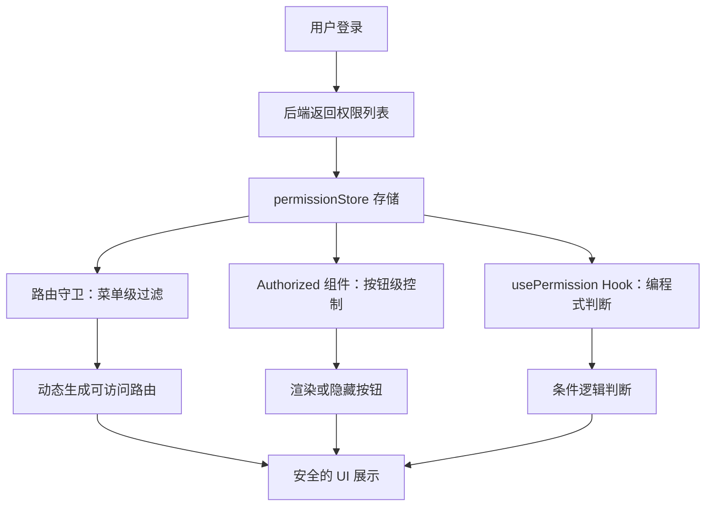

# 按钮级 RBAC 权限系统：细粒度到每一个操作按钮

> **TL;DR**
> 中后台权限不止是"能不能看到这个页面"，更要做到"能不能点这个按钮"。本章实现一套从**角色 → 菜单 → 按钮**的三级 RBAC 系统，包括权限指令组件 `<Authorized>`、动态菜单过滤、以及权限缓存策略。

## 1. 核心顿悟：把原理拉下神坛

- **生动比喻**：RBAC（基于角色的访问控制）就像公司的门禁卡系统。每个员工（用户）有一张门禁卡（角色），门禁卡上标记了能进哪些区域（权限）。普通员工只能进办公区，经理能进会议室，CTO 能进机房。按钮级权限就是——即使你进了办公区（页面），有些抽屉（按钮）你也打不开。
- **底层剖析**：前端权限本质上是**UI 层的访问控制**，它决定的是"显不显示"和"能不能点"，而不是"数据安不安全"。真正的安全屏障必须在后端。前端权限的价值在于**用户体验**——不要让用户看到自己无法操作的东西，避免"点了没反应"或"操作后 403"的困惑。

## 2. 架构图解



## 3. 业务痛点与解决方案

- **Admin 痛点**：GlobalMart 有 5 种角色（超级管理员、运营总监、运营专员、客服、仓库管理员），每种角色能看到不同的菜单和操作按钮。最初用 `if (role === 'admin')` 硬编码，结果新增角色时要改几十个文件。更痛苦的是，产品经理经常说"给运营专员加一个'导出'按钮的权限"——这种细粒度的变更在硬编码模式下几乎不可维护。
- **破局思路**：权限标识符（如 `order:export`）+ 声明式权限组件，将权限判断从业务代码中剥离出来。

## 4. 生产级实战源码

### 4.1 权限类型定义

```tsx
// src/types/permission.ts — 权限数据模型

// 权限标识采用 "模块:操作" 格式
type PermissionCode = string; // 如 "order:view", "order:edit", "order:export"

interface UserPermissions {
  roles: string[];          // 角色列表：["operation_director", "admin"]
  permissions: PermissionCode[]; // 权限标识列表
  menus: string[];          // 可访问的菜单路径
}

interface RoleConfig {
  name: string;
  label: string;
  description: string;
  permissions: PermissionCode[];
}

export type { PermissionCode, UserPermissions, RoleConfig };
```

### 4.2 权限 Store

```tsx
// src/store/permission.ts — 权限状态管理（Zustand）
import { create } from "zustand";
import type { PermissionCode, UserPermissions } from "@/types/permission";

interface PermissionState {
  permissions: Set<PermissionCode>;
  roles: Set<string>;
  menus: Set<string>;
  initialized: boolean;

  // Actions
  setPermissions: (data: UserPermissions) => void;
  hasPermission: (code: PermissionCode) => boolean;
  hasAnyPermission: (codes: PermissionCode[]) => boolean;
  hasAllPermissions: (codes: PermissionCode[]) => boolean;
  hasRole: (role: string) => boolean;
  canAccessMenu: (path: string) => boolean;
  reset: () => void;
}

const usePermissionStore = create<PermissionState>((set, get) => ({
  permissions: new Set(),
  roles: new Set(),
  menus: new Set(),
  initialized: false,

  setPermissions: (data: UserPermissions) => {
    set({
      permissions: new Set(data.permissions),
      roles: new Set(data.roles),
      menus: new Set(data.menus),
      initialized: true,
    });
  },

  hasPermission: (code: PermissionCode) => {
    const { roles, permissions } = get();
    if (roles.has("super_admin")) return true;
    return permissions.has(code);
  },

  hasAnyPermission: (codes: PermissionCode[]) => {
    return codes.some((code) => get().hasPermission(code));
  },

  hasAllPermissions: (codes: PermissionCode[]) => {
    return codes.every((code) => get().hasPermission(code));
  },

  hasRole: (role: string) => {
    return get().roles.has(role);
  },

  canAccessMenu: (path: string) => {
    const { roles, menus } = get();
    if (roles.has("super_admin")) return true;
    return menus.has(path);
  },

  reset: () => {
    set({
      permissions: new Set(),
      roles: new Set(),
      menus: new Set(),
      initialized: false,
    });
  },
}));

export { usePermissionStore };
```

### 4.3 权限 Hook

```tsx
// src/hooks/use-permission.ts — 编程式权限判断
import { useMemo } from "react";
import { usePermissionStore } from "@/store/permission";
import type { PermissionCode } from "@/types/permission";

interface UsePermissionOptions {
  permission?: PermissionCode;
  permissions?: PermissionCode[];
  mode?: "any" | "all"; // any: 满足任一即可；all: 必须全部满足
  role?: string;
}

function usePermission(options: UsePermissionOptions): boolean {
  const { hasPermission, hasAnyPermission, hasAllPermissions, hasRole } =
    usePermissionStore();

  return useMemo(() => {
    // 单个权限判断
    if (options.permission) {
      return hasPermission(options.permission);
    }

    // 多个权限判断
    if (options.permissions) {
      return options.mode === "all"
        ? hasAllPermissions(options.permissions)
        : hasAnyPermission(options.permissions);
    }

    // 角色判断
    if (options.role) {
      return hasRole(options.role);
    }

    return true;
  }, [options, hasPermission, hasAnyPermission, hasAllPermissions, hasRole]);
}

export { usePermission, type UsePermissionOptions };
```

### 4.4 声明式权限组件

```tsx
// src/components/auth/Authorized.tsx — 声明式权限控制
import type { ReactNode } from "react";
import { usePermission, type UsePermissionOptions } from "@/hooks/use-permission";

interface AuthorizedProps extends UsePermissionOptions {
  children: ReactNode;
  fallback?: ReactNode; // 无权限时显示的内容
}

function Authorized({ children, fallback = null, ...options }: AuthorizedProps) {
  const authorized = usePermission(options);

  if (!authorized) {
    return <>{fallback}</>;
  }

  return <>{children}</>;
}

export { Authorized };
```

### 4.5 在业务页面中使用

```tsx
// src/pages/orders/OrderList.tsx — 订单列表页的权限控制
import { Button } from "@/components/ui/button";
import { Authorized } from "@/components/auth/Authorized";
import { usePermission } from "@/hooks/use-permission";
import type { Order } from "@/types/api";

function OrderList() {
  // 编程式判断：控制表格列的显示
  const canViewAmount = usePermission({ permission: "order:view_amount" });

  return (
    <div className="space-y-4">
      <div className="flex items-center justify-between">
        <h1 className="text-2xl font-bold">订单管理</h1>

        <div className="flex gap-2">
          {/* 声明式权限：有创建权限才显示按钮 */}
          <Authorized permission="order:create">
            <Button>创建订单</Button>
          </Authorized>

          {/* 多权限组合：导出需要查看和导出两个权限 */}
          <Authorized
            permissions={["order:view", "order:export"]}
            mode="all"
          >
            <Button variant="outline">导出 Excel</Button>
          </Authorized>

          {/* 带降级显示：无权限时显示禁用按钮 */}
          <Authorized
            permission="order:batch_delete"
            fallback={
              <Button variant="outline" disabled title="无权限">
                批量删除
              </Button>
            }
          >
            <Button variant="destructive">批量删除</Button>
          </Authorized>
        </div>
      </div>

      {/* 表格区域：根据权限动态显示列 */}
      <table className="w-full">
        <thead>
          <tr>
            <th>订单号</th>
            <th>客户</th>
            {canViewAmount && <th>金额</th>}
            <th>状态</th>
            <th>操作</th>
          </tr>
        </thead>
        <tbody>
          {/* 表格行渲染... */}
        </tbody>
      </table>
    </div>
  );
}

export default OrderList;
```

### 4.6 动态路由权限过滤

```tsx
// src/routes/filter.ts — 根据权限过滤可访问路由
import type { AppRouteConfig } from "@/types/router";
import { usePermissionStore } from "@/store/permission";

function filterAuthorizedRoutes(
  routes: AppRouteConfig[],
  permissions: Set<string>
): AppRouteConfig[] {
  return routes
    .filter((route) => {
      // 没有设置权限要求的路由，默认所有人可访问
      if (!route.meta.permissions || route.meta.permissions.length === 0) {
        return true;
      }
      // 有权限要求的路由，检查用户是否有任一权限
      return route.meta.permissions.some((p) => permissions.has(p));
    })
    .map((route) => ({
      ...route,
      children: route.children
        ? filterAuthorizedRoutes(route.children, permissions)
        : undefined,
    }));
}

export { filterAuthorizedRoutes };
```

## 5. 避坑指南与反模式

### 坑一：只做前端权限不做后端校验

**现象**：前端隐藏了"删除"按钮，但用户通过 DevTools 或 Postman 直接调 API 还是能删。

```tsx
// Bad: 只靠前端隐藏按钮
<Authorized permission="order:delete">
  <Button onClick={handleDelete}>删除</Button>
</Authorized>
// 用户打开 DevTools，手动调 API，照样能删！

// Good: 前端控 UI 展示，后端控数据安全，双重保障
// 前端：<Authorized> 隐藏按钮（用户体验）
// 后端：@RequirePermission("order:delete") 拦截请求（数据安全）
```

### 坑二：权限判断散落在业务代码中

```tsx
// Bad: 权限判断和业务逻辑耦合
function OrderActions({ order }: { order: Order }) {
  const { roles } = useAuthStore();
  if (roles.includes("admin") || roles.includes("operation_director")) {
    return <Button>审批</Button>;
  }
  return null;
}

// Good: 用权限标识解耦
function OrderActions({ order }: { order: Order }) {
  return (
    <Authorized permission="order:approve">
      <Button>审批</Button>
    </Authorized>
  );
}
// 角色和权限的映射关系在后端维护，前端只关心权限标识
```

---

*下一步预告：权限系统搭好了，但登录鉴权怎么做才安全？下一章 [JWT 鉴权与 Token 刷新](./03.JWT鉴权与Token刷新.md) 将实现双 Token 无感刷新机制。*
