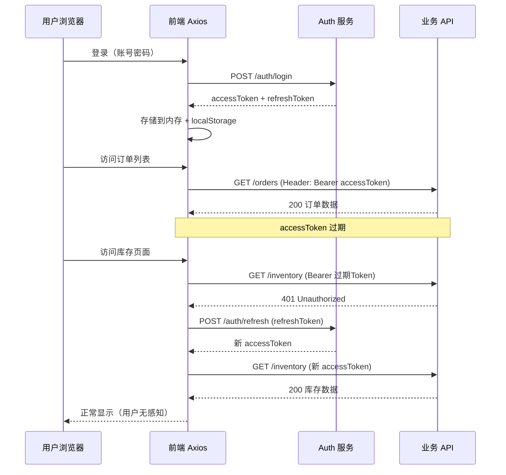

# JWT 鉴权与 Token 刷新：企业级登录全流程

> **TL;DR**
> 单 Token 方案在中后台系统中迟早翻车——要么 Token 有效期太短用户频繁被踢出登录，要么太长被盗后风险巨大。本章实现**双 Token（Access + Refresh）无感刷新**机制，配合 Axios 拦截器队列，让用户永远感知不到 Token 过期。

## 1. 核心顿悟：把原理拉下神坛

- **生动比喻**：Access Token 像一张有效期 15 分钟的临时门禁卡，Refresh Token 像一张有效期 7 天的身份证。临时卡过期了，你拿身份证去前台换一张新的临时卡，全程不用重新填写入职申请（重新登录）。
- **底层剖析**：JWT（JSON Web Token）由三部分组成：Header（算法声明）、Payload（数据载荷）、Signature（签名）。服务端不存储 Token，而是通过签名验证 Token 是否被篡改。这是**无状态认证**——服务端不需要维护 Session，天然支持分布式部署。但代价是 Token 一旦签发就无法主动失效（除非用黑名单机制）。

## 2. 架构图解



## 3. 业务痛点与解决方案

- **Admin 痛点**：GlobalMart 运营团队一天要在系统上工作 8+ 小时，如果 Token 15 分钟过期就要重新登录，运营同学会崩溃。但如果 Token 设成 8 小时，员工离职后旧 Token 还能用很久，安全团队不同意。更头疼的是，多个并发请求同时遇到 401 时，会触发多次刷新 Token，导致 Refresh Token 被重复消费而失效。
- **破局思路**：双 Token + 刷新队列。Access Token 有效期 15 分钟（安全），Refresh Token 有效期 7 天（便利）。当 Access Token 过期时，自动用 Refresh Token 换新的 Access Token，并将刷新期间的所有请求放入队列，刷新成功后批量重发。

## 4. 生产级实战源码

### 4.1 Token 管理

```tsx
// src/utils/token.ts — Token 存储与管理

const ACCESS_TOKEN_KEY = "globalmart_access_token";
const REFRESH_TOKEN_KEY = "globalmart_refresh_token";

interface TokenPair {
  accessToken: string;
  refreshToken: string;
}

function getAccessToken(): string | null {
  return localStorage.getItem(ACCESS_TOKEN_KEY);
}

function getRefreshToken(): string | null {
  return localStorage.getItem(REFRESH_TOKEN_KEY);
}

function setTokens(tokens: TokenPair): void {
  localStorage.setItem(ACCESS_TOKEN_KEY, tokens.accessToken);
  localStorage.setItem(REFRESH_TOKEN_KEY, tokens.refreshToken);
}

function clearTokens(): void {
  localStorage.removeItem(ACCESS_TOKEN_KEY);
  localStorage.removeItem(REFRESH_TOKEN_KEY);
}

function isTokenExpired(token: string): boolean {
  try {
    const payload = JSON.parse(atob(token.split(".")[1]));
    // 提前 30 秒判定过期，留出网络延迟的缓冲
    return payload.exp * 1000 < Date.now() + 30_000;
  } catch {
    return true;
  }
}

export {
  getAccessToken,
  getRefreshToken,
  setTokens,
  clearTokens,
  isTokenExpired,
  type TokenPair,
};
```

### 4.2 Axios 实例与拦截器

```tsx
// src/api/request.ts — 带无感刷新的 Axios 封装
import axios, {
  type AxiosError,
  type AxiosRequestConfig,
  type InternalAxiosRequestConfig,
} from "axios";
import {
  getAccessToken,
  getRefreshToken,
  setTokens,
  clearTokens,
  isTokenExpired,
} from "@/utils/token";

// 创建 Axios 实例
const request = axios.create({
  baseURL: import.meta.env.VITE_API_BASE_URL,
  timeout: 15_000,
  headers: {
    "Content-Type": "application/json",
  },
});

// --- 刷新 Token 的队列机制 ---
let isRefreshing = false;
let refreshQueue: Array<{
  resolve: (token: string) => void;
  reject: (error: unknown) => void;
}> = [];

// 处理队列中等待的请求
function processQueue(error: unknown, token: string | null): void {
  refreshQueue.forEach(({ resolve, reject }) => {
    if (error) {
      reject(error);
    } else {
      resolve(token!);
    }
  });
  refreshQueue = [];
}

// 刷新 Token
async function refreshAccessToken(): Promise<string> {
  const refreshToken = getRefreshToken();
  if (!refreshToken) {
    throw new Error("No refresh token");
  }

  // 用独立的 axios 实例，避免被拦截器拦截形成死循环
  const response = await axios.post(
    `${import.meta.env.VITE_AUTH_URL}/auth/refresh`,
    { refreshToken }
  );

  const { accessToken, refreshToken: newRefreshToken } = response.data.data;
  setTokens({ accessToken, refreshToken: newRefreshToken });

  return accessToken;
}

// --- 请求拦截器：自动附加 Token ---
request.interceptors.request.use(
  (config: InternalAxiosRequestConfig) => {
    const token = getAccessToken();
    if (token) {
      config.headers.Authorization = `Bearer ${token}`;
    }
    return config;
  },
  (error) => Promise.reject(error)
);

// --- 响应拦截器：401 自动刷新 ---
request.interceptors.response.use(
  (response) => response,
  async (error: AxiosError) => {
    const originalRequest = error.config as InternalAxiosRequestConfig & {
      _retry?: boolean;
    };

    // 非 401 错误，或者已经是重试请求，直接抛出
    if (error.response?.status !== 401 || originalRequest._retry) {
      return Promise.reject(error);
    }

    // 如果正在刷新中，将当前请求加入队列
    if (isRefreshing) {
      return new Promise<string>((resolve, reject) => {
        refreshQueue.push({ resolve, reject });
      }).then((newToken) => {
        originalRequest.headers.Authorization = `Bearer ${newToken}`;
        return request(originalRequest);
      });
    }

    // 开始刷新 Token
    originalRequest._retry = true;
    isRefreshing = true;

    try {
      const newToken = await refreshAccessToken();
      processQueue(null, newToken);

      // 用新 Token 重发原始请求
      originalRequest.headers.Authorization = `Bearer ${newToken}`;
      return request(originalRequest);
    } catch (refreshError) {
      processQueue(refreshError, null);

      // 刷新失败，清除登录状态，跳转登录页
      clearTokens();
      window.location.href = "/login";

      return Promise.reject(refreshError);
    } finally {
      isRefreshing = false;
    }
  }
);

export { request };
```

### 4.3 Auth Store

```tsx
// src/store/auth.ts — 认证状态管理
import { create } from "zustand";
import { request } from "@/api/request";
import {
  getAccessToken,
  setTokens,
  clearTokens,
  type TokenPair,
} from "@/utils/token";
import { usePermissionStore } from "@/store/permission";

interface LoginParams {
  username: string;
  password: string;
}

interface UserInfo {
  id: string;
  username: string;
  nickname: string;
  avatar: string;
  email: string;
}

interface AuthState {
  token: string | null;
  userInfo: UserInfo | null;
  isLoading: boolean;
  initialized: boolean;

  login: (params: LoginParams) => Promise<void>;
  logout: () => Promise<void>;
  fetchUserInfo: () => Promise<void>;
  initialize: () => Promise<void>;
}

const useAuthStore = create<AuthState>((set, get) => ({
  token: getAccessToken(),
  userInfo: null,
  isLoading: false,
  initialized: false,

  login: async (params: LoginParams) => {
    set({ isLoading: true });
    try {
      const { data } = await request.post<{ data: TokenPair & { user: UserInfo } }>(
        "/auth/login",
        params
      );

      setTokens({
        accessToken: data.data.accessToken,
        refreshToken: data.data.refreshToken,
      });

      set({
        token: data.data.accessToken,
        userInfo: data.data.user,
      });

      // 登录后拉取权限
      await get().fetchUserInfo();
    } finally {
      set({ isLoading: false });
    }
  },

  logout: async () => {
    try {
      await request.post("/auth/logout");
    } finally {
      clearTokens();
      set({ token: null, userInfo: null });
      usePermissionStore.getState().reset();
    }
  },

  fetchUserInfo: async () => {
    const { data } = await request.get("/auth/me");
    set({ userInfo: data.data.user });

    // 同步更新权限
    usePermissionStore.getState().setPermissions(data.data.permissions);
  },

  initialize: async () => {
    const token = getAccessToken();
    if (!token) {
      set({ initialized: true });
      return;
    }

    try {
      await get().fetchUserInfo();
      set({ token, initialized: true });
    } catch {
      clearTokens();
      set({ token: null, initialized: true });
    }
  },
}));

export { useAuthStore };
```

### 4.4 登录页面

```tsx
// src/pages/auth/LoginPage.tsx — 登录页
import { useState, type FormEvent } from "react";
import { useNavigate, useLocation } from "react-router-dom";
import { useAuthStore } from "@/store/auth";
import { Button } from "@/components/ui/button";

function LoginPage() {
  const navigate = useNavigate();
  const location = useLocation();
  const { login, isLoading } = useAuthStore();
  const [username, setUsername] = useState("");
  const [password, setPassword] = useState("");
  const [error, setError] = useState("");

  const from = (location.state as { from?: string })?.from || "/dashboard";

  async function handleSubmit(e: FormEvent) {
    e.preventDefault();
    setError("");

    try {
      await login({ username, password });
      navigate(from, { replace: true });
    } catch (err) {
      setError("用户名或密码错误");
    }
  }

  return (
    <div className="flex min-h-screen items-center justify-center bg-muted">
      <div className="w-full max-w-md rounded-lg bg-card p-8 shadow-lg">
        <h1 className="mb-6 text-center text-2xl font-bold text-foreground">
          GlobalMart 运营大盘
        </h1>

        <form onSubmit={handleSubmit} className="space-y-4">
          <div>
            <label className="mb-1 block text-sm text-muted-foreground">
              用户名
            </label>
            <input
              type="text"
              value={username}
              onChange={(e) => setUsername(e.target.value)}
              className="w-full rounded-md border bg-background px-3 py-2 text-foreground"
              required
            />
          </div>

          <div>
            <label className="mb-1 block text-sm text-muted-foreground">
              密码
            </label>
            <input
              type="password"
              value={password}
              onChange={(e) => setPassword(e.target.value)}
              className="w-full rounded-md border bg-background px-3 py-2 text-foreground"
              required
            />
          </div>

          {error && (
            <p className="text-sm text-destructive">{error}</p>
          )}

          <Button type="submit" className="w-full" disabled={isLoading}>
            {isLoading ? "登录中..." : "登录"}
          </Button>
        </form>
      </div>
    </div>
  );
}

export { LoginPage };
```

## 5. 避坑指南与反模式

### 坑一：Refresh Token 存在 localStorage 不安全

**现象**：XSS 攻击可以读取 localStorage 中的 Refresh Token。

```tsx
// 风险点：XSS 可以通过 document.cookie 或 localStorage 窃取 Token
// 缓解方案（按安全级别递增）：
// 1. 基础：做好 XSS 防护（CSP、输入过滤、React 自动转义）
// 2. 进阶：Refresh Token 用 httpOnly Cookie 存储（JS 无法读取）
// 3. 高级：Token Rotation（每次刷新都换新的 Refresh Token，旧的立即失效）
```

### 坑二：并发请求重复刷新

**现象**：多个请求同时收到 401，触发多次 Refresh 请求，导致 Refresh Token 被重复消费。

```tsx
// Bad: 每个 401 都独立去刷新
interceptors.response.use(null, async (error) => {
  if (error.response.status === 401) {
    await refreshAccessToken(); // 并发时重复调用！
    return request(error.config);
  }
});

// Good: 用队列机制（如本文方案），只有第一个 401 触发刷新，
// 后续 401 进入等待队列，刷新成功后统一重发
```

---

*下一步预告：鉴权体系完成了！下一卷将进入数据流的世界——[React Query 缓存失效策略](../03.状态与请求篇/01.ReactQuery缓存失效策略.md) 教你优雅管理服务端状态。*
