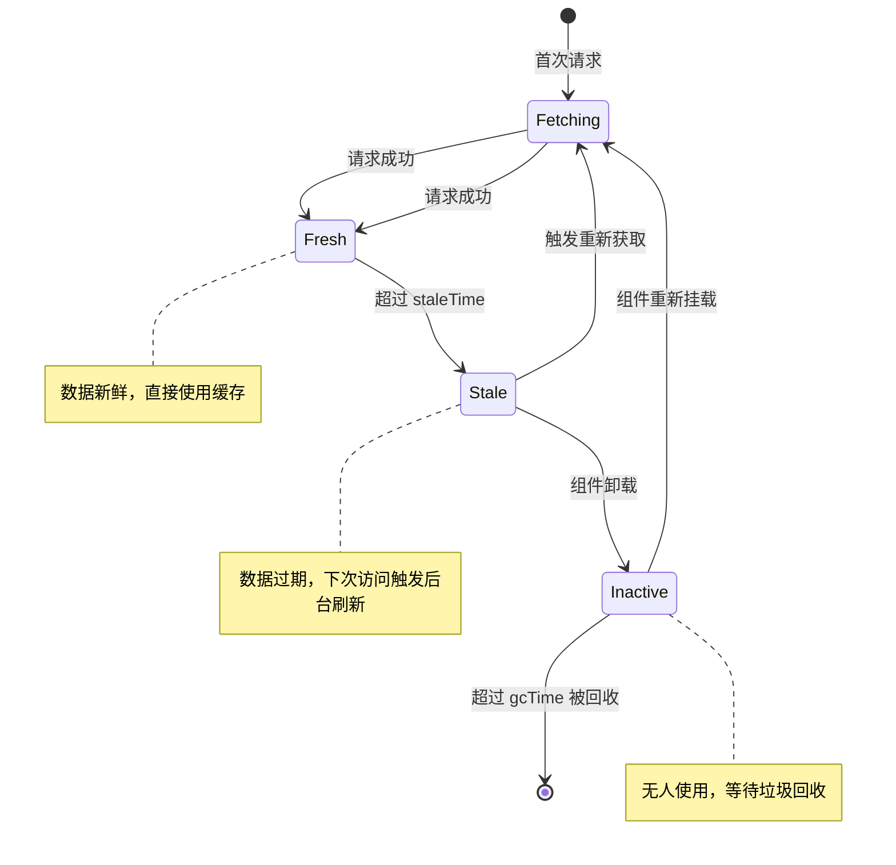

# React Query 缓存失效策略：优雅管理服务端状态

> **TL;DR**
> 中后台系统中 80% 的状态来自服务端（订单列表、用户数据、配置项），用 `useState` + `useEffect` 手动管理这些状态是灾难的开始。React Query（TanStack Query v5）通过**智能缓存 + 自动失效 + 后台刷新**三板斧，让你用声明式的方式管理所有服务端状态。

## 1. 核心顿悟：把原理拉下神坛

- **生动比喻**：想象你在超市买牛奶。`useState` + `useEffect` 的方式是——每次想喝牛奶都跑一趟超市。React Query 的方式是——冰箱里放一瓶牛奶（缓存），牛奶快过期时自动下单补货（后台刷新），你只管从冰箱拿就行。`staleTime` 就是"保质期"——保质期内直接喝，过期了触发补货。
- **底层剖析**：React Query 维护了一个全局的 **QueryCache**（内存中的 Map），以 `queryKey` 为键存储数据。每条缓存有两个关键时间戳——`dataUpdatedAt`（数据更新时间）和 `staleTime`（数据过期时间）。当组件 mount 或 window refocus 时，React Query 检查缓存是否过期（stale），过期则在后台重新 fetch，同时先用旧数据渲染页面——这就是"先展示后刷新"的 stale-while-revalidate 策略。

## 2. 架构图解



## 3. 业务痛点与解决方案

- **Admin 痛点**：GlobalMart 订单列表页每次切换标签页回来都重新加载，用户看到"闪烁"。更糟糕的是，运营在列表页点击某个订单进入详情页，修改状态后返回列表，列表还是旧数据——必须手动刷新页面。同时，多个组件同时需要同一份"国家列表"数据，导致重复请求。
- **破局思路**：React Query 的缓存机制天然解决这些问题——相同 `queryKey` 的请求自动去重，`staleTime` 避免不必要的重复请求，`invalidateQueries` 精准刷新变更的数据。

## 4. 生产级实战源码

### 4.1 QueryClient 全局配置

```tsx
// src/lib/query-client.ts — 中后台场景的 QueryClient 配置
import { QueryClient } from "@tanstack/react-query";

const queryClient = new QueryClient({
  defaultOptions: {
    queries: {
      // 数据过期时间：5 分钟内认为数据是新鲜的，不重新请求
      staleTime: 5 * 60 * 1000,

      // 缓存保留时间：数据不再被使用后，30 分钟后从内存中清除
      gcTime: 30 * 60 * 1000,

      // 窗口聚焦时重新获取：中后台用户经常切标签页，回来时自动刷新
      refetchOnWindowFocus: true,

      // 重连时重新获取
      refetchOnReconnect: true,

      // 重试策略：网络错误重试 3 次，认证错误不重试
      retry: (failureCount, error) => {
        if ((error as { status?: number }).status === 401) return false;
        if ((error as { status?: number }).status === 403) return false;
        return failureCount < 3;
      },

      // 重试延迟：指数退避
      retryDelay: (attemptIndex) =>
        Math.min(1000 * 2 ** attemptIndex, 30_000),
    },
    mutations: {
      // mutation 错误重试
      retry: 1,
    },
  },
});

export { queryClient };
```

### 4.2 Query Key 工厂模式

```tsx
// src/api/query-keys.ts — 统一管理所有 Query Key
// 工厂模式确保 key 的命名一致性和类型安全

const orderKeys = {
  all: ["orders"] as const,
  lists: () => [...orderKeys.all, "list"] as const,
  list: (filters: Record<string, unknown>) =>
    [...orderKeys.lists(), filters] as const,
  details: () => [...orderKeys.all, "detail"] as const,
  detail: (id: string) => [...orderKeys.details(), id] as const,
  stats: () => [...orderKeys.all, "stats"] as const,
};

const userKeys = {
  all: ["users"] as const,
  lists: () => [...userKeys.all, "list"] as const,
  list: (filters: Record<string, unknown>) =>
    [...userKeys.lists(), filters] as const,
  detail: (id: string) => [...userKeys.all, "detail", id] as const,
};

const commonKeys = {
  countries: ["common", "countries"] as const,
  currencies: ["common", "currencies"] as const,
  dictionaries: (type: string) => ["common", "dict", type] as const,
};

export { orderKeys, userKeys, commonKeys };
```

### 4.3 订单相关 Hooks

```tsx
// src/hooks/use-orders.ts — 订单模块的 Query/Mutation Hooks
import {
  useQuery,
  useMutation,
  useQueryClient,
  type UseQueryOptions,
} from "@tanstack/react-query";
import { request } from "@/api/request";
import { orderKeys } from "@/api/query-keys";
import type {
  Order,
  PageResult,
  ApiResponse,
  FilteredPageParams,
  OrderFilter,
} from "@/types/api";

// 获取订单列表
function useOrderList(params: FilteredPageParams<OrderFilter>) {
  return useQuery({
    queryKey: orderKeys.list(params),
    queryFn: async (): Promise<PageResult<Order>> => {
      const { data } = await request.get<ApiResponse<PageResult<Order>>>(
        "/orders",
        { params }
      );
      return data.data;
    },
    // 列表数据 2 分钟内有效（比默认更短，因为订单变化频繁）
    staleTime: 2 * 60 * 1000,
  });
}

// 获取订单详情
function useOrderDetail(orderId: string) {
  return useQuery({
    queryKey: orderKeys.detail(orderId),
    queryFn: async (): Promise<Order> => {
      const { data } = await request.get<ApiResponse<Order>>(
        `/orders/${orderId}`
      );
      return data.data;
    },
    enabled: !!orderId, // orderId 为空时不发请求
  });
}

// 更新订单状态（Mutation + 智能缓存失效）
function useUpdateOrderStatus() {
  const queryClient = useQueryClient();

  return useMutation({
    mutationFn: async ({
      orderId,
      status,
    }: {
      orderId: string;
      status: string;
    }) => {
      const { data } = await request.patch<ApiResponse<Order>>(
        `/orders/${orderId}/status`,
        { status }
      );
      return data.data;
    },

    onSuccess: (updatedOrder, { orderId }) => {
      // 策略1：精确更新单条缓存（避免重新请求）
      queryClient.setQueryData(
        orderKeys.detail(orderId),
        updatedOrder
      );

      // 策略2：使列表缓存失效（下次访问列表时自动刷新）
      queryClient.invalidateQueries({ queryKey: orderKeys.lists() });

      // 策略3：使统计数据失效（状态变了，统计也要变）
      queryClient.invalidateQueries({ queryKey: orderKeys.stats() });
    },
  });
}

// 创建订单（乐观更新示例）
function useCreateOrder() {
  const queryClient = useQueryClient();

  return useMutation({
    mutationFn: async (orderData: Omit<Order, "id" | "createdAt">) => {
      const { data } = await request.post<ApiResponse<Order>>(
        "/orders",
        orderData
      );
      return data.data;
    },

    // 乐观更新：用户提交后立刻在列表中显示新订单
    onMutate: async (newOrderData) => {
      // 取消正在进行的列表请求，防止覆盖乐观更新
      await queryClient.cancelQueries({ queryKey: orderKeys.lists() });

      // 快照旧数据（用于回滚）
      const previousLists = queryClient.getQueriesData({
        queryKey: orderKeys.lists(),
      });

      return { previousLists };
    },

    onError: (_error, _variables, context) => {
      // 请求失败，回滚到旧数据
      if (context?.previousLists) {
        for (const [key, data] of context.previousLists) {
          queryClient.setQueryData(key, data);
        }
      }
    },

    onSettled: () => {
      // 无论成功失败，都重新获取最新列表
      queryClient.invalidateQueries({ queryKey: orderKeys.lists() });
    },
  });
}

export { useOrderList, useOrderDetail, useUpdateOrderStatus, useCreateOrder };
```

### 4.4 通用数据 Hooks（长缓存策略）

```tsx
// src/hooks/use-common.ts — 基础数据（国家、币种等）缓存策略
import { useQuery } from "@tanstack/react-query";
import { request } from "@/api/request";
import { commonKeys } from "@/api/query-keys";
import type { ApiResponse } from "@/types/api";

interface Country {
  code: string;
  name: string;
  nameEn: string;
  flag: string;
}

// 国家列表：数据几乎不变，设置超长缓存
function useCountries() {
  return useQuery({
    queryKey: commonKeys.countries,
    queryFn: async (): Promise<Country[]> => {
      const { data } = await request.get<ApiResponse<Country[]>>("/common/countries");
      return data.data;
    },
    // 基础数据 1 小时内有效
    staleTime: 60 * 60 * 1000,
    // 缓存保留 24 小时
    gcTime: 24 * 60 * 60 * 1000,
    // 窗口聚焦不刷新
    refetchOnWindowFocus: false,
  });
}

export { useCountries };
```

## 5. 避坑指南与反模式

### 坑一：staleTime 和 gcTime 混淆

```tsx
// 常见误解：以为 gcTime（原 cacheTime）是"数据过期时间"
// 实际上：
// - staleTime：数据多久后被认为"过期"（过期后才会触发后台刷新）
// - gcTime：数据在没有组件使用时，多久后从内存中删除

// Bad: 设置了长 gcTime 但 staleTime 为 0，每次都重新请求
useQuery({
  queryKey: ["orders"],
  queryFn: fetchOrders,
  staleTime: 0,          // 数据立刻过期
  gcTime: 60 * 60 * 1000, // 缓存保留 1 小时但一直被重新请求
});

// Good: staleTime 控制请求频率，gcTime 控制内存占用
useQuery({
  queryKey: ["orders"],
  queryFn: fetchOrders,
  staleTime: 5 * 60 * 1000,  // 5 分钟内不重复请求
  gcTime: 30 * 60 * 1000,    // 30 分钟后释放内存
});
```

### 坑二：在 Mutation 中直接操作缓存但忘了处理分页

```tsx
// Bad: 乐观更新只改了第一页的缓存
queryClient.setQueryData(
  orderKeys.list({ page: 1, pageSize: 10, filters: {} }),
  (old) => ({ ...old, list: [newOrder, ...old.list] })
);
// 用户如果在第 2 页，看不到更新！

// Good: 使用 invalidateQueries 让所有列表页都重新获取
queryClient.invalidateQueries({ queryKey: orderKeys.lists() });
```

---

*下一步预告：服务端状态交给 React Query 了，但客户端状态（侧边栏折叠、主题、用户偏好）怎么管？下一章 [Zustand 轻量状态树](./02.Zustand轻量状态树.md) 带你用最少的代码管理客户端状态。*
