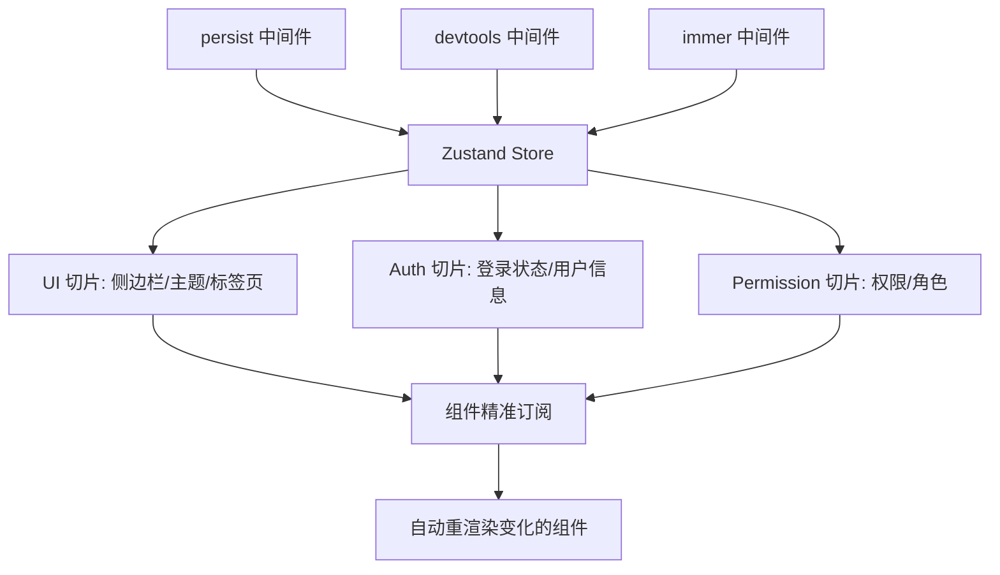

# Zustand 轻量状态树：告别 Redux 的样板地狱

> **TL;DR**
> Redux 需要 action、reducer、dispatch、selector 四件套，而 Zustand 只需要一个 `create` 函数。本章用切片模式（Slice Pattern）组织多模块状态，用中间件实现持久化和日志，构建中后台系统的客户端状态层。

## 1. 核心顿悟：把原理拉下神坛

- **生动比喻**：Redux 像一家大型央企——每件事都要走审批流程（dispatch action → reducer 处理 → 生成新 state）。Zustand 像一家创业公司——想改什么直接改（调用 set 方法），没有繁文缛节，但该有的规矩（不可变更新、类型安全）一样不少。
- **底层剖析**：Zustand 的核心是一个**发布-订阅模式**。`create` 返回一个 Hook，这个 Hook 内部订阅了 store 的变化。当你调用 `set` 更新 state 时，Zustand 用 `Object.is` 浅比较变化的部分，只通知使用了变化字段的组件重新渲染——这就是它性能好的原因：精准订阅，按需渲染。

## 2. 架构图解



## 3. 业务痛点与解决方案

- **Admin 痛点**：GlobalMart 的客户端状态散落在各处——侧边栏折叠状态用 `useState`（刷新就丢失），主题偏好用 `localStorage` 手动读写，多标签页状态用 Context（性能差，每次更新所有消费者都重渲染）。
- **破局思路**：用 Zustand 统一管理所有客户端状态，用切片模式按模块拆分，用 `persist` 中间件自动持久化到 localStorage，用选择器（selector）精准订阅避免无效重渲染。

## 4. 生产级实战源码

### 4.1 UI Store：界面状态管理

```tsx
// src/store/ui.ts — 界面状态：侧边栏、标签页、全局 Loading
import { create } from "zustand";
import { persist } from "zustand/middleware";

interface TabItem {
  key: string;
  title: string;
  path: string;
  closable: boolean;
}

interface UIState {
  // 侧边栏
  sidebarCollapsed: boolean;
  toggleSidebar: () => void;

  // 多标签页
  tabs: TabItem[];
  activeTabKey: string;
  addTab: (tab: TabItem) => void;
  removeTab: (key: string) => void;
  setActiveTab: (key: string) => void;

  // 全局 Loading
  globalLoading: boolean;
  setGlobalLoading: (loading: boolean) => void;
}

const useUIStore = create<UIState>()(
  persist(
    (set, get) => ({
      // --- 侧边栏 ---
      sidebarCollapsed: false,
      toggleSidebar: () =>
        set((state) => ({ sidebarCollapsed: !state.sidebarCollapsed })),

      // --- 多标签页 ---
      tabs: [
        {
          key: "dashboard",
          title: "运营大盘",
          path: "/dashboard",
          closable: false,
        },
      ],
      activeTabKey: "dashboard",

      addTab: (tab: TabItem) => {
        const { tabs } = get();
        const exists = tabs.find((t) => t.key === tab.key);
        if (!exists) {
          set({ tabs: [...tabs, tab], activeTabKey: tab.key });
        } else {
          set({ activeTabKey: tab.key });
        }
      },

      removeTab: (key: string) => {
        const { tabs, activeTabKey } = get();
        const newTabs = tabs.filter((t) => t.key !== key);
        if (activeTabKey === key && newTabs.length > 0) {
          set({
            tabs: newTabs,
            activeTabKey: newTabs[newTabs.length - 1].key,
          });
        } else {
          set({ tabs: newTabs });
        }
      },

      setActiveTab: (key: string) => set({ activeTabKey: key }),

      // --- 全局 Loading ---
      globalLoading: false,
      setGlobalLoading: (loading: boolean) => set({ globalLoading: loading }),
    }),
    {
      name: "globalmart-ui",
      // 只持久化部分字段（不持久化 globalLoading）
      partialize: (state) => ({
        sidebarCollapsed: state.sidebarCollapsed,
        tabs: state.tabs,
        activeTabKey: state.activeTabKey,
      }),
    }
  )
);

export { useUIStore, type TabItem };
```

### 4.2 精准订阅：避免无效重渲染

```tsx
// src/components/layout/Header.tsx — 精准订阅示例

import { useUIStore } from "@/store/ui";
import { useAuthStore } from "@/store/auth";
import { useShallow } from "zustand/react/shallow";
import { Button } from "@/components/ui/button";

function Header() {
  // 只订阅需要的字段，其他字段变化时不重渲染
  const { sidebarCollapsed, toggleSidebar } = useUIStore(
    useShallow((state) => ({
      sidebarCollapsed: state.sidebarCollapsed,
      toggleSidebar: state.toggleSidebar,
    }))
  );

  const userInfo = useAuthStore((state) => state.userInfo);

  return (
    <header className="flex h-header items-center justify-between border-b bg-card px-6">
      <Button variant="ghost" size="sm" onClick={toggleSidebar}>
        {sidebarCollapsed ? "展开" : "收起"}
      </Button>

      <div className="flex items-center gap-3">
        <span className="text-sm text-muted-foreground">
          {userInfo?.nickname}
        </span>
      </div>
    </header>
  );
}

export { Header };
```

### 4.3 App 设置 Store（支持主题）

```tsx
// src/store/app-settings.ts — 应用设置（持久化到 localStorage）
import { create } from "zustand";
import { persist } from "zustand/middleware";
import type { Theme } from "@/hooks/use-theme";

interface AppSettings {
  theme: Theme;
  language: "zh-CN" | "en-US";
  pageSize: number;      // 默认分页大小
  compactMode: boolean;   // 紧凑模式

  setTheme: (theme: Theme) => void;
  setLanguage: (lang: AppSettings["language"]) => void;
  setPageSize: (size: number) => void;
  toggleCompactMode: () => void;
}

const useAppSettings = create<AppSettings>()(
  persist(
    (set) => ({
      theme: "system",
      language: "zh-CN",
      pageSize: 20,
      compactMode: false,

      setTheme: (theme) => set({ theme }),
      setLanguage: (language) => set({ language }),
      setPageSize: (pageSize) => set({ pageSize }),
      toggleCompactMode: () =>
        set((state) => ({ compactMode: !state.compactMode })),
    }),
    { name: "globalmart-settings" }
  )
);

export { useAppSettings };
```

### 4.4 Store 使用最佳实践总结

```tsx
// src/store/index.ts — Store 统一导出

// 规则1: 按职责拆分 Store，不要一个巨型 Store
export { useAuthStore } from "./auth";
export { usePermissionStore } from "./permission";
export { useUIStore } from "./ui";
export { useAppSettings } from "./app-settings";

// 规则2: 服务端状态用 React Query，客户端状态用 Zustand
// - 订单列表、用户数据 → React Query
// - 侧边栏状态、主题偏好 → Zustand

// 规则3: 总是用 selector 精准订阅
// Bad:  const state = useUIStore(); // 任何字段变化都重渲染
// Good: const collapsed = useUIStore(s => s.sidebarCollapsed);
```

## 5. 避坑指南与反模式

### 坑一：在 Store 外部直接修改 State

```tsx
// Bad: 绕过 set 直接修改，不触发订阅更新
const store = useUIStore.getState();
store.tabs.push(newTab); // 引用没变，组件不会重渲染！

// Good: 通过 set 产生新引用
useUIStore.getState().addTab(newTab);
```

### 坑二：persist 持久化了不该持久化的数据

```tsx
// Bad: 把 globalLoading 也持久化了，下次打开还是 loading 状态
persist(
  (set) => ({ globalLoading: false, /* ... */ }),
  { name: "app-store" } // 默认持久化所有字段
);

// Good: 用 partialize 精确控制
persist(
  (set) => ({ /* ... */ }),
  {
    name: "app-store",
    partialize: (state) => ({
      sidebarCollapsed: state.sidebarCollapsed,
      // 不包含 globalLoading
    }),
  }
);
```

---

*下一步预告：状态管理搞定了，但 Axios 的封装还很原始？下一章 [请求层架构设计](./03.请求层架构设计.md) 将构建可插拔的企业级请求架构。*
