# 请求层架构设计：可插拔的企业级 Axios 封装

> **TL;DR**
> 中后台项目的请求层不只是 `axios.get` 的简单包装——你需要统一的错误处理、请求取消、重复请求拦截、Loading 状态管理、以及与 React Query 的无缝集成。本章构建一套"洋葱模型"式的请求架构，每一层拦截器各司其职。

## 1. 核心顿悟：把原理拉下神坛

- **生动比喻**：Axios 拦截器就像机场的安检流程——出发前（请求拦截器）要过身份验证、行李检查、登机牌核验；到达后（响应拦截器）要过海关、取行李、检疫检查。每个环节独立运作，但串成一条流水线。洋葱模型意味着请求"穿过"所有拦截器发出去，响应再"反向穿过"所有拦截器回来。
- **底层剖析**：Axios 的拦截器本质是一个**链式 Promise**。请求拦截器按添加顺序倒序执行（后加的先执行），响应拦截器按添加顺序正序执行。每个拦截器可以修改 config/response，也可以抛出错误中断链路。

## 2. 架构图解

```mermaid
graph LR
    A["业务代码"] --> B["请求拦截器链"]
    B --> B1["1. Token 注入"]
    B1 --> B2["2. 请求去重"]
    B2 --> B3["3. Loading 管理"]
    B3 --> C["Axios 发送请求"]
    C --> D["响应拦截器链"]
    D --> D1["1. 响应数据解包"]
    D1 --> D2["2. 业务错误处理"]
    D2 --> D3["3. HTTP 错误处理"]
    D3 --> D4["4. Token 刷新"]
    D4 --> E["返回业务代码"]
```



## 3. 业务痛点与解决方案

- **Admin 痛点**：GlobalMart 的运营同学在弱网环境下疯狂点击"搜索"按钮，触发了 10 次相同的列表请求，服务端压力暴增。不同模块的开发者各自处理错误——有人用 `alert`，有人用 `toast`，有人忘了处理。接口返回 `{ code: 40001, message: "库存不足" }` 这种业务错误码，每个调用处都要 `if (code !== 200)` 判断。
- **破局思路**：在请求层统一处理这些"横切关注点"，业务代码只需要关心正常数据。

## 4. 生产级实战源码

### 4.1 统一错误类型

```tsx
// src/api/errors.ts — 错误类型体系

// 业务错误：后端返回 code !== 200
class BusinessError extends Error {
  code: number;
  constructor(code: number, message: string) {
    super(message);
    this.name = "BusinessError";
    this.code = code;
  }
}

// HTTP 错误映射
const HTTP_ERROR_MAP: Record<number, string> = {
  400: "请求参数错误",
  401: "登录已过期，请重新登录",
  403: "没有操作权限",
  404: "请求的资源不存在",
  408: "请求超时",
  500: "服务器内部错误",
  502: "网关错误",
  503: "服务暂不可用",
  504: "网关超时",
};

export { BusinessError, HTTP_ERROR_MAP };
```

### 4.2 请求去重拦截器

```tsx
// src/api/interceptors/dedup.ts — 重复请求拦截
import type { InternalAxiosRequestConfig } from "axios";

const pendingRequests = new Map<string, AbortController>();

function generateRequestKey(config: InternalAxiosRequestConfig): string {
  const { method, url, params, data } = config;
  return [method, url, JSON.stringify(params), JSON.stringify(data)].join("&");
}

function addPending(config: InternalAxiosRequestConfig): void {
  const key = generateRequestKey(config);
  if (pendingRequests.has(key)) {
    // 取消前一个相同的请求
    pendingRequests.get(key)!.abort();
  }
  const controller = new AbortController();
  config.signal = controller.signal;
  pendingRequests.set(key, controller);
}

function removePending(config: InternalAxiosRequestConfig): void {
  const key = generateRequestKey(config);
  pendingRequests.delete(key);
}

export { addPending, removePending };
```

### 4.3 完整请求封装

```tsx
// src/api/request.ts — 企业级请求封装
import axios, {
  type AxiosError,
  type AxiosResponse,
  type InternalAxiosRequestConfig,
} from "axios";
import { getAccessToken } from "@/utils/token";
import { BusinessError, HTTP_ERROR_MAP } from "./errors";
import { addPending, removePending } from "./interceptors/dedup";

// 创建实例
const request = axios.create({
  baseURL: import.meta.env.VITE_API_BASE_URL,
  timeout: 15_000,
});

// ===== 请求拦截器 =====

// 1. Token 注入
request.interceptors.request.use((config) => {
  const token = getAccessToken();
  if (token) {
    config.headers.Authorization = `Bearer ${token}`;
  }
  return config;
});

// 2. 请求去重（同一时间相同请求只保留最后一个）
request.interceptors.request.use((config) => {
  // GET 请求默认去重，POST/PUT 等不去重（可通过 config 自定义）
  if (config.method === "get" || (config as { dedup?: boolean }).dedup) {
    addPending(config);
  }
  return config;
});

// ===== 响应拦截器 =====

// 1. 清除已完成的 pending 请求
request.interceptors.response.use(
  (response) => {
    removePending(response.config);
    return response;
  },
  (error) => {
    if (error.config) removePending(error.config);
    return Promise.reject(error);
  }
);

// 2. 业务错误解包：code !== 200 转为 BusinessError
request.interceptors.response.use((response: AxiosResponse) => {
  const { data } = response;
  // 非 JSON 响应（如文件下载）直接返回
  if (response.config.responseType === "blob") {
    return response;
  }
  // 业务状态码判断
  if (data.code !== undefined && data.code !== 200) {
    return Promise.reject(new BusinessError(data.code, data.message));
  }
  return response;
});

// 3. HTTP 错误统一处理
request.interceptors.response.use(undefined, (error: AxiosError) => {
  // 请求被取消（去重导致的取消不报错）
  if (axios.isCancel(error)) {
    return Promise.reject(error);
  }

  // 网络错误
  if (!error.response) {
    console.error("网络连接异常，请检查网络设置");
    return Promise.reject(new Error("网络连接异常"));
  }

  // HTTP 状态码错误
  const status = error.response.status;
  const message = HTTP_ERROR_MAP[status] || `请求失败 (${status})`;

  // 401 由 Token 刷新逻辑处理（见上一章）
  if (status !== 401) {
    console.error(message);
  }

  return Promise.reject(error);
});

// ===== 便捷方法 =====

// 文件下载
async function downloadFile(url: string, filename: string): Promise<void> {
  const response = await request.get(url, { responseType: "blob" });
  const blob = new Blob([response.data]);
  const link = document.createElement("a");
  link.href = URL.createObjectURL(blob);
  link.download = filename;
  link.click();
  URL.revokeObjectURL(link.href);
}

export { request, downloadFile };
```

### 4.4 API 模块示例

```tsx
// src/api/modules/order.ts — 订单 API 模块
import { request } from "../request";
import type {
  ApiResponse,
  PageResult,
  Order,
  FilteredPageParams,
  OrderFilter,
} from "@/types/api";

const orderApi = {
  getList: (params: FilteredPageParams<OrderFilter>) =>
    request.get<ApiResponse<PageResult<Order>>>("/orders", { params }),

  getDetail: (id: string) =>
    request.get<ApiResponse<Order>>(`/orders/${id}`),

  create: (data: Omit<Order, "id" | "createdAt">) =>
    request.post<ApiResponse<Order>>("/orders", data),

  updateStatus: (id: string, status: string) =>
    request.patch<ApiResponse<Order>>(`/orders/${id}/status`, { status }),

  delete: (id: string) =>
    request.delete<ApiResponse<void>>(`/orders/${id}`),

  exportExcel: (params: FilteredPageParams<OrderFilter>) =>
    request.get("/orders/export", {
      params,
      responseType: "blob",
    }),
};

export { orderApi };
```

## 5. 避坑指南与反模式

### 坑一：拦截器中抛错但没有 reject

```tsx
// Bad: 在拦截器中 return 错误对象而不是 reject
request.interceptors.response.use((response) => {
  if (response.data.code !== 200) {
    return { error: response.data.message }; // 下游以为成功了！
  }
  return response;
});

// Good: 用 Promise.reject 中断链路
request.interceptors.response.use((response) => {
  if (response.data.code !== 200) {
    return Promise.reject(new BusinessError(response.data.code, response.data.message));
  }
  return response;
});
```

### 坑二：请求去重误杀 POST 请求

```tsx
// Bad: 所有请求都去重，导致表单重复提交被"吞掉"
request.interceptors.request.use((config) => {
  addPending(config); // POST 请求也被去重了！
  return config;
});

// Good: 只对 GET 请求默认去重，POST 等需要显式开启
request.interceptors.request.use((config) => {
  if (config.method === "get") {
    addPending(config);
  }
  return config;
});
```

---

*下一步预告：数据流架构完成了！下一卷将进入中后台最硬的骨头——[TanStack Table 复杂表格](../04.深水区UI篇/01.TanStackTable复杂表格.md)，万行级数据表格的性能方案。*
