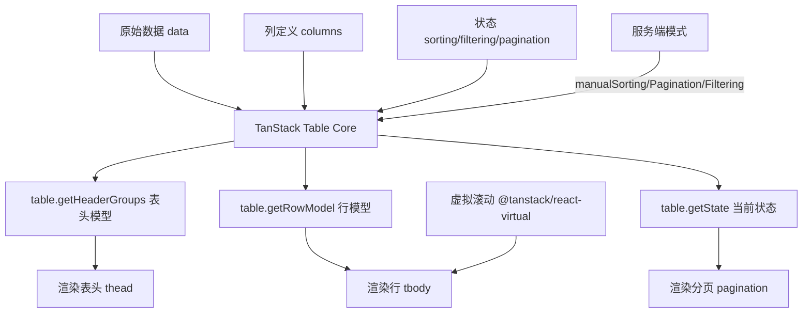

# TanStack Table 复杂表格：万行级数据的性能方案

> **TL;DR**
> 中后台 80% 的页面都是表格，而最痛的场景——多级表头、列固定、服务端排序分页筛选、行选择、单元格编辑、虚拟滚动——全部撞在一张表上。TanStack Table v8 是 Headless UI 表格库，它只管数据逻辑，渲染完全由你控制，配合 shadcn/ui 可以组合出任何表格形态。

## 1. 核心顿悟：把原理拉下神坛

- **生动比喻**：传统表格组件（如 Ant Design Table）像一辆出厂配置好的家用轿车——能开，但想改底盘就得拆车。TanStack Table 像一套汽车零部件——引擎（排序逻辑）、变速箱（分页逻辑）、方向盘（筛选逻辑）都给你了，你自己组装，想造轿车造轿车，想造越野车造越野车。
- **底层剖析**：TanStack Table 的核心是一个**纯函数状态机**。它接收原始数据（data）和列定义（columns），输出一个"表格实例"（table instance），这个实例包含了所有计算好的行、列、排序状态、分页信息等。组件只需要遍历 `table.getRowModel().rows` 来渲染——数据逻辑和 UI 渲染完全解耦。

## 2. 架构图解



## 3. 业务痛点与解决方案

- **Admin 痛点**：GlobalMart 的订单表格有 15 列（订单号、客户名、金额、币种、国家、状态、创建时间...），需要支持服务端排序、多条件筛选、行选择批量操作、列固定（左固定操作列）。订单量级达到万级，前端全量渲染 DOM 卡到怀疑人生。
- **破局思路**：TanStack Table 处理数据逻辑 + shadcn/ui 处理样式 + `@tanstack/react-virtual` 虚拟滚动处理性能。服务端分页排序筛选，前端只渲染当前页 + 可视区域的行。

## 4. 生产级实战源码

### 4.1 类型安全的列定义

```tsx
// src/pages/orders/columns.tsx — 订单表格列定义
import { type ColumnDef } from "@tanstack/react-table";
import type { Order } from "@/types/api";
import { OrderStatusBadge } from "@/components/ui/status-badge";
import { Authorized } from "@/components/auth/Authorized";
import { Button } from "@/components/ui/button";
import { Checkbox } from "@/components/ui/checkbox";
import { format } from "date-fns";

function getOrderColumns(options: {
  onEdit: (order: Order) => void;
  onDelete: (order: Order) => void;
}): ColumnDef<Order>[] {
  return [
    // 行选择列
    {
      id: "select",
      header: ({ table }) => (
        <Checkbox
          checked={table.getIsAllPageRowsSelected()}
          onCheckedChange={(value) =>
            table.toggleAllPageRowsSelected(!!value)
          }
        />
      ),
      cell: ({ row }) => (
        <Checkbox
          checked={row.getIsSelected()}
          onCheckedChange={(value) => row.toggleSelected(!!value)}
        />
      ),
      size: 40,
      enableSorting: false,
    },

    // 订单号
    {
      accessorKey: "orderNo",
      header: "订单号",
      cell: ({ getValue }) => (
        <span className="font-mono text-sm">{getValue<string>()}</span>
      ),
      size: 160,
    },

    // 客户名称
    {
      accessorKey: "customerName",
      header: "客户",
      size: 120,
    },

    // 金额（带币种格式化）
    {
      accessorKey: "amount",
      header: "金额",
      cell: ({ row }) => {
        const amount = row.getValue<number>("amount");
        const currency = row.original.currency;
        return new Intl.NumberFormat("zh-CN", {
          style: "currency",
          currency,
        }).format(amount);
      },
      size: 120,
    },

    // 状态
    {
      accessorKey: "status",
      header: "状态",
      cell: ({ getValue }) => (
        <OrderStatusBadge status={getValue<Order["status"]>()} />
      ),
      size: 100,
      filterFn: "equals",
    },

    // 创建时间
    {
      accessorKey: "createdAt",
      header: "创建时间",
      cell: ({ getValue }) =>
        format(new Date(getValue<string>()), "yyyy-MM-dd HH:mm"),
      size: 160,
    },

    // 操作列
    {
      id: "actions",
      header: "操作",
      cell: ({ row }) => (
        <div className="flex gap-1">
          <Authorized permission="order:edit">
            <Button
              variant="ghost"
              size="sm"
              onClick={() => options.onEdit(row.original)}
            >
              编辑
            </Button>
          </Authorized>
          <Authorized permission="order:delete">
            <Button
              variant="ghost"
              size="sm"
              className="text-destructive"
              onClick={() => options.onDelete(row.original)}
            >
              删除
            </Button>
          </Authorized>
        </div>
      ),
      size: 120,
    },
  ];
}

export { getOrderColumns };
```

### 4.2 通用 DataTable 组件

```tsx
// src/components/ui/data-table.tsx — 通用表格组件
import {
  type ColumnDef,
  type SortingState,
  type PaginationState,
  type RowSelectionState,
  flexRender,
  getCoreRowModel,
  useReactTable,
} from "@tanstack/react-table";
import { useState } from "react";
import { Button } from "@/components/ui/button";
import { cn } from "@/lib/utils";

interface DataTableProps<TData> {
  columns: ColumnDef<TData, unknown>[];
  data: TData[];
  total: number;
  loading?: boolean;

  // 服务端控制
  pagination: PaginationState;
  onPaginationChange: (pagination: PaginationState) => void;
  sorting?: SortingState;
  onSortingChange?: (sorting: SortingState) => void;

  // 行选择
  enableRowSelection?: boolean;
  onRowSelectionChange?: (rows: TData[]) => void;
}

function DataTable<TData>({
  columns,
  data,
  total,
  loading,
  pagination,
  onPaginationChange,
  sorting = [],
  onSortingChange,
  enableRowSelection = false,
  onRowSelectionChange,
}: DataTableProps<TData>) {
  const [rowSelection, setRowSelection] = useState<RowSelectionState>({});

  const table = useReactTable({
    data,
    columns,
    pageCount: Math.ceil(total / pagination.pageSize),
    state: {
      sorting,
      pagination,
      rowSelection,
    },

    // 服务端模式：告诉 TanStack Table 不要自己做排序/分页
    manualSorting: true,
    manualPagination: true,

    onSortingChange: (updater) => {
      const newSorting =
        typeof updater === "function" ? updater(sorting) : updater;
      onSortingChange?.(newSorting);
    },
    onPaginationChange: (updater) => {
      const newPagination =
        typeof updater === "function" ? updater(pagination) : updater;
      onPaginationChange(newPagination);
    },
    onRowSelectionChange: (updater) => {
      const newSelection =
        typeof updater === "function" ? updater(rowSelection) : updater;
      setRowSelection(newSelection);
      if (onRowSelectionChange) {
        const selectedRows = Object.keys(newSelection)
          .filter((key) => newSelection[key])
          .map((key) => data[Number(key)]);
        onRowSelectionChange(selectedRows);
      }
    },

    enableRowSelection,
    getCoreRowModel: getCoreRowModel(),
  });

  const pageCount = table.getPageCount();

  return (
    <div className="space-y-4">
      {/* 表格 */}
      <div className="rounded-md border">
        <table className="w-full">
          <thead className="bg-muted/50">
            {table.getHeaderGroups().map((headerGroup) => (
              <tr key={headerGroup.id}>
                {headerGroup.headers.map((header) => (
                  <th
                    key={header.id}
                    className={cn(
                      "px-4 py-3 text-left text-sm font-medium text-muted-foreground",
                      header.column.getCanSort() && "cursor-pointer select-none"
                    )}
                    style={{ width: header.getSize() }}
                    onClick={header.column.getToggleSortingHandler()}
                  >
                    <div className="flex items-center gap-1">
                      {flexRender(
                        header.column.columnDef.header,
                        header.getContext()
                      )}
                      {header.column.getIsSorted() === "asc" && " ↑"}
                      {header.column.getIsSorted() === "desc" && " ↓"}
                    </div>
                  </th>
                ))}
              </tr>
            ))}
          </thead>
          <tbody>
            {loading ? (
              <tr>
                <td
                  colSpan={columns.length}
                  className="py-10 text-center text-muted-foreground"
                >
                  加载中...
                </td>
              </tr>
            ) : table.getRowModel().rows.length === 0 ? (
              <tr>
                <td
                  colSpan={columns.length}
                  className="py-10 text-center text-muted-foreground"
                >
                  暂无数据
                </td>
              </tr>
            ) : (
              table.getRowModel().rows.map((row) => (
                <tr
                  key={row.id}
                  className="border-t transition-colors hover:bg-muted/30"
                >
                  {row.getVisibleCells().map((cell) => (
                    <td key={cell.id} className="px-4 py-3 text-sm">
                      {flexRender(
                        cell.column.columnDef.cell,
                        cell.getContext()
                      )}
                    </td>
                  ))}
                </tr>
              ))
            )}
          </tbody>
        </table>
      </div>

      {/* 分页 */}
      <div className="flex items-center justify-between">
        <p className="text-sm text-muted-foreground">
          共 {total} 条，第 {pagination.pageIndex + 1}/{pageCount} 页
        </p>
        <div className="flex gap-2">
          <Button
            variant="outline"
            size="sm"
            onClick={() => table.previousPage()}
            disabled={!table.getCanPreviousPage()}
          >
            上一页
          </Button>
          <Button
            variant="outline"
            size="sm"
            onClick={() => table.nextPage()}
            disabled={!table.getCanNextPage()}
          >
            下一页
          </Button>
        </div>
      </div>
    </div>
  );
}

export { DataTable, type DataTableProps };
```

### 4.3 订单列表页完整集成

```tsx
// src/pages/orders/OrderList.tsx — 完整的订单列表页
import { useState, useMemo } from "react";
import { type SortingState, type PaginationState } from "@tanstack/react-table";
import { DataTable } from "@/components/ui/data-table";
import { getOrderColumns } from "./columns";
import { useOrderList } from "@/hooks/use-orders";
import type { Order, OrderFilter } from "@/types/api";

function OrderListPage() {
  // 分页状态
  const [pagination, setPagination] = useState<PaginationState>({
    pageIndex: 0,
    pageSize: 20,
  });

  // 排序状态
  const [sorting, setSorting] = useState<SortingState>([
    { id: "createdAt", desc: true },
  ]);

  // 筛选状态
  const [filters, setFilters] = useState<Partial<OrderFilter>>({});

  // 用 React Query 获取数据
  const { data, isLoading } = useOrderList({
    page: pagination.pageIndex + 1,
    pageSize: pagination.pageSize,
    sortBy: sorting[0]?.id,
    sortOrder: sorting[0]?.desc ? "desc" : "asc",
    filters,
  });

  // 列定义
  const columns = useMemo(
    () =>
      getOrderColumns({
        onEdit: (order) => console.log("编辑", order.id),
        onDelete: (order) => console.log("删除", order.id),
      }),
    []
  );

  return (
    <div className="space-y-4">
      <h1 className="text-2xl font-bold">订单管理</h1>

      <DataTable
        columns={columns}
        data={data?.list ?? []}
        total={data?.total ?? 0}
        loading={isLoading}
        pagination={pagination}
        onPaginationChange={setPagination}
        sorting={sorting}
        onSortingChange={setSorting}
        enableRowSelection
        onRowSelectionChange={(rows) =>
          console.log("选中:", rows.length, "行")
        }
      />
    </div>
  );
}

export default OrderListPage;
```

## 5. 避坑指南与反模式

### 坑一：列定义在组件内创建导致无限重渲染

```tsx
// Bad: 每次渲染都创建新的 columns 数组，触发 table 重新计算
function OrderList() {
  const columns = getOrderColumns({ onEdit, onDelete }); // 每次新引用！
  return <DataTable columns={columns} />;
}

// Good: 用 useMemo 稳定引用
function OrderList() {
  const columns = useMemo(
    () => getOrderColumns({ onEdit, onDelete }),
    [onEdit, onDelete]
  );
  return <DataTable columns={columns} />;
}
```

### 坑二：前端分页和服务端分页混用

```tsx
// Bad: 开了服务端分页但还用了 getPaginationRowModel
const table = useReactTable({
  manualPagination: true,
  getPaginationRowModel: getPaginationRowModel(), // 冲突！
});

// Good: 服务端分页只需要 getCoreRowModel
const table = useReactTable({
  manualPagination: true,
  getCoreRowModel: getCoreRowModel(), // 够了
});
```

---

*下一步预告：表格搞定了，下一个硬骨头是表单——[React Hook Form + Zod 联动校验](./02.ReactHookForm与Zod联动校验.md) 将征服千行级动态表单。*
