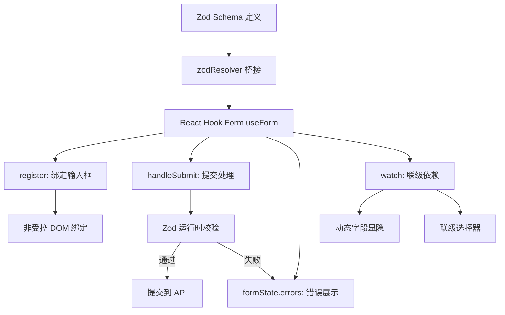

# React Hook Form + Zod 联动校验：千行级动态表单的丝滑体验

> **TL;DR**
> 中后台表单是最消磨开发者意志的东西——几十个字段、联级依赖、动态增减、异步校验、回显与提交。React Hook Form 的**非受控模式**天然高性能（不会因为输入一个字符重渲染整个表单），配合 Zod Schema 实现**运行时校验 + 编译时类型推断**双保险。

## 1. 核心顿悟：把原理拉下神坛

- **生动比喻**：受控表单（useState）像一个焦虑的家长——孩子（输入框）每写一个字，家长就要看一遍、记录一遍、检查一遍。React Hook Form 的非受控模式像一个佛系家长——孩子自己写，交作业（submit）的时候再统一检查。结果就是：受控模式 50 个字段打字卡顿，非受控模式 200 个字段依然丝滑。
- **底层剖析**：React Hook Form 内部使用 `ref` 直接绑定 DOM 元素，避免了每次输入触发 React 的 setState → reconciliation → re-render 流程。校验时，它通过 `ref.current.value` 直接读取 DOM 的值，只在校验失败时才触发组件重渲染以显示错误信息。

## 2. 架构图解



## 3. 业务痛点与解决方案

- **Admin 痛点**：GlobalMart 的"创建订单"表单有 30+ 字段，其中"配送方式"选择"国际快递"后要展示"报关信息"子表单（额外 8 个字段），选择"虚拟商品"后要隐藏"配送地址"。更痛苦的是"商品明细"——用户可以动态添加/删除商品行，每行有商品名、数量、单价、小计，且需要实时计算总金额。用 `useState` 管理这一切，代码超过 500 行，性能惨不忍睹。
- **破局思路**：Zod Schema 定义数据结构和校验规则，React Hook Form 管理表单状态，`useFieldArray` 处理动态行，`watch` 实现联级依赖。

## 4. 生产级实战源码

### 4.1 Zod Schema 定义

```tsx
// src/pages/orders/schemas/order-form.schema.ts
import { z } from "zod";

// 商品明细 Schema
const orderItemSchema = z.object({
  productName: z.string().min(1, "请输入商品名称"),
  quantity: z.number().min(1, "数量至少为 1"),
  unitPrice: z.number().min(0.01, "单价必须大于 0"),
});

// 配送方式枚举
const deliveryMethod = z.enum(["standard", "express", "international", "virtual"]);

// 报关信息（仅国际快递需要）
const customsInfoSchema = z.object({
  declarationNo: z.string().min(1, "请输入报关单号"),
  hsCode: z.string().min(1, "请输入 HS 编码"),
  declaredValue: z.number().min(0, "申报价值不能为负"),
});

// 主表单 Schema
const orderFormSchema = z
  .object({
    // 基础信息
    customerName: z.string().min(2, "客户姓名至少 2 个字符"),
    email: z.string().email("请输入有效的邮箱地址"),
    phone: z.string().regex(/^1[3-9]\d{9}$/, "请输入有效的手机号"),
    country: z.string().min(1, "请选择国家"),

    // 配送信息
    deliveryMethod,
    address: z.string().optional(),
    customsInfo: customsInfoSchema.optional(),

    // 商品明细（至少一项）
    items: z.array(orderItemSchema).min(1, "至少添加一项商品"),

    // 备注
    remark: z.string().max(500, "备注不超过 500 字").optional(),
  })
  // 联级校验：非虚拟商品必须填写配送地址
  .refine(
    (data) => {
      if (data.deliveryMethod !== "virtual") {
        return !!data.address && data.address.length > 0;
      }
      return true;
    },
    { message: "请填写配送地址", path: ["address"] }
  )
  // 联级校验：国际快递必须填写报关信息
  .refine(
    (data) => {
      if (data.deliveryMethod === "international") {
        return !!data.customsInfo;
      }
      return true;
    },
    { message: "国际快递需要填写报关信息", path: ["customsInfo"] }
  );

// 从 Schema 自动推断 TypeScript 类型
type OrderFormData = z.infer<typeof orderFormSchema>;

export { orderFormSchema, orderItemSchema, type OrderFormData };
```

### 4.2 完整表单组件

```tsx
// src/pages/orders/OrderCreateForm.tsx
import { useForm, useFieldArray, useWatch } from "react-hook-form";
import { zodResolver } from "@hookform/resolvers/zod";
import { orderFormSchema, type OrderFormData } from "./schemas/order-form.schema";
import { Button } from "@/components/ui/button";
import { useCreateOrder } from "@/hooks/use-orders";
import { useCountries } from "@/hooks/use-common";

function OrderCreateForm() {
  const createOrder = useCreateOrder();
  const { data: countries } = useCountries();

  const {
    register,
    control,
    handleSubmit,
    formState: { errors, isSubmitting },
  } = useForm<OrderFormData>({
    resolver: zodResolver(orderFormSchema),
    defaultValues: {
      deliveryMethod: "standard",
      items: [{ productName: "", quantity: 1, unitPrice: 0 }],
    },
  });

  // 动态商品行
  const { fields, append, remove } = useFieldArray({
    control,
    name: "items",
  });

  // 监听配送方式（用于联级显隐）
  const deliveryMethod = useWatch({ control, name: "deliveryMethod" });
  const showAddress = deliveryMethod !== "virtual";
  const showCustoms = deliveryMethod === "international";

  // 监听商品明细计算总金额
  const items = useWatch({ control, name: "items" });
  const totalAmount = items.reduce(
    (sum, item) => sum + (item.quantity || 0) * (item.unitPrice || 0),
    0
  );

  async function onSubmit(data: OrderFormData) {
    await createOrder.mutateAsync({
      customerName: data.customerName,
      amount: totalAmount,
      currency: "CNY",
      status: "pending",
      orderNo: "",
    });
  }

  return (
    <form onSubmit={handleSubmit(onSubmit)} className="max-w-2xl space-y-6">
      {/* 基础信息 */}
      <section className="space-y-4 rounded-lg border p-4">
        <h2 className="text-lg font-semibold">基础信息</h2>

        <div className="grid grid-cols-2 gap-4">
          <div>
            <label className="mb-1 block text-sm">客户姓名</label>
            <input
              {...register("customerName")}
              className="w-full rounded-md border px-3 py-2"
            />
            {errors.customerName && (
              <p className="mt-1 text-sm text-destructive">
                {errors.customerName.message}
              </p>
            )}
          </div>

          <div>
            <label className="mb-1 block text-sm">邮箱</label>
            <input
              {...register("email")}
              type="email"
              className="w-full rounded-md border px-3 py-2"
            />
            {errors.email && (
              <p className="mt-1 text-sm text-destructive">
                {errors.email.message}
              </p>
            )}
          </div>

          <div>
            <label className="mb-1 block text-sm">手机号</label>
            <input
              {...register("phone")}
              className="w-full rounded-md border px-3 py-2"
            />
            {errors.phone && (
              <p className="mt-1 text-sm text-destructive">
                {errors.phone.message}
              </p>
            )}
          </div>

          <div>
            <label className="mb-1 block text-sm">国家</label>
            <select
              {...register("country")}
              className="w-full rounded-md border px-3 py-2"
            >
              <option value="">请选择</option>
              {countries?.map((c) => (
                <option key={c.code} value={c.code}>
                  {c.name}
                </option>
              ))}
            </select>
            {errors.country && (
              <p className="mt-1 text-sm text-destructive">
                {errors.country.message}
              </p>
            )}
          </div>
        </div>
      </section>

      {/* 配送信息（联级显隐） */}
      <section className="space-y-4 rounded-lg border p-4">
        <h2 className="text-lg font-semibold">配送信息</h2>

        <div>
          <label className="mb-1 block text-sm">配送方式</label>
          <select
            {...register("deliveryMethod")}
            className="w-full rounded-md border px-3 py-2"
          >
            <option value="standard">标准快递</option>
            <option value="express">加急快递</option>
            <option value="international">国际快递</option>
            <option value="virtual">虚拟商品（无需配送）</option>
          </select>
        </div>

        {showAddress && (
          <div>
            <label className="mb-1 block text-sm">配送地址</label>
            <textarea
              {...register("address")}
              rows={3}
              className="w-full rounded-md border px-3 py-2"
            />
            {errors.address && (
              <p className="mt-1 text-sm text-destructive">
                {errors.address.message}
              </p>
            )}
          </div>
        )}

        {showCustoms && (
          <div className="space-y-3 rounded border border-warning/30 bg-warning/5 p-3">
            <h3 className="text-sm font-medium text-warning">报关信息</h3>
            <div className="grid grid-cols-3 gap-3">
              <div>
                <label className="mb-1 block text-xs">报关单号</label>
                <input
                  {...register("customsInfo.declarationNo")}
                  className="w-full rounded border px-2 py-1 text-sm"
                />
              </div>
              <div>
                <label className="mb-1 block text-xs">HS 编码</label>
                <input
                  {...register("customsInfo.hsCode")}
                  className="w-full rounded border px-2 py-1 text-sm"
                />
              </div>
              <div>
                <label className="mb-1 block text-xs">申报价值</label>
                <input
                  {...register("customsInfo.declaredValue", {
                    valueAsNumber: true,
                  })}
                  type="number"
                  className="w-full rounded border px-2 py-1 text-sm"
                />
              </div>
            </div>
          </div>
        )}
      </section>

      {/* 商品明细（动态行） */}
      <section className="space-y-4 rounded-lg border p-4">
        <div className="flex items-center justify-between">
          <h2 className="text-lg font-semibold">商品明细</h2>
          <Button
            type="button"
            variant="outline"
            size="sm"
            onClick={() =>
              append({ productName: "", quantity: 1, unitPrice: 0 })
            }
          >
            + 添加商品
          </Button>
        </div>

        {fields.map((field, index) => (
          <div key={field.id} className="flex items-start gap-3">
            <div className="flex-1">
              <input
                {...register(`items.${index}.productName`)}
                placeholder="商品名称"
                className="w-full rounded-md border px-3 py-2"
              />
              {errors.items?.[index]?.productName && (
                <p className="mt-1 text-xs text-destructive">
                  {errors.items[index].productName?.message}
                </p>
              )}
            </div>
            <div className="w-24">
              <input
                {...register(`items.${index}.quantity`, {
                  valueAsNumber: true,
                })}
                type="number"
                placeholder="数量"
                className="w-full rounded-md border px-3 py-2"
              />
            </div>
            <div className="w-32">
              <input
                {...register(`items.${index}.unitPrice`, {
                  valueAsNumber: true,
                })}
                type="number"
                step="0.01"
                placeholder="单价"
                className="w-full rounded-md border px-3 py-2"
              />
            </div>
            <div className="w-24 py-2 text-right text-sm text-muted-foreground">
              ¥{((items[index]?.quantity || 0) * (items[index]?.unitPrice || 0)).toFixed(2)}
            </div>
            {fields.length > 1 && (
              <Button
                type="button"
                variant="ghost"
                size="sm"
                className="text-destructive"
                onClick={() => remove(index)}
              >
                删除
              </Button>
            )}
          </div>
        ))}

        <div className="text-right text-lg font-bold">
          合计：¥{totalAmount.toFixed(2)}
        </div>
      </section>

      {/* 备注 */}
      <div>
        <label className="mb-1 block text-sm">备注</label>
        <textarea
          {...register("remark")}
          rows={3}
          className="w-full rounded-md border px-3 py-2"
          placeholder="选填，不超过 500 字"
        />
        {errors.remark && (
          <p className="mt-1 text-sm text-destructive">
            {errors.remark.message}
          </p>
        )}
      </div>

      {/* 提交 */}
      <Button type="submit" className="w-full" disabled={isSubmitting}>
        {isSubmitting ? "提交中..." : "创建订单"}
      </Button>
    </form>
  );
}

export default OrderCreateForm;
```

## 5. 避坑指南与反模式

### 坑一：number 字段收到的是 string

```tsx
// Bad: input type="number" 的值依然是 string
<input {...register("quantity")} type="number" />
// form 提交时 quantity 是 "5" 而不是 5，Zod z.number() 校验失败！

// Good: 使用 valueAsNumber
<input {...register("quantity", { valueAsNumber: true })} type="number" />
```

### 坑二：useWatch 导致整个表单重渲染

```tsx
// Bad: 在父组件 watch 所有字段
const allValues = watch(); // 任何字段变化都触发父组件重渲染

// Good: 只 watch 需要的字段，或者用 useWatch 在子组件中局部监听
const deliveryMethod = useWatch({ control, name: "deliveryMethod" });
```

---

*下一步预告：表格和表单都搞定了，但 UI 组件还是零散的？下一章 [shadcn/ui 组件深度定制](./03.shadcnUI组件深度定制.md) 将建立团队级 UI 组件规范。*
