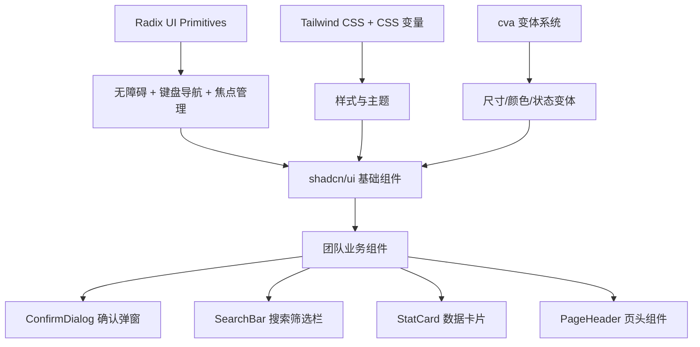

# shadcn/ui 组件深度定制：建立团队级 UI 组件规范

> **TL;DR**
> shadcn/ui 不是一个 npm 包，而是一套**可复制到项目中的组件源码**。你拥有每一行代码的所有权，可以自由修改和扩展。本章教你基于 shadcn/ui 构建中后台专属的复合组件——确认弹窗、搜索筛选栏、数据卡片，并建立团队的组件开发规范。

## 1. 核心顿悟：把原理拉下神坛

- **生动比喻**：Ant Design 像宜家成品家具——买回来直接用，但想改个尺寸就很痛苦。shadcn/ui 像宜家的设计图纸——图纸给你，木材给你，工具给你，你自己做出来的家具大小颜色随你定，而且做工不比成品差。底层的 Radix UI 就是那套精密的五金件——处理好了所有无障碍、键盘导航、焦点管理等复杂逻辑。
- **底层剖析**：shadcn/ui 的每个组件都由三层构成：**Radix UI Primitives**（无样式的行为层，处理 A11y 和交互逻辑）→ **Tailwind CSS**（样式层）→ **cva/cn**（变体管理）。当你运行 `npx shadcn-ui@latest add button` 时，它只是把这三层组合好的源码复制到你的 `src/components/ui/` 目录。

## 2. 架构图解



## 3. 业务痛点与解决方案

- **Admin 痛点**：GlobalMart 团队 6 个开发者，每个人写"删除确认弹窗"的方式都不一样——有人用 `window.confirm`，有人自己写 Modal，有人用 Dialog 但样式和交互各异。"搜索+筛选+重置"这个组合在 20 个列表页出现了 20 种不同的实现。
- **破局思路**：基于 shadcn/ui 的 Dialog、Popover、Select 等基础组件，封装中后台高频业务组件，统一交互模式和视觉风格。

## 4. 生产级实战源码

### 4.1 确认弹窗组件

```tsx
// src/components/business/confirm-dialog.tsx — 通用确认弹窗
import {
  AlertDialog,
  AlertDialogAction,
  AlertDialogCancel,
  AlertDialogContent,
  AlertDialogDescription,
  AlertDialogFooter,
  AlertDialogHeader,
  AlertDialogTitle,
} from "@/components/ui/alert-dialog";
import { Button } from "@/components/ui/button";
import { useState, useCallback } from "react";

interface ConfirmDialogProps {
  open: boolean;
  onOpenChange: (open: boolean) => void;
  title: string;
  description: string;
  confirmText?: string;
  cancelText?: string;
  variant?: "default" | "destructive";
  onConfirm: () => void | Promise<void>;
}

function ConfirmDialog({
  open,
  onOpenChange,
  title,
  description,
  confirmText = "确认",
  cancelText = "取消",
  variant = "default",
  onConfirm,
}: ConfirmDialogProps) {
  const [loading, setLoading] = useState(false);

  const handleConfirm = useCallback(async () => {
    setLoading(true);
    try {
      await onConfirm();
      onOpenChange(false);
    } finally {
      setLoading(false);
    }
  }, [onConfirm, onOpenChange]);

  return (
    <AlertDialog open={open} onOpenChange={onOpenChange}>
      <AlertDialogContent>
        <AlertDialogHeader>
          <AlertDialogTitle>{title}</AlertDialogTitle>
          <AlertDialogDescription>{description}</AlertDialogDescription>
        </AlertDialogHeader>
        <AlertDialogFooter>
          <AlertDialogCancel disabled={loading}>
            {cancelText}
          </AlertDialogCancel>
          <AlertDialogAction asChild>
            <Button
              variant={variant === "destructive" ? "destructive" : "default"}
              onClick={handleConfirm}
              disabled={loading}
            >
              {loading ? "处理中..." : confirmText}
            </Button>
          </AlertDialogAction>
        </AlertDialogFooter>
      </AlertDialogContent>
    </AlertDialog>
  );
}

// Hook 版本：命令式调用
function useConfirmDialog() {
  const [state, setState] = useState<{
    open: boolean;
    props: Omit<ConfirmDialogProps, "open" | "onOpenChange">;
    resolve: ((confirmed: boolean) => void) | null;
  }>({
    open: false,
    props: { title: "", description: "", onConfirm: () => {} },
    resolve: null,
  });

  const confirm = useCallback(
    (props: Omit<ConfirmDialogProps, "open" | "onOpenChange" | "onConfirm">) => {
      return new Promise<boolean>((resolve) => {
        setState({
          open: true,
          props: {
            ...props,
            onConfirm: () => resolve(true),
          },
          resolve,
        });
      });
    },
    []
  );

  const dialog = (
    <ConfirmDialog
      open={state.open}
      onOpenChange={(open) => {
        if (!open && state.resolve) {
          state.resolve(false);
        }
        setState((prev) => ({ ...prev, open }));
      }}
      {...state.props}
    />
  );

  return { confirm, dialog };
}

export { ConfirmDialog, useConfirmDialog };
```

### 4.2 使用确认弹窗

```tsx
// 在业务组件中使用
import { useConfirmDialog } from "@/components/business/confirm-dialog";

function OrderActions({ order }: { order: Order }) {
  const { confirm, dialog } = useConfirmDialog();

  async function handleDelete() {
    const confirmed = await confirm({
      title: "确认删除",
      description: `确定要删除订单 ${order.orderNo} 吗？此操作不可恢复。`,
      variant: "destructive",
      confirmText: "删除",
    });

    if (confirmed) {
      await deleteOrder(order.id);
    }
  }

  return (
    <>
      <Button variant="destructive" size="sm" onClick={handleDelete}>
        删除
      </Button>
      {dialog}
    </>
  );
}
```

### 4.3 数据统计卡片

```tsx
// src/components/business/stat-card.tsx — 运营大盘数据卡片
import { cn } from "@/lib/utils";
import { cva, type VariantProps } from "class-variance-authority";

const statCardVariants = cva(
  "rounded-lg border p-4 transition-shadow hover:shadow-md",
  {
    variants: {
      trend: {
        up: "border-l-4 border-l-success",
        down: "border-l-4 border-l-destructive",
        neutral: "border-l-4 border-l-muted",
      },
    },
    defaultVariants: {
      trend: "neutral",
    },
  }
);

interface StatCardProps extends VariantProps<typeof statCardVariants> {
  title: string;
  value: string | number;
  subtitle?: string;
  change?: number;
  className?: string;
}

function StatCard({
  title,
  value,
  subtitle,
  change,
  trend,
  className,
}: StatCardProps) {
  const autoTrend = trend ?? (change && change > 0 ? "up" : change && change < 0 ? "down" : "neutral");

  return (
    <div className={cn(statCardVariants({ trend: autoTrend }), className)}>
      <p className="text-sm text-muted-foreground">{title}</p>
      <p className="mt-1 text-2xl font-bold">{value}</p>
      <div className="mt-1 flex items-center gap-2">
        {change !== undefined && (
          <span
            className={cn(
              "text-xs font-medium",
              change > 0 && "text-success",
              change < 0 && "text-destructive",
              change === 0 && "text-muted-foreground"
            )}
          >
            {change > 0 ? "+" : ""}
            {change}%
          </span>
        )}
        {subtitle && (
          <span className="text-xs text-muted-foreground">{subtitle}</span>
        )}
      </div>
    </div>
  );
}

export { StatCard };
```

### 4.4 页头组件

```tsx
// src/components/business/page-header.tsx — 统一的页头布局
import type { ReactNode } from "react";

interface PageHeaderProps {
  title: string;
  description?: string;
  actions?: ReactNode;
}

function PageHeader({ title, description, actions }: PageHeaderProps) {
  return (
    <div className="flex items-start justify-between">
      <div>
        <h1 className="text-2xl font-bold tracking-tight">{title}</h1>
        {description && (
          <p className="mt-1 text-sm text-muted-foreground">{description}</p>
        )}
      </div>
      {actions && <div className="flex gap-2">{actions}</div>}
    </div>
  );
}

export { PageHeader };
```

### 4.5 组件规范文档模板

```tsx
// 团队组件开发规范：
// 1. 所有组件使用 function 声明，不用 const + 箭头函数
// 2. Props 接口命名：组件名 + Props（如 StatCardProps）
// 3. 支持 className 透传（使用 cn 合并）
// 4. 变体用 cva 管理，不用 switch-case
// 5. 导出 named export，不用 default export
// 6. 业务组件放 src/components/business/
// 7. 基础组件放 src/components/ui/（shadcn/ui 原始组件）
```

## 5. 避坑指南与反模式

### 坑一：直接修改 shadcn/ui 的基础组件

```tsx
// Bad: 在 button.tsx 里加业务逻辑
// src/components/ui/button.tsx
function Button({ children, loading, ...props }) {
  // 加了 loading 属性... 但下次 shadcn/ui 更新你要手动 merge
}

// Good: 业务需求在外层封装，保持基础组件纯净
// src/components/business/loading-button.tsx
function LoadingButton({ loading, children, ...props }: LoadingButtonProps) {
  return (
    <Button disabled={loading} {...props}>
      {loading ? "处理中..." : children}
    </Button>
  );
}
```

### 坑二：组件 API 设计不一致

```tsx
// Bad: 有的组件用 visible 控制显隐，有的用 open，有的用 show
<Modal visible={true} />
<Drawer open={true} />
<Tooltip show={true} />

// Good: 统一使用 Radix UI 的惯例：open + onOpenChange
<ConfirmDialog open={true} onOpenChange={setOpen} />
<Drawer open={true} onOpenChange={setOpen} />
```

---

*下一步预告：UI 组件规范化完成！最后一卷 [Render 拦截与重渲染治理](../05.性能淬炼篇/01.Render拦截与重渲染治理.md) 将带你用 Profiler 精准定位和消灭无效重渲染。*
