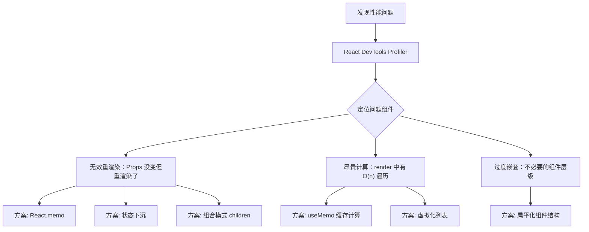

# Render 拦截与重渲染治理：精准消灭无效渲染

> **TL;DR**
> 中后台系统动辄几十个组件嵌套，一个顶层状态变化可能导致整棵组件树重渲染。React DevTools Profiler 是你的"热成像仪"——先定位哪些组件在无效重渲染，再用 `React.memo`、状态下沉、组件拆分等手段精准治理，而不是上来就 `useMemo` 一把梭。

## 1. 核心顿悟：把原理拉下神坛

- **生动比喻**：React 的渲染就像一场连锁反应——父组件重渲染，所有子组件默认跟着重渲染，就像多米诺骨牌。`React.memo` 是在骨牌链路中间放一块挡板——只有当 Props 真的变了，后面的骨牌才会倒。但挡板也有成本（浅比较），乱放挡板反而更慢。
- **底层剖析**：React 的渲染分两个阶段：**Render 阶段**（调用组件函数生成 Virtual DOM）和 **Commit 阶段**（对比 Virtual DOM 差异，更新真实 DOM）。"无效重渲染"是指 Render 阶段执行了但 Virtual DOM 没变化——Commit 阶段什么都不做。虽然 React 的 Diff 算法很快，但 Render 阶段的函数调用、对象创建、Hook 执行仍然有成本，尤其在复杂组件中。

## 2. 架构图解



## 3. 业务痛点与解决方案

- **Admin 痛点**：GlobalMart 运营大盘首页有 8 个 StatCard + 1 个实时订单表格 + 2 个图表。Header 中有一个"通知铃铛"每 30 秒更新未读数——这个小更新导致整个 Dashboard 组件树（包括 8 个图表）全部重渲染，用户在图表上 hover 时明显感到卡顿。
- **破局思路**：先用 Profiler 确认问题组件，再用状态下沉 + `React.memo` + 选择性订阅组合治理。

## 4. 生产级实战源码

### 4.1 问题复现：未优化的 Dashboard

```tsx
// Bad: 通知状态在 Dashboard 层级，导致所有子组件重渲染
function Dashboard() {
  const [notificationCount, setNotificationCount] = useState(0);

  // 每 30 秒轮询通知
  useEffect(() => {
    const timer = setInterval(async () => {
      const count = await fetchNotificationCount();
      setNotificationCount(count); // 这里触发 Dashboard 重渲染
    }, 30_000);
    return () => clearInterval(timer);
  }, []);

  return (
    <div>
      <Header notificationCount={notificationCount} /> {/* 需要更新 */}
      <StatsGrid />      {/* 不需要更新，但被迫重渲染！ */}
      <OrderTable />     {/* 不需要更新，但被迫重渲染！ */}
      <SalesChart />     {/* 不需要更新，但被迫重渲染！ */}
      <TrafficChart />   {/* 不需要更新，但被迫重渲染！ */}
    </div>
  );
}
```

### 4.2 治理方案一：状态下沉

```tsx
// Good: 把通知状态下沉到 Header 内部，Dashboard 不再因通知更新而重渲染
function Dashboard() {
  return (
    <div>
      <HeaderWithNotification /> {/* 通知状态在这里面管理 */}
      <StatsGrid />              {/* 不受影响 */}
      <OrderTable />             {/* 不受影响 */}
      <SalesChart />             {/* 不受影响 */}
      <TrafficChart />           {/* 不受影响 */}
    </div>
  );
}

function HeaderWithNotification() {
  const [notificationCount, setNotificationCount] = useState(0);

  useEffect(() => {
    const timer = setInterval(async () => {
      const count = await fetchNotificationCount();
      setNotificationCount(count); // 只触发 Header 重渲染
    }, 30_000);
    return () => clearInterval(timer);
  }, []);

  return <Header notificationCount={notificationCount} />;
}
```

### 4.3 治理方案二：React.memo 精准拦截

```tsx
// 对于无法下沉状态的场景，用 memo 拦截
import { memo, useMemo } from "react";
import type { Order } from "@/types/api";

// memo 拦截：只有 data 变化时才重渲染
const StatsGrid = memo(function StatsGrid({
  stats,
}: {
  stats: { label: string; value: number; change: number }[];
}) {
  return (
    <div className="grid grid-cols-4 gap-4">
      {stats.map((stat) => (
        <StatCard
          key={stat.label}
          title={stat.label}
          value={stat.value}
          change={stat.change}
        />
      ))}
    </div>
  );
});

// 配合 useMemo 稳定 Props 引用
function Dashboard() {
  const { data: rawStats } = useDashboardStats();

  // 用 useMemo 确保 stats 数组引用稳定（rawStats 不变时不创建新数组）
  const stats = useMemo(
    () =>
      rawStats
        ? [
            { label: "今日订单", value: rawStats.todayOrders, change: rawStats.orderChange },
            { label: "今日营收", value: rawStats.todayRevenue, change: rawStats.revenueChange },
            { label: "活跃用户", value: rawStats.activeUsers, change: rawStats.userChange },
            { label: "转化率", value: rawStats.conversionRate, change: rawStats.cvChange },
          ]
        : [],
    [rawStats]
  );

  return (
    <div>
      <HeaderWithNotification />
      <StatsGrid stats={stats} />
    </div>
  );
}
```

### 4.4 治理方案三：组合模式（children 不重渲染）

```tsx
// React 的一个隐藏优化：作为 children 传入的 JSX 不会因父组件重渲染而重渲染
// 原理：children 的 React Element 引用在父组件 re-render 时不变

function SidebarLayout({ children }: { children: React.ReactNode }) {
  const [collapsed, setCollapsed] = useState(false);

  return (
    <div className="flex">
      <Sidebar collapsed={collapsed} onToggle={() => setCollapsed(!collapsed)} />
      <main className="flex-1">
        {children}
        {/* children 不会因为 collapsed 变化而重渲染！ */}
      </main>
    </div>
  );
}

// 使用
function App() {
  return (
    <SidebarLayout>
      <Dashboard /> {/* 侧边栏折叠时，Dashboard 不重渲染 */}
    </SidebarLayout>
  );
}
```

### 4.5 React DevTools Profiler 使用指南

```tsx
// 步骤 1：打开 React DevTools → Profiler 标签
// 步骤 2：点击录制按钮，执行触发性能问题的操作
// 步骤 3：停止录制，分析火焰图

// 关键指标：
// - "Why did this render?"（需要在设置中开启）
//   显示组件重渲染的原因：Props changed / State changed / Parent re-rendered
//
// - 渲染耗时：
//   < 1ms  → 绿色，无需优化
//   1-16ms → 黄色，关注但不紧急
//   > 16ms → 红色，必须优化（超过一帧 16.67ms）

// 编程式性能监控
import { Profiler, type ProfilerOnRenderCallback } from "react";

const onRender: ProfilerOnRenderCallback = (
  id,
  phase,
  actualDuration,
  baseDuration,
  startTime,
  commitTime
) => {
  if (actualDuration > 16) {
    console.warn(
      `[Perf] ${id} 渲染耗时 ${actualDuration.toFixed(1)}ms (phase: ${phase})`
    );
  }
};

function MonitoredDashboard() {
  return (
    <Profiler id="Dashboard" onRender={onRender}>
      <Dashboard />
    </Profiler>
  );
}
```

## 5. 避坑指南与反模式

### 坑一：给所有组件都加 React.memo

```tsx
// Bad: 无脑 memo，浅比较本身有成本
const SimpleText = memo(({ text }: { text: string }) => <p>{text}</p>);
// 这个组件渲染成本 < 浅比较成本，memo 反而更慢！

// Good: 只对"渲染成本高"或"频繁被父组件重渲染但 Props 不变"的组件用 memo
const ExpensiveChart = memo(function ExpensiveChart({ data }: { data: ChartData[] }) {
  // 内部有复杂 SVG 渲染逻辑
  return <svg>...</svg>;
});
```

### 坑二：useMemo 的依赖项不稳定

```tsx
// Bad: 每次渲染都创建新的 filter 对象，useMemo 形同虚设
function OrderList() {
  const filtered = useMemo(
    () => orders.filter(filter),
    [orders, { status: "pending" }] // 对象字面量每次都是新引用！
  );
}

// Good: 用原始值作为依赖
function OrderList() {
  const statusFilter = "pending";
  const filtered = useMemo(
    () => orders.filter((o) => o.status === statusFilter),
    [orders, statusFilter]
  );
}
```

---

*下一步预告：重渲染治好了，但首屏还是慢？下一章 [懒加载与代码分割](./02.懒加载与代码分割.md) 将把首屏加载时间降低 60%+。*
