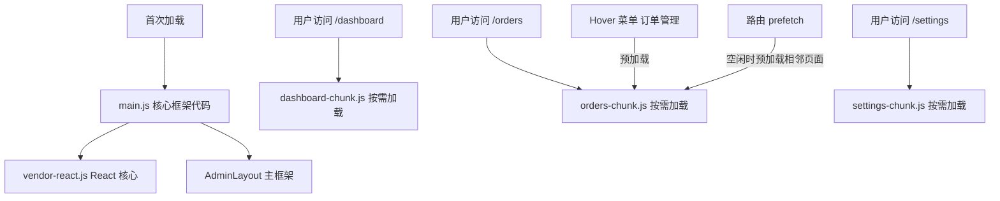

# 懒加载与代码分割：首屏加载时间降低 60%+

> **TL;DR**
> 中后台系统 200 个页面的代码不应该在首次加载时全部下载。`React.lazy` + 路由级分割让每个页面变成独立 chunk，用户只下载当前页面的代码。配合**预加载策略**，在用户 hover 菜单时就开始加载目标页面，实现"无感切换"。

## 1. 核心顿悟：把原理拉下神坛

- **生动比喻**：不做代码分割的中后台系统就像一本 500 页的字典——你只想查一个字，但必须先把整本字典搬到桌上。代码分割后，字典变成了 200 张卡片——你查哪个字就抽哪张卡片，其余的留在柜子里。预加载就是——你翻字典目录看到下一个要查的字时，助手已经帮你把那张卡片抽出来了。
- **底层剖析**：`React.lazy` 底层使用 ES2020 的 `import()` 动态导入语法。Vite（Rollup）在构建时看到 `import('./OrderList')` 会自动将 `OrderList` 及其独有依赖打包成一个独立 chunk。浏览器运行时，`React.lazy` 在组件首次渲染时才触发 `import()` 请求对应的 chunk 文件，加载完成后渲染组件。

## 2. 架构图解



## 3. 业务痛点与解决方案

- **Admin 痛点**：GlobalMart 大盘的初始 JS bundle 高达 2.8MB（gzip 后 800KB），在 3G 网络下首屏加载需要 12 秒。用户登录后看到的只是 Dashboard 页面，但却下载了包括设置页面、报表页面在内的所有代码。
- **破局思路**：路由级代码分割 + 按组件重要性分级预加载。首屏只加载框架代码 + Dashboard 代码（~200KB gzip），其余页面按需加载。

## 4. 生产级实战源码

### 4.1 路由级懒加载（已在路由章节实现）

```tsx
// src/routes/modules/order.routes.ts — 每个路由用 lazy 动态导入
const orderRoutes: AppRouteConfig[] = [
  {
    path: "orders",
    meta: { title: "订单管理" },
    children: [
      {
        path: "",
        // Vite 会为这个 import() 生成独立的 chunk
        lazy: () => import("@/pages/orders/OrderList"),
        meta: { title: "订单列表" },
      },
      {
        path: ":orderId",
        lazy: () => import("@/pages/orders/OrderDetail"),
        meta: { title: "订单详情" },
      },
    ],
  },
];
```

### 4.2 组件级懒加载

```tsx
// src/pages/dashboard/Dashboard.tsx — Dashboard 中的重量级组件也可以懒加载
import { Suspense, lazy } from "react";
import { StatCard } from "@/components/business/stat-card";

// 图表组件体积大（echarts/recharts），懒加载
const SalesChart = lazy(() => import("./components/SalesChart"));
const TrafficMap = lazy(() => import("./components/TrafficMap"));

function Dashboard() {
  return (
    <div className="space-y-6">
      {/* 统计卡片：轻量，直接加载 */}
      <div className="grid grid-cols-4 gap-4">
        <StatCard title="今日订单" value={1234} change={12.5} />
        <StatCard title="今日营收" value="¥89,234" change={8.3} />
        <StatCard title="活跃用户" value={5678} change={-2.1} />
        <StatCard title="转化率" value="3.2%" change={0.5} />
      </div>

      {/* 图表组件：重量级，懒加载 */}
      <div className="grid grid-cols-2 gap-6">
        <Suspense
          fallback={
            <div className="h-80 animate-pulse rounded-lg bg-muted" />
          }
        >
          <SalesChart />
        </Suspense>

        <Suspense
          fallback={
            <div className="h-80 animate-pulse rounded-lg bg-muted" />
          }
        >
          <TrafficMap />
        </Suspense>
      </div>
    </div>
  );
}

export default Dashboard;
```

### 4.3 菜单 Hover 预加载

```tsx
// src/hooks/use-prefetch.ts — Hover 预加载 Hook
import { useCallback } from "react";

// 路由模块映射表
const routeModules: Record<string, () => Promise<unknown>> = {
  "/dashboard": () => import("@/pages/dashboard/Dashboard"),
  "/orders": () => import("@/pages/orders/OrderList"),
  "/orders/create": () => import("@/pages/orders/OrderCreate"),
  "/settings/profile": () => import("@/pages/settings/Profile"),
};

// 已预加载的模块（避免重复加载）
const prefetched = new Set<string>();

function usePrefetch() {
  const prefetch = useCallback((path: string) => {
    if (prefetched.has(path)) return;

    const loader = routeModules[path];
    if (loader) {
      prefetched.add(path);
      // 用 requestIdleCallback 在浏览器空闲时加载
      if ("requestIdleCallback" in window) {
        requestIdleCallback(() => loader());
      } else {
        setTimeout(() => loader(), 100);
      }
    }
  }, []);

  return { prefetch };
}

export { usePrefetch };
```

```tsx
// 在 Sidebar 菜单中使用预加载
import { usePrefetch } from "@/hooks/use-prefetch";

function MenuLink({ path, title }: { path: string; title: string }) {
  const { prefetch } = usePrefetch();

  return (
    <Link
      to={path}
      // Hover 时开始预加载目标页面
      onMouseEnter={() => prefetch(path)}
      className="block rounded-lg px-3 py-2 text-sm hover:bg-muted"
    >
      {title}
    </Link>
  );
}
```

### 4.4 构建分析与优化验证

```bash
# 安装分析工具
npm install -D rollup-plugin-visualizer

# 在 vite.config.ts 中配置（见卷一）
# 运行分析构建
VITE_ANALYZE=true npm run build

# 查看生成的 dist/stats.html，分析每个 chunk 的构成和大小
```

```tsx
// 优化前后对比（GlobalMart 实测数据）：
//
// 优化前：
//   main.js      → 2.8MB (gzip 800KB)
//   首屏加载     → 12s (3G)
//
// 优化后：
//   main.js          → 180KB (gzip 58KB)  — 框架 + 路由
//   vendor-react.js  → 140KB (gzip 45KB)  — React 核心
//   vendor-ui.js     → 80KB  (gzip 25KB)  — UI 组件库
//   dashboard.js     → 45KB  (gzip 15KB)  — Dashboard 页面
//   首屏加载         → 3.2s (3G) — 降低 73%!
```

## 5. 避坑指南与反模式

### 坑一：懒加载的 Loading 状态闪烁

```tsx
// Bad: 每次切换路由都看到 Loading 闪一下（即使加载很快）
<Suspense fallback={<FullPageSpinner />}>
  <LazyPage />
</Suspense>

// Good: 延迟显示 Loading，快速加载时用户无感知
function DelayedLoading({ delay = 200 }: { delay?: number }) {
  const [show, setShow] = useState(false);
  useEffect(() => {
    const timer = setTimeout(() => setShow(true), delay);
    return () => clearTimeout(timer);
  }, [delay]);
  if (!show) return null;
  return <div className="animate-pulse p-6">加载中...</div>;
}
```

### 坑二：named export 导致 lazy 失败

```tsx
// Bad: React.lazy 要求模块必须有 default export
// OrderList.tsx
export function OrderList() { ... } // named export
// 路由
lazy: () => import("@/pages/orders/OrderList") // 报错！

// Good: 使用 default export，或在 import 时转换
export default function OrderList() { ... }

// 或者不改源码，在 lazy 中转换：
lazy: () => import("@/pages/orders/OrderList").then(m => ({ default: m.OrderList }))
```

---

*下一步预告：代码分割让首屏飞起来了！最后一章 [生产环境性能监控](./03.生产环境性能监控.md) 将教你上线后持续守护性能底线。*
