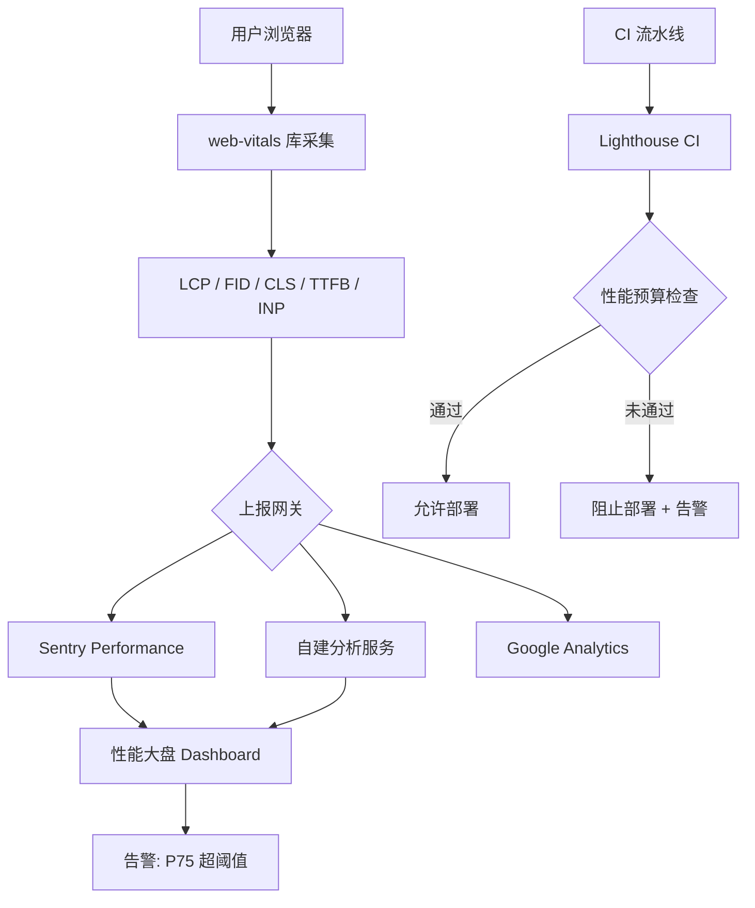

# 生产环境性能监控：上线后持续守护性能底线

> **TL;DR**
> 优化做得再好，没有监控就是盲人摸象。本章建立一套从 **Web Vitals 采集 → 异常上报 → 性能预算 CI 卡点**的全链路监控体系，让性能退化在上线前被拦截，上线后被发现。

## 1. 核心顿悟：把原理拉下神坛

- **生动比喻**：代码优化像给赛车调教引擎，性能监控像给赛车装遥测系统。没有遥测，你永远不知道赛车在第几圈、第几个弯开始掉速。Web Vitals 就是 Google 定义的赛车遥测指标——LCP（最大内容绘制）衡量"赛车起步有多快"，FID/INP（交互延迟）衡量"方向盘转了多久车才响应"，CLS（累积布局偏移）衡量"赛车跑直线时会不会突然偏移"。
- **底层剖析**：Web Vitals 基于浏览器的 Performance API（`PerformanceObserver`）。LCP 监听 `largest-contentful-paint` 条目，FID 监听 `first-input` 条目，CLS 监听 `layout-shift` 条目。这些 API 是零性能开销的——浏览器本身就在收集这些数据，我们只是读取出来。

## 2. 架构图解



## 3. 业务痛点与解决方案

- **Admin 痛点**：GlobalMart 大盘上线一个月后，运营反馈"系统越来越慢"。开发团队在本地测试一切正常，但线上用户分布在 50 个国家，网络条件和设备差异巨大。更糟糕的是，某次上线不小心引入了一个大型 npm 包，首屏 JS 体积翻倍，但没有人发现——直到用户投诉。
- **破局思路**：三道防线——开发环境 React DevTools Profiler 做局部诊断，CI 流水线 Lighthouse + 性能预算做上线前卡点，生产环境 Web Vitals + Sentry 做实时监控和告警。

## 4. 生产级实战源码

### 4.1 Web Vitals 采集与上报

```tsx
// src/lib/performance.ts — Web Vitals 采集与上报
import { onCLS, onFID, onLCP, onTTFB, onINP, type Metric } from "web-vitals";

interface PerformanceData {
  name: string;
  value: number;
  rating: "good" | "needs-improvement" | "poor";
  navigationType: string;
  url: string;
  timestamp: number;
}

function formatMetric(metric: Metric): PerformanceData {
  return {
    name: metric.name,
    value: Math.round(metric.value),
    rating: metric.rating,
    navigationType: metric.navigationType,
    url: window.location.href,
    timestamp: Date.now(),
  };
}

// 上报到后端分析服务
function reportToAnalytics(data: PerformanceData): void {
  // 使用 sendBeacon 确保页面关闭时也能成功上报
  if (navigator.sendBeacon) {
    navigator.sendBeacon(
      `${import.meta.env.VITE_API_BASE_URL}/analytics/performance`,
      JSON.stringify(data)
    );
  }
}

// 初始化性能监控
function initPerformanceMonitoring(): void {
  const handleMetric = (metric: Metric) => {
    const data = formatMetric(metric);
    reportToAnalytics(data);

    // 开发环境在控制台输出
    if (import.meta.env.DEV) {
      const color =
        data.rating === "good"
          ? "green"
          : data.rating === "needs-improvement"
            ? "orange"
            : "red";
      console.log(
        `%c[Perf] ${data.name}: ${data.value}ms (${data.rating})`,
        `color: ${color}`
      );
    }
  };

  onCLS(handleMetric);
  onFID(handleMetric);
  onLCP(handleMetric);
  onTTFB(handleMetric);
  onINP(handleMetric);
}

export { initPerformanceMonitoring };
```

```tsx
// src/main.tsx — 在应用入口初始化
import { initPerformanceMonitoring } from "@/lib/performance";

// 性能监控在 App 渲染后启动
initPerformanceMonitoring();
```

### 4.2 Sentry 错误与性能监控集成

```tsx
// src/lib/sentry.ts — Sentry 初始化
import * as Sentry from "@sentry/react";

function initSentry(): void {
  if (import.meta.env.DEV) return; // 开发环境不上报

  Sentry.init({
    dsn: import.meta.env.VITE_SENTRY_DSN,
    environment: import.meta.env.MODE,

    // 性能采样率：生产环境采集 20% 的请求
    tracesSampleRate: 0.2,

    // 会话回放：捕获错误前后的用户操作录像
    replaysSessionSampleRate: 0.01, // 1% 常规会话
    replaysOnErrorSampleRate: 1.0,  // 100% 错误会话

    integrations: [
      Sentry.browserTracingIntegration(),
      Sentry.replayIntegration(),
    ],

    // 过滤噪音
    ignoreErrors: [
      "ResizeObserver loop",
      "Network Error",
      "AbortError",
    ],
  });
}

// 手动上报业务错误
function captureBusinessError(
  code: number,
  message: string,
  context?: Record<string, unknown>
): void {
  Sentry.captureException(new Error(`[Business] ${code}: ${message}`), {
    tags: { errorType: "business", errorCode: String(code) },
    extra: context,
  });
}

export { initSentry, captureBusinessError };
```

### 4.3 性能预算配置

```json
// budget.json — 性能预算（Lighthouse CI 使用）
[
  {
    "path": "/*",
    "timings": [
      { "metric": "interactive", "budget": 5000 },
      { "metric": "first-contentful-paint", "budget": 2000 },
      { "metric": "largest-contentful-paint", "budget": 3000 }
    ],
    "resourceSizes": [
      { "resourceType": "script", "budget": 500 },
      { "resourceType": "stylesheet", "budget": 100 },
      { "resourceType": "total", "budget": 800 }
    ],
    "resourceCounts": [
      { "resourceType": "script", "budget": 15 },
      { "resourceType": "third-party", "budget": 5 }
    ]
  }
]
```

### 4.4 自定义性能守卫 Hook

```tsx
// src/hooks/use-render-time.ts — 组件渲染耗时监控
import { useEffect, useRef } from "react";

function useRenderTime(componentName: string, threshold = 16): void {
  const startTime = useRef(performance.now());

  // 每次渲染重置开始时间
  startTime.current = performance.now();

  useEffect(() => {
    const renderTime = performance.now() - startTime.current;
    if (renderTime > threshold) {
      console.warn(
        `[Perf] ${componentName} 渲染耗时 ${renderTime.toFixed(1)}ms（超过 ${threshold}ms 阈值）`
      );
    }
  });
}

export { useRenderTime };
```

### 4.5 性能监控 Dashboard 数据结构

```tsx
// 性能指标阈值参考（Google Web Vitals 标准）：
//
// | 指标 | Good      | Needs Improvement | Poor     |
// |------|-----------|-------------------|----------|
// | LCP  | ≤ 2.5s    | ≤ 4.0s            | > 4.0s   |
// | FID  | ≤ 100ms   | ≤ 300ms           | > 300ms  |
// | INP  | ≤ 200ms   | ≤ 500ms           | > 500ms  |
// | CLS  | ≤ 0.1     | ≤ 0.25            | > 0.25   |
// | TTFB | ≤ 800ms   | ≤ 1800ms          | > 1800ms |
//
// 中后台系统建议以 P75（75 分位数）作为监控指标，
// 因为 P50 太乐观，P95 受极端网络影响太大。
```

## 5. 避坑指南与反模式

### 坑一：只看平均值不看分位数

```tsx
// Bad: "平均 LCP 是 2s，达标了！"
// 实际上：50% 用户 1s，50% 用户 3s，平均 2s 但一半用户体验很差

// Good: 看 P75（75% 用户的体验）
// P75 LCP = 3s → 有 25% 的用户 LCP 超过 3s，需要优化
```

### 坑二：生产环境采样率设太高

```tsx
// Bad: 100% 采样，自己给自己的监控服务制造 DDoS
Sentry.init({ tracesSampleRate: 1.0 }); // 每个请求都上报

// Good: 阶梯式采样
// 开发环境：100%（方便调试）
// 预发布：50%（充分测试）
// 生产环境：10-20%（足够做统计分析，不影响性能）
```

### 坑三：监控了但没有告警

```tsx
// Bad: 数据采集了，但没人看 → 纯摆设

// Good: 设置告警规则
// - P75 LCP > 4s → Slack 告警
// - JS bundle 体积增长 > 10% → CI 阻断
// - 错误率 > 1% → PagerDuty 值班通知
```

---

## 全系列回顾

恭喜你完成了整套 **React 中后台架构知识库** 的学习！让我们回顾一下你已经掌握的武器：

| 卷 | 主题 | 核心产出 |
|---|------|---------|
| 卷一 | 基石篇 | Vite 生产配置 + TS 泛型体系 + Tailwind 设计令牌 |
| 卷二 | 路由与权限 | 200+ 页面路由架构 + 按钮级 RBAC + 双 Token 无感刷新 |
| 卷三 | 状态与请求 | React Query 缓存策略 + Zustand 客户端状态 + Axios 企业封装 |
| 卷四 | 深水区 UI | TanStack Table 万行表格 + RHF+Zod 动态表单 + shadcn/ui 组件规范 |
| 卷五 | 性能淬炼 | Render 治理 + 代码分割 + Web Vitals 全链路监控 |

> 这些技术方案已经在 **GlobalMart 跨国电商运营大盘**项目中经过验证——支撑 50+ 国家、200+ 页面、日均百万级订单的管理需求。现在，它们也属于你了。
