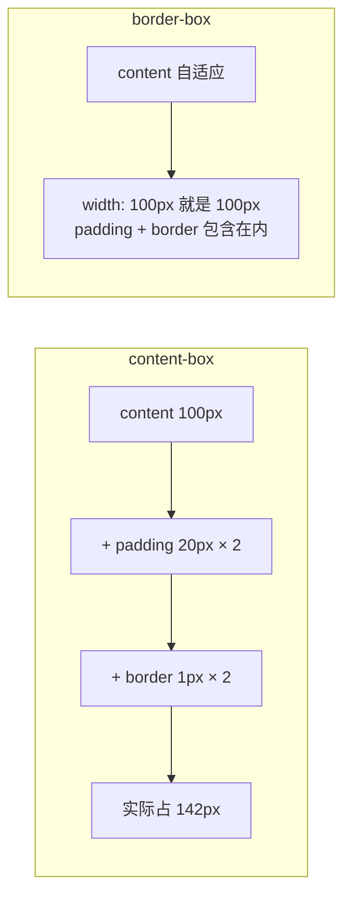
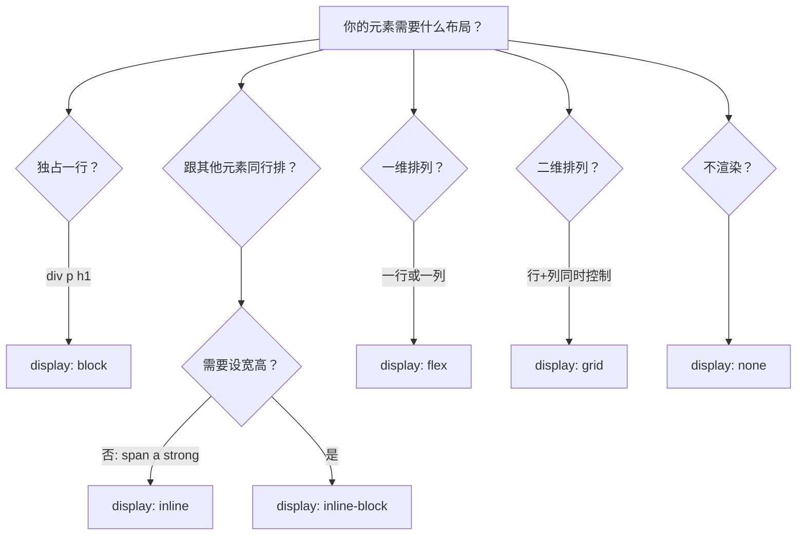
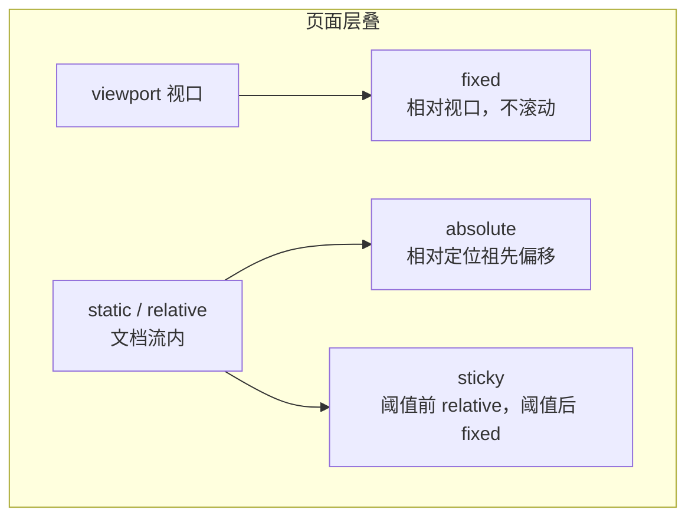
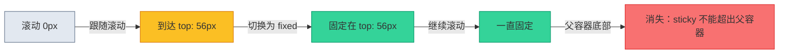
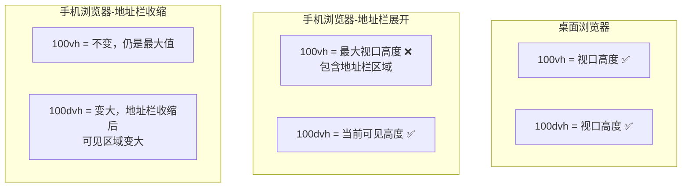

# 布局速查手册

> **这一步解决什么问题？**
>
> 后端开发者看到 `flex`、`grid`、`position: sticky` 这些词能查到定义，但脑子里没有一张"什么时候用什么"的决策图。本文把 CSS 布局的核心概念浓缩为一页纸，作为后续 7 篇场景教程的"字典"随时回查。
>
> 不需要从头读到尾——先浏览一遍建立印象，后面遇到具体布局问题时再回来查。

---

## 盒模型

### content-box vs border-box



| 属性 | content-box | border-box |
|------|------------|-----------|
| `width: 100px` 含义 | 仅内容区 | 内容+内边距+边框 |
| 加 padding 后 | 变宽 | 不变 |
| 加 border 后 | 变宽 | 不变 |
| Tailwind 使用 | 否 | 是（全局设置） |

> **后端类比**：`content-box` 像值类型——`sizeof(int)` 只返回数据本身的大小，对齐填充是额外的。`border-box` 像引用类型——你拿到的是一个包含了所有开销的对象大小。

Tailwind 在全局样式中设置了：

```css
*, *::before, *::after {
  box-sizing: border-box;
}
```

> **为什么 Tailwind 选 border-box？** 因为 `width: 100px` 就是 100px，不会因为加了 padding 突然变成 142px。布局计算更可预测——类比后端：你定义一个 `PageSize = 20`，不会因为加了排序字段就变成 25 条。

---

## display 家族决策树



### 详细对比

| display | 占行 | 可设宽高 | 典型用途 | Tailwind |
|---------|------|---------|---------|----------|
| `block` | 独占一行 | 是 | 容器、段落 | `block` |
| `inline` | 行内 | 否（宽高无效） | 文字片段、链接 | `inline` |
| `inline-block` | 行内 | 是 | 按钮、标签 | `inline-block` |
| `flex` | 独占一行 | 是 | 一维排列 | `flex` |
| `inline-flex` | 行内 | 是 | 行内的弹性容器 | `inline-flex` |
| `grid` | 独占一行 | 是 | 二维网格 | `grid` |
| `inline-grid` | 行内 | 是 | 行内的网格容器 | `inline-grid` |
| `none` | 不渲染 | — | 条件隐藏 | `hidden` |

### 隐藏元素的三种方式

| 方式 | 渲染？ | 占空间？ | 事件？ | Tailwind |
|------|--------|---------|--------|----------|
| `display: none` | 否 | 否 | 否 | `hidden` |
| `visibility: hidden` | 是 | 是 | 否 | `invisible` |
| `opacity: 0` | 是 | 是 | 是 | `opacity-0` |

> **后端类比**：`display: none` = 服务下线（不响应请求），`visibility: hidden` = 服务挂起（占着端口但不处理），`opacity: 0` = 透明代理（请求能到但用户看不到）。

---

## position 家族

### 层叠关系示意图



### 五种定位详解

| position | 相对于 | 脱离文档流？ | 滚动时 | Tailwind |
|----------|--------|------------|--------|----------|
| `static` | 无（默认） | 否 | 跟随滚动 | `static`（默认） |
| `relative` | 自身原位置 | 否 | 跟随滚动 | `relative` |
| `absolute` | 最近定位祖先 | 是 | 跟随祖先滚动 | `absolute` |
| `fixed` | 视口 | 是 | 不滚动 | `fixed` |
| `sticky` | 滚动容器 | 否（阈值前）/ 是（阈值后） | 阈值前跟随，阈值后固定 | `sticky` |

### sticky 的阈值行为



> **后端类比**：`sticky` 就像消息队列的"积压阈值"——积压量没到阈值时正常消费（relative），到了阈值后触发限流（fixed），但队列销毁后就不再处理（不能超出父容器）。

### absolute 的"最近定位祖先"

```css
.grandparent { position: relative; }  /* 定位祖先 */
.parent { }                             /* 没有定位 */
.child { position: absolute; top: 0; } /* 相对 .grandparent 偏移 */
```

如果没有任何祖先设置 `position: relative/absolute/fixed/sticky`，`absolute` 会相对 `<html>`（初始包含块）定位。

> **【易错点】** 给父元素加 `position: relative` 是最常见的"锚定"操作。不加的话，子元素的 `absolute` 会"飞"到页面的某个角落。这就像 WPF 中不给 Popup 设 `PlacementTarget`——它会跑到窗口左上角。

---

## 单位速查

| 单位 | 相对于 | 适用场景 | Tailwind |
|------|--------|---------|----------|
| `px` | 绝对像素 | 边框、阴影、固定尺寸 | 数字如 `w-4`（16px）、`h-8`（32px） |
| `rem` | 根元素字号（默认 16px） | 间距、字号、布局尺寸 | Tailwind 默认单位，`p-4` = 1rem = 16px |
| `em` | 父元素字号 | 组件内部相对尺寸 | 少用，Tailwind 不直接提供 |
| `%` | 父元素对应属性 | 宽度百分比 | `w-1/2` = 50%、`w-1/3` = 33.33% |
| `vw` | 视口宽度的 1% | 全宽布局 | `w-screen` = 100vw |
| `vh` | 视口高度的 1% | 全高布局 | `h-screen` = 100vh |
| `dvh` | 动态视口高度的 1% | 移动端全高 | Tailwind v4: `h-dvh` |

### 1rem = ?

```
浏览器默认：1rem = 16px
用户放大字体后：1rem = 20px（或更大）

Tailwind 的间距刻度：
  p-1 = 0.25rem = 4px
  p-2 = 0.5rem  = 8px
  p-3 = 0.75rem = 12px
  p-4 = 1rem    = 16px
  p-6 = 1.5rem  = 24px
  p-8 = 2rem    = 32px
```

### vh vs dvh



> **为什么用 `min-h-screen` 而不是 `h-screen`？** `min-h-screen`（`min-height: 100vh`）允许内容超过一屏时自然撑高。`h-screen`（`height: 100vh`）会把内容截断在一屏内。

---

## Tailwind 布局 class 快查表

### Flex 布局

| CSS 属性 | Tailwind class | 说明 |
|---------|---------------|------|
| `display: flex` | `flex` | 弹性容器 |
| `flex-direction: row` | `flex-row` | 水平排列（默认） |
| `flex-direction: column` | `flex-col` | 垂直排列 |
| `justify-content: flex-start` | `justify-start` | 主轴起始 |
| `justify-content: center` | `justify-center` | 主轴居中 |
| `justify-content: space-between` | `justify-between` | 主轴两端对齐 |
| `align-items: flex-start` | `items-start` | 交叉轴起始 |
| `align-items: center` | `items-center` | 交叉轴居中 |
| `align-items: stretch` | `items-stretch` | 交叉轴拉伸（默认） |
| `flex: 1 1 0%` | `flex-1` | 占满剩余空间 |
| `flex: 0 0 auto` | `flex-none` | 不伸缩 |
| `flex-shrink: 0` | `shrink-0` | 不允许被压缩 |
| `flex-wrap: wrap` | `flex-wrap` | 换行 |
| `gap: 1rem` | `gap-4` | 间距 |

### Grid 布局

| CSS 属性 | Tailwind class | 说明 |
|---------|---------------|------|
| `display: grid` | `grid` | 网格容器 |
| `grid-template-columns: repeat(3, 1fr)` | `grid-cols-3` | 3 等宽列 |
| `grid-template-columns: 1fr 1fr` | `grid-cols-2` | 2 等宽列 |
| `grid-template-columns: 280px 1fr` | `grid-cols-[280px_1fr]` | 固定+弹性 |
| `grid-column: span 2` | `col-span-2` | 跨 2 列 |
| `grid-row: span 2` | `row-span-2` | 跨 2 行 |
| `gap: 1rem` | `gap-4` | 间距 |
| `align-items: center` | `items-center` | 垂直居中 |

### Position 定位

| CSS 属性 | Tailwind class | 说明 |
|---------|---------------|------|
| `position: relative` | `relative` | 相对定位 |
| `position: absolute` | `absolute` | 绝对定位 |
| `position: fixed` | `fixed` | 固定定位 |
| `position: sticky` | `sticky` | 粘性定位 |
| `top: 0` | `top-0` | 顶部偏移 |
| `z-index: 10` | `z-10` | 层叠顺序 |

### Overflow 溢出

| CSS 属性 | Tailwind class | 说明 |
|---------|---------------|------|
| `overflow: hidden` | `overflow-hidden` | 裁剪溢出 |
| `overflow: auto` | `overflow-auto` | 需要时滚动 |
| `overflow: scroll` | `overflow-scroll` | 始终显示滚动条 |
| `overflow-x: auto` | `overflow-x-auto` | 水平滚动 |
| `overflow-y: auto` | `overflow-y-auto` | 垂直滚动 |

### Sizing 尺寸

| CSS 属性 | Tailwind class | 说明 |
|---------|---------------|------|
| `width: 100%` | `w-full` | 全宽 |
| `height: 100%` | `h-full` | 全高 |
| `min-height: 100vh` | `min-h-screen` | 最小一屏高 |
| `height: 100vh` | `h-screen` | 固定一屏高 |
| `max-width: 1280px` | `max-w-7xl` | 最大宽度限制 |

### 响应式断点

| 断点 | 最小宽度 | Tailwind 前缀 | 典型设备 |
|------|---------|--------------|---------|
| `sm` | 640px | `sm:` | 大手机横屏 |
| `md` | 768px | `md:` | 平板 |
| `lg` | 1024px | `lg:` | 小笔记本 |
| `xl` | 1280px | `xl:` | 桌面 |
| `2xl` | 1536px | `2xl:` | 大桌面 |

> **移动优先**：不加前缀的 class 对所有尺寸生效，加了前缀的只在对应断点以上生效。例如 `flex-col md:flex-row` = 手机竖排、桌面横排。

---

## 踩坑提醒

1. **`border-box` 是全局设置的**。Tailwind 已帮你设置好了，不要在自己的 CSS 中再写 `box-sizing: content-box`，否则宽度计算会全部出错。

2. **`inline` 元素不能设宽高**。给 `<span>` 加 `w-32 h-8` 不会生效——需要改成 `inline-block` 或 `flex`。

3. **`absolute` 定位的元素不影响父元素高度**。如果你用 `absolute` 定位了一个子元素，父元素的高度不会包含它——这就像 `float` 脱离文档流一样。如果父元素高度塌陷，检查是否有 `absolute` 子元素。

4. **`sticky` 不起作用的最常见原因**：父容器有 `overflow: hidden` 或 `overflow: auto`。`sticky` 需要能在滚动容器中"粘住"，如果父容器裁剪了溢出，`sticky` 就失效了。

5. **`100vh` 在手机上有问题**。手机浏览器的地址栏会占据一部分视口，`100vh` 包含了地址栏区域，导致实际可见区域比 `100vh` 小。用 `100dvh` 或 `min-h-screen` + `flex` 替代。

---

## 🤔 自测题

### 概念级（理解定义）

1. `border-box` 和 `content-box` 的区别是什么？为什么 Tailwind 默认用 `border-box`？

2. `display: none` 和 `visibility: hidden` 都能让元素不可见，它们有什么区别？

### 推理级（分析原因）

3. 为什么 `position: sticky` 在设置了 `overflow: hidden` 的父容器中不生效？

4. `flex-1` 展开为 `flex: 1 1 0%`，三个值分别代表什么？如果只写 `flex: 1` 省略了什么？

### 动手级（实践验证）

5. 在浏览器开发者工具中，选中一个元素，切换 `box-sizing` 在 `content-box` 和 `border-box` 之间，观察元素尺寸变化。

6. 创建一个 `div`，设置 `position: sticky; top: 0`，验证它在滚动时是否固定在顶部。然后给它的父元素加 `overflow: hidden`，观察 sticky 是否失效。

---

## 输出检查清单

完成本节后，确认以下各项：

- [ ] 能说出 `border-box` 和 `content-box` 的区别，以及 Tailwind 默认使用 `border-box` 的原因
- [ ] 看到布局需求时，能在 display 家族中做出正确选择
- [ ] 理解 `absolute` 定位相对的是"最近定位祖先"
- [ ] 理解 `sticky` 的阈值行为和常见失效原因
- [ ] 知道 `vh` 和 `dvh` 在移动端的差异
- [ ] 能快速在 Tailwind class 快查表中找到对应的布局 class

---

[下一篇：登录页居中布局 →](./01-登录页居中布局.md)
