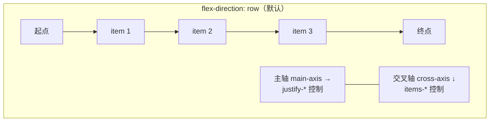
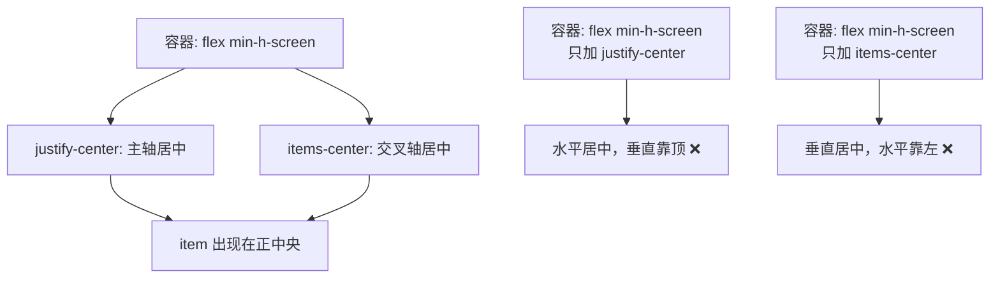
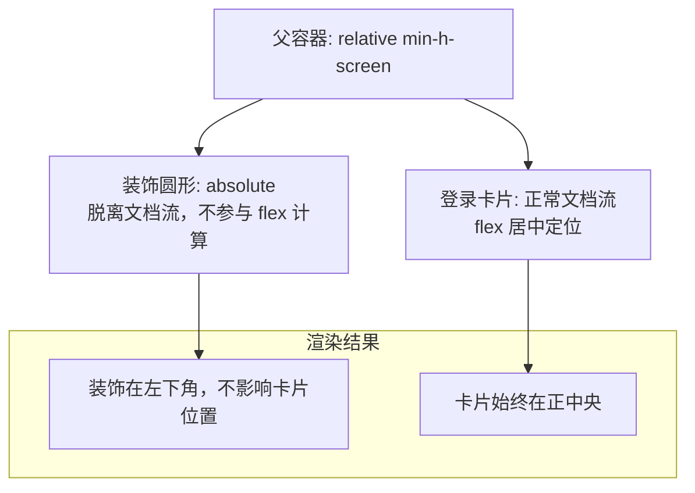
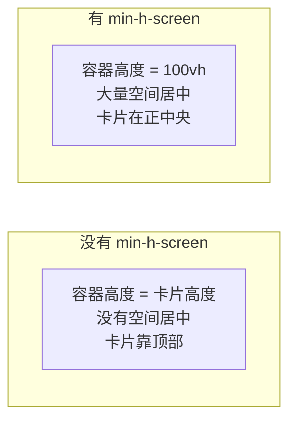
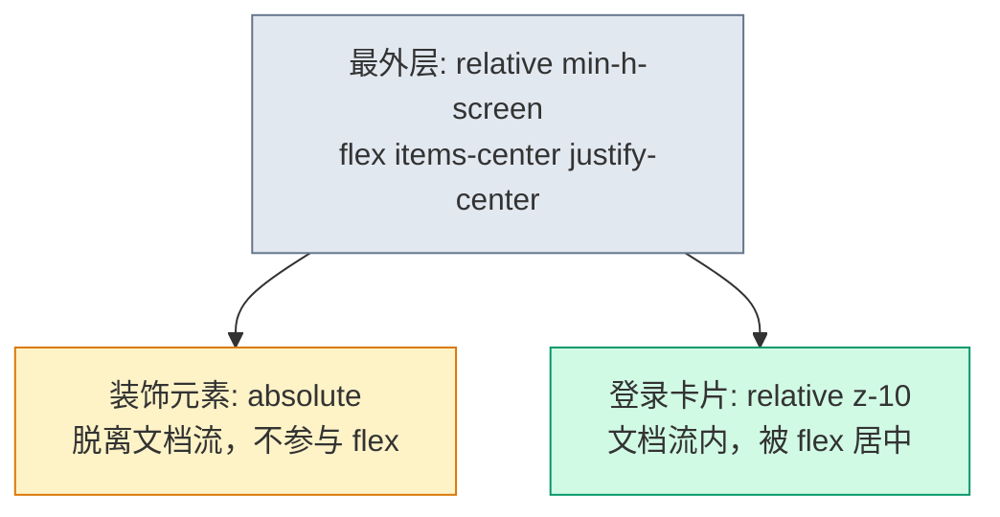

# 登录页居中布局

> **这一步解决什么问题？**
>
> 登录页是最常见的"居中卡片"布局——页面中央一张登录表单，两侧留白或放品牌装饰。本文从 LoginPage 的真实布局出发，讲透 flex 居中、全屏高度、position absolute 装饰元素三大核心知识点。
>
> 对于 ASP.NET Core 开发者来说，LoginPage 就是 `_Login.cshtml`——但前端不用 `<center>` 或 `margin: auto` 猜尺寸，而是用 flex 一行代码搞定。

---

## 前置知识

### flex 居中的两条轴

flex 容器有两条轴：



| 属性 | 控制的轴 | `flex-row` 时 | `flex-col` 时 |
|------|---------|--------------|--------------|
| `justify-*` | 主轴 | 水平 | 垂直 |
| `items-*` | 交叉轴 | 垂直 | 水平 |

> **记忆口诀**：主轴用 `justify`，交叉轴用 `items`。`flex-row` 时主轴水平，`flex-col` 时主轴垂直。

### min-h-screen vs h-screen

| class | CSS | 行为 |
|-------|-----|------|
| `h-screen` | `height: 100vh` | 固定一屏高，内容超出会溢出 |
| `min-h-screen` | `min-height: 100vh` | 最小一屏高，内容超出自然撑高 |

登录页内容不会超出一屏，两者效果相同。但 `min-h-screen` 是更安全的习惯——万一内容变多了也不会被截断。

---

## 原理图解

### flex 居中原理



### position absolute 脱离文档流



> **关键**：`absolute` 元素从 flex 布局的计算中"消失"了。flex 只管文档流内的子元素，`absolute` 元素的位置完全由 `top/left/right/bottom` 决定。

---

## 对照实验

### 实验 1：margin auto 居中 vs flex 居中

```tsx
// ❌ margin auto 居中——必须知道卡片宽度
<div className="min-h-screen">
  <div className="mx-auto my-auto w-[400px]">
    {/* my-auto 在普通块级容器中不生效！ */}
    {/* 因为 margin: auto 垂直居中需要父元素有固定高度 */}
  </div>
</div>

// ✅ flex 居中——不需要知道卡片尺寸
<div className="min-h-screen flex items-center justify-center">
  <div className="w-[400px]">
    {/* flex 自动计算居中位置 */}
  </div>
</div>
```

| 方式 | 需要知道尺寸？ | 垂直居中？ | 适应内容变化？ |
|------|-------------|----------|-------------|
| `margin: auto` | 是（水平可以，垂直不行） | 块级容器中不行 | 差 |
| `flex + items/justify` | 否 | 行 | 好 |

### 实验 2：忘了 min-h-screen 会怎样

```tsx
// ❌ 没有 min-h-screen——卡片挤在页面顶部
<div className="flex items-center justify-center">
  {/* 容器高度 = 内容高度，没有空间居中 */}
  <div className="w-[400px]">登录卡片</div>
</div>

// ✅ 加了 min-h-screen——卡片出现在正中央
<div className="min-h-screen flex items-center justify-center">
  <div className="w-[400px]">登录卡片</div>
</div>
```



### 实验 3：100vh vs 100dvh

手机浏览器上 `100vh` 包含地址栏区域，导致底部内容被遮挡。`100dvh` 是动态视口高度，只计算当前可见区域。桌面端两者相同，移动端有差异。

---

## 代码实现

### 登录页完整布局骨架

```tsx
// src/pages/login-page.tsx
export function LoginPage() {
  return (
    <div className="relative min-h-screen flex items-center justify-center bg-gradient-to-br from-slate-50 to-slate-100 dark:from-slate-950 dark:to-slate-900">
      {/* 装饰元素——absolute 脱离文档流 */}
      <div className="absolute -left-20 -bottom-20 h-80 w-80 rounded-full bg-primary/5" />
      <div className="absolute -right-10 -top-10 h-60 w-60 rounded-full bg-primary/5" />

      {/* 登录卡片——文档流内，flex 居中 */}
      <div className="relative z-10 mx-auto w-full max-w-md rounded-lg border bg-card p-8 shadow-sm">
        <div className="flex flex-col items-center gap-2">
          <h1 className="text-2xl font-bold">登录</h1>
          <p className="text-sm text-muted-foreground">请输入您的账号信息</p>
        </div>

        {/* 表单区域 */}
        <div className="mt-6 grid gap-4">
          <div className="grid gap-2">
            <label className="text-sm font-medium">用户名</label>
            <input className="h-10 rounded-md border bg-background px-3" placeholder="请输入用户名" />
          </div>
          <div className="grid gap-2">
            <label className="text-sm font-medium">密码</label>
            <input className="h-10 rounded-md border bg-background px-3" type="password" placeholder="请输入密码" />
          </div>
          <button className="h-10 rounded-md bg-primary text-primary-foreground font-medium">
            登录
          </button>
        </div>
      </div>
    </div>
  )
}
```

---

## 代码讲解

### 三层结构



1. **最外层 `relative`**：为 `absolute` 子元素提供定位锚点。如果不加 `relative`，装饰圆形会相对 `<html>` 定位，跑到页面左上角。

2. **`min-h-screen flex items-center justify-center`**：四个 class 各司其职：
   - `min-h-screen`：撑满一屏高度，提供居中空间
   - `flex`：开启弹性布局
   - `items-center`：交叉轴（垂直）居中
   - `justify-center`：主轴（水平）居中

3. **装饰元素 `absolute -left-20 -bottom-20`**：负偏移让圆形一半在容器外，营造"溢出"的视觉效果。`bg-primary/5` 是 5% 透明度的主题色。

4. **卡片 `relative z-10`**：`relative` 让卡片可以设 `z-index`，确保在装饰元素之上。如果不加 `z-10`，`absolute` 的装饰元素可能覆盖卡片。

> **【易错点】** `z-index` 只在定位元素（`position` 不是 `static`）上生效。卡片的 `relative` 就是为了让 `z-10` 生效。

> **【设计取舍】** 装饰元素用 `absolute` 而不是放在文档流中，是因为它们是"背景装饰"——无论屏幕大小如何变化，都不应该影响卡片的居中位置。类比后端：装饰元素就像日志输出——它不应该影响业务逻辑的执行结果。

---

## 踩坑提醒

1. **`items-center` 需要容器有高度**。如果容器没有 `min-h-screen` 或 `h-screen`，`items-center` 无效——因为容器高度等于内容高度，没有空间居中。

2. **`absolute` 元素不占空间**。如果你发现页面布局"塌陷"了，检查是不是有 `absolute` 子元素。它不会撑开父容器的高度。

3. **装饰元素别忘了 `z-10`**。如果不给卡片设 `z-index`，装饰圆形可能遮住卡片的点击区域。

4. **`bg-primary/5` 是 Tailwind v4 的透明度语法**。v3 写法是 `bg-primary bg-opacity-5`，v4 直接用 `/5` 表示 5% 透明度。

---

## 🤔 自测题

### 概念级（理解定义）

1. `flex` 容器中，`justify-center` 和 `items-center` 分别控制哪个轴的对齐？

2. 为什么装饰元素要用 `absolute` 而不是放在文档流中？

### 推理级（分析原因）

3. 如果最外层不加 `relative`，装饰圆形会出现在哪里？为什么？

4. `min-h-screen` 和 `h-screen` 在什么情况下会产生不同的效果？

### 动手级（实践验证）

5. 把 `items-center` 去掉，观察卡片的位置变化。然后只去掉 `justify-center`，再观察。理解两条轴各自的作用。

6. 把装饰元素的 `absolute` 改为 `relative`，观察卡片位置是否偏移。理解"脱离文档流"的视觉影响。

---

## 验证步骤

1. 创建 `src/pages/login-page.tsx`，复制上面的代码
2. 执行 `pnpm dev`，浏览器打开登录页
3. 确认卡片在页面正中央
4. 确认左右两侧有装饰圆形
5. 调整浏览器窗口大小，确认卡片始终居中
6. 检查移动端显示：卡片是否仍然居中且不超出屏幕

---

## ✅ 输出检查清单

完成本节后，确认以下各项：

- [ ] 理解 flex 的主轴和交叉轴，知道 `justify-*` 和 `items-*` 各控制哪个轴
- [ ] 知道 `min-h-screen` 是居中布局的前提条件
- [ ] 理解 `absolute` 脱离文档流的含义——不参与 flex 布局计算
- [ ] 知道为什么父容器要加 `relative`——为 absolute 子元素提供定位锚点
- [ ] 理解 `z-index` 只在定位元素上生效

---

[← 上一篇：布局速查手册](./00-布局速查手册.md) | [下一篇：管理后台框架布局 →](./02-管理后台框架布局.md)
