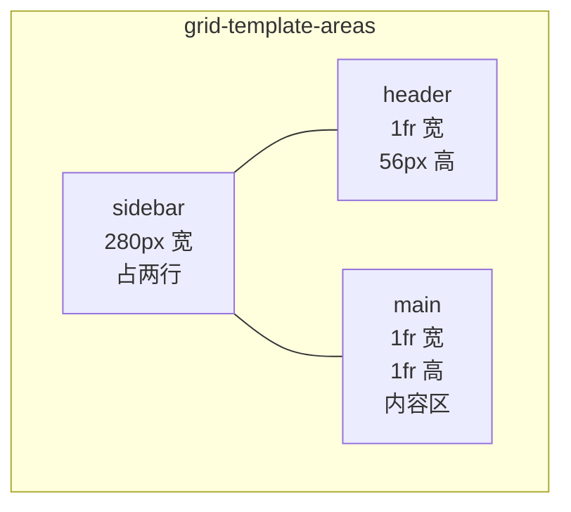
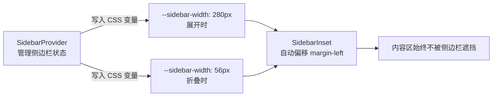
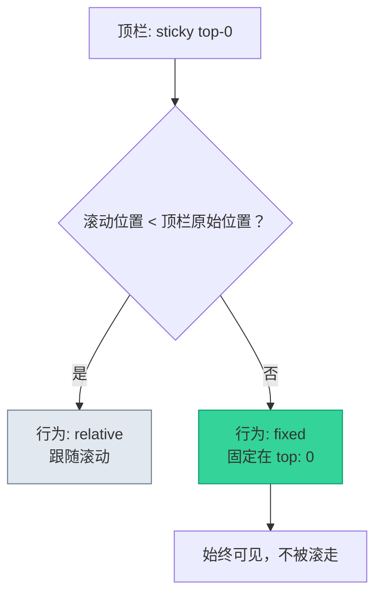
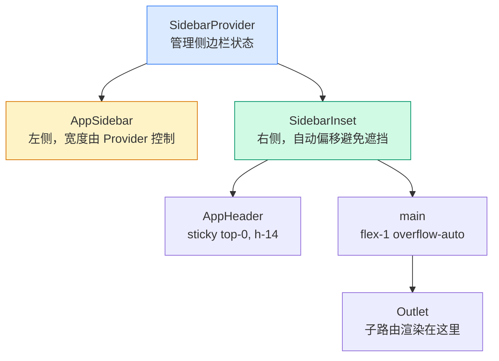

# 管理后台框架布局

> **这一步解决什么问题？**
>
> 管理后台有一个统一的"画框"——侧边栏在左、顶栏在上、内容区在中间。所有页面都在这个画框内渲染。本文从 AppLayout 出发，讲透 CSS Grid 命名区域、SidebarProvider 的 CSS 变量机制、sticky 定位三大核心知识点。
>
> 对于 ASP.NET Core 开发者：`AppLayout` = `_Layout.cshtml`，`AppSidebar` = `_NavMenu.cshtml`，`<Outlet />` = `@RenderBody()`，`SidebarProvider` = `_ViewStart.cshtml`。

---

## 前置知识

### CSS Grid 的 grid-template-areas

用名字给布局区域起名，比写行列号更直观：

```css
/* 用编号 */
grid-template-columns: 280px 1fr;
grid-template-rows: 56px 1fr;
/* 第 1 行第 1 列 = sidebar，第 1 行第 2 列 = header... */

/* 用名字 */
grid-template-areas:
  "sidebar header"
  "sidebar main";
grid-template-columns: 280px 1fr;
grid-template-rows: 56px 1fr;
/* sidebar = 左侧整列，header = 右上，main = 右下，一目了然 */
```

### .NET 类比

| 前端组件 | .NET 对应 | 说明 |
|---------|----------|------|
| `AppLayout` | `_Layout.cshtml` | 侧边栏 + 顶栏 + 内容区的整体框架 |
| `AppSidebar` | `_NavMenu.cshtml` | 左侧导航菜单 |
| `AppHeader` | `_LoginPartial.cshtml` | 顶部用户信息、面包屑 |
| `<Outlet />` | `@RenderBody()` | 子页面的渲染插槽 |
| `SidebarProvider` | `_ViewStart.cshtml` | 管理侧边栏的展开/折叠状态 |

### 关键区别：.NET 的布局是静态的，React 的布局是动态的

在 .NET 中，`_Layout.cshtml` 在服务端渲染一次就结束了。在 React 中，布局组件是持续渲染的——侧边栏的展开/折叠、菜单的加载状态都会触发重新渲染。

---

## 原理图解

### 管理后台的 Grid 区域划分



```mermaid
block-beta
    columns 2
    block:sidebar:2:1
        columns 1
        A["Logo"]:1
        B["菜单项"]:1
        C["菜单项"]:1
        D["版本号"]:1
    end
    block:header:1
        E["折叠按钮 | 面包屑 | 搜索 | 租户 | 用户"]
    end
    block:main:1
        F["<Outlet /> 子页面渲染在这里"]
    end
```

### SidebarProvider 的 CSS 变量机制



> shadcn/ui 的 `SidebarProvider` 用 CSS 变量而非 React state 控制宽度，是为了避免频繁 state 更新引起的级联重渲染。

### sticky 定位阈值



---

## 对照实验

### 实验 1：用 flex 实现侧边栏 vs 用 grid

```tsx
// ❌ flex 实现——手动计算偏移
<div className="flex min-h-screen">
  <aside className="w-[280px] shrink-0">侧边栏</aside>
  <div className="flex-1 flex flex-col">
    <header className="h-14">顶栏</header>
    <main className="flex-1">内容</main>
  </div>
</div>
// 问题：侧边栏折叠时需要手动更新 w-[280px] → w-14

// ✅ grid 实现——用 grid-template-areas 语义清晰
<div className="grid min-h-screen"
     style={{
       gridTemplateAreas: '"sidebar header" "sidebar main"',
       gridTemplateColumns: 'var(--sidebar-width) 1fr',
       gridTemplateRows: '56px 1fr'
     }}>
  <aside style={{ gridArea: 'sidebar' }}>侧边栏</aside>
  <header style={{ gridArea: 'header' }}>顶栏</header>
  <main style={{ gridArea: 'main' }}>内容</main>
</div>
// 优势：sidebar 自动占两行，折叠时只需改 CSS 变量
```

| 方式 | 侧边栏跨行 | 折叠控制 | 语义清晰度 |
|------|-----------|---------|-----------|
| flex | 需要嵌套 | 需要手动更新宽度 | 一般 |
| grid + areas | 天然支持 | 改 CSS 变量即可 | 好 |

### 实验 2：overflow hidden vs overflow auto

```tsx
// ❌ overflow-hidden——内容超出时被裁剪，无法滚动
<main className="flex-1 overflow-hidden">
  <Outlet /> {/* 长页面内容被截断 */}
</main>

// ✅ overflow-auto——内容超出时自动出现滚动条
<main className="flex-1 overflow-auto" style={{ scrollbarGutter: "stable" }}>
  <Outlet /> {/* 长页面可以正常滚动 */}
</main>
```

---

## 代码实现

### 简化版 AppLayout

```tsx
// src/components/layout/app-layout.tsx
import { Outlet } from "react-router-dom"
import { SidebarProvider, SidebarInset } from "@/components/ui/sidebar"
import { AppSidebar } from "./app-sidebar"
import { AppHeader } from "./app-header"

/**
 * 应用主布局组件
 *
 * SidebarProvider 管理侧边栏的展开/折叠状态，
 * SidebarInset 自动适应侧边栏宽度偏移，
 * Outlet 渲染当前路由匹配的子页面。
 */
export function AppLayout() {
  return (
    <SidebarProvider>
      <AppSidebar />
      <SidebarInset>
        <AppHeader />
        <main className="flex-1 overflow-auto" style={{ scrollbarGutter: "stable" }}>
          <Outlet />
        </main>
      </SidebarInset>
    </SidebarProvider>
  )
}
```

### 简化版 AppSidebar

```tsx
// src/components/layout/app-sidebar.tsx
import {
  Sidebar,
  SidebarContent,
  SidebarHeader,
  SidebarMenu,
  SidebarMenuItem,
  SidebarMenuButton,
  SidebarFooter,
} from "@/components/ui/sidebar"
import { LayoutDashboard } from "lucide-react"

/**
 * 简化版侧边栏——只保留布局结构
 */
export function AppSidebar() {
  return (
    <Sidebar>
      <SidebarHeader>
        <div className="px-3 py-3">
          <span className="font-bold">MyApp</span>
        </div>
      </SidebarHeader>

      <SidebarContent>
        <SidebarMenu>
          <SidebarMenuItem>
            <SidebarMenuButton>
              <LayoutDashboard className="h-4 w-4" />
              <span>仪表盘</span>
            </SidebarMenuButton>
          </SidebarMenuItem>
        </SidebarMenu>
      </SidebarContent>

      <SidebarFooter>
        <span className="text-xs text-muted-foreground">v1.0.0</span>
      </SidebarFooter>
    </Sidebar>
  )
}
```

### 简化版 AppHeader

```tsx
// src/components/layout/app-header.tsx
import { SidebarTrigger } from "@/components/ui/sidebar"
import { Separator } from "@/components/ui/separator"

/**
 * 简化版顶栏——只保留布局核心
 */
export function AppHeader() {
  return (
    <header className="sticky top-0 z-30 flex h-14 items-center gap-3 border-b bg-background px-4">
      <SidebarTrigger />
      <Separator orientation="vertical" className="h-5" />
      <div className="flex-1" />
      {/* 右侧放搜索、用户菜单等 */}
    </header>
  )
}
```

---

## 代码讲解

### AppLayout 的三层嵌套



### SidebarProvider 的 CSS 变量实现

shadcn/ui 的 `SidebarProvider` 内部实现大致如下：

```css
/* 展开时 */
--sidebar-width: 280px;

/* 折叠时 */
--sidebar-width: 56px;

/* SidebarInset 响应变化 */
.sidebar-inset {
  margin-left: var(--sidebar-width);
  transition: margin-left 0.2s;
}
```

> **【性能陷阱】** 如果用 React state 控制宽度，每次拖拽调整宽度都会触发 state 更新，导致所有子组件重渲染。shadcn/ui 用 CSS 变量 + `transition` 实现平滑动画，避免了重渲染开销。

### sticky 的三要素

顶栏的 `sticky top-0` 需要三个条件才能生效：

1. **`position: sticky`**（Tailwind: `sticky`）
2. **阈值方向**：`top-0`（滚到顶部时固定）
3. **父容器没有 `overflow: hidden`**：否则 sticky 被裁剪

> **🤔 导师提问**：如果给 `AppHeader` 加 `fixed` 而不是 `sticky`，会有什么问题？提示：`fixed` 脱离文档流，不占据空间，下面的内容会"顶上去"覆盖 header 区域。`sticky` 在文档流中占据空间，只是滚动到阈值后固定——不需要额外的 padding 或 margin 补偿。

---

## 踩坑提醒

1. **`SidebarProvider` 必须包裹 `AppSidebar` 和 `SidebarInset`**。如果只包裹了其中一个，侧边栏宽度变化时另一侧不会响应。

2. **`sticky` 在 `overflow: hidden` 的父容器中不生效**。这是最常见的"为什么 sticky 不起作用"的原因。

3. **`<main>` 的 `flex-1`**。`SidebarInset` 内部是 `flex flex-col`，`flex-1` 让 `<main>` 填满剩余空间。不加 `flex-1`，内容区只占内容高度。

4. **`scrollbarGutter: "stable"`**。这个 CSS 属性为滚动条预留空间，避免内容出现/消失滚动条时宽度跳动。不是所有浏览器都支持，但主流浏览器已实现。

---

## 🤔 自测题

### 概念级（理解定义）

1. `grid-template-areas` 相比直接写行列编号有什么优势？

2. `SidebarProvider` 为什么用 CSS 变量而不是 React state 控制侧边栏宽度？

### 推理级（分析原因）

3. 如果 `AppHeader` 用 `fixed` 而不是 `sticky`，需要做什么额外处理？

4. `<main>` 的 `flex-1` 去掉后会怎样？为什么？

### 动手级（实践验证）

5. 在浏览器开发者工具中，找到 `SidebarInset` 元素，观察它的 `margin-left` 值在侧边栏展开/折叠时的变化。

6. 给 `<main>` 加 `overflow-hidden` 替换 `overflow-auto`，观察长页面内容是否还能滚动。

---

## 验证步骤

1. 创建 `src/components/layout/app-layout.tsx`、`app-sidebar.tsx`、`app-header.tsx`
2. 在路由配置中将 `AppLayout` 作为布局组件包裹业务页面
3. 执行 `pnpm dev`，确认侧边栏和顶栏正常显示
4. 点击侧边栏折叠按钮，确认折叠/展开动画正常
5. 滚动页面，确认顶栏 `sticky` 生效（固定在顶部）
6. 确认内容区可以正常滚动

---

## ✅ 输出检查清单

完成本节后，确认以下各项：

- [ ] 理解 `grid-template-areas` 的命名区域布局方式
- [ ] 知道 `SidebarProvider` 用 CSS 变量控制宽度的原因（避免级联重渲染）
- [ ] 理解 `sticky` 的阈值行为和三个生效条件
- [ ] 知道 `flex-1` 在 `SidebarInset` 内部的作用
- [ ] 理解 `scrollbarGutter: "stable"` 解决的问题

---

[← 上一篇：登录页居中布局](./01-登录页居中布局.md) | [下一篇：数据列表页布局 →](./03-数据列表页布局.md)
