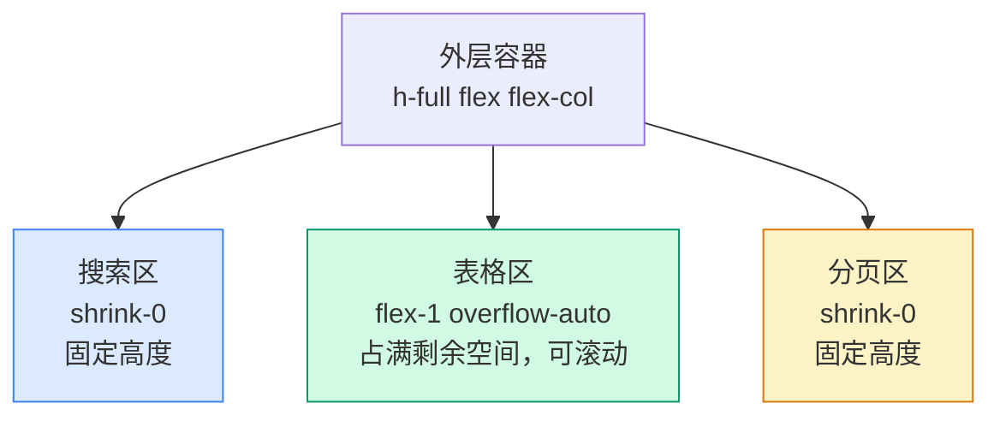
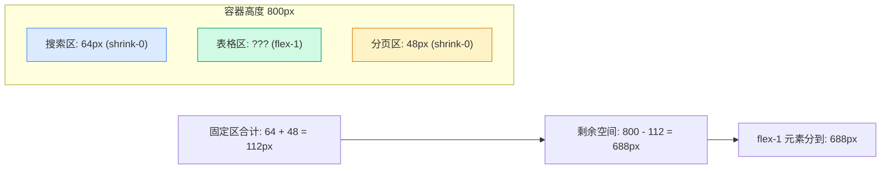
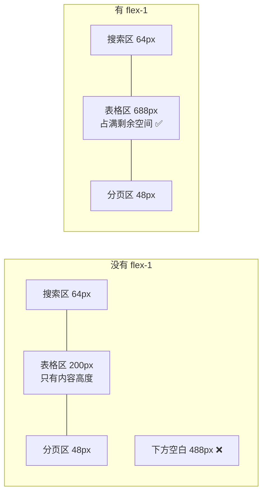
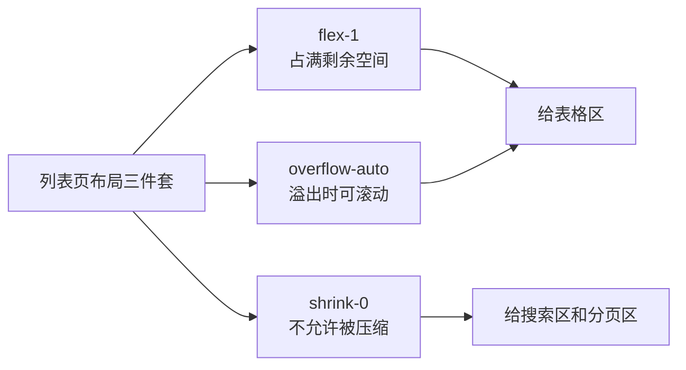

# 数据列表页布局

> **这一步解决什么问题？**
>
> 数据列表页是管理后台最常见、数量最多的页面类型——搜索区在上、表格在中间、分页在底部。本文从角色管理页的布局出发，讲透 flex 嵌套、flex-1/shrink-0/overflow-auto 三件套的使用。
>
> 对于 ASP.NET Core 开发者：这就是带搜索条件的数据列表页——上面是筛选表单，中间是 `<table>`，下面是 `Pager`。前端的挑战在于让表格区自动填满剩余空间并独立滚动。

---

## 前置知识

### flex-1 展开为什么

```css
flex: 1 1 0%;
/*  ↑ ↑ ↑
    │ │ └─ flex-basis: 0%（初始尺寸为 0，从零开始分配）
    │ └─── flex-shrink: 1（空间不足时允许收缩）
    └───── flex-grow: 1（有剩余空间时按比例增长）
*/
```

| class | CSS | 效果 |
|-------|-----|------|
| `flex-1` | `flex: 1 1 0%` | 占满剩余空间，可收缩 |
| `flex-none` | `flex: 0 0 auto` | 不伸缩，保持原始尺寸 |
| `shrink-0` | `flex-shrink: 0` | 不允许被压缩 |
| `grow` | `flex-grow: 1` | 允许增长（但不设 basis） |

### overflow 家族

| class | CSS | 溢出时 | 未溢出时 |
|-------|-----|--------|---------|
| `overflow-auto` | `overflow: auto` | 出现滚动条 | 无滚动条 |
| `overflow-scroll` | `overflow: scroll` | 出现滚动条 | 始终显示滚动条 |
| `overflow-hidden` | `overflow: hidden` | 裁剪内容 | 无滚动条 |

> **列表页的黄金组合**：表格区用 `flex-1 overflow-auto`——占满剩余空间，内容多时自动出现滚动条。

---

## 原理图解

### 列表页的垂直三段式结构



### flex-1 的空间分配原理



> **计算公式**：`flex-1 元素高度 = 容器高度 - shrink-0 元素高度之和`。如果有多个 `flex-1` 元素，它们平分剩余空间。

---

## 对照实验

### 实验 1：不加 flex-1 的表格区

```tsx
// ❌ 表格区不加 flex-1——只占内容高度，底部大片空白
<div className="h-full flex flex-col p-4 gap-4">
  <div className="shrink-0">搜索区</div>
  <div className="overflow-auto">表格区</div> {/* 没有 flex-1 */}
  <div className="shrink-0">分页区</div>
</div>
// 结果：表格区高度 = 内容高度，不占满剩余空间

// ✅ 表格区加 flex-1——占满剩余空间
<div className="h-full flex flex-col p-4 gap-4">
  <div className="shrink-0">搜索区</div>
  <div className="flex-1 overflow-auto">表格区</div>
  <div className="shrink-0">分页区</div>
</div>
```



### 实验 2：不加 overflow-auto 的表格区

```tsx
// ❌ 不加 overflow-auto——表格撑破容器，页面整体滚动
<div className="flex-1">表格区</div>
// 50 行数据时，表格高度远超容器，整个页面滚动

// ✅ 加 overflow-auto——表格区独立滚动
<div className="flex-1 overflow-auto">表格区</div>
// 50 行数据时，表格区出现内部滚动条，搜索区和分页区始终可见
```

### 实验 3：不加 shrink-0 的分页区

```tsx
// ❌ 分页区不加 shrink-0——空间不足时被压缩
<div className="h-12">分页区</div>
// 容器高度不足时，分页区被压缩成一条线

// ✅ 加 shrink-0——分页区始终完整显示
<div className="shrink-0 h-12">分页区</div>
```

---

## 代码实现

### 标准列表页骨架

```tsx
// src/pages/users-page.tsx（布局骨架）
import { useState } from "react"

export function UsersPage() {
  const [keyword, setKeyword] = useState("")

  return (
    <div className="h-full flex flex-col gap-4 p-4">
      {/* 搜索区——固定高度，不可压缩 */}
      <div className="shrink-0 flex items-center gap-3">
        <input
          className="h-9 w-64 rounded-md border bg-background px-3 text-sm"
          placeholder="搜索用户名..."
          value={keyword}
          onChange={(e) => setKeyword(e.target.value)}
        />
        <button className="h-9 rounded-md bg-primary px-4 text-sm text-primary-foreground">
          搜索
        </button>
        <div className="flex-1" />
        <button className="h-9 rounded-md bg-primary px-4 text-sm text-primary-foreground">
          新增用户
        </button>
      </div>

      {/* 表格区——占满剩余空间，内容溢出时可滚动 */}
      <div className="flex-1 overflow-auto rounded-md border">
        <table className="w-full text-sm">
          <thead className="sticky top-0 bg-muted/50">
            <tr>
              <th className="px-4 py-3 text-left font-medium">用户名</th>
              <th className="px-4 py-3 text-left font-medium">邮箱</th>
              <th className="px-4 py-3 text-left font-medium">角色</th>
              <th className="px-4 py-3 text-left font-medium">操作</th>
            </tr>
          </thead>
          <tbody>
            {Array.from({ length: 30 }).map((_, i) => (
              <tr key={i} className="border-t">
                <td className="px-4 py-3">user_{i + 1}</td>
                <td className="px-4 py-3">user_{i + 1}@example.com</td>
                <td className="px-4 py-3">管理员</td>
                <td className="px-4 py-3">
                  <button className="text-primary text-sm">编辑</button>
                </td>
              </tr>
            ))}
          </tbody>
        </table>
      </div>

      {/* 分页区——固定高度，不可压缩 */}
      <div className="shrink-0 flex items-center justify-between text-sm text-muted-foreground">
        <span>共 30 条</span>
        <div className="flex items-center gap-2">
          <button className="rounded border px-2 py-1">上一页</button>
          <span>1 / 3</span>
          <button className="rounded border px-2 py-1">下一页</button>
        </div>
      </div>
    </div>
  )
}
```

---

## 代码讲解

### 表格头的 sticky 定位

```tsx
<thead className="sticky top-0 bg-muted/50">
```

`sticky top-0` 让表头在滚动时固定在表格区顶部。注意：

1. **`sticky` 的父容器是 `overflow-auto` 的 `div`**（不是整个页面），所以表头固定在表格区的顶部
2. **必须有背景色**（`bg-muted/50`），否则滚动时表头内容会透过文字
3. **`top-0`** 是 sticky 的阈值——表头滚到容器顶部 0px 时固定

> **【易错点】** `sticky` 元素如果没有背景色，滚动时表头文字会和表格内容重叠，看起来像"穿透"了。必须加背景色遮住下方滚动的内容。

### 搜索区的 `flex-1` 隔离

```tsx
<div className="shrink-0 flex items-center gap-3">
  <input ... />
  <button>搜索</button>
  <div className="flex-1" />  {/* 弹性空间，把"新增"按钮推到右边 */}
  <button>新增用户</button>
</div>
```

搜索区的 `flex-1` 是一个空的 `<div>`，它的作用是占据中间所有空间，把右侧的"新增"按钮推到最右边——这是 flex 布局中常见的"左右分离"技巧。

> **后端类比**：这就像 WPF 的 `DockPanel`——最后一个子元素默认填满剩余空间。在 flex 中，用一个 `flex-1` 的空 div 模拟这个行为。

### 三件套总结



---

## 踩坑提醒

1. **外层容器必须有高度**。`h-full` 要求父容器也有确定高度。如果外层是 `flex-1` 的子元素，高度链就一直要传递上去，直到 `min-h-screen` 或 `h-screen`。

2. **表格区要加 `rounded-md border`**。不加的话，滚动时表格内容没有视觉边界，看起来"溢出"了容器。

3. **`sticky` 表头必须有背景色**。否则滚动时表头文字和内容重叠。

4. **`overflow-auto` vs `overflow-y-auto`**。如果表格宽度也可能超出，用 `overflow-auto`（两个方向都能滚动）。如果只关心垂直滚动，用 `overflow-y-auto`。

> **🤔 导师提问**：搜索区和分页区都用 `shrink-0`，但如果页面高度非常小（比如手机横屏），两者都不允许收缩，表格区会被挤压到 0 高度。你会如何处理这种极端情况？

---

## 🤔 自测题

### 概念级（理解定义）

1. `flex-1` 展开为哪三个 CSS 属性？各自的作用是什么？

2. `overflow-auto` 和 `overflow-scroll` 的区别是什么？

### 推理级（分析原因）

3. 表格区的 `flex-1 overflow-auto` 缺少任何一个会分别产生什么问题？

4. 搜索区中间的 `<div className="flex-1" />` 起什么作用？去掉会怎样？

### 动手级（实践验证）

5. 把 `flex-1` 去掉，观察表格区是否还占满剩余空间。把 `overflow-auto` 去掉，观察表格是否撑破容器。

6. 把分页区的 `shrink-0` 去掉，缩小浏览器窗口高度，观察分页区是否被压缩变形。

---

## 验证步骤

1. 创建 `src/pages/users-page.tsx`，复制上面的代码
2. 在路由中注册该页面
3. 执行 `pnpm dev`，打开用户列表页
4. 确认搜索区在上方，表格在中间，分页在底部
5. 确认表格区独立滚动，搜索区和分页区始终可见
6. 确认表头在滚动时固定在顶部

---

## ✅ 输出检查清单

完成本节后，确认以下各项：

- [ ] 理解 `flex-1` 的空间分配原理：占满剩余空间
- [ ] 知道 `overflow-auto` 让表格区独立滚动
- [ ] 知道 `shrink-0` 保护搜索区和分页区不被压缩
- [ ] 理解表格头 `sticky top-0` 需要背景色的原因
- [ ] 掌握 flex 布局中"左右分离"的技巧（`flex-1` 空 div）

---

[← 上一篇：管理后台框架布局](./02-管理后台框架布局.md) | [下一篇：详情页Tab布局 →](./04-详情页Tab布局.md)
