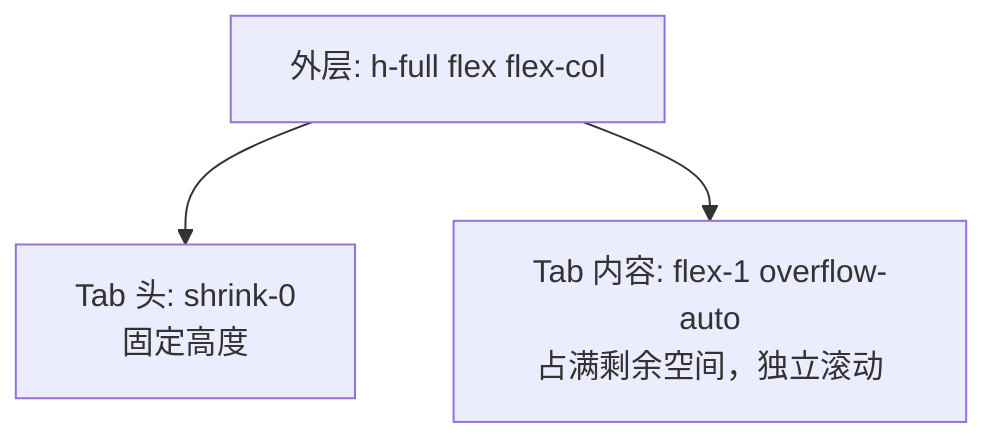
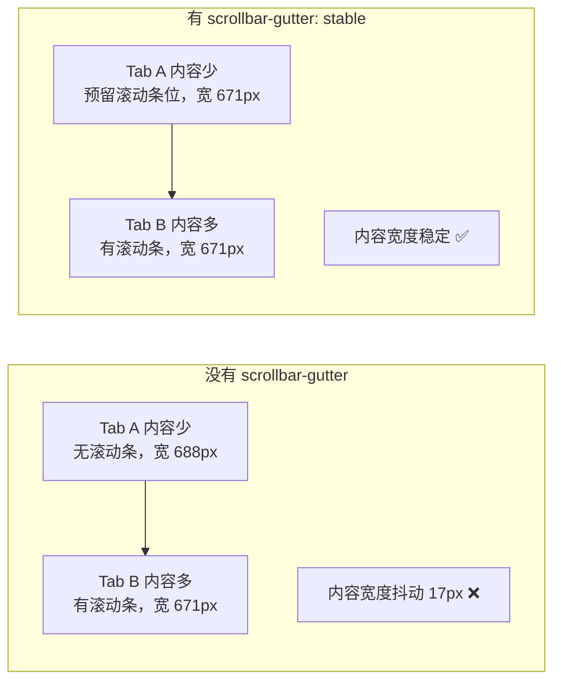
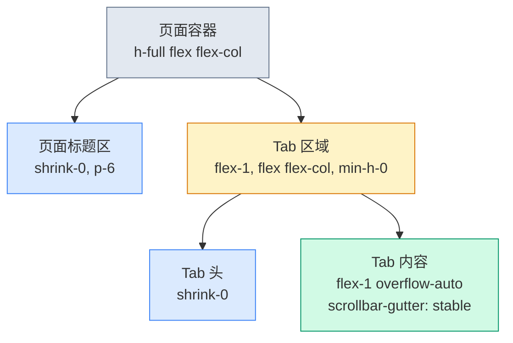
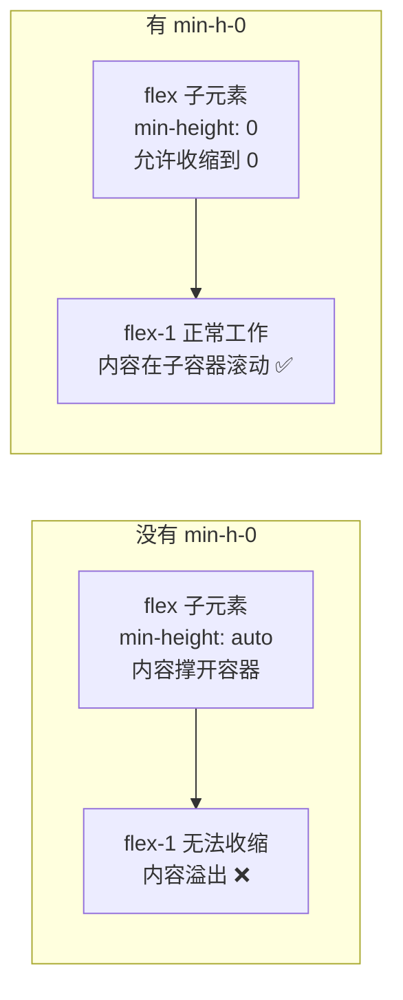
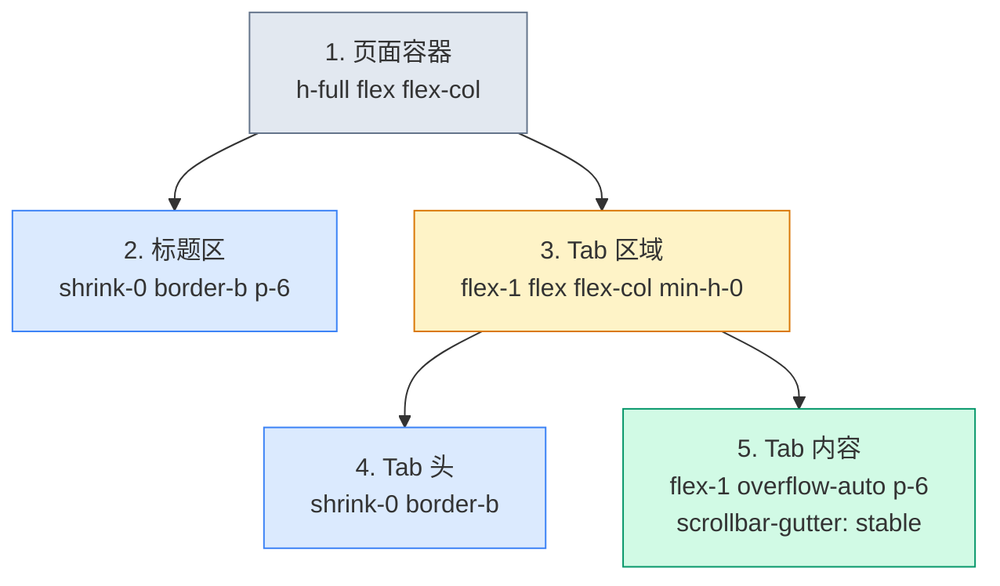

# 详情页Tab布局

> **这一步解决什么问题？**
>
> 详情页通常用 Tab 分区——基本信息、权限配置、操作日志等，每个 Tab 有独立的滚动区域。本文从租户详情页的布局出发，讲透嵌套 flex、scrollbar-gutter、overflow 配合三大知识点。
>
> 对于 ASP.NET Core 开发者：这就是带 Tab 的详情页——每个 Tab 对应一个 `Partial`，切换时只刷新 Tab 内容区，不刷新整个页面。

---

## 前置知识

### 嵌套 flex 布局

Tab 详情页需要两层 flex 嵌套：



外层 `flex-col` 让 Tab 头和内容垂直排列，`flex-1` 让内容区占满剩余空间。

### scrollbar-gutter: stable



`scrollbar-gutter: stable` 在没有滚动条时也预留滚动条的空间，避免切换 Tab 时内容区宽度抖动。

### overflow 的父子配合

```tsx
// 父容器裁剪溢出
<div className="flex-1 overflow-hidden">
  // 子容器提供滚动
  <div className="h-full overflow-auto">
    {/* 长内容 */}
  </div>
</div>
```

这种配合确保：父容器限制可见区域，子容器提供滚动能力。

---

## 原理图解

### Tab 页的完整布局层级



### 为什么需要 min-h-0



> **【易错点】** flex 子元素默认 `min-height: auto`，这意味着它不会收缩到比内容更小。加上 `min-h-0`（`min-height: 0`）后，flex-1 才能正常工作。这是 flex 布局中最常见的"为什么 flex-1 不生效"的原因之一。

---

## 对照实验

### 实验 1：不用 scrollbar-gutter 的宽度抖动

```tsx
// ❌ 不用 scrollbar-gutter——切换 Tab 时宽度抖动
<div className="flex-1 overflow-auto">
  {/* Tab A: 无滚动条，内容宽 688px */}
  {/* Tab B: 有滚动条，内容宽 671px → 抖动 17px */}
</div>

// ✅ 用 scrollbar-gutter——宽度稳定
<div className="flex-1 overflow-auto" style={{ scrollbarGutter: "stable" }}>
  {/* Tab A: 预留滚动条位，内容宽 671px */}
  {/* Tab B: 有滚动条，内容宽 671px → 无抖动 */}
</div>
```

### 实验 2：Tab 内容区不加 flex-1 overflow-auto

```tsx
// ❌ 不加 flex-1 overflow-auto——内容溢出整个页面
<div className="flex flex-col">
  <div>Tab 头</div>
  <div>{/* Tab 内容 —— 没有 flex-1，高度 = 内容高度 */}</div>
</div>
// 长内容时：Tab 头被推到视口外，页面整体滚动

// ✅ 加 flex-1 overflow-auto——内容在 Tab 区域内滚动
<div className="flex-1 flex flex-col min-h-0">
  <div>Tab 头</div>
  <div className="flex-1 overflow-auto" style={{ scrollbarGutter: "stable" }}>
    {/* Tab 内容 —— 独立滚动 */}
  </div>
</div>
```

### 实验 3：父容器不加 min-h-0

```tsx
// ❌ 不加 min-h-0——Tab 区域被内容撑开，flex-1 失效
<div className="flex-1 flex flex-col">
  {/* 内容撑开容器，Tab 区域高度 = 内容高度 */}
</div>

// ✅ 加 min-h-0——Tab 区域正确收缩
<div className="flex-1 flex flex-col min-h-0">
  {/* 内容在子容器滚动，Tab 区域高度 = 剩余空间 */}
</div>
```

---

## 代码实现

### Tab 详情页骨架

```tsx
// src/pages/tenant-detail-page.tsx
import { useState } from "react"

export function TenantDetailPage() {
  const [activeTab, setActiveTab] = useState("basic")

  const tabs = [
    { id: "basic", label: "基本信息" },
    { id: "modules", label: "模块配置" },
    { id: "features", label: "功能开关" },
    { id: "quota", label: "配额管理" },
  ]

  return (
    <div className="h-full flex flex-col">
      {/* 页面标题区 */}
      <div className="shrink-0 border-b p-6">
        <h1 className="text-2xl font-bold">租户详情</h1>
        <p className="mt-1 text-sm text-muted-foreground">管理租户的配置和功能</p>
      </div>

      {/* Tab 区域——必须加 min-h-0 */}
      <div className="flex-1 flex flex-col min-h-0">
        {/* Tab 头 */}
        <div className="shrink-0 border-b">
          <div className="flex gap-0 px-6">
            {tabs.map((tab) => (
              <button
                key={tab.id}
                onClick={() => setActiveTab(tab.id)}
                className={`px-4 py-3 text-sm font-medium border-b-2 transition-colors ${
                  activeTab === tab.id
                    ? "border-primary text-foreground"
                    : "border-transparent text-muted-foreground hover:text-foreground"
                }`}
              >
                {tab.label}
              </button>
            ))}
          </div>
        </div>

        {/* Tab 内容——独立滚动 */}
        <div className="flex-1 overflow-auto p-6" style={{ scrollbarGutter: "stable" }}>
          {activeTab === "basic" && (
            <div className="space-y-6">
              {Array.from({ length: 20 }).map((_, i) => (
                <div key={i} className="grid grid-cols-[180px_1fr] gap-4">
                  <span className="text-sm text-muted-foreground">字段 {i + 1}</span>
                  <span className="text-sm">字段值 {i + 1}</span>
                </div>
              ))}
            </div>
          )}
          {activeTab === "modules" && <div>模块配置内容</div>}
          {activeTab === "features" && <div>功能开关内容</div>}
          {activeTab === "quota" && <div>配额管理内容</div>}
        </div>
      </div>
    </div>
  )
}
```

---

## 代码讲解

### 三层嵌套结构



1. **页面容器** `h-full flex flex-col`：撑满父容器高度，子元素垂直排列
2. **标题区** `shrink-0`：固定高度，不可压缩
3. **Tab 区域** `flex-1 flex flex-col min-h-0`：占满剩余空间，再次垂直排列子元素。`min-h-0` 是关键——允许收缩
4. **Tab 头** `shrink-0`：固定高度
5. **Tab 内容** `flex-1 overflow-auto`：占满剩余空间，独立滚动

### min-h-0 的原理

flex 子元素默认 `min-height: auto`，等于内容的最小高度。这会阻止 `flex-1` 收缩到比内容更小。`min-h-0` 把最小高度设为 0，让 `flex-1` 可以正常工作。

> **后端类比**：`min-height: auto` 就像数据库连接池的 `MinPoolSize`——即使没有请求，也保留最小连接数。`min-h-0` 就是把 `MinPoolSize` 设为 0——没有请求时完全释放资源。

### scrollbar-gutter 的浏览器兼容性

| 浏览器 | 支持版本 |
|--------|---------|
| Chrome | 94+ |
| Firefox | 97+ |
| Safari | 17.4+ |
| Edge | 94+ |

> **【设计取舍】** 如果需要兼容更老的浏览器，可以用 `overflow-y: scroll`（始终显示滚动条）替代 `scrollbar-gutter: stable`。但 `overflow-y: scroll` 会在不需要滚动时也显示一个灰色滚动条轨道，视觉上不够干净。

---

## 踩坑提醒

1. **`min-h-0` 是 Tab 布局的关键**。不加的话，Tab 区域会被内容撑开，`flex-1` 失效，内容溢出整个页面。这是 flex 布局最常见的坑。

2. **`scrollbar-gutter` 需要写在有 `overflow-auto` 的元素上**。写在父容器上无效。

3. **Tab 切换时不要用条件渲染清空 DOM**。如果 Tab 内容区有滚动位置，切换 Tab 时用 `display: none/block`（或 `hidden` class）隐藏/显示，而不是用条件渲染卸载/重建 DOM——这样切换回来时滚动位置不会丢失。

4. **`h-full` 需要高度链传递**。从最外层的 `min-h-screen` 到页面容器到 Tab 区域，每一层都需要有确定的高度。

---

## 🤔 自测题

### 概念级（理解定义）

1. `scrollbar-gutter: stable` 解决什么问题？

2. 为什么 Tab 区域需要 `min-h-0`？

### 推理级（分析原因）

3. 如果 Tab 内容区不加 `overflow-auto`，内容会怎么溢出？

4. Tab 切换时用条件渲染（`{activeTab === "basic" && ...}`）和用 `hidden` class 隐藏，各有什么优劣？

### 动手级（实践验证）

5. 去掉 `min-h-0`，观察 Tab 区域是否被内容撑开。然后加回来，确认 `flex-1` 正常工作。

6. 去掉 `scrollbarGutter: "stable"`，在两个内容量差异大的 Tab 之间切换，观察内容区宽度是否抖动。

---

## 验证步骤

1. 创建 `src/pages/tenant-detail-page.tsx`，复制上面的代码
2. 在路由中注册该页面
3. 执行 `pnpm dev`，打开租户详情页
4. 确认 Tab 头固定，Tab 内容独立滚动
5. 在 Tab 之间切换，确认内容区宽度不抖动
6. 滚动到 Tab 内容底部，确认 Tab 头始终可见

---

## ✅ 输出检查清单

完成本节后，确认以下各项：

- [ ] 理解 Tab 详情页的三层嵌套 flex 结构
- [ ] 知道 `min-h-0` 是让 `flex-1` 在嵌套场景下正常工作的关键
- [ ] 理解 `scrollbar-gutter: stable` 解决的宽度抖动问题
- [ ] 知道 Tab 切换时保留滚动位置的方法（`hidden` vs 条件渲染）
- [ ] 理解 `overflow` 父子配合的原理

---

[← 上一篇：数据列表页布局](./03-数据列表页布局.md) | [下一篇：表单页布局 →](./05-表单页布局.md)
