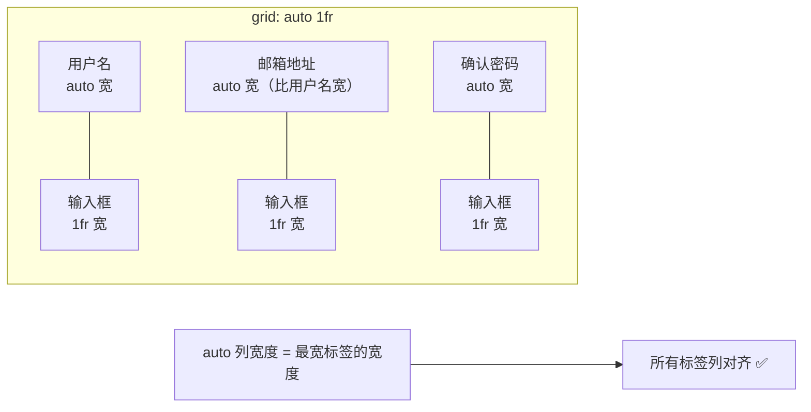
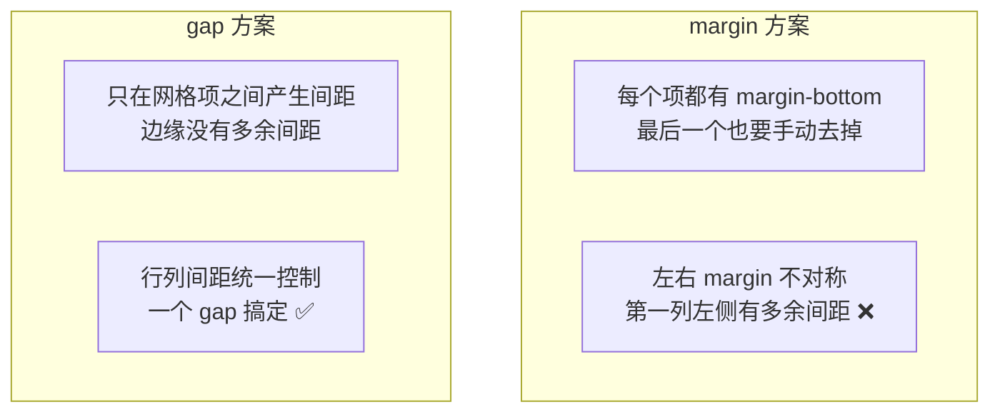
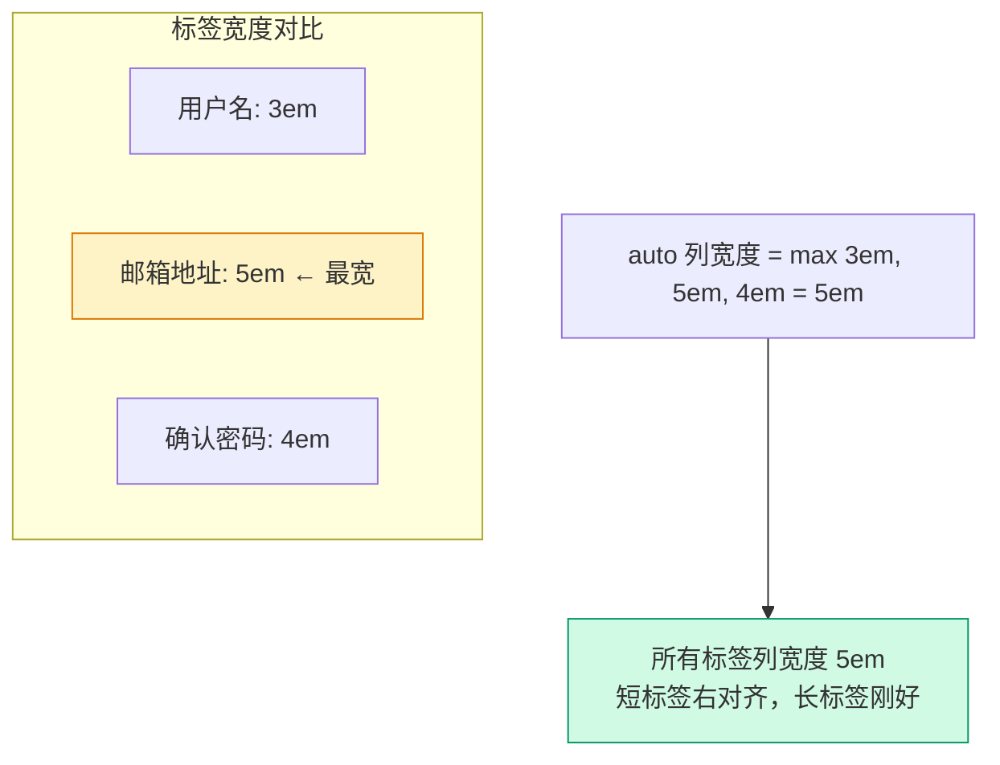
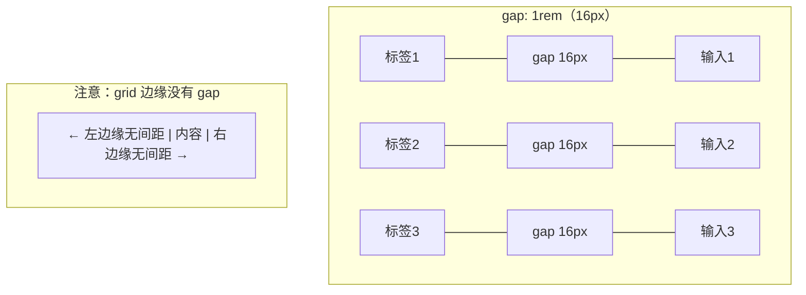
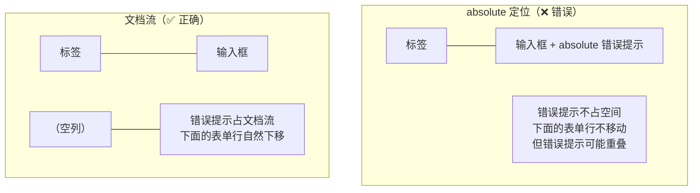

# 表单页布局

> **这一步解决什么问题？**
>
> 表单是管理后台最基础的交互——标签在左、输入在右、校验提示在下方。本文从应用管理的新增/编辑表单出发，讲透 CSS Grid 的 `auto 1fr` 对齐、`gap` 替代 margin、错误状态布局三大知识点。
>
> 对于 ASP.NET Core 开发者：这就是 `<form>` 配 `<label>` + `<input>` 的水平对齐——但前端不用 `<table>` 布局，而是用 CSS Grid 让标签列自适应最宽标签的宽度。

---

## 前置知识

### CSS Grid 的 grid-template-columns: auto 1fr

```css
grid-template-columns: auto 1fr;
/*                      ↑    ↑
                       │    └── 第二列：占满剩余空间
                       └─────── 第一列：宽度由内容决定（自适应最宽标签）
*/
```



> **关键**：`auto` 列的宽度由该列中**最宽的内容**决定。这意味着"邮箱地址"这个最长的标签决定了整列的宽度，短标签（如"用户名"）自动右对齐留白。

### gap vs margin



| 属性 | margin | gap |
|------|--------|-----|
| 边缘间距 | 需要手动处理 | 不产生 |
| 行列统一 | 需要分别设 | 一个值搞定 |
| 响应式 | 各项单独控制 | 容器级控制 |
| Tailwind | `mb-4` 等 | `gap-4` |

---

## 原理图解

### auto 1fr 对齐原理



### gap 只影响网格项之间



### 错误提示的布局策略



---

## 对照实验

### 实验 1：flex 固定宽度 vs grid auto 1fr

```tsx
// ❌ flex + 固定宽度标签——不同语言下宽度不够
<div className="flex items-center gap-4">
  <span className="w-20 text-sm">用户名</span>  {/* 英文 "Username" 可能超出 */}
  <input className="flex-1 h-10 rounded-md border px-3" />
</div>

// ✅ grid auto 1fr——标签列自适应最宽标签
<div className="grid grid-cols-[auto_1fr] gap-x-4 gap-y-2 items-center">
  <span className="text-sm text-right">用户名</span>
  <input className="h-10 rounded-md border px-3" />
  <span className="text-sm text-right">邮箱地址</span>  {/* 最宽标签，决定列宽 */}
  <input className="h-10 rounded-md border px-3" />
</div>
```

| 方式 | 标签宽度 | 多语言适配 | 对齐效果 |
|------|---------|-----------|---------|
| flex + 固定宽度 | 固定 80px | 可能不够 | 一般 |
| grid auto 1fr | 自适应最宽 | 自动调整 | 完美 |

### 实验 2：错误提示用 absolute vs 文档流

```tsx
// ❌ absolute 定位——错误提示不占空间，不会推动下方表单行
<div className="relative">
  <input className="h-10 w-full rounded-md border px-3" />
  <span className="absolute -bottom-5 text-xs text-destructive">请输入用户名</span>
</div>
// 问题：错误提示和下一个表单行重叠

// ✅ 文档流——错误提示占空间，自然推动下方表单行
<div>
  <input className="h-10 w-full rounded-md border px-3" />
  <span className="text-xs text-destructive">请输入用户名</span>
</div>
```

### 实验 3：gap vs margin

```tsx
// ❌ margin 方案——边缘有多余间距，需要手动处理
<div className="space-y-4">
  <div className="flex gap-4 mb-4">  {/* mb-4 最后一行也有 */}
    <span className="w-20">标签</span>
    <input className="flex-1" />
  </div>
</div>

// ✅ gap 方案——只在项之间产生间距
<div className="grid grid-cols-[auto_1fr] gap-4">
  <span>标签</span>
  <input className="flex-1" />
</div>
```

---

## 代码实现

### 标准表单骨架

```tsx
// src/components/app-form-dialog.tsx
import { useState } from "react"

interface FormData {
  name: string
  code: string
  description: string
  redirectUri: string
}

interface FormErrors {
  name?: string
  code?: string
  redirectUri?: string
}

export function AppFormDialog() {
  const [form, setForm] = useState<FormData>({
    name: "",
    code: "",
    description: "",
    redirectUri: "",
  })
  const [errors, setErrors] = useState<FormErrors>({})

  const updateField = (field: keyof FormData, value: string) => {
    setForm((prev) => ({ ...prev, [field]: value }))
    // 清除该字段的错误
    if (errors[field]) {
      setErrors((prev) => {
        const next = { ...prev }
        delete next[field]
        return next
      })
    }
  }

  return (
    <div className="w-[480px] p-6">
      <h2 className="text-lg font-semibold">新增应用</h2>
      <p className="mt-1 text-sm text-muted-foreground">填写应用的基本信息</p>

      {/* 表单区域：grid auto 1fr 对齐 */}
      <div className="mt-6 grid grid-cols-[auto_1fr] gap-x-4 gap-y-3">
        {/* 应用名称 */}
        <label className="text-sm font-medium self-center text-right whitespace-nowrap">
          应用名称
          <span className="text-destructive">*</span>
        </label>
        <div>
          <input
            className={`h-10 w-full rounded-md border bg-background px-3 text-sm ${
              errors.name ? "border-destructive" : ""
            }`}
            value={form.name}
            onChange={(e) => updateField("name", e.target.value)}
            placeholder="请输入应用名称"
          />
          {errors.name && (
            <p className="mt-1 text-xs text-destructive">{errors.name}</p>
          )}
        </div>

        {/* 应用编码 */}
        <label className="text-sm font-medium self-center text-right whitespace-nowrap">
          应用编码
          <span className="text-destructive">*</span>
        </label>
        <div>
          <input
            className={`h-10 w-full rounded-md border bg-background px-3 text-sm ${
              errors.code ? "border-destructive" : ""
            }`}
            value={form.code}
            onChange={(e) => updateField("code", e.target.value)}
            placeholder="请输入应用编码"
          />
          {errors.code && (
            <p className="mt-1 text-xs text-destructive">{errors.code}</p>
          )}
        </div>

        {/* 重定向 URI */}
        <label className="text-sm font-medium self-center text-right whitespace-nowrap">
          重定向 URI
          <span className="text-destructive">*</span>
        </label>
        <div>
          <input
            className={`h-10 w-full rounded-md border bg-background px-3 text-sm ${
              errors.redirectUri ? "border-destructive" : ""
            }`}
            value={form.redirectUri}
            onChange={(e) => updateField("redirectUri", e.target.value)}
            placeholder="https://example.com/callback"
          />
          {errors.redirectUri && (
            <p className="mt-1 text-xs text-destructive">{errors.redirectUri}</p>
          )}
        </div>

        {/* 描述 */}
        <label className="text-sm font-medium self-start text-right whitespace-nowrap pt-2">
          描述
        </label>
        <textarea
          className="min-h-[80px] w-full rounded-md border bg-background px-3 py-2 text-sm resize-none"
          value={form.description}
          onChange={(e) => updateField("description", e.target.value)}
          placeholder="请输入应用描述"
        />
      </div>

      {/* 操作按钮 */}
      <div className="mt-6 flex justify-end gap-3">
        <button className="h-10 rounded-md border px-4 text-sm">取消</button>
        <button className="h-10 rounded-md bg-primary px-4 text-sm text-primary-foreground">
          保存
        </button>
      </div>
    </div>
  )
}
```

---

## 代码讲解

### grid auto 1fr 的对齐魔法

```tsx
<div className="grid grid-cols-[auto_1fr] gap-x-4 gap-y-3">
```

- `auto`：标签列宽度 = 该列最宽标签的宽度（"重定向 URI" 最长，决定列宽）
- `1fr`：输入列占满剩余空间
- `gap-x-4`：列间距 16px（标签和输入之间）
- `gap-y-3`：行间距 12px（表单行之间）

### 标签的对齐处理

```tsx
<label className="text-sm font-medium self-center text-right whitespace-nowrap">
```

- `self-center`：垂直居中（和输入框对齐）
- `text-right`：文字右对齐（和输入框紧挨）
- `whitespace-nowrap`：不换行（标签必须在一行内显示）

> **【易错点】** 如果标签文字换行了，`auto` 列的宽度计算会出错。`whitespace-nowrap` 确保标签始终在一行。

### 错误提示的布局

```tsx
{errors.name && (
  <p className="mt-1 text-xs text-destructive">{errors.name}</p>
)}
```

错误提示放在输入框的 `<div>` 内部，占据文档流。当错误出现时，这个 `<div>` 的高度增加，下方的表单行自然下移。错误消失时，`<div>` 高度恢复，下方表单行回到原位。

> **为什么不用 `absolute`？** 因为 `absolute` 不占空间，错误提示会和下一个表单行重叠。而且多个字段同时出错时，`absolute` 的错误提示会互相遮挡。

### textarea 的 self-start

```tsx
<label className="... self-start text-right ... pt-2">
<textarea className="min-h-[80px] ..." />
```

`textarea` 高度比输入框大，标签应该顶部对齐（`self-start`）而不是垂直居中（`self-center`）。`pt-2` 给标签加一点顶部间距，和 textarea 的文字基线对齐。

---

## 踩坑提醒

1. **标签必须加 `whitespace-nowrap`**。不加的话，标签可能换行，`auto` 列宽度计算出错，输入列变窄。

2. **错误提示放在输入框的容器内**。不要放在 grid 的独立行中，否则错误提示的空列会破坏标签-输入的对齐。

3. **`gap-x-4` 和 `gap-y-3` 可以不同**。列间距（标签和输入之间）通常比行间距（表单行之间）小，因为标签和输入在视觉上是一组的。

4. **长表单需要滚动**。如果表单字段很多，外层容器加 `overflow-auto`，表单区域用 `max-h-[70vh] overflow-auto` 限制高度。

---

## 🤔 自测题

### 概念级（理解定义）

1. `grid-template-columns: auto 1fr` 中，`auto` 列的宽度由什么决定？

2. `gap` 和 `margin` 在间距控制上有什么区别？

### 推理级（分析原因）

3. 为什么错误提示应该用文档流而不是 `absolute` 定位？

4. textarea 的标签用 `self-start` 而不是 `self-center`，原因是什么？

### 动手级（实践验证）

5. 把 `grid-cols-[auto_1fr]` 改成 `grid-cols-[120px_1fr]`，观察标签列宽度变化。加一个更长的标签名（如"OAuth2 回调地址"），观察固定宽度是否不够。

6. 在一个输入框上触发错误提示，观察下方表单行是否自然下移。然后把错误提示改为 `absolute` 定位，观察是否和下一个表单行重叠。

---

## 验证步骤

1. 创建 `src/components/app-form-dialog.tsx`，复制上面的代码
2. 在页面中引入该组件
3. 执行 `pnpm dev`，打开表单
4. 确认标签列右对齐，输入列占满剩余空间
5. 触发校验错误，确认错误提示在输入框下方
6. 确认错误出现时，下方表单行自然下移

---

## ✅ 输出检查清单

完成本节后，确认以下各项：

- [ ] 理解 `grid auto 1fr` 中 `auto` 列自适应最宽标签的原理
- [ ] 知道 `gap` 比 `margin` 更适合网格间距控制
- [ ] 理解错误提示应该用文档流而不是 `absolute` 定位
- [ ] 知道标签需要 `whitespace-nowrap` 防止换行
- [ ] 理解 textarea 标签用 `self-start` 对齐的原因

---

[← 上一篇：详情页Tab布局](./04-详情页Tab布局.md) | [下一篇：文件管理器布局 →](./06-文件管理器布局.md)
