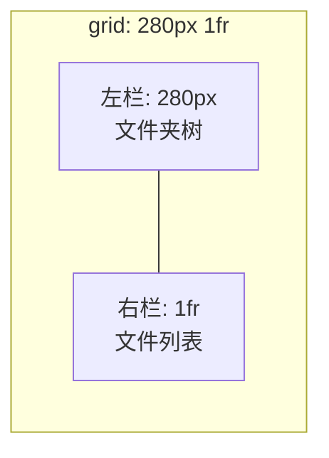
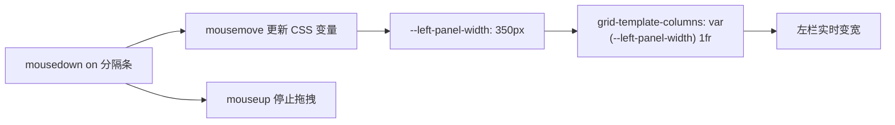
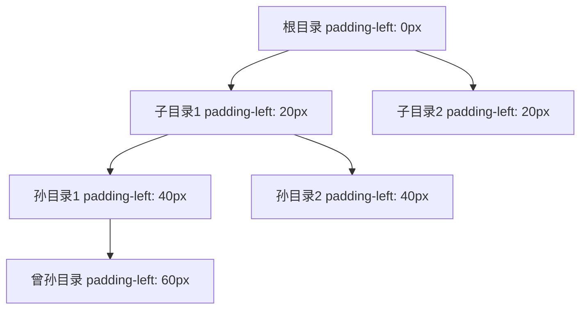
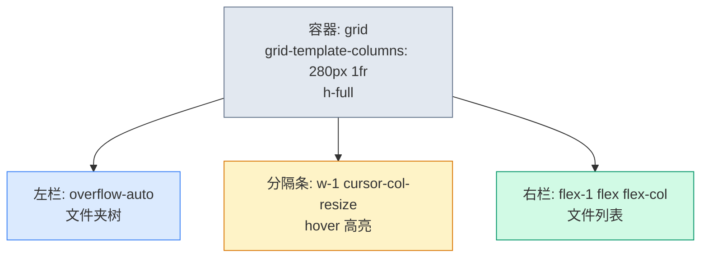
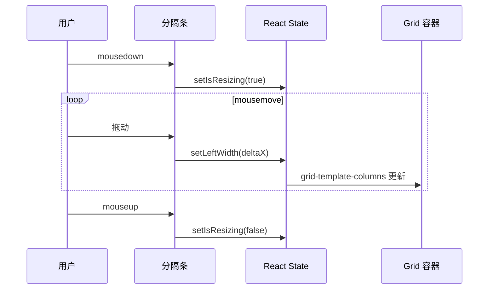

# 文件管理器布局

> **这一步解决什么问题？**
>
> 文件管理器是典型的"左右分栏"布局——左侧文件夹树、右侧文件列表，中间有可拖拽的分隔条。本文从文件服务的真实布局出发，讲透 CSS Grid 分栏、拖拽调整宽度、树形缩进三大知识点。
>
> 对于 ASP.NET Core 开发者：这就是 Windows 资源管理器的布局——左侧目录树 + 右侧文件列表。前端用 CSS Grid 的 `grid-template-columns: 280px 1fr` 实现固定左栏 + 弹性右栏。

---

## 前置知识

### CSS Grid 分栏：固定 + 弹性

```css
grid-template-columns: 280px 1fr;
/*                     ↑     ↑
                      │     └── 右栏：占满剩余空间
                      └──────── 左栏：固定 280px
*/
```



### 拖拽分隔条

通过鼠标事件 + CSS 变量动态更新左栏宽度：



### 树形缩进

每层缩进递增 20px：



---

## 原理图解

### 分栏布局的 Grid 实现



### 拖拽分隔条的交互流程



---

## 对照实验

### 实验 1：固定宽度分栏 vs 可拖拽分栏

```tsx
// ❌ 固定宽度——用户无法调整工作区
<div className="grid grid-cols-[280px_1fr]">
  <div>文件夹树</div>
  <div>文件列表</div>
</div>
// 问题：小屏幕时 280px 左栏太宽，大屏幕时太窄

// ✅ 可拖拽分栏——用户自定义工作区
<div className="grid h-full" style={{ gridTemplateColumns: `${leftWidth}px 1fr` }}>
  <div>文件夹树</div>
  <ResizeHandle onResize={setLeftWidth} />
  <div>文件列表</div>
</div>
```

### 实验 2：树形缩进用 margin-left vs padding-left

```tsx
// ❌ margin-left——影响兄弟元素的间距计算
<div style={{ marginLeft: `${depth * 20}px` }}>
  文件夹名
</div>
// 问题：margin 叠加时，相邻项的间距可能不一致

// ✅ padding-left——只影响自身内部，不影响兄弟
<div style={{ paddingLeft: `${depth * 20}px` }}>
  文件夹名
</div>
// padding 不会叠加，每个项的缩进独立计算
```

| 属性 | 影响兄弟？ | 叠加问题？ | 适合缩进？ |
|------|-----------|-----------|-----------|
| `margin-left` | 是 | 可能叠加 | 否 |
| `padding-left` | 否 | 不叠加 | 是 |

### 实验 3：左栏不加 overflow-auto

```tsx
// ❌ 不加 overflow-auto——树节点很多时左栏撑破容器
<div className="h-full">
  {folders.map(f => <FolderItem />)} {/* 100+ 个文件夹 */}
</div>
// 问题：左栏高度超过容器，整个页面滚动

// ✅ 加 overflow-auto——左栏独立滚动
<div className="h-full overflow-auto">
  {folders.map(f => <FolderItem />)}
</div>
```

---

## 代码实现

### 文件管理器布局骨架

```tsx
// src/pages/file-manager-page.tsx
import { useState, useCallback, useRef, useEffect } from "react"

interface TreeNode {
  id: string
  name: string
  children?: TreeNode[]
}

const MOCK_TREE: TreeNode[] = [
  {
    id: "1",
    name: "项目文档",
    children: [
      { id: "1-1", name: "需求文档", children: [
        { id: "1-1-1", name: "PRD v1.0" },
        { id: "1-1-2", name: "PRD v2.0" },
      ]},
      { id: "1-2", name: "技术方案" },
      { id: "1-3", name: "会议纪要" },
    ],
  },
  {
    id: "2",
    name: "设计资源",
    children: [
      { id: "2-1", name: "UI 稿" },
      { id: "2-2", name: "图标" },
    ],
  },
  { id: "3", name: "合同文件" },
]

/** 树节点组件 */
function TreeItem({
  node,
  depth,
  selectedId,
  onSelect,
}: {
  node: TreeNode
  depth: number
  selectedId: string
  onSelect: (id: string) => void
}) {
  const [expanded, setExpanded] = useState(depth === 0)
  const hasChildren = node.children && node.children.length > 0

  return (
    <div>
      <button
        className={`flex w-full items-center gap-1 rounded px-2 py-1 text-sm hover:bg-accent ${
          selectedId === node.id ? "bg-accent font-medium" : ""
        }`}
        style={{ paddingLeft: `${depth * 20 + 8}px` }}
        onClick={() => {
          if (hasChildren) setExpanded(!expanded)
          onSelect(node.id)
        }}
      >
        {hasChildren && (
          <span className="shrink-0 text-xs text-muted-foreground">
            {expanded ? "▼" : "▶"}
          </span>
        )}
        <span className="truncate">{node.name}</span>
      </button>
      {expanded && hasChildren && (
        <div>
          {node.children!.map((child) => (
            <TreeItem
              key={child.id}
              node={child}
              depth={depth + 1}
              selectedId={selectedId}
              onSelect={onSelect}
            />
          ))}
        </div>
      )}
    </div>
  )
}

/** 可拖拽分隔条 */
function ResizeHandle({
  onResize,
}: {
  onResize: (deltaX: number) => void
}) {
  const isResizing = useRef(false)
  const lastX = useRef(0)

  const handleMouseDown = useCallback((e: React.MouseEvent) => {
    isResizing.current = true
    lastX.current = e.clientX
    e.preventDefault()

    const handleMouseMove = (e: MouseEvent) => {
      if (!isResizing.current) return
      const deltaX = e.clientX - lastX.current
      lastX.current = e.clientX
      onResize(deltaX)
    }

    const handleMouseUp = () => {
      isResizing.current = false
      document.removeEventListener("mousemove", handleMouseMove)
      document.removeEventListener("mouseup", handleMouseUp)
      document.body.style.cursor = ""
      document.body.style.userSelect = ""
    }

    document.addEventListener("mousemove", handleMouseMove)
    document.addEventListener("mouseup", handleMouseUp)
    document.body.style.cursor = "col-resize"
    document.body.style.userSelect = "none"
  }, [onResize])

  return (
    <div
      className="w-1 shrink-0 cursor-col-resize bg-border hover:bg-primary/50 active:bg-primary transition-colors"
      onMouseDown={handleMouseDown}
    />
  )
}

/** 文件管理器页面 */
export function FileManagerPage() {
  const [leftWidth, setLeftWidth] = useState(280)
  const [selectedFolder, setSelectedFolder] = useState("1")

  const handleResize = useCallback((deltaX: number) => {
    setLeftWidth((prev) => Math.min(Math.max(prev + deltaX, 180), 500))
  }, [])

  return (
    <div
      className="h-full grid"
      style={{ gridTemplateColumns: `${leftWidth}px 1fr` }}
    >
      {/* 左栏：文件夹树 */}
      <div className="h-full overflow-auto border-r p-2">
        <div className="mb-2 px-2 text-xs font-medium text-muted-foreground uppercase tracking-wider">
          文件夹
        </div>
        {MOCK_TREE.map((node) => (
          <TreeItem
            key={node.id}
            node={node}
            depth={0}
            selectedId={selectedFolder}
            onSelect={setSelectedFolder}
          />
        ))}
      </div>

      {/* 分隔条 */}
      <ResizeHandle onResize={handleResize} />

      {/* 右栏：文件列表 */}
      <div className="h-full flex flex-col overflow-hidden">
        {/* 工具栏 */}
        <div className="shrink-0 flex items-center gap-2 border-b px-4 py-2">
          <button className="h-8 rounded-md bg-primary px-3 text-xs text-primary-foreground">
            上传
          </button>
          <button className="h-8 rounded-md border px-3 text-xs">
            新建文件夹
          </button>
          <div className="flex-1" />
          <span className="text-xs text-muted-foreground">3 个文件</span>
        </div>

        {/* 文件列表 */}
        <div className="flex-1 overflow-auto p-4">
          <div className="grid grid-cols-[repeat(auto-fill,minmax(120px,1fr))] gap-4">
            {["文档1.pdf", "图片2.png", "表格3.xlsx"].map((name) => (
              <div
                key={name}
                className="flex flex-col items-center gap-2 rounded-lg border p-4 hover:bg-accent cursor-pointer"
              >
                <div className="h-10 w-10 rounded bg-muted flex items-center justify-center text-lg">
                  📄
                </div>
                <span className="text-xs text-center truncate w-full">{name}</span>
              </div>
            ))}
          </div>
        </div>
      </div>
    </div>
  )
}
```

---

## 代码讲解

### Grid 分栏的动态宽度

```tsx
<div className="h-full grid"
     style={{ gridTemplateColumns: `${leftWidth}px 1fr` }}>
```

`leftWidth` 是 React state，拖拽时通过 `onResize(deltaX)` 更新。`Math.min(Math.max(prev + deltaX, 180), 500)` 限制左栏宽度在 180-500px 之间。

### 拖拽分隔条的关键实现

```tsx
const handleMouseDown = useCallback((e: React.MouseEvent) => {
  // 记录起始位置
  isResizing.current = true
  lastX.current = e.clientX

  // 在 document 上监听 mousemove/mouseup
  // 为什么不在分隔条上？因为鼠标可能移出分隔条区域
  const handleMouseMove = (e: MouseEvent) => {
    const deltaX = e.clientX - lastX.current
    lastX.current = e.clientX
    onResize(deltaX)
  }

  const handleMouseUp = () => {
    isResizing.current = false
    // 清理：移除事件、恢复光标
    document.body.style.cursor = ""
    document.body.style.userSelect = ""
  }

  document.addEventListener("mousemove", handleMouseMove)
  document.addEventListener("mouseup", handleMouseUp)
  document.body.style.cursor = "col-resize"
  document.body.style.userSelect = "none"  // 防止拖拽时选中文字
}, [onResize])
```

> **【易错点】** `mousemove` 和 `mouseup` 必须绑定在 `document` 上，而不是分隔条上。因为鼠标移动速度可能超过分隔条的宽度，导致事件丢失。

### 树形缩进的实现

```tsx
style={{ paddingLeft: `${depth * 20 + 8}px` }}
```

- `depth * 20`：每层缩进 20px
- `+ 8`：基础内边距，根节点也有 8px 左间距

> **后端类比**：这就像递归渲染树形菜单——每一层传 `depth + 1`，类似 C# 中渲染树形结构时传 `indentLevel + 1`。

---

## 踩坑提醒

1. **`mousemove`/`mouseup` 绑定在 `document` 上**。绑定在分隔条上会导致鼠标移出时事件丢失，拖拽中断。

2. **拖拽时禁止文字选中**。`document.body.style.userSelect = "none"` 防止拖拽过程中选中页面文字。

3. **左栏宽度需要上下限**。不加限制的话，用户可以把左栏拖到 0px（消失）或 2000px（右栏消失）。`Math.min(Math.max(..., 180), 500)` 限制范围。

4. **`border-r` 给左栏加右边框**。这是分隔条的视觉底线——即使没有可拖拽分隔条，左右分栏也需要视觉分隔。

---

## 🤔 自测题

### 概念级（理解定义）

1. `grid-template-columns: 280px 1fr` 中，左栏和右栏的宽度分别如何计算？

2. 树形缩进为什么用 `padding-left` 而不是 `margin-left`？

### 推理级（分析原因）

3. 拖拽分隔条的 `mousemove` 为什么要绑定在 `document` 上而不是分隔条上？

4. 为什么左栏宽度需要限制上下限？不加限制会怎样？

### 动手级（实践验证）

5. 实现拖拽分隔条，拖动时观察左右栏的宽度变化。调整上下限值，感受不同的限制效果。

6. 把 `paddingLeft` 改成 `marginLeft`，观察树形缩进是否正常。特别注意相邻节点之间的间距是否一致。

---

## 验证步骤

1. 创建 `src/pages/file-manager-page.tsx`，复制上面的代码
2. 在路由中注册该页面
3. 执行 `pnpm dev`，打开文件管理器页
4. 确认左侧文件夹树和右侧文件列表正常显示
5. 拖拽分隔条，确认左右栏宽度实时变化
6. 确认左栏宽度被限制在 180-500px 之间
7. 确认文件夹树可以展开/折叠，缩进正常

---

## ✅ 输出检查清单

完成本节后，确认以下各项：

- [ ] 理解 `grid-template-columns: 280px 1fr` 的固定+弹性分栏
- [ ] 知道拖拽分隔条的关键实现：document 事件 + userSelect 禁用
- [ ] 理解树形缩进用 `padding-left` 而不是 `margin-left` 的原因
- [ ] 知道左栏宽度需要限制上下限
- [ ] 理解左栏需要 `overflow-auto` 处理大量树节点

---

[← 上一篇：表单页布局](./05-表单页布局.md) | [下一篇：仪表盘网格布局 →](./07-仪表盘网格布局.md)
