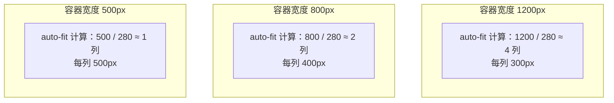
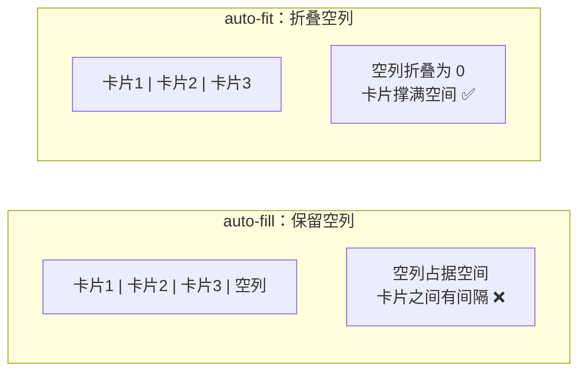
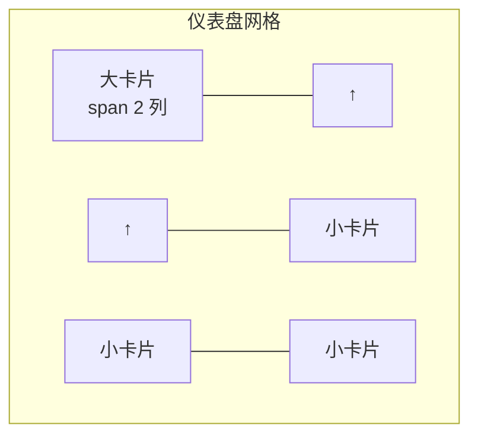
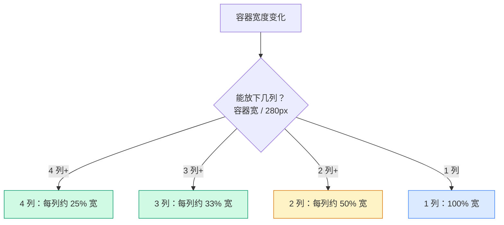
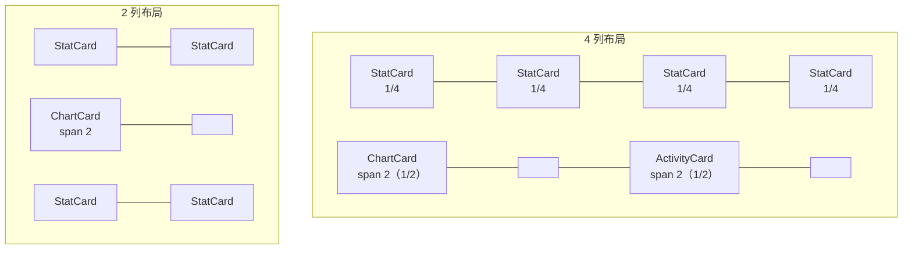
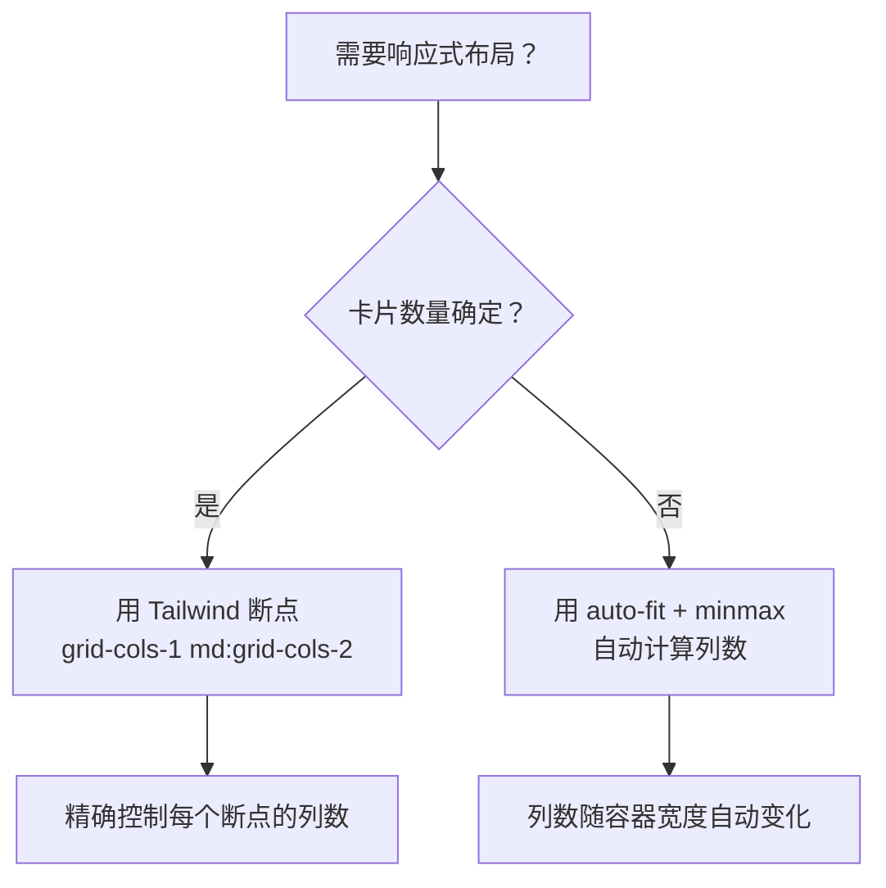

# 仪表盘网格布局

> **这一步解决什么问题？**
>
> 仪表盘是管理后台的"门面"——多尺寸卡片自动排列，窗口缩小时自动折行，窗口放大时自动增加列数。本文从租户运营中心的仪表盘出发，讲透 `repeat(auto-fit, minmax())` 逐词拆解、`grid-column: span 2` 跨列、响应式断点三大知识点。
>
> 对于 ASP.NET Core 开发者：这就像 WPF 的 `WrapPanel`——子元素自动换行排列。但 CSS Grid 更强大：可以控制最小/最大列宽，还可以让大卡片跨两列。

---

## 前置知识

### repeat(auto-fit, minmax()) 逐词拆解

```css
grid-template-columns: repeat(auto-fit, minmax(280px, 1fr));
/*                      ↑       ↑         ↑       ↑
                      │       │         │       └── 最大宽度：等分剩余空间
                      │       │         └─────────── 最小宽度：280px
                      │       └───────────────────── 自动填充可用空间
                      └───────────────────────────── 重复模式
*/
```



### auto-fit vs auto-fill



> **大多数情况用 `auto-fit`**。`auto-fill` 在卡片数量少于可容纳列数时，会保留空列导致卡片之间出现大片空白。`auto-fit` 会把空列折叠为 0，让现有卡片撑满空间。

### grid-column: span 2



```tsx
<div className="col-span-2">大卡片</div>  // grid-column: span 2
<div>小卡片</div>                         // grid-column: span 1（默认）
```

> **注意**：跨列卡片在列数减少时可能出问题。如果容器只能容纳 2 列，一个 `span 2` 的大卡片会占据整行，旁边放不下任何卡片。

---

## 原理图解

### auto-fit 的自适应列数



### 大卡片跨列的布局效果



---

## 对照实验

### 实验 1：auto-fit vs auto-fill

```tsx
// auto-fill：3 个卡片 + 空列
<div className="grid grid-cols-[repeat(auto-fill,minmax(280px,1fr))] gap-4">
  <Card /> <Card /> <Card />
</div>
// 容器 1200px 时：3 个卡片各 280px，剩余空间是空列

// auto-fit：3 个卡片撑满
<div className="grid grid-cols-[repeat(auto-fit,minmax(280px,1fr))] gap-4">
  <Card /> <Card /> <Card />
</div>
// 容器 1200px 时：3 个卡片各 400px，撑满空间
```

### 实验 2：minmax 值太大/太小

```tsx
// ❌ 280px 太大——小屏幕只能放 1 列，卡片太宽
grid-template-columns: repeat(auto-fit, minmax(280px, 1fr));
// 320px 手机：1 列 320px

// ❌ 150px 太小——大屏幕太多列，卡片太窄
grid-template-columns: repeat(auto-fit, minmax(150px, 1fr));
// 1200px 桌面：8 列 150px，内容挤

// ✅ 280px 合适——桌面 3-4 列，平板 2 列，手机 1 列
grid-template-columns: repeat(auto-fit, minmax(280px, 1fr));
// 1200px：4 列 300px
// 800px：2 列 400px
// 320px：1 列 320px
```

### 实验 3：flex wrap vs grid auto-fit

```tsx
// ❌ flex wrap——卡片宽度不统一，最后一行可能只有一个
<div className="flex flex-wrap gap-4">
  <div className="w-[280px]">Card</div>
  <div className="w-[280px]">Card</div>
  <div className="w-[280px]">Card</div>
</div>
// 容器 900px：3 个卡片 280px = 840px，最后一个在一行
// 问题：3 个卡片一行，但第 4 个卡片时最后一个被挤到下一行

// ✅ grid auto-fit——列数自动调整，卡片宽度统一
<div className="grid grid-cols-[repeat(auto-fit,minmax(280px,1fr))] gap-4">
  <div>Card</div>
  <div>Card</div>
  <div>Card</div>
</div>
// 容器 900px：3 列 300px，每列等宽
// 容器 700px：2 列 350px，自动折行
```

| 方式 | 列数 | 卡片宽度 | 最后一行 |
|------|------|---------|---------|
| flex wrap | 固定宽度 | 不统一 | 可能不满 |
| grid auto-fit | 自动计算 | 统一 | 始终撑满 |

---

## 代码实现

### 仪表盘网格骨架

```tsx
// src/pages/dashboard-page.tsx

/** 统计卡片 */
function StatCard({
  title,
  value,
  color,
}: {
  title: string
  value: string
  color: string
}) {
  return (
    <div className="rounded-lg border bg-card p-6">
      <p className="text-sm text-muted-foreground">{title}</p>
      <p className={`mt-2 text-3xl font-bold ${color}`}>{value}</p>
    </div>
  )
}

/** 图表卡片（跨 2 列） */
function ChartCard({ title }: { title: string }) {
  return (
    <div className="col-span-2 rounded-lg border bg-card p-6">
      <p className="text-sm font-medium">{title}</p>
      <div className="mt-4 h-48 rounded bg-muted/50 flex items-center justify-center text-sm text-muted-foreground">
        图表区域
      </div>
    </div>
  )
}

/** 仪表盘页面 */
export function DashboardPage() {
  return (
    <div className="p-6 space-y-6">
      <div>
        <h1 className="text-2xl font-bold">平台概览</h1>
        <p className="mt-1 text-sm text-muted-foreground">SaaS 平台运营数据概览</p>
      </div>

      {/* 统计卡片网格——auto-fit 自适应列数 */}
      <div className="grid grid-cols-[repeat(auto-fit,minmax(280px,1fr))] gap-4">
        <StatCard title="总租户数" value="128" color="text-blue-600" />
        <StatCard title="活跃租户" value="96" color="text-green-600" />
        <StatCard title="总用户数" value="2,456" color="text-purple-600" />
        <StatCard title="今日登录" value="342" color="text-orange-600" />
      </div>

      {/* 图表区——大卡片跨 2 列 */}
      <div className="grid grid-cols-[repeat(auto-fit,minmax(280px,1fr))] gap-4">
        <ChartCard title="租户增长趋势" />
        <ChartCard title="API 调用量" />
      </div>

      {/* 响应式布局——小屏 1 列，中屏 2 列，大屏 3 列 */}
      <div className="grid gap-4 grid-cols-1 md:grid-cols-2 lg:grid-cols-3">
        <div className="rounded-lg border bg-card p-6">
          <p className="text-sm font-medium">最近活动</p>
          <div className="mt-4 space-y-3">
            {["租户A 创建了新项目", "租户B 升级了套餐", "租户C 添加了用户"].map(
              (text, i) => (
                <div key={i} className="flex items-center gap-2 text-sm">
                  <div className="h-2 w-2 rounded-full bg-primary" />
                  <span className="text-muted-foreground">{text}</span>
                </div>
              )
            )}
          </div>
        </div>
        <div className="rounded-lg border bg-card p-6">
          <p className="text-sm font-medium">系统状态</p>
          <div className="mt-4 space-y-2 text-sm">
            <div className="flex justify-between">
              <span className="text-muted-foreground">CPU 使用率</span>
              <span>23%</span>
            </div>
            <div className="flex justify-between">
              <span className="text-muted-foreground">内存使用率</span>
              <span>45%</span>
            </div>
            <div className="flex justify-between">
              <span className="text-muted-foreground">磁盘使用率</span>
              <span>67%</span>
            </div>
          </div>
        </div>
        <div className="rounded-lg border bg-card p-6">
          <p className="text-sm font-medium">待处理事项</p>
          <div className="mt-4 text-3xl font-bold text-destructive">3</div>
          <p className="text-sm text-muted-foreground">需要立即处理</p>
        </div>
      </div>
    </div>
  )
}
```

---

## 代码讲解

### 两种响应式策略

本文展示了两种响应式策略：

| 策略 | CSS | 适用场景 | 优势 |
|------|-----|---------|------|
| `auto-fit + minmax` | `grid-cols-[repeat(auto-fit,minmax(280px,1fr))]` | 卡片数量不确定 | 列数自动计算 |
| Tailwind 断点 | `grid-cols-1 md:grid-cols-2 lg:grid-cols-3` | 卡片数量确定 | 精确控制 |



### ChartCard 的 col-span-2

```tsx
function ChartCard({ title }: { title: string }) {
  return (
    <div className="col-span-2 rounded-lg border bg-card p-6">
```

`col-span-2` 让图表卡片占据两列。当列数减少到 2 列时，图表卡片刚好占满整行。当列数只有 1 列时，`col-span-2` 会被忽略（因为不存在第二列可以跨越），图表卡片自动变成全宽。

> **【易错点】** `col-span-2` 在只有 1 列时不会出问题——浏览器会自动降级为 `span 1`。但如果你用了 `col-span-3`，在 2 列布局中会导致布局错乱——因为无法跨越不存在的第 3 列。

### 移动优先的断点策略

```tsx
<div className="grid gap-4 grid-cols-1 md:grid-cols-2 lg:grid-cols-3">
```

- `grid-cols-1`：默认 1 列（手机）
- `md:grid-cols-2`：768px 以上 2 列（平板）
- `lg:grid-cols-3`：1024px 以上 3 列（桌面）

> **移动优先**：不加前缀的 class 对所有尺寸生效，加了前缀的只在对应断点以上生效。`grid-cols-1` 不需要 `sm:` 前缀——它就是默认值。

---

## 踩坑提醒

1. **`auto-fit + minmax` 不能和 `col-span-2` 混用**。`auto-fit` 的列数是动态计算的，`col-span-2` 可能跨越到不存在的列。如果需要跨列，用 Tailwind 断点精确控制列数。

2. **`minmax` 的最小值不要设太小**。150px 的卡片在桌面端会产生太多列，内容挤在一起看不清。280px 是比较合理的下限。

3. **`gap` 会计入总宽度**。4 列 280px + 3 个 gap 16px = 1168px，容器至少需要这么宽。如果容器不够，auto-fit 会自动减少列数。

4. **`col-span-2` 在 1 列布局中自动降级**。不需要写 `grid-cols-1 md:col-span-2`——浏览器会处理。

> **🤔 导师提问**：仪表盘的统计卡片用 `auto-fit + minmax` 而不是 Tailwind 断点，但系统状态区域用了断点。为什么不在整个仪表盘中统一用一种策略？提示：统计卡片 4 个，在不同宽度下列数变化多（1→2→3→4）；系统状态 3 个，列数变化少（1→2→3）。数量少且确定时，断点更精确；数量多或不确定时，auto-fit 更灵活。

---

## 🤔 自测题

### 概念级（理解定义）

1. `repeat(auto-fit, minmax(280px, 1fr))` 中，`auto-fit`、`minmax`、`280px`、`1fr` 各自的作用是什么？

2. `auto-fit` 和 `auto-fill` 的区别是什么？

### 推理级（分析原因）

3. 为什么 `auto-fit + minmax` 不适合和 `col-span-2` 混用？

4. `minmax(280px, 1fr)` 中 280px 太大或太小分别会导致什么问题？

### 动手级（实践验证）

5. 把 `auto-fit` 改成 `auto-fill`，观察卡片之间是否有空白。然后改回 `auto-fit`。

6. 把 `minmax(280px, 1fr)` 改成 `minmax(150px, 1fr)`，在大屏幕上观察列数变化。然后改成 `minmax(400px, 1fr)`，观察列数减少的效果。

---

## 验证步骤

1. 创建 `src/pages/dashboard-page.tsx`，复制上面的代码
2. 在路由中注册该页面
3. 执行 `pnpm dev`，打开仪表盘
4. 确认统计卡片网格在不同窗口宽度下自动调整列数
5. 确认图表卡片跨两列显示
6. 缩小窗口到手机宽度，确认所有卡片自动变为 1 列
7. 确认系统状态区域在 md 断点以上变为 2 列，lg 断点以上变为 3 列

---

## ✅ 输出检查清单

完成本节后，确认以下各项：

- [ ] 能逐词解释 `repeat(auto-fit, minmax(280px, 1fr))` 的含义
- [ ] 知道 `auto-fit` 和 `auto-fill` 的区别及各自的适用场景
- [ ] 理解 `col-span-2` 跨列的原理及在列数不足时的降级行为
- [ ] 掌握两种响应式策略的选择：`auto-fit + minmax` vs Tailwind 断点
- [ ] 理解移动优先原则：不加前缀的 class 对所有尺寸生效

---

[← 上一篇：文件管理器布局](./06-文件管理器布局.md)
