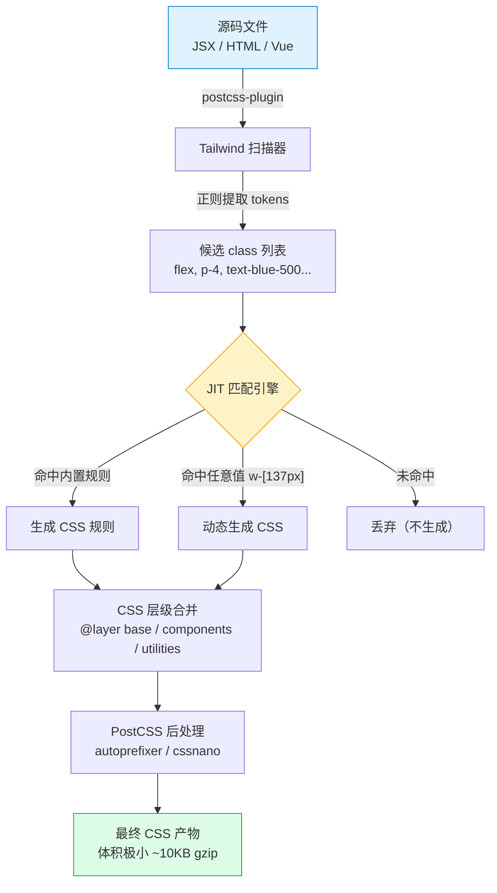
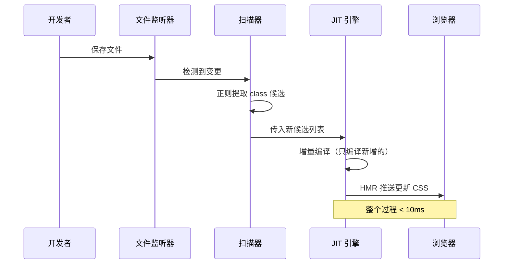
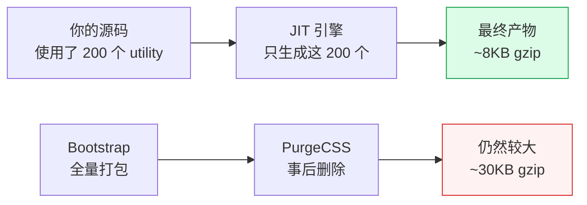

# TailwindCSS 原理篇：Utility-First / JIT / PostCSS 链路

> **TL;DR**
> TailwindCSS 是一个 **Utility-First** 的 CSS 框架，它通过 PostCSS 插件在构建时扫描你的模板文件，按需生成最小化的 CSS 产物。JIT 引擎让你可以使用任意值（如 `w-[137px]`），同时保持极小的产物体积。

---

## 💡 1. 核心顿悟：把原理拉下神坛

### 生动比喻：乐高积木 vs 手工雕塑

想象你要装修房子：

| 方式 | CSS 类比 | 特点 |
|------|----------|------|
| 🏗️ 买现成的乐高积木拼装 | **Utility-First (Tailwind)** | 积木已预制好，直接拼装，灵活快速 |
| 🎨 请雕塑家手工雕刻每件家具 | **传统 CSS (BEM/SMACSS)** | 每件都量身定制，费时但完全自定义 |
| 🤖 用 3D 打印机按需打印 | **CSS-in-JS (Emotion/styled)** | 运行时动态生成，灵活但有运行时开销 |

**Tailwind 本质**：它不是在"写样式"，而是在"组合原子"。每个 class 就是一块积木——`flex`、`p-4`、`text-blue-500`——你通过在 HTML 中组合这些积木来构建界面。

### 底层剖析：PostCSS 编译链路

TailwindCSS 本质是一个 **PostCSS 插件**。它的工作原理可以拆成三个核心阶段：

```
源代码模板 → [扫描器] → [匹配引擎] → [CSS 生成器] → 最终 CSS 文件
```

**第一阶段：内容扫描（Content Scanning）**

Tailwind 不会解析你的 HTML/JSX AST。它使用一个极快的**正则扫描器**，对你的源码文件做纯文本搜索，提取所有可能是 class 名的字符串 token：

```javascript
// Tailwind 内部简化逻辑
const CANDIDATE_REGEX = /[^<>"'`\s]*[^<>"'`\s:]/g;

function extractCandidates(content) {
  return [...content.matchAll(CANDIDATE_REGEX)].map(m => m[0]);
}

// 扫描 "className='flex p-4 text-blue-500'" 
// 得到 → ["flex", "p-4", "text-blue-500"]
```

**第二阶段：候选匹配（Candidate Resolution）**

扫描出来的字符串会与 Tailwind 内置的 **utility 注册表** 对比，匹配成功的才会生成 CSS：

```javascript
// 内置注册表（简化示意）
const utilities = {
  flex:    () => ({ display: 'flex' }),
  'p-4':   () => ({ padding: '1rem' }),
  'text-blue-500': () => ({ color: 'rgb(59 130 246)' }),
  // ... 数千个预定义映射
};
```

**第三阶段：CSS 生成与注入**

匹配成功的 utility 被编译成标准 CSS 规则，按层级（base / components / utilities）注入到最终样式表中。

## 📊 2. 架构图解：PostCSS 编译全链路



## 🏢 3. 三大范式深度对比

### 传统 CSS（BEM 方法论）

```css
/* styles.css — 你需要为每个组件手写样式 */
.card { display: flex; flex-direction: column; padding: 1.5rem; }
.card__title { font-size: 1.25rem; font-weight: 700; color: #1a1a2e; }
.card__body { margin-top: 0.75rem; color: #4a5568; }
.card--highlighted { border: 2px solid #3b82f6; }
```

```html
<div class="card card--highlighted">
  <h2 class="card__title">标题</h2>
  <p class="card__body">内容</p>
</div>
```

**痛点**：
- 命名是最难的事——`card__title--active-highlighted` 这种恐怖命名
- CSS 文件线性增长，10 个页面 = 10 套样式
- 改一个组件的样式需要在 CSS 和 HTML 之间反复跳转

### CSS-in-JS（Emotion / styled-components）

```tsx
import styled from '@emotion/styled';

const Card = styled.div<{ highlighted?: boolean }>`
  display: flex;
  flex-direction: column;
  padding: 1.5rem;
  ${({ highlighted }) => highlighted && `border: 2px solid #3b82f6;`}
`;

const Title = styled.h2`
  font-size: 1.25rem;
  font-weight: 700;
  color: #1a1a2e;
`;
```

**痛点**：
- 运行时开销：每次渲染都要序列化样式 → 生成 hash → 注入 `<style>` 标签
- Bundle 体积增加（emotion 核心 ~11KB gzip）
- SSR 需要额外配置样式提取

### Utility-First（TailwindCSS）

```html
<div class="flex flex-col p-6 border-2 border-blue-500">
  <h2 class="text-xl font-bold text-gray-900">标题</h2>
  <p class="mt-3 text-gray-600">内容</p>
</div>
```

**优势**：
- 零运行时开销——所有 CSS 在构建时生成
- CSS 体积几乎不随页面数量增长（utility 天然去重）
- 不用命名，不用在文件间跳转

## 💡 4. JIT 引擎深度剖析

### 从 AOT 到 JIT 的革命

**AOT（Ahead-Of-Time）时代**——Tailwind v2 之前：

```
全量 CSS（~15MB）→ PurgeCSS 删除未使用 → 最终产物（~10KB）
```

问题：开发时加载 15MB CSS，IDE 卡顿，浏览器 DevTools 崩溃。

**JIT（Just-In-Time）时代**——Tailwind v3+：

```
扫描源码 → 只生成你用到的 → 直接输出最终产物
```



### 为什么 JIT 如此快？

```typescript
// JIT 核心：增量编译 + 缓存
class JITEngine {
  // 已生成的 utility 缓存（Set 查找 O(1)）
  private generatedUtilities = new Set<string>();
  
  processCandidate(candidate: string): string | null {
    // 已生成过，直接跳过
    if (this.generatedUtilities.has(candidate)) return null;
    
    // 尝试匹配 utility 规则
    const rule = this.resolveUtility(candidate);
    if (!rule) return null;
    
    // 标记已生成
    this.generatedUtilities.add(candidate);
    
    // 返回新增的 CSS（增量追加，不重建整个文件）
    return rule.toCSS();
  }
}
```

关键优化：
1. **增量编译**：只编译新增的 class，不重建整个 CSS 文件
2. **Set 缓存**：O(1) 查找已生成的 utility
3. **无 AST 解析**：用正则扫描而非 Babel/PostHTML 解析，速度快 10-100 倍

### 任意值（Arbitrary Values）的秘密

JIT 引擎让任意值成为可能：

```html
<!-- 任意像素值 -->
<div class="w-[137px] h-[calc(100vh-64px)]">

<!-- 任意颜色 -->
<div class="bg-[#1a1a2e] text-[hsl(210,50%,60%)]">

<!-- 任意 CSS 属性 -->
<div class="[mask-type:luminance]">
```

JIT 引擎如何处理 `w-[137px]`：

```javascript
// 内部匹配逻辑（简化）
function resolveArbitrary(candidate) {
  // 正则匹配 "w-[137px]"
  const match = candidate.match(/^w-\[(.+)\]$/);
  if (match) {
    const value = match[1]; // "137px"
    return { width: value }; // → .w-\[137px\] { width: 137px }
  }
}
```

## 💣 5. Tree-Shaking 机制与产物分析

### 为什么 Tailwind 产物极小？

传统框架（Bootstrap）的问题：

```
Bootstrap 全量：~230KB min → 你可能只用了 10%
```

Tailwind 的秘密：**它从来不生成你没用到的 CSS**



### 产物体积实测对比

| 框架 | 10页面应用 | 100页面应用 | 增长率 |
|------|-----------|------------|--------|
| **TailwindCSS** | ~8KB | ~12KB | +50% |
| Bootstrap | ~45KB | ~45KB | 0%（全量打包） |
| 手写 CSS | ~15KB | ~150KB | +900% |
| Emotion | ~20KB + 11KB runtime | ~80KB + 11KB runtime | +300% |

Tailwind 产物增长极慢的原因：**utility 天然去重**。100 个页面都用 `flex`，CSS 里也只有一条 `.flex { display: flex }`。

## 💻 6. 实战：构建时流程验证

### 配置 PostCSS 链路

```javascript
// postcss.config.js
module.exports = {
  plugins: {
    // Step 1: Tailwind 作为 PostCSS 插件运行
    tailwindcss: {},
    // Step 2: 自动添加浏览器前缀
    autoprefixer: {},
  },
};
```

```javascript
// tailwind.config.js
/** @type {import('tailwindcss').Config} */
module.exports = {
  // 告诉扫描器去哪些文件里找 class 候选
  content: [
    './src/**/*.{js,ts,jsx,tsx}',
    './index.html',
  ],
  theme: {
    extend: {},
  },
  plugins: [],
};
```

### 验证 JIT 增量编译

```bash
# 开发模式启动
npx tailwindcss -i ./src/input.css -o ./dist/output.css --watch

# 观察终端输出：
# Rebuilding... Done in 8ms.  ← 首次构建
# Rebuilding... Done in 3ms.  ← 增量编译（只新增了几个 utility）
```

### 产物分析脚本

```bash
# 查看最终 CSS 行数和体积
wc -l dist/output.css           # 行数
ls -lh dist/output.css          # 原始大小
gzip -c dist/output.css | wc -c # gzip 后字节数
```

## 💣 7. 避坑指南与反模式

### 坑1: 动态拼接类名导致 Tree-Shaking 失效

```tsx
// ❌ Bad Case — Tailwind 扫描器找不到完整的 class 名
const color = 'blue';
<div className={`text-${color}-500`} />
// 扫描器看到的是 `text-${color}-500`，不是 `text-blue-500`
// 结果：这个样式不会被生成！

// ✅ Good Case — 使用完整的 class 名映射
const colorMap = {
  blue: 'text-blue-500',
  red: 'text-red-500',
  green: 'text-green-500',
} as const;

<div className={colorMap[color]} />
// 扫描器能找到完整的 "text-blue-500" / "text-red-500" / "text-green-500"
```

### 坑2: content 路径配置遗漏

```javascript
// ❌ Bad — 忘记包含组件库路径
module.exports = {
  content: ['./src/**/*.tsx'],  // 第三方 UI 库的 class 不会被扫描！
};

// ✅ Good — 包含 node_modules 中使用 Tailwind 的库
module.exports = {
  content: [
    './src/**/*.tsx',
    './node_modules/@your-ui-lib/**/*.js', // 第三方库
  ],
};
```

### 坑3: @apply 滥用导致回到传统 CSS 模式

```css
/* ❌ Bad — 把 Tailwind 变成了传统 CSS */
.card {
  @apply flex flex-col p-6 rounded-lg shadow-md bg-white hover:shadow-lg transition-shadow;
}
.card-title {
  @apply text-xl font-bold text-gray-900 mb-2;
}
.card-body {
  @apply text-gray-600 leading-relaxed;
}
/* 你又回到了命名地狱…… */

/* ✅ Good — @apply 只用于真正需要复用的基础样式 */
/* 比如在 @layer base 中重置样式 */
@layer base {
  h1 { @apply text-3xl font-bold; }
  h2 { @apply text-2xl font-semibold; }
}
/* 组件样式直接在 JSX 中使用 utility class */
```

## 🧠 8. 向 AI 提问的 Prompt 模板

### Prompt 1：理解底层原理

```
我正在学习 TailwindCSS 的底层原理。请用"乐高积木工厂"的比喻，
分步骤解释以下流程：
1. PostCSS 插件是如何被 Vite/Webpack 调用的
2. Tailwind 扫描器的正则匹配策略（为什么不用 AST 解析）
3. JIT 引擎的增量编译机制（与 AOT 模式的区别）
4. 最终 CSS 产物是如何做到极小体积的

请用 Mermaid 流程图展示完整链路，并标注每一步的耗时数量级。
```

### Prompt 2：对比分析

```
请对比 TailwindCSS (Utility-First) / BEM (传统CSS) / Emotion (CSS-in-JS) 
三种方案在以下维度的表现，输出为 Markdown 表格：
- 运行时开销
- 构建时开销
- 产物体积（10页面 vs 100页面应用）
- DX（开发体验）
- 学习曲线
- SSR 兼容性
- 设计系统适配度

针对中后台 Admin 系统场景，给出你的推荐和理由。
```

### Prompt 3：调试技巧

```
我在 Tailwind 项目中遇到了样式不生效的问题。
请列出最常见的 5 个原因，并给出每个原因的排查步骤和解决方案。
包含：content 配置、动态类名、CSS 层级冲突、PostCSS 配置、缓存问题。
```

## 📝 9. 实战练习

### 练习 1：手动模拟 JIT 引擎

给你以下模板代码：

```html
<div class="flex items-center p-4 bg-blue-500 text-white rounded-lg shadow-md hover:bg-blue-600">
  <span class="text-lg font-semibold">Hello Tailwind</span>
</div>
```

请手写出 JIT 引擎应该生成的完整 CSS 代码（不借助工具）。

### 练习 2：产物体积优化

给你一个 Tailwind 项目，产物 CSS 有 50KB gzip。请列出你的排查思路和优化方案。

### 练习 3：比较实验

用传统 CSS、Emotion、Tailwind 三种方式实现同一个卡片组件，对比：
- 代码行数
- 构建产物体积
- 浏览器首次渲染时间

## 🎯 10. 面试高频题

### Q1: TailwindCSS 是运行时框架还是编译时框架？

**答**：编译时（Build-time）框架。Tailwind 在构建阶段通过 PostCSS 插件扫描源码，按需生成静态 CSS 文件。最终产物是纯 CSS，浏览器端零运行时开销。这与 CSS-in-JS 方案（如 Emotion）在运行时动态生成样式形成鲜明对比。

### Q2: 为什么 Tailwind 不用 AST 解析而用正则扫描？

**答**：
1. **通用性**：AST 解析需要为 HTML/JSX/Vue/Svelte 等每种模板语言编写不同的解析器。正则扫描对所有纯文本文件通用。
2. **性能**：正则扫描速度比 AST 解析快 10-100 倍。
3. **足够准确**：Tailwind class 名的格式是高度结构化的（字母-数字-方括号），正则完全够用。
4. **副作用可控**：最坏情况是多生成了几个 CSS 规则（false positive），不会丢失样式（false negative）。

### Q3: 如何在团队中推广 Tailwind？常见阻力和应对策略？

**答**：
- **阻力1 "HTML 太丑了"**：回应——用 `cn()` + 组件抽象，实际 JSX 中的 class 列表和 styled-components 的模板字符串可读性相当。
- **阻力2 "学习成本高"**：回应——核心 utility 约 50 个，配合 IDE 插件（Tailwind CSS IntelliSense）有完整自动补全。
- **阻力3 "不好维护"**：回应——配合 prettier-plugin-tailwindcss 自动排序，+ ESLint 规则强制一致性。

---

*👉 下一步预告：[01-配置篇](./01-配置篇.md) — 深入 tailwind.config.js 配置系统，掌握 Design Token 体系和插件开发*
