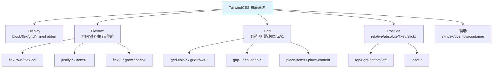

# TailwindCSS 速查手册：布局系统 — Flex / Grid / Position / Display

> **TL;DR**
> 布局是 CSS 的骨架，Tailwind 将 Flexbox、Grid、定位和显示模式的所有属性压缩为直觉化的 utility class。掌握这一章，你就能用 class 组合搭建任何中后台布局。

---

## 📊 1. 布局系统全景图



---

## 🟦 2. Display 显示模式

| Class | CSS | 场景 |
|-------|-----|------|
| `block` | `display: block` | 块级元素 |
| `inline-block` | `display: inline-block` | 行内块 |
| `inline` | `display: inline` | 行内 |
| `flex` | `display: flex` | Flex 容器 |
| `inline-flex` | `display: inline-flex` | 行内 Flex |
| `grid` | `display: grid` | Grid 容器 |
| `inline-grid` | `display: inline-grid` | 行内 Grid |
| `table` | `display: table` | 表格布局 |
| `hidden` | `display: none` | 隐藏元素 |
| `contents` | `display: contents` | 仅保留子节点 |

```html
<!-- 响应式显示/隐藏 -->
<div class="hidden md:block">桌面端可见</div>
<div class="block md:hidden">移动端可见</div>
```

---

## 📐 3. Flexbox 完全指南

### 3.1 容器属性速查

| Class | CSS | 说明 |
|-------|-----|------|
| `flex` | `display: flex` | 开启 Flex |
| `flex-row` | `flex-direction: row` | 水平排列（默认） |
| `flex-row-reverse` | `flex-direction: row-reverse` | 水平反转 |
| `flex-col` | `flex-direction: column` | 垂直排列 |
| `flex-col-reverse` | `flex-direction: column-reverse` | 垂直反转 |
| `flex-wrap` | `flex-wrap: wrap` | 允许换行 |
| `flex-nowrap` | `flex-wrap: nowrap` | 不换行（默认） |
| `flex-wrap-reverse` | `flex-wrap: wrap-reverse` | 反向换行 |

### 3.2 对齐属性速查

**主轴对齐 justify-content：**

| Class | CSS | 可视化 |
|-------|-----|--------|
| `justify-start` | `justify-content: flex-start` | `[■ ■ ■        ]` |
| `justify-end` | `justify-content: flex-end` | `[        ■ ■ ■]` |
| `justify-center` | `justify-content: center` | `[    ■ ■ ■    ]` |
| `justify-between` | `justify-content: space-between` | `[■    ■    ■]` |
| `justify-around` | `justify-content: space-around` | `[  ■  ■  ■  ]` |
| `justify-evenly` | `justify-content: space-evenly` | `[ ■  ■  ■ ]` |

**交叉轴对齐 align-items：**

| Class | CSS | 说明 |
|-------|-----|------|
| `items-start` | `align-items: flex-start` | 顶部对齐 |
| `items-end` | `align-items: flex-end` | 底部对齐 |
| `items-center` | `align-items: center` | 垂直居中 |
| `items-baseline` | `align-items: baseline` | 基线对齐 |
| `items-stretch` | `align-items: stretch` | 拉伸填满（默认） |

### 3.3 子项属性速查

| Class | CSS | 说明 |
|-------|-----|------|
| `flex-1` | `flex: 1 1 0%` | 自动填满剩余空间 |
| `flex-auto` | `flex: 1 1 auto` | 基于内容自动伸缩 |
| `flex-initial` | `flex: 0 1 auto` | 可缩不可伸（默认） |
| `flex-none` | `flex: none` | 不伸不缩 |
| `grow` | `flex-grow: 1` | 可伸展 |
| `grow-0` | `flex-grow: 0` | 不伸展 |
| `shrink` | `flex-shrink: 1` | 可收缩 |
| `shrink-0` | `flex-shrink: 0` | 不收缩 |
| `order-1` ~ `order-12` | `order: N` | 排列顺序 |
| `order-first` | `order: -9999` | 排在最前 |
| `order-last` | `order: 9999` | 排在最后 |
| `order-none` | `order: 0` | 默认顺序 |

### 3.4 Admin 常用 Flex 布局模式

```html
<!-- 模式1：水平垂直居中（最常用） -->
<div class="flex items-center justify-center h-screen">
  <div>完美居中</div>
</div>

<!-- 模式2：Header 左-中-右三栏 -->
<header class="flex items-center justify-between px-6 h-16 border-b">
  <div class="flex items-center gap-3">
    
    <span class="font-semibold text-lg">Admin</span>
  </div>
  <nav class="flex items-center gap-6">
    <a href="#" class="text-sm text-muted-foreground hover:text-foreground">仪表盘</a>
    <a href="#" class="text-sm text-muted-foreground hover:text-foreground">用户</a>
  </nav>
  <div class="flex items-center gap-3">
    <button class="p-2 rounded-lg hover:bg-muted">🔔</button>
    <div class="h-8 w-8 rounded-full bg-primary" />
  </div>
</header>

<!-- 模式3：侧边栏 + 内容区 -->
<div class="flex h-screen">
  <aside class="w-64 shrink-0 border-r bg-muted/50">侧边栏</aside>
  <main class="flex-1 overflow-y-auto p-6">内容区</main>
</div>

<!-- 模式4：底部固定（Sticky Footer） -->
<div class="flex flex-col min-h-screen">
  <header class="h-16 shrink-0">Header</header>
  <main class="flex-1">Content</main>
  <footer class="h-12 shrink-0">Footer</footer>
</div>
```

---

## 🔲 4. Grid 完全指南

### 4.1 容器属性速查

| Class | CSS | 说明 |
|-------|-----|------|
| `grid` | `display: grid` | 开启 Grid |
| `grid-cols-1` ~ `grid-cols-12` | `grid-template-columns: repeat(N, 1fr)` | N 等列 |
| `grid-cols-none` | `grid-template-columns: none` | 无列定义 |
| `grid-cols-subgrid` | `grid-template-columns: subgrid` | 子网格 |
| `grid-rows-1` ~ `grid-rows-12` | `grid-template-rows: repeat(N, 1fr)` | N 等行 |
| `auto-cols-auto` | `grid-auto-columns: auto` | 自动列宽 |
| `auto-cols-min` | `grid-auto-columns: min-content` | 最小内容列宽 |
| `auto-cols-max` | `grid-auto-columns: max-content` | 最大内容列宽 |
| `auto-cols-fr` | `grid-auto-columns: minmax(0, 1fr)` | 弹性列宽 |
| `grid-flow-row` | `grid-auto-flow: row` | 行优先填充 |
| `grid-flow-col` | `grid-auto-flow: column` | 列优先填充 |
| `grid-flow-dense` | `grid-auto-flow: dense` | 紧凑填充 |

### 4.2 间距（Gap）

| Class | CSS | 说明 |
|-------|-----|------|
| `gap-0` ~ `gap-96` | `gap: N` | 行列间距 |
| `gap-x-*` | `column-gap: N` | 列间距 |
| `gap-y-*` | `row-gap: N` | 行间距 |
| `gap-px` | `gap: 1px` | 1px 间距 |

### 4.3 子项属性速查

| Class | CSS | 说明 |
|-------|-----|------|
| `col-span-1` ~ `col-span-12` | `grid-column: span N / span N` | 跨 N 列 |
| `col-span-full` | `grid-column: 1 / -1` | 跨满所有列 |
| `col-start-1` ~ `col-start-13` | `grid-column-start: N` | 起始列 |
| `col-end-1` ~ `col-end-13` | `grid-column-end: N` | 结束列 |
| `row-span-*` | `grid-row: span N / span N` | 跨 N 行 |
| `row-span-full` | `grid-row: 1 / -1` | 跨满所有行 |

### 4.4 Grid 对齐

| Class | CSS | 说明 |
|-------|-----|------|
| `place-content-center` | `place-content: center` | 内容居中 |
| `place-items-center` | `place-items: center` | 项目居中 |
| `place-self-center` | `place-self: center` | 单个项目居中 |

### 4.5 Admin 常用 Grid 布局模式

```html
<!-- 模式1：Dashboard 统计卡片 -->
<div class="grid grid-cols-1 sm:grid-cols-2 lg:grid-cols-4 gap-4 p-6">
  <div class="rounded-lg border p-4">
    <p class="text-sm text-muted-foreground">总收入</p>
    <p class="text-2xl font-bold">¥45,231.89</p>
    <p class="text-xs text-green-600">+20.1% vs 上月</p>
  </div>
  <div class="rounded-lg border p-4">
    <p class="text-sm text-muted-foreground">新增用户</p>
    <p class="text-2xl font-bold">+2,350</p>
  </div>
  <div class="rounded-lg border p-4">
    <p class="text-sm text-muted-foreground">销售额</p>
    <p class="text-2xl font-bold">+12,234</p>
  </div>
  <div class="rounded-lg border p-4">
    <p class="text-sm text-muted-foreground">活跃用户</p>
    <p class="text-2xl font-bold">+573</p>
  </div>
</div>

<!-- 模式2：表单两列布局 -->
<form class="grid grid-cols-1 md:grid-cols-2 gap-x-6 gap-y-4">
  <div class="space-y-2">
    <label class="text-sm font-medium">姓名</label>
    <input class="w-full rounded-md border px-3 py-2" />
  </div>
  <div class="space-y-2">
    <label class="text-sm font-medium">邮箱</label>
    <input class="w-full rounded-md border px-3 py-2" />
  </div>
  <div class="col-span-full space-y-2">
    <label class="text-sm font-medium">地址</label>
    <input class="w-full rounded-md border px-3 py-2" />
  </div>
</form>

<!-- 模式3：Dashboard 不等宽布局 -->
<div class="grid grid-cols-3 gap-4">
  <div class="col-span-2 rounded-lg border p-4">图表区域（占2列）</div>
  <div class="col-span-1 rounded-lg border p-4">侧边信息（占1列）</div>
  <div class="col-span-full rounded-lg border p-4">底部全宽区域</div>
</div>
```

---

## 📌 5. Position 定位系统

### 5.1 定位类型

| Class | CSS | 场景 |
|-------|-----|------|
| `static` | `position: static` | 默认（文档流） |
| `relative` | `position: relative` | 相对定位（偏移参考点） |
| `absolute` | `position: absolute` | 绝对定位（脱离文档流） |
| `fixed` | `position: fixed` | 固定定位（相对视口） |
| `sticky` | `position: sticky` | 粘性定位（滚动吸顶） |

### 5.2 偏移值

| Class | CSS | 说明 |
|-------|-----|------|
| `top-0` ~ `top-96` | `top: N` | 顶部偏移 |
| `right-0` ~ `right-96` | `right: N` | 右侧偏移 |
| `bottom-0` ~ `bottom-96` | `bottom: N` | 底部偏移 |
| `left-0` ~ `left-96` | `left: N` | 左侧偏移 |
| `inset-0` | `inset: 0` | 四边归零（全屏遮罩常用） |
| `inset-x-0` | `left: 0; right: 0` | 水平撑满 |
| `inset-y-0` | `top: 0; bottom: 0` | 垂直撑满 |
| `-top-4` | `top: -1rem` | 负偏移 |

### 5.3 Z-Index

| Class | CSS |
|-------|-----|
| `z-0` | `z-index: 0` |
| `z-10` | `z-index: 10` |
| `z-20` | `z-index: 20` |
| `z-30` | `z-index: 30` |
| `z-40` | `z-index: 40` |
| `z-50` | `z-index: 50` |
| `z-auto` | `z-index: auto` |

### 5.4 Admin 常用定位模式

```html
<!-- 模式1：固定顶栏 -->
<header class="fixed top-0 inset-x-0 z-50 h-16 border-b bg-background/80 backdrop-blur">
  导航栏内容
</header>
<main class="pt-16">主内容（避开固定顶栏高度）</main>

<!-- 模式2：Sticky 表头 -->
<div class="max-h-[500px] overflow-y-auto">
  <table class="w-full">
    <thead class="sticky top-0 bg-background z-10">
      <tr>
        <th class="px-4 py-3 text-left">名称</th>
        <th class="px-4 py-3 text-left">状态</th>
      </tr>
    </thead>
    <tbody><!-- 数据行 --></tbody>
  </table>
</div>

<!-- 模式3：通知徽标 -->
<div class="relative inline-block">
  <button class="p-2">🔔</button>
  <span class="absolute -top-1 -right-1 flex h-4 w-4 items-center justify-center rounded-full bg-red-500 text-[10px] text-white">
    3
  </span>
</div>

<!-- 模式4：全屏遮罩 -->
<div class="fixed inset-0 z-50 flex items-center justify-center bg-black/50">
  <div class="rounded-lg bg-white p-6 shadow-xl">
    模态框内容
  </div>
</div>
```

---

## 🧩 6. Overflow 溢出控制

| Class | CSS | 说明 |
|-------|-----|------|
| `overflow-auto` | `overflow: auto` | 需要时出现滚动条 |
| `overflow-hidden` | `overflow: hidden` | 隐藏溢出 |
| `overflow-visible` | `overflow: visible` | 允许溢出 |
| `overflow-scroll` | `overflow: scroll` | 始终显示滚动条 |
| `overflow-x-auto` | `overflow-x: auto` | 水平滚动 |
| `overflow-y-auto` | `overflow-y: auto` | 垂直滚动 |
| `truncate` | `overflow: hidden; text-overflow: ellipsis; white-space: nowrap` | 文本截断 |

---

## 💣 7. 避坑指南

### 坑1: flex-1 子项内容溢出

```html
<!-- ❌ Bad — 长文本撑破 flex-1 容器 -->
<div class="flex">
  <div class="w-48 shrink-0">侧栏</div>
  <div class="flex-1">
    <p>这是一段非常长的文本这是一段非常长的文本...</p>
  </div>
</div>

<!-- ✅ Good — 添加 min-w-0 防止溢出 -->
<div class="flex">
  <div class="w-48 shrink-0">侧栏</div>
  <div class="flex-1 min-w-0">
    <p class="truncate">这是一段非常长的文本...</p>
  </div>
</div>
```

### 坑2: Grid 子项超出预期

```html
<!-- ❌ Bad — 内容过长导致列宽超出 -->
<div class="grid grid-cols-3 gap-4">
  <div>短内容</div>
  <div>这里有一个超长的不可断行的URL-https://example.com/very/long/path</div>
  <div>短内容</div>
</div>

<!-- ✅ Good — 使用 min-w-0 或 overflow-hidden -->
<div class="grid grid-cols-3 gap-4">
  <div>短内容</div>
  <div class="min-w-0 truncate">长内容自动截断</div>
  <div>短内容</div>
</div>
```

---

## 🧠 8. 向 AI 提问的 Prompt 模板

```
请用 TailwindCSS 实现以下中后台布局：
- 顶部固定导航栏（64px 高）
- 左侧可折叠侧边栏（展开 256px / 折叠 64px）
- 右侧内容区自适应，内部可滚动
- 底部 Sticky Footer

要求：
1. 纯 Tailwind utility class，不写自定义 CSS
2. 侧边栏使用 Flex + transition 实现折叠动画
3. 移动端侧边栏变为抽屉式（overlay）
4. 使用响应式断点 md: 区分移动端/桌面端

请输出完整的 HTML/JSX 代码。
```

---

*👉 下一步预告：[间距.md](./间距.md) — padding / margin / gap / space 间距系统完全速查*
