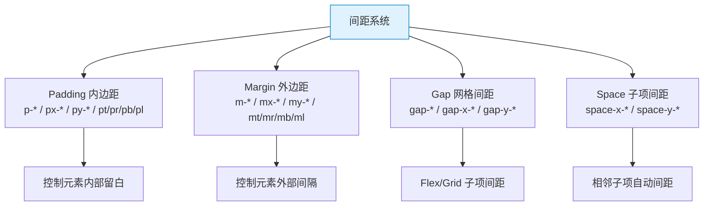

# TailwindCSS 速查手册：间距系统 — Padding / Margin / Gap / Space

> **TL;DR**
> Tailwind 的间距系统基于 **4px 基准网格**（1 单位 = 0.25rem = 4px），提供 `p-*`（内边距）、`m-*`（外边距）、`gap-*`（Grid/Flex 间距）、`space-*`（子元素间距）四大武器，覆盖所有间距场景。

---

## 📊 1. 间距系统全景图



---

## 📏 2. 间距值对照表

Tailwind 间距值遵循 **4px 基准网格**：

| Class 后缀 | rem | px | 场景参考 |
|------------|-----|-----|---------|
| `0` | 0 | 0px | 归零 |
| `px` | — | 1px | 边框补偿 |
| `0.5` | 0.125rem | 2px | 微间距 |
| `1` | 0.25rem | 4px | 紧凑间距 |
| `1.5` | 0.375rem | 6px | |
| `2` | 0.5rem | 8px | 小间距 |
| `2.5` | 0.625rem | 10px | |
| `3` | 0.75rem | 12px | 中小间距 |
| `3.5` | 0.875rem | 14px | |
| `4` | 1rem | 16px | **基础间距** |
| `5` | 1.25rem | 20px | |
| `6` | 1.5rem | 24px | **常用间距** |
| `7` | 1.75rem | 28px | |
| `8` | 2rem | 32px | 中间距 |
| `10` | 2.5rem | 40px | |
| `12` | 3rem | 48px | 大间距 |
| `14` | 3.5rem | 56px | |
| `16` | 4rem | 64px | **Section 间距** |
| `20` | 5rem | 80px | |
| `24` | 6rem | 96px | 超大间距 |
| `32` | 8rem | 128px | |
| `40` | 10rem | 160px | |
| `48` | 12rem | 192px | |
| `56` | 14rem | 224px | |
| `64` | 16rem | 256px | |
| `72` | 18rem | 288px | |
| `80` | 20rem | 320px | |
| `96` | 24rem | 384px | |

---

## 🟦 3. Padding 内边距

### 语法规则

| Class | CSS | 说明 |
|-------|-----|------|
| `p-4` | `padding: 1rem` | 四边 |
| `px-4` | `padding-left: 1rem; padding-right: 1rem` | 水平 |
| `py-4` | `padding-top: 1rem; padding-bottom: 1rem` | 垂直 |
| `pt-4` | `padding-top: 1rem` | 上 |
| `pr-4` | `padding-right: 1rem` | 右 |
| `pb-4` | `padding-bottom: 1rem` | 下 |
| `pl-4` | `padding-left: 1rem` | 左 |
| `ps-4` | `padding-inline-start: 1rem` | 逻辑起始方向 |
| `pe-4` | `padding-inline-end: 1rem` | 逻辑结束方向 |

### Admin 常用模式

```html
<!-- 卡片内边距 -->
<div class="rounded-lg border p-6">卡片内容</div>

<!-- 列表项 — 水平多、垂直少 -->
<li class="px-4 py-2 hover:bg-muted">列表项</li>

<!-- 按钮 — 水平多、垂直少 -->
<button class="px-4 py-2 rounded-md bg-primary text-primary-foreground">
  按钮
</button>

<!-- 页面容器 — 响应式内边距 -->
<main class="px-4 sm:px-6 lg:px-8 py-6">页面内容</main>
```

---

## 🟪 4. Margin 外边距

### 语法规则

| Class | CSS | 说明 |
|-------|-----|------|
| `m-4` | `margin: 1rem` | 四边 |
| `mx-4` | `margin-left: 1rem; margin-right: 1rem` | 水平 |
| `my-4` | `margin-top: 1rem; margin-bottom: 1rem` | 垂直 |
| `mt-4` | `margin-top: 1rem` | 上 |
| `mb-4` | `margin-bottom: 1rem` | 下 |
| `ml-4` | `margin-left: 1rem` | 左 |
| `mr-4` | `margin-right: 1rem` | 右 |
| `mx-auto` | `margin-left: auto; margin-right: auto` | 水平居中 |
| `-mt-4` | `margin-top: -1rem` | 负外边距 |
| `ms-4` | `margin-inline-start: 1rem` | 逻辑起始 |
| `me-4` | `margin-inline-end: 1rem` | 逻辑结束 |

### Admin 常用模式

```html
<!-- 内容区水平居中 -->
<div class="mx-auto max-w-7xl">居中容器</div>

<!-- 段落间距 -->
<h1 class="text-2xl font-bold">标题</h1>
<p class="mt-2 text-muted-foreground">描述文本</p>
<div class="mt-6">内容区域</div>

<!-- 负 margin 实现视觉突破 -->
<div class="p-6">
  
</div>

<!-- ml-auto 推到右侧 -->
<div class="flex items-center">
  <span>左侧文字</span>
  <button class="ml-auto">右侧按钮</button>
</div>
```

---

## 🟩 5. Gap 网格/弹性间距

Gap 是 Flex/Grid 容器中设置子项间距的标准方式（取代 margin）。

| Class | CSS | 说明 |
|-------|-----|------|
| `gap-4` | `gap: 1rem` | 行列间距 |
| `gap-x-4` | `column-gap: 1rem` | 列间距 |
| `gap-y-4` | `row-gap: 1rem` | 行间距 |

### 为什么优先用 gap 而非 margin？

```html
<!-- ❌ Bad — margin 导致首末元素多余间距 -->
<div class="flex">
  <div class="mr-4">A</div>
  <div class="mr-4">B</div>
  <div class="mr-4">C</div> <!-- 最后一个也有右 margin -->
</div>

<!-- ✅ Good — gap 只在元素之间生效 -->
<div class="flex gap-4">
  <div>A</div>
  <div>B</div>
  <div>C</div>
</div>
```

### Admin 常用模式

```html
<!-- 按钮组 -->
<div class="flex gap-3">
  <button class="px-4 py-2 bg-primary text-white rounded">保存</button>
  <button class="px-4 py-2 border rounded">取消</button>
</div>

<!-- 表单字段列表 -->
<div class="grid grid-cols-2 gap-x-6 gap-y-4">
  <div>字段1</div>
  <div>字段2</div>
  <div>字段3</div>
  <div>字段4</div>
</div>

<!-- 标签列表（换行时保持间距） -->
<div class="flex flex-wrap gap-2">
  <span class="rounded-full bg-blue-100 px-3 py-1 text-sm">标签A</span>
  <span class="rounded-full bg-green-100 px-3 py-1 text-sm">标签B</span>
  <span class="rounded-full bg-yellow-100 px-3 py-1 text-sm">标签C</span>
</div>
```

---

## 🟧 6. Space 子项间距

`space-*` 通过给相邻子元素添加 margin 实现间距（使用 `> * + *` 选择器）。

| Class | CSS 效果 | 说明 |
|-------|---------|------|
| `space-x-4` | 子项之间水平间距 1rem | `> * + * { margin-left: 1rem }` |
| `space-y-4` | 子项之间垂直间距 1rem | `> * + * { margin-top: 1rem }` |
| `space-x-reverse` | 反转水平间距方向 | 配合 `flex-row-reverse` |
| `space-y-reverse` | 反转垂直间距方向 | 配合 `flex-col-reverse` |
| `-space-x-4` | 子项之间负水平间距 | 头像叠加效果 |

### space vs gap 的选择

| 维度 | `gap` | `space` |
|------|-------|---------|
| 适用范围 | Flex/Grid 容器 | 任何父容器 |
| 实现方式 | 容器属性 | 子元素 margin |
| 副作用 | 无 | 影响子元素 margin |
| **推荐度** | ⭐⭐⭐⭐⭐ | ⭐⭐⭐ |

> **结论**：优先用 `gap`，只在非 Flex/Grid 场景（如纯 block 堆叠）用 `space-y`。

### Admin 常用模式

```html
<!-- 垂直堆叠表单字段 -->
<div class="space-y-4">
  <div>
    <label class="text-sm font-medium">用户名</label>
    <input class="mt-1 w-full rounded border px-3 py-2" />
  </div>
  <div>
    <label class="text-sm font-medium">密码</label>
    <input class="mt-1 w-full rounded border px-3 py-2" type="password" />
  </div>
</div>

<!-- 头像叠加效果（负间距） -->
<div class="flex -space-x-3">
  
  
  
  <span class="flex h-8 w-8 items-center justify-center rounded-full border-2 border-white bg-muted text-xs">
    +5
  </span>
</div>
```

---

## 💣 7. 避坑指南

### 坑1: space-* 与隐藏元素冲突

```html
<!-- ❌ Bad — hidden 元素仍占据 space 间距 -->
<div class="space-y-4">
  <div>可见</div>
  <div class="hidden">隐藏</div>  <!-- margin-top 仍然存在！ -->
  <div>可见</div>
</div>

<!-- ✅ Good — 用 gap 替代 -->
<div class="flex flex-col gap-4">
  <div>可见</div>
  <div class="hidden">隐藏</div>  <!-- gap 自动跳过隐藏元素 -->
  <div>可见</div>
</div>
```

### 坑2: 间距值不一致导致视觉混乱

```html
<!-- ❌ Bad — 随意使用间距值 -->
<div class="p-5">  <!-- 20px -->
  <h1 class="mb-3">标题</h1>  <!-- 12px -->
  <p class="mt-7">正文</p>  <!-- 28px -->
</div>

<!-- ✅ Good — 遵循 4-8-16 递进 -->
<div class="p-4">  <!-- 16px -->
  <h1 class="mb-2">标题</h1>  <!-- 8px -->
  <p class="mt-4">正文</p>  <!-- 16px -->
</div>
```

---

## 🧠 8. 向 AI 提问的 Prompt 模板

```
请为一个中后台 Admin 系统设计一套间距规范（使用 TailwindCSS），要求：
1. 基于 4px 基准网格
2. 定义以下场景的标准间距值：
   - 页面外层 padding
   - 卡片内 padding
   - 表单字段间距
   - 按钮组间距
   - 表格行内 padding
   - Section 之间的 margin
3. 输出为 Markdown 表格，包含：场景 / Class / px 值 / 说明
4. 额外说明何时用 gap vs margin vs padding
```

---

*👉 下一步预告：[尺寸.md](./尺寸.md) — width / height / min / max 尺寸系统完全速查*
