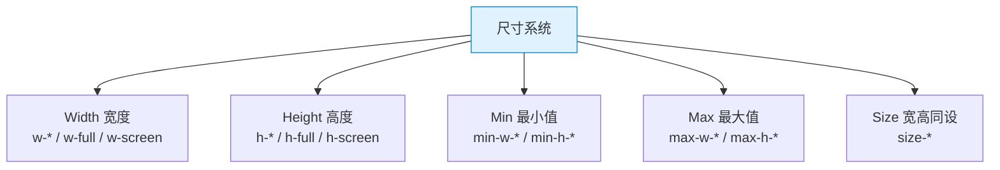
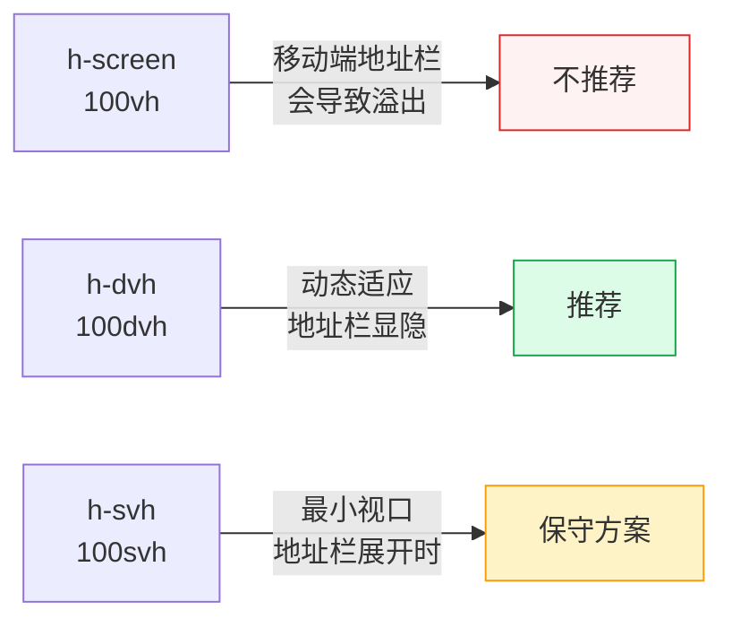

# TailwindCSS 速查手册：尺寸系统 — Width / Height / Min / Max

> **TL;DR**
> Tailwind 尺寸系统提供 `w-*`（宽度）、`h-*`（高度）、`min-*`（最小值）、`max-*`（最大值）和 `size-*`（同时设宽高）五组 utility，支持固定值、百分比、视口单位和任意值，足以精确控制任何元素的尺寸。

---

## 📊 1. 尺寸系统全景图



---

## 📐 2. Width 宽度

### 固定宽度

| Class | Value | px |
|-------|-------|-----|
| `w-0` | 0px | 0 |
| `w-px` | 1px | 1 |
| `w-0.5` ~ `w-96` | 0.125rem ~ 24rem | 2 ~ 384 |
| `w-[137px]` | 137px | 任意值 |

### 相对/比例宽度

| Class | CSS | 说明 |
|-------|-----|------|
| `w-auto` | `width: auto` | 自动（默认） |
| `w-full` | `width: 100%` | 填满父容器 |
| `w-screen` | `width: 100vw` | 视口宽度 |
| `w-svw` | `width: 100svw` | 小视口宽度 |
| `w-dvw` | `width: 100dvw` | 动态视口宽度 |
| `w-min` | `width: min-content` | 最小内容宽度 |
| `w-max` | `width: max-content` | 最大内容宽度 |
| `w-fit` | `width: fit-content` | 自适应内容 |

### 分数宽度

| Class | CSS | 百分比 |
|-------|-----|--------|
| `w-1/2` | `width: 50%` | 50% |
| `w-1/3` | `width: 33.333%` | 33.3% |
| `w-2/3` | `width: 66.667%` | 66.7% |
| `w-1/4` | `width: 25%` | 25% |
| `w-3/4` | `width: 75%` | 75% |
| `w-1/5` | `width: 20%` | 20% |
| `w-2/5` | `width: 40%` | 40% |
| `w-1/6` | `width: 16.667%` | 16.7% |
| `w-5/6` | `width: 83.333%` | 83.3% |
| `w-1/12` | `width: 8.333%` | 8.3% |
| `w-11/12` | `width: 91.667%` | 91.7% |

---

## 📏 3. Height 高度

### 固定高度

与宽度相同的间距系统：`h-0` ~ `h-96`，`h-px`，`h-[100px]`。

### 特殊高度

| Class | CSS | 场景 |
|-------|-----|------|
| `h-auto` | `height: auto` | 自动 |
| `h-full` | `height: 100%` | 填满父容器 |
| `h-screen` | `height: 100vh` | 视口高度 |
| `h-svh` | `height: 100svh` | 小视口高度 |
| `h-dvh` | `height: 100dvh` | 动态视口（移动端推荐） |
| `h-min` | `height: min-content` | 最小内容 |
| `h-max` | `height: max-content` | 最大内容 |
| `h-fit` | `height: fit-content` | 适应内容 |

### 移动端视口高度选择



---

## 📦 4. Size 宽高同设

`size-*` 同时设置 `width` 和 `height`，适用于正方形元素。

| Class | CSS | 场景 |
|-------|-----|------|
| `size-4` | `width: 1rem; height: 1rem` | 小图标 |
| `size-6` | `width: 1.5rem; height: 1.5rem` | 标准图标 |
| `size-8` | `width: 2rem; height: 2rem` | 头像（小） |
| `size-10` | `width: 2.5rem; height: 2.5rem` | 头像（中） |
| `size-12` | `width: 3rem; height: 3rem` | 头像（大） |
| `size-full` | `width: 100%; height: 100%` | 填满 |

```html
<!-- 图标按钮 -->
<button class="flex items-center justify-center size-10 rounded-lg hover:bg-muted">
  <svg class="size-5" />
</button>

<!-- 头像 -->


<!-- 加载占位 -->
<div class="size-16 animate-pulse rounded-lg bg-muted" />
```

---

## 📏 5. Min / Max 约束

### Min-Width

| Class | CSS | 场景 |
|-------|-----|------|
| `min-w-0` | `min-width: 0` | 修复 Flex 子项溢出 |
| `min-w-full` | `min-width: 100%` | 至少撑满 |
| `min-w-min` | `min-width: min-content` | 至少容纳内容 |
| `min-w-max` | `min-width: max-content` | 不换行 |
| `min-w-fit` | `min-width: fit-content` | 适应内容 |

### Max-Width（Admin 最常用）

| Class | CSS | 值 | 场景 |
|-------|-----|-----|------|
| `max-w-xs` | `max-width: 20rem` | 320px | 小卡片 |
| `max-w-sm` | `max-width: 24rem` | 384px | 登录框 |
| `max-w-md` | `max-width: 28rem` | 448px | 对话框 |
| `max-w-lg` | `max-width: 32rem` | 512px | 表单 |
| `max-w-xl` | `max-width: 36rem` | 576px | |
| `max-w-2xl` | `max-width: 42rem` | 672px | 文章 |
| `max-w-3xl` | `max-width: 48rem` | 768px | |
| `max-w-4xl` | `max-width: 56rem` | 896px | |
| `max-w-5xl` | `max-width: 64rem` | 1024px | 宽内容 |
| `max-w-6xl` | `max-width: 72rem` | 1152px | |
| `max-w-7xl` | `max-width: 80rem` | 1280px | **页面容器** |
| `max-w-full` | `max-width: 100%` | | 不限制 |
| `max-w-prose` | `max-width: 65ch` | ~65字符 | 阅读最佳宽度 |
| `max-w-screen-sm` ~ `2xl` | 断点对应值 | | 按断点限宽 |

### Min/Max-Height

| Class | CSS | 场景 |
|-------|-----|------|
| `min-h-0` | `min-height: 0` | |
| `min-h-full` | `min-height: 100%` | 至少撑满父容器 |
| `min-h-screen` | `min-height: 100vh` | 至少一屏高 |
| `min-h-dvh` | `min-height: 100dvh` | 动态视口 |
| `max-h-full` | `max-height: 100%` | |
| `max-h-screen` | `max-height: 100vh` | |
| `max-h-[500px]` | `max-height: 500px` | 任意值 |

### Admin 常用模式

```html
<!-- 页面容器（居中 + 限宽） -->
<div class="mx-auto max-w-7xl px-4 sm:px-6 lg:px-8">
  页面内容
</div>

<!-- 模态框（限宽 + 限高） -->
<div class="mx-auto max-w-lg max-h-[80vh] overflow-y-auto rounded-lg bg-white p-6">
  模态框内容
</div>

<!-- 表格容器（固定高度 + 滚动） -->
<div class="max-h-[600px] overflow-y-auto rounded-lg border">
  <table class="w-full min-w-[800px]">
    <!-- 表格内容（min-w 防止过度收缩） -->
  </table>
</div>

<!-- 侧边栏（固定宽 + 全高） -->
<aside class="w-64 min-h-screen shrink-0 border-r">
  侧边栏
</aside>
```

---

## 💣 6. 避坑指南

### 坑1: h-full 不生效

```html
<!-- ❌ Bad — 父元素没有明确高度，h-full 无效 -->
<div>
  <div class="h-full bg-blue-500">我不会撑满！</div>
</div>

<!-- ✅ Good — 确保祖先链都有高度 -->
<html class="h-full">
  <body class="h-full">
    <div class="h-full">
      <div class="h-full bg-blue-500">现在撑满了</div>
    </div>
  </body>
</html>

<!-- ✅ 或者用 min-h-screen -->
<div class="min-h-screen bg-blue-500">不需要祖先高度</div>
```

### 坑2: 移动端 100vh 溢出

```html
<!-- ❌ Bad — 移动端地址栏导致实际超出可视区 -->
<div class="h-screen">...</div>

<!-- ✅ Good — 使用动态视口单位 -->
<div class="h-dvh">...</div>
```

---

## 🧠 7. 向 AI 提问的 Prompt 模板

```
请用 TailwindCSS 实现以下尺寸约束需求：
1. 一个居中的内容容器，最大宽度 1280px，响应式 padding
2. 一个可滚动的表格区域，最大高度 600px，最小宽度 800px
3. 一个全屏登录页，移动端适配（避免 100vh 问题）
4. 一组等宽的 Dashboard 卡片，使用 Grid 实现响应式列数

请输出完整代码并注释每个尺寸 class 的作用。
```

---

*👉 下一步预告：[排版.md](./排版.md) — font / text / leading / tracking 排版系统速查*
