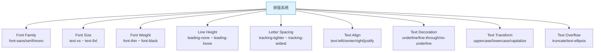

# TailwindCSS 速查手册：排版系统 — Font / Text / Leading / Tracking

> **TL;DR**
> 排版系统覆盖字体族（`font-*`）、字号（`text-*`）、字重（`font-*`）、行高（`leading-*`）、字间距（`tracking-*`）、对齐（`text-*`）、装饰（`underline` / `line-through`）等全部文本排版属性，让你用 class 组合精确控制每一个文字细节。

---

## 📊 1. 排版系统全景图



---

## 🔤 2. Font Family 字体族

| Class | CSS | 说明 |
|-------|-----|------|
| `font-sans` | `font-family: ui-sans-serif, system-ui, sans-serif...` | 无衬线（默认） |
| `font-serif` | `font-family: ui-serif, Georgia, serif...` | 衬线 |
| `font-mono` | `font-family: ui-monospace, monospace...` | 等宽 |

```html
<!-- 代码片段用等宽字体 -->
<code class="font-mono text-sm bg-muted px-1.5 py-0.5 rounded">npm install</code>

<!-- 数据展示用等宽字体（数字对齐） -->
<td class="font-mono tabular-nums text-right">¥12,345.67</td>
```

---

## 📏 3. Font Size 字号

Tailwind 的 `text-*` 同时设置 `font-size` 和默认 `line-height`：

| Class | font-size | line-height | 场景 |
|-------|-----------|-------------|------|
| `text-xs` | 0.75rem (12px) | 1rem | 辅助文本、标签 |
| `text-sm` | 0.875rem (14px) | 1.25rem | **表格、表单、正文（紧凑）** |
| `text-base` | 1rem (16px) | 1.5rem | **正文（标准）** |
| `text-lg` | 1.125rem (18px) | 1.75rem | 副标题 |
| `text-xl` | 1.25rem (20px) | 1.75rem | 小标题 |
| `text-2xl` | 1.5rem (24px) | 2rem | 标题 |
| `text-3xl` | 1.875rem (30px) | 2.25rem | 页面标题 |
| `text-4xl` | 2.25rem (36px) | 2.5rem | 大标题 |
| `text-5xl` | 3rem (48px) | 1 | Hero 标题 |
| `text-6xl` | 3.75rem (60px) | 1 | |
| `text-7xl` | 4.5rem (72px) | 1 | |
| `text-8xl` | 6rem (96px) | 1 | |
| `text-9xl` | 8rem (128px) | 1 | |

### Admin 标题层级规范

```html
<!-- 推荐的 Admin 标题层级 -->
<h1 class="text-3xl font-bold tracking-tight">页面主标题</h1>
<h2 class="text-2xl font-semibold tracking-tight">区块标题</h2>
<h3 class="text-xl font-semibold">卡片标题</h3>
<h4 class="text-lg font-medium">子区块标题</h4>
<p class="text-sm text-muted-foreground">描述性文本</p>
<span class="text-xs text-muted-foreground">辅助信息</span>
```

---

## ⚖️ 4. Font Weight 字重

| Class | CSS | 值 |
|-------|-----|----|
| `font-thin` | `font-weight: 100` | 100 |
| `font-extralight` | `font-weight: 200` | 200 |
| `font-light` | `font-weight: 300` | 300 |
| `font-normal` | `font-weight: 400` | 400 |
| `font-medium` | `font-weight: 500` | 500 |
| `font-semibold` | `font-weight: 600` | 600 |
| `font-bold` | `font-weight: 700` | 700 |
| `font-extrabold` | `font-weight: 800` | 800 |
| `font-black` | `font-weight: 900` | 900 |

### Admin 常用搭配

```html
<!-- 数据仪表盘的数字 -->
<span class="text-3xl font-bold">45,231</span>

<!-- 表格表头 -->
<th class="text-sm font-medium text-muted-foreground">用户名</th>

<!-- 导航链接 -->
<a class="text-sm font-medium hover:text-primary">设置</a>

<!-- 面包屑 -->
<span class="text-sm font-normal text-muted-foreground">首页</span>
<span class="text-sm font-medium">当前页</span>
```

---

## 📐 5. Line Height 行高

| Class | CSS | 说明 |
|-------|-----|------|
| `leading-none` | `line-height: 1` | 无额外行高 |
| `leading-tight` | `line-height: 1.25` | 紧凑 |
| `leading-snug` | `line-height: 1.375` | 略紧 |
| `leading-normal` | `line-height: 1.5` | 标准 |
| `leading-relaxed` | `line-height: 1.625` | 宽松 |
| `leading-loose` | `line-height: 2` | 很宽松 |
| `leading-3` ~ `leading-10` | 固定值 | 0.75rem ~ 2.5rem |

```html
<!-- 大标题用紧行高 -->
<h1 class="text-4xl font-bold leading-tight">
  跨国电商<br/>管理后台
</h1>

<!-- 正文用舒适行高 -->
<p class="text-base leading-relaxed text-muted-foreground">
  这是一段较长的描述文本，需要舒适的行距以提高可读性。
</p>
```

---

## 🔡 6. Letter Spacing 字间距

| Class | CSS | 说明 |
|-------|-----|------|
| `tracking-tighter` | `letter-spacing: -0.05em` | 更紧凑 |
| `tracking-tight` | `letter-spacing: -0.025em` | 紧凑（大标题推荐） |
| `tracking-normal` | `letter-spacing: 0em` | 默认 |
| `tracking-wide` | `letter-spacing: 0.025em` | 略宽 |
| `tracking-wider` | `letter-spacing: 0.05em` | 宽 |
| `tracking-widest` | `letter-spacing: 0.1em` | 最宽（标签/徽章） |

```html
<!-- 大标题收紧字间距 -->
<h1 class="text-4xl font-bold tracking-tight">Dashboard</h1>

<!-- 小号标签加宽字间距 -->
<span class="text-xs font-semibold uppercase tracking-widest text-muted-foreground">
  overview
</span>
```

---

## ↔️ 7. Text Align 文本对齐

| Class | CSS |
|-------|-----|
| `text-left` | `text-align: left` |
| `text-center` | `text-align: center` |
| `text-right` | `text-align: right` |
| `text-justify` | `text-align: justify` |
| `text-start` | `text-align: start` |
| `text-end` | `text-align: end` |

---

## ✂️ 8. 文本截断与换行

| Class | CSS | 说明 |
|-------|-----|------|
| `truncate` | `overflow: hidden; text-overflow: ellipsis; white-space: nowrap` | 单行截断 |
| `text-ellipsis` | `text-overflow: ellipsis` | 省略号 |
| `text-clip` | `text-overflow: clip` | 直接裁切 |
| `whitespace-nowrap` | `white-space: nowrap` | 不换行 |
| `whitespace-pre` | `white-space: pre` | 保留空白 |
| `whitespace-pre-wrap` | `white-space: pre-wrap` | 保留+换行 |
| `break-words` | `overflow-wrap: break-word` | 断词换行 |
| `break-all` | `word-break: break-all` | 任意位置断行 |
| `hyphens-auto` | `hyphens: auto` | 自动断字符 |

### 多行截断

```html
<!-- 单行截断 -->
<p class="truncate">这是一段很长很长的文本...</p>

<!-- 多行截断（需要 @tailwindcss/line-clamp 或原生） -->
<p class="line-clamp-2">
  这是一段很长很长的文本，会在两行后截断显示省略号...
</p>

<p class="line-clamp-3">三行截断</p>
```

---

## 🎨 9. Text Decoration & Transform

### 装饰

| Class | CSS |
|-------|-----|
| `underline` | `text-decoration-line: underline` |
| `overline` | `text-decoration-line: overline` |
| `line-through` | `text-decoration-line: line-through` |
| `no-underline` | `text-decoration-line: none` |
| `decoration-solid` | `text-decoration-style: solid` |
| `decoration-dashed` | `text-decoration-style: dashed` |
| `decoration-dotted` | `text-decoration-style: dotted` |
| `decoration-wavy` | `text-decoration-style: wavy` |
| `underline-offset-2` ~ `8` | `text-underline-offset: N` |

### 转换

| Class | CSS |
|-------|-----|
| `uppercase` | `text-transform: uppercase` |
| `lowercase` | `text-transform: lowercase` |
| `capitalize` | `text-transform: capitalize` |
| `normal-case` | `text-transform: none` |

```html
<!-- 导航标签 -->
<span class="text-xs font-semibold uppercase tracking-wider">
  settings
</span>

<!-- 删除线价格 -->
<span class="text-sm text-muted-foreground line-through">¥299</span>
<span class="text-lg font-bold text-red-600">¥199</span>
```

---

## 💰 10. Tabular Nums 等宽数字

```html
<!-- 价格/数据对齐 -->
<td class="tabular-nums text-right font-mono">¥12,345.67</td>
<td class="tabular-nums text-right font-mono">¥1,234.56</td>
<td class="tabular-nums text-right font-mono">¥123.45</td>
```

`tabular-nums` 让数字每位等宽，配合 `text-right` 实现完美对齐。

---

## 💣 11. 避坑指南

### 坑1: text-* 同时影响颜色和字号

```html
<!-- ⚠️ text-sm 是字号，text-gray-500 是颜色 -->
<p class="text-sm text-gray-500">正确——它们不冲突</p>

<!-- 但要注意顺序可读性 -->
<!-- ✅ 推荐：字号在前，颜色在后 -->
<p class="text-sm text-gray-500">...</p>
```

### 坑2: leading 与 text-* 内置行高冲突

```html
<!-- text-xl 自带 line-height: 1.75rem -->
<!-- leading-tight 设置 line-height: 1.25 -->
<!-- 后者会覆盖前者 ✅ -->
<h2 class="text-xl leading-tight">标题</h2>
```

---

## 🧠 12. 向 AI 提问的 Prompt 模板

```
请为一个中后台 Admin 系统设计完整的排版规范（使用 TailwindCSS），包含：
1. 标题层级（H1-H4）的 class 组合
2. 正文/描述文本的标准样式
3. 表格内文本的样式（表头 vs 单元格）
4. 数字/金额的展示样式（等宽对齐）
5. 状态标签的文本样式
6. 响应式字号调整策略

输出为可直接复制使用的 class 组合表。
```

---

*👉 下一步预告：[颜色.md](./颜色.md) — bg / text / border / ring 颜色系统速查*
