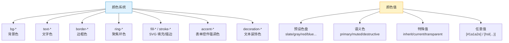

# TailwindCSS 速查手册：颜色系统 — bg / text / border / ring

> **TL;DR**
> Tailwind 的颜色系统以 `颜色名-色阶` 命名（如 `blue-500`），通过前缀 `bg-` / `text-` / `border-` / `ring-` / `fill-` / `stroke-` 应用于不同属性。支持透明度修饰符（`bg-blue-500/50`）和 CSS 变量实现的语义化颜色。

---

## 📊 1. 颜色系统全景图



---

## 🎨 2. 默认色盘速查

Tailwind 内置的颜色，每种有 11 个色阶（50 ~ 950）：

### 中性色（Neutral）

| 色系 | 50 | 100 | 200 | 300 | 400 | 500 | 600 | 700 | 800 | 900 | 950 |
|------|-----|------|------|------|------|------|------|------|------|------|------|
| `slate` | 浅 ← | | | | | 中 | | | | | → 深 |
| `gray` | | | | | | | | | | | |
| `zinc` | | | | | | | | | | | |
| `neutral` | | | | | | | | | | | |
| `stone` | | | | | | | | | | | |

### 彩色

| 色系 | 代表色（500） | Admin 常用场景 |
|------|-------------|---------------|
| `red` | 🔴 #ef4444 | 错误、危险、删除 |
| `orange` | 🟠 #f97316 | 警告 |
| `amber` | 🟡 #f59e0b | 提示、待处理 |
| `yellow` | 💛 #eab308 | 高亮 |
| `lime` | 💚 #84cc16 | |
| `green` | 🟢 #22c55e | 成功、在线、通过 |
| `emerald` | 💚 #10b981 | |
| `teal` | 🟢 #14b8a6 | |
| `cyan` | 🔵 #06b6d4 | 信息 |
| `sky` | 🔵 #0ea5e9 | |
| `blue` | 🔵 #3b82f6 | 主色、链接、选中 |
| `indigo` | 🟣 #6366f1 | |
| `violet` | 🟣 #8b5cf6 | |
| `purple` | 🟣 #a855f7 | |
| `fuchsia` | 💜 #d946ef | |
| `pink` | 💗 #ec4899 | |
| `rose` | 🌹 #f43f5e | |

### 色阶选择指南

| 色阶 | 用途 | 示例 |
|------|------|------|
| **50** | 极浅背景 | `bg-blue-50` 浅蓝底色 |
| **100** | 浅背景/hover | `hover:bg-gray-100` |
| **200** | 边框/分割线 | `border-gray-200` |
| **300** | 禁用态 | `text-gray-300` |
| **400** | 占位符 | `placeholder:text-gray-400` |
| **500** | **标准色**（图标、徽标） | `text-blue-500` |
| **600** | 按钮/链接 hover | `hover:bg-blue-600` |
| **700** | 按钮主色 | `bg-blue-700` |
| **800** | 深色文本 | `text-gray-800` |
| **900** | 标题文本 | `text-gray-900` |
| **950** | 最深色 | `bg-gray-950` 暗色背景 |

---

## 🖌️ 3. 属性前缀速查

### Background 背景色

```html
<div class="bg-white">白色背景</div>
<div class="bg-gray-50">极浅灰背景</div>
<div class="bg-blue-500">蓝色背景</div>
<div class="bg-gradient-to-r from-blue-500 to-purple-500">渐变背景</div>
<div class="bg-black/50">半透明黑色（50%透明度）</div>
<div class="bg-transparent">透明背景</div>
```

### Text 文字色

```html
<p class="text-gray-900">深色标题文本</p>
<p class="text-gray-600">正文文本</p>
<p class="text-gray-400">辅助文本</p>
<p class="text-blue-600">链接/强调色</p>
<p class="text-red-500">错误提示</p>
<p class="text-green-600">成功提示</p>
```

### Border 边框色

```html
<div class="border border-gray-200">标准边框</div>
<div class="border border-red-500">错误边框</div>
<div class="border-b border-gray-100">底部分割线</div>
<input class="border border-gray-300 focus:border-blue-500" />
```

### Ring 聚焦环

```html
<!-- ring = box-shadow 实现的轮廓，不影响布局 -->
<button class="ring-2 ring-blue-500">蓝色聚焦环</button>
<input class="focus:ring-2 focus:ring-blue-500 focus:ring-offset-2" />
<div class="ring-1 ring-gray-200">细边框（ring 替代 border）</div>
```

---

## 🌈 4. 透明度修饰符

Tailwind 支持在颜色后追加 `/N` 设置透明度（0~100）：

```html
<!-- 背景透明度 -->
<div class="bg-black/50">50% 透明黑</div>
<div class="bg-blue-500/20">20% 透明蓝（浅底色）</div>
<div class="bg-white/80 backdrop-blur">毛玻璃效果</div>

<!-- 文字透明度 -->
<p class="text-gray-900/70">70% 透明度的文字</p>

<!-- 边框透明度 -->
<div class="border border-white/20">微弱白边框</div>

<!-- 完全透明 -->
<div class="bg-blue-500/0">透明</div>
```

---

## 🎯 5. 语义化颜色（shadcn/ui 风格）

### CSS 变量 + Tailwind 配置

```css
/* globals.css */
@layer base {
  :root {
    --background: 0 0% 100%;
    --foreground: 222.2 84% 4.9%;
    --primary: 222.2 47.4% 11.2%;
    --primary-foreground: 210 40% 98%;
    --destructive: 0 84.2% 60.2%;
    --muted: 210 40% 96%;
    --muted-foreground: 215.4 16.3% 46.9%;
  }
  .dark {
    --background: 222.2 84% 4.9%;
    --foreground: 210 40% 98%;
    /* ... */
  }
}
```

```html
<!-- 使用语义色 -->
<div class="bg-background text-foreground">自动跟随主题</div>
<button class="bg-primary text-primary-foreground">主按钮</button>
<button class="bg-destructive text-destructive-foreground">删除</button>
<p class="text-muted-foreground">辅助文字</p>
```

### Admin 常用语义色映射

| 语义 | 亮色模式 | 暗色模式 | Class |
|------|---------|---------|-------|
| 页面背景 | 白色 | 近黑 | `bg-background` |
| 正文 | 深灰 | 浅灰 | `text-foreground` |
| 卡片 | 白色 | 深灰 | `bg-card` |
| 主操作 | 深蓝 | 浅蓝 | `bg-primary` |
| 危险操作 | 红色 | 暗红 | `bg-destructive` |
| 辅助文本 | 中灰 | 浅灰 | `text-muted-foreground` |
| 边框 | 浅灰 | 深灰 | `border-border` |

---

## 🌓 6. 渐变色

| Class | CSS | 说明 |
|-------|-----|------|
| `bg-gradient-to-t` | `background-image: linear-gradient(to top, ...)` | 向上 |
| `bg-gradient-to-tr` | `...to top right` | 右上 |
| `bg-gradient-to-r` | `...to right` | 向右 |
| `bg-gradient-to-br` | `...to bottom right` | 右下 |
| `bg-gradient-to-b` | `...to bottom` | 向下 |
| `from-blue-500` | 起始色 | |
| `via-purple-500` | 中间色 | |
| `to-pink-500` | 结束色 | |

```html
<!-- 渐变按钮 -->
<button class="bg-gradient-to-r from-blue-500 to-purple-600 text-white px-6 py-2 rounded-lg">
  渐变按钮
</button>

<!-- 渐变文字 -->
<h1 class="bg-gradient-to-r from-blue-600 to-purple-600 bg-clip-text text-transparent text-4xl font-bold">
  渐变文字
</h1>

<!-- 渐变边框（技巧） -->
<div class="rounded-lg bg-gradient-to-r from-blue-500 to-purple-500 p-[1px]">
  <div class="rounded-lg bg-white p-4">渐变边框效果</div>
</div>
```

---

## 💣 7. 避坑指南

### 坑1: 动态颜色类名不生效

```tsx
// ❌ Bad — 拼接类名，JIT 扫描不到
const color = 'red';
<div className={`bg-${color}-500`} />

// ✅ Good — 使用完整类名映射
const statusColorMap = {
  error: 'bg-red-500 text-white',
  warning: 'bg-amber-500 text-white',
  success: 'bg-green-500 text-white',
  info: 'bg-blue-500 text-white',
} as const;

<div className={statusColorMap[status]} />
```

### 坑2: 颜色对比度不足（可访问性）

```html
<!-- ❌ Bad — 浅色背景 + 浅色文字，看不清 -->
<div class="bg-gray-100 text-gray-300">低对比度</div>

<!-- ✅ Good — 保证 WCAG AA 标准（4.5:1） -->
<div class="bg-gray-100 text-gray-700">足够对比度</div>
```

---

## 🧠 8. 向 AI 提问的 Prompt 模板

```
请为一个中后台 Admin 系统设计完整的颜色规范（TailwindCSS），包含：
1. 语义化颜色体系（使用 CSS 变量 + hsl）
2. 亮色/暗色主题的完整 Token 定义
3. 状态颜色（success/warning/error/info）的色阶使用规范
4. 数据可视化的颜色盘（6-8色，色盲友好）
5. 文字颜色的层级规范（标题/正文/辅助/占位符）

输出包含 globals.css 和 tailwind.config.js 的完整配置。
```

---

*👉 下一步预告：[边框.md](./边框.md) — border / rounded / ring / outline 边框系统速查*
