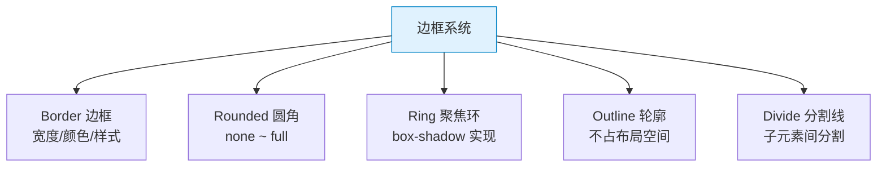

# TailwindCSS 速查手册：边框系统 — Border / Rounded / Ring / Outline

> **TL;DR**
> 边框系统涵盖 `border-*`（边框线）、`rounded-*`（圆角）、`ring-*`（聚焦环）、`outline-*`（轮廓线）和 `divide-*`（分割线）五大类，是构建精致 Admin UI 的关键细节。

---

## 📊 1. 边框系统全景图



---

## 🔲 2. Border 边框

### 边框宽度

| Class | CSS | 说明 |
|-------|-----|------|
| `border` | `border-width: 1px` | 四边 1px |
| `border-0` | `border-width: 0` | 无边框 |
| `border-2` | `border-width: 2px` | 2px |
| `border-4` | `border-width: 4px` | 4px |
| `border-8` | `border-width: 8px` | 8px |
| `border-t` | `border-top-width: 1px` | 上边框 |
| `border-r` | `border-right-width: 1px` | 右边框 |
| `border-b` | `border-bottom-width: 1px` | 下边框 |
| `border-l` | `border-left-width: 1px` | 左边框 |
| `border-x` | 左右各 1px | 水平边框 |
| `border-y` | 上下各 1px | 垂直边框 |

### 边框样式

| Class | CSS |
|-------|-----|
| `border-solid` | `border-style: solid` |
| `border-dashed` | `border-style: dashed` |
| `border-dotted` | `border-style: dotted` |
| `border-double` | `border-style: double` |
| `border-hidden` | `border-style: hidden` |
| `border-none` | `border-style: none` |

### Admin 常用模式

```html
<!-- 标准卡片 -->
<div class="rounded-lg border border-gray-200 bg-white p-6">
  卡片内容
</div>

<!-- 左侧强调边框 -->
<div class="border-l-4 border-blue-500 bg-blue-50 p-4">
  提示信息
</div>

<!-- 底部分割线列表 -->
<ul>
  <li class="border-b border-gray-100 px-4 py-3">项目 1</li>
  <li class="border-b border-gray-100 px-4 py-3">项目 2</li>
  <li class="px-4 py-3">项目 3</li>
</ul>

<!-- 虚线边框上传区 -->
<div class="rounded-lg border-2 border-dashed border-gray-300 p-8 text-center">
  拖拽上传文件
</div>
```

---

## ⭕ 3. Rounded 圆角

| Class | CSS | px | 场景 |
|-------|-----|-----|------|
| `rounded-none` | `border-radius: 0` | 0 | 直角 |
| `rounded-sm` | `border-radius: 0.125rem` | 2px | 微圆角 |
| `rounded` | `border-radius: 0.25rem` | 4px | 标准 |
| `rounded-md` | `border-radius: 0.375rem` | 6px | **按钮/输入框** |
| `rounded-lg` | `border-radius: 0.5rem` | 8px | **卡片** |
| `rounded-xl` | `border-radius: 0.75rem` | 12px | 大卡片 |
| `rounded-2xl` | `border-radius: 1rem` | 16px | |
| `rounded-3xl` | `border-radius: 1.5rem` | 24px | |
| `rounded-full` | `border-radius: 9999px` | ∞ | **头像/标签** |

### 单边圆角

| Class | 说明 |
|-------|------|
| `rounded-t-lg` | 上边两角 |
| `rounded-r-lg` | 右边两角 |
| `rounded-b-lg` | 下边两角 |
| `rounded-l-lg` | 左边两角 |
| `rounded-tl-lg` | 左上角 |
| `rounded-tr-lg` | 右上角 |
| `rounded-bl-lg` | 左下角 |
| `rounded-br-lg` | 右下角 |

### Admin 圆角规范

```html
<!-- 按钮 -->
<button class="rounded-md px-4 py-2">标准按钮</button>
<button class="rounded-full px-6 py-2">药丸按钮</button>

<!-- 头像 -->


<!-- 卡片 -->
<div class="rounded-lg border p-4">标准卡片</div>
<div class="rounded-xl border p-6">大卡片</div>

<!-- 输入框 -->
<input class="rounded-md border px-3 py-2" />

<!-- 表格（首行和末行圆角） -->
<tr class="first:rounded-t-lg last:rounded-b-lg">...</tr>

<!-- 图片裁切 -->

```

---

## 💍 4. Ring 聚焦环

Ring 使用 `box-shadow` 实现，不占布局空间。

| Class | CSS | 说明 |
|-------|-----|------|
| `ring-0` | `box-shadow: ... 0px` | 无环 |
| `ring-1` | `box-shadow: ... 1px` | 1px 环 |
| `ring-2` | `box-shadow: ... 2px` | 2px 环 |
| `ring` | `box-shadow: ... 3px` | 3px 环（默认） |
| `ring-4` | `box-shadow: ... 4px` | 4px 环 |
| `ring-8` | `box-shadow: ... 8px` | 8px 环 |
| `ring-inset` | 内阴影环 | 内侧聚焦环 |
| `ring-offset-2` | 环与元素间距 2px | |
| `ring-offset-4` | 环与元素间距 4px | |

### Ring 的优势（vs border）

```html
<!-- border 方式 — 增加边框会影响布局 -->
<button class="border-2 border-transparent focus:border-blue-500">
  切换边框时元素会跳动
</button>

<!-- ring 方式 — box-shadow 不影响布局 -->
<button class="focus:ring-2 focus:ring-blue-500 focus:ring-offset-2">
  聚焦环不影响布局
</button>
```

### Admin Focus 样式标准

```html
<!-- 输入框聚焦 -->
<input class="rounded-md border border-gray-300 px-3 py-2
             focus:border-blue-500 focus:ring-2 focus:ring-blue-500/20 focus:outline-none" />

<!-- 按钮聚焦 -->
<button class="rounded-md bg-primary px-4 py-2 text-white
               focus-visible:ring-2 focus-visible:ring-primary focus-visible:ring-offset-2
               focus-visible:outline-none">
  按钮
</button>

<!-- 用 ring-1 替代 border（更精细的控制） -->
<div class="rounded-lg ring-1 ring-gray-200 p-4">
  用 ring 模拟边框
</div>
```

---

## 📄 5. Outline 轮廓

| Class | CSS | 说明 |
|-------|-----|------|
| `outline-none` | `outline: 2px solid transparent; outline-offset: 2px` | 移除轮廓 |
| `outline` | `outline-style: solid` | 实线轮廓 |
| `outline-dashed` | `outline-style: dashed` | 虚线轮廓 |
| `outline-dotted` | `outline-style: dotted` | 点线轮廓 |
| `outline-1` ~ `outline-8` | 宽度 | |
| `outline-offset-0` ~ `8` | 偏移 | |

---

## ➗ 6. Divide 分割线

在 Flex/Grid 子元素之间自动添加分割线（使用 `> * + *` 选择器）。

| Class | CSS 效果 | 说明 |
|-------|---------|------|
| `divide-x` | 垂直分割线 | 水平布局子项之间 |
| `divide-y` | 水平分割线 | 垂直布局子项之间 |
| `divide-x-2` | 2px 垂直分割线 | |
| `divide-y-2` | 2px 水平分割线 | |
| `divide-gray-200` | 灰色分割线 | 颜色 |
| `divide-dashed` | 虚线分割线 | 样式 |

```html
<!-- 垂直列表分割线 -->
<ul class="divide-y divide-gray-100">
  <li class="px-4 py-3">项目 1</li>
  <li class="px-4 py-3">项目 2</li>
  <li class="px-4 py-3">项目 3</li>
</ul>

<!-- 水平按钮组分割线 -->
<div class="flex divide-x divide-gray-200 rounded-lg border">
  <button class="px-4 py-2 hover:bg-gray-50">选项 A</button>
  <button class="px-4 py-2 hover:bg-gray-50">选项 B</button>
  <button class="px-4 py-2 hover:bg-gray-50">选项 C</button>
</div>
```

---

## 💣 7. 避坑指南

### 坑1: border 需要同时指定宽度和颜色

```html
<!-- ❌ Bad — 只写 border 但没指定颜色 -->
<div class="border">默认是 currentColor，可能不是你想要的</div>

<!-- ✅ Good — 明确指定颜色 -->
<div class="border border-gray-200">标准浅灰边框</div>
```

### 坑2: rounded 在 overflow-hidden 容器中的表现

```html
<!-- ❌ Bad — 子元素溢出导致圆角被遮盖 -->
<div class="rounded-lg">
   <!-- 直角 -->
</div>

<!-- ✅ Good — 添加 overflow-hidden -->
<div class="overflow-hidden rounded-lg">
   <!-- 圆角裁切 -->
</div>
```

### 坑3: ring 和 shadow 叠加

```html
<!-- ring 和 shadow 都使用 box-shadow，需要注意叠加 -->
<!-- Tailwind v3+ 已解决此问题，二者可以共存 ✅ -->
<div class="shadow-lg ring-1 ring-gray-200">
  同时有阴影和环
</div>
```

---

## 🧠 8. 向 AI 提问的 Prompt 模板

```
请为一个中后台 Admin 系统设计边框和圆角规范（TailwindCSS），包含：
1. 卡片/容器的边框标准（border vs ring 选择）
2. 圆角层级规范（按钮/输入框/卡片/头像/标签）
3. 焦点样式标准（keyboard focus vs mouse focus）
4. 分割线规范（列表/表格/区域分隔）
5. 暗色模式下的边框颜色变化

输出为可直接在设计系统文档中使用的规范表格。
```

---

*👉 下一步预告：[效果.md](./效果.md) — shadow / opacity / blur 视觉效果速查*
