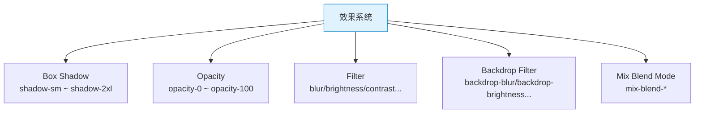

# TailwindCSS 速查手册：效果系统 — Shadow / Opacity / Blur

> **TL;DR**
> 效果系统包含 `shadow-*`（阴影）、`opacity-*`（不透明度）、`blur-*`（模糊）、`backdrop-*`（背景模糊）等视觉效果 utility，是提升 Admin UI 层次感和精致度的关键工具。

---

## 📊 1. 效果系统全景图



---

## 🌑 2. Box Shadow 阴影

| Class | 效果 | 场景 |
|-------|------|------|
| `shadow-sm` | 极小阴影 | 输入框 |
| `shadow` | 小阴影 | 卡片（默认） |
| `shadow-md` | 中阴影 | 浮起卡片 |
| `shadow-lg` | 大阴影 | 下拉菜单 |
| `shadow-xl` | 超大阴影 | 弹窗/模态框 |
| `shadow-2xl` | 最大阴影 | 全屏浮层 |
| `shadow-inner` | 内阴影 | 输入框凹陷效果 |
| `shadow-none` | 无阴影 | 移除 |

### 阴影颜色

```html
<!-- 默认灰色阴影 -->
<div class="shadow-lg">标准阴影</div>

<!-- 彩色阴影（品牌感） -->
<button class="bg-blue-500 shadow-lg shadow-blue-500/30">
  蓝色光晕按钮
</button>

<!-- 暗色模式下的微妙阴影 -->
<div class="shadow-lg dark:shadow-gray-900/50">适配暗色模式</div>
```

### Admin 阴影层级规范

```html
<!-- Level 0: 无阴影 — 内容区域 -->
<div class="bg-white">平面内容</div>

<!-- Level 1: shadow-sm — 输入框/小卡片 -->
<input class="rounded-md border shadow-sm" />

<!-- Level 2: shadow — 标准卡片 -->
<div class="rounded-lg border shadow p-4">标准卡片</div>

<!-- Level 3: shadow-md — 悬浮卡片/Popover -->
<div class="rounded-lg shadow-md p-4">hover 浮起的卡片</div>

<!-- Level 4: shadow-lg — 下拉菜单/Tooltip -->
<div class="rounded-lg shadow-lg p-2">下拉菜单</div>

<!-- Level 5: shadow-xl — 模态框/抽屉 -->
<div class="rounded-xl shadow-xl p-6">模态框</div>

<!-- 交互层级：hover 提升阴影 -->
<div class="rounded-lg border shadow-sm transition-shadow hover:shadow-md">
  hover 时浮起效果
</div>
```

---

## 👁️ 3. Opacity 不透明度

| Class | CSS | 场景 |
|-------|-----|------|
| `opacity-0` | `opacity: 0` | 完全透明（动画起点） |
| `opacity-5` | `opacity: 0.05` | 极微弱 |
| `opacity-10` | `opacity: 0.1` | |
| `opacity-20` | `opacity: 0.2` | |
| `opacity-25` | `opacity: 0.25` | |
| `opacity-30` | `opacity: 0.3` | |
| `opacity-40` | `opacity: 0.4` | |
| `opacity-50` | `opacity: 0.5` | 半透明（遮罩） |
| `opacity-60` | `opacity: 0.6` | |
| `opacity-70` | `opacity: 0.7` | |
| `opacity-75` | `opacity: 0.75` | |
| `opacity-80` | `opacity: 0.8` | |
| `opacity-90` | `opacity: 0.9` | |
| `opacity-95` | `opacity: 0.95` | |
| `opacity-100` | `opacity: 1` | 完全不透明（默认） |

```html
<!-- 禁用态 -->
<button class="opacity-50 cursor-not-allowed" disabled>禁用按钮</button>

<!-- 水印文字 -->
<span class="text-4xl font-bold opacity-5 select-none">DRAFT</span>

<!-- 加载遮罩 -->
<div class="absolute inset-0 flex items-center justify-center bg-white/80">
  <div class="animate-spin size-8 border-4 border-primary border-t-transparent rounded-full" />
</div>

<!-- hover 显示 -->
<div class="opacity-0 group-hover:opacity-100 transition-opacity">
  hover 时显示的内容
</div>
```

---

## 🔮 4. Filter 滤镜

### Blur 模糊

| Class | CSS | 说明 |
|-------|-----|------|
| `blur-none` | `filter: blur(0)` | 无模糊 |
| `blur-sm` | `filter: blur(4px)` | 轻微模糊 |
| `blur` | `filter: blur(8px)` | 标准模糊 |
| `blur-md` | `filter: blur(12px)` | |
| `blur-lg` | `filter: blur(16px)` | |
| `blur-xl` | `filter: blur(24px)` | |
| `blur-2xl` | `filter: blur(40px)` | |
| `blur-3xl` | `filter: blur(64px)` | |

### 其他滤镜

| Class | CSS | 说明 |
|-------|-----|------|
| `brightness-50` ~ `brightness-200` | `filter: brightness(N)` | 亮度 |
| `contrast-50` ~ `contrast-200` | `filter: contrast(N)` | 对比度 |
| `grayscale` | `filter: grayscale(100%)` | 灰度 |
| `grayscale-0` | `filter: grayscale(0)` | 无灰度 |
| `saturate-50` ~ `saturate-200` | `filter: saturate(N)` | 饱和度 |
| `sepia` | `filter: sepia(100%)` | 复古 |
| `invert` | `filter: invert(100%)` | 反色 |
| `hue-rotate-15` ~ `180` | `filter: hue-rotate(N)` | 色相旋转 |
| `drop-shadow-md` | `filter: drop-shadow(...)` | 投影（适合不规则形状） |

```html
<!-- 禁用态图片 -->


<!-- hover 恢复彩色 -->


<!-- 图标阴影（drop-shadow 支持透明背景） -->
<svg class="drop-shadow-md">...</svg>
```

---

## 🪟 5. Backdrop Filter 背景滤镜

作用于元素**背后**的内容，常用于毛玻璃效果。

| Class | CSS | 说明 |
|-------|-----|------|
| `backdrop-blur-sm` | `backdrop-filter: blur(4px)` | 轻微 |
| `backdrop-blur` | `backdrop-filter: blur(8px)` | 标准 |
| `backdrop-blur-md` | `backdrop-filter: blur(12px)` | |
| `backdrop-blur-lg` | `backdrop-filter: blur(16px)` | |
| `backdrop-blur-xl` | `backdrop-filter: blur(24px)` | |
| `backdrop-brightness-*` | | 背景亮度 |
| `backdrop-contrast-*` | | 背景对比度 |
| `backdrop-saturate-*` | | 背景饱和度 |

### Admin 毛玻璃效果

```html
<!-- 毛玻璃导航栏 -->
<header class="fixed top-0 inset-x-0 z-50 h-16 border-b
               bg-background/80 backdrop-blur-sm">
  导航内容
</header>

<!-- 毛玻璃遮罩 -->
<div class="fixed inset-0 z-50 bg-black/40 backdrop-blur-sm
            flex items-center justify-center">
  <div class="rounded-xl bg-white p-6 shadow-xl">模态框</div>
</div>

<!-- 毛玻璃侧边栏 -->
<aside class="fixed inset-y-0 left-0 w-64 border-r
              bg-background/60 backdrop-blur-xl">
  侧边栏内容
</aside>
```

---

## 💣 6. 避坑指南

### 坑1: backdrop-blur 在某些浏览器不生效

```html
<!-- ✅ 总是提供 fallback 背景色 -->
<header class="bg-white/80 backdrop-blur supports-[backdrop-filter]:bg-white/60">
  有 backdrop-filter 时更透明，否则用较不透明的背景
</header>
```

### 坑2: shadow 颜色在暗色模式下太突兀

```html
<!-- ❌ Bad — 亮色阴影在暗色背景上很突兀 -->
<div class="shadow-lg">...</div>

<!-- ✅ Good — 暗色模式使用不同的阴影颜色 -->
<div class="shadow-lg dark:shadow-gray-900/30">...</div>
```

---

## 🧠 7. 向 AI 提问的 Prompt 模板

```
请为一个中后台 Admin 系统设计完整的阴影和效果规范（TailwindCSS），包含：
1. 5 级阴影层级（从平面到模态框）
2. 毛玻璃效果的标准实现（导航栏/遮罩/侧边栏）
3. 交互反馈效果（hover 浮起/点击凹陷/禁用灰度）
4. 暗色模式下的阴影和效果调整方案

输出为设计系统文档中可直接使用的规范。
```

---

*👉 下一步预告：[动画.md](./动画.md) — transition / animate 过渡与动画速查*
