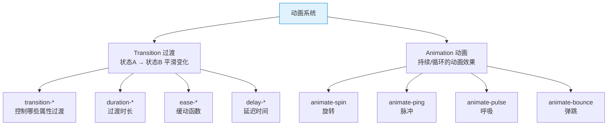

# TailwindCSS 速查手册：动画系统 — Transition / Animate

> **TL;DR**
> Tailwind 的动画系统分为两层：`transition-*`（CSS 过渡，用于状态切换的平滑变化）和 `animate-*`（CSS 动画，用于持续/循环动画）。掌握它们能让 Admin UI 的交互从"能用"升级到"好用"。

---

## 📊 1. 动画系统全景图



---

## 🔄 2. Transition 过渡

### 过渡属性

| Class | 过渡的 CSS 属性 | 场景 |
|-------|----------------|------|
| `transition-none` | 无 | 禁用过渡 |
| `transition-all` | `all` | 所有属性（慎用） |
| `transition` | `color, bg, border, text-decoration, fill, stroke, opacity, shadow, transform, filter, backdrop-filter` | **推荐默认** |
| `transition-colors` | `color, bg, border-color, text-decoration-color, fill, stroke` | 仅颜色 |
| `transition-opacity` | `opacity` | 仅透明度 |
| `transition-shadow` | `box-shadow` | 仅阴影 |
| `transition-transform` | `transform` | 仅变换 |

### Duration 时长

| Class | CSS | 建议 |
|-------|-----|------|
| `duration-0` | `0ms` | 无过渡 |
| `duration-75` | `75ms` | 极快（微交互） |
| `duration-100` | `100ms` | |
| `duration-150` | `150ms` | **按钮/链接 hover** |
| `duration-200` | `200ms` | **标准交互** |
| `duration-300` | `300ms` | **展开/收起** |
| `duration-500` | `500ms` | 较慢（面板切换） |
| `duration-700` | `700ms` | |
| `duration-1000` | `1000ms` | 缓慢（页面过渡） |

### Easing 缓动

| Class | CSS | 说明 |
|-------|-----|------|
| `ease-linear` | `linear` | 匀速 |
| `ease-in` | `cubic-bezier(0.4, 0, 1, 1)` | 慢→快 |
| `ease-out` | `cubic-bezier(0, 0, 0.2, 1)` | 快→慢（**最自然**） |
| `ease-in-out` | `cubic-bezier(0.4, 0, 0.2, 1)` | 慢→快→慢 |

### Delay 延迟

| Class | CSS |
|-------|-----|
| `delay-0` | `0ms` |
| `delay-75` | `75ms` |
| `delay-100` | `100ms` |
| `delay-150` | `150ms` |
| `delay-200` | `200ms` |
| `delay-300` | `300ms` |
| `delay-500` | `500ms` |
| `delay-700` | `700ms` |
| `delay-1000` | `1000ms` |

### Admin 常用过渡模式

```html
<!-- 按钮 hover 变色 -->
<button class="bg-primary text-white rounded-md px-4 py-2
               transition-colors duration-150
               hover:bg-primary/90">
  保存
</button>

<!-- 卡片 hover 浮起 -->
<div class="rounded-lg border p-4 shadow-sm
            transition-shadow duration-200
            hover:shadow-md">
  可点击的卡片
</div>

<!-- 侧边栏展开/收起 -->
<aside class="h-screen border-r overflow-hidden
              transition-all duration-300 ease-in-out"
       :class="collapsed ? 'w-16' : 'w-64'">
  侧边栏
</aside>

<!-- 下拉菜单渐显 -->
<div class="transition-all duration-200 ease-out"
     :class="open 
       ? 'opacity-100 translate-y-0' 
       : 'opacity-0 -translate-y-2 pointer-events-none'">
  菜单内容
</div>

<!-- 列表项交错出现 -->
<ul>
  <li class="animate-fade-in delay-0">项目 1</li>
  <li class="animate-fade-in delay-75">项目 2</li>
  <li class="animate-fade-in delay-150">项目 3</li>
</ul>
```

---

## 🎬 3. Animation 预设动画

### 内置动画

| Class | 效果 | 场景 |
|-------|------|------|
| `animate-spin` | 360° 匀速旋转 | 加载图标 |
| `animate-ping` | 向外扩散脉冲 | 通知点 |
| `animate-pulse` | 透明度呼吸 | 骨架屏加载 |
| `animate-bounce` | 垂直弹跳 | 引导箭头 |
| `animate-none` | 移除动画 | |

```html
<!-- 加载旋转 -->
<svg class="animate-spin h-5 w-5 text-white" viewBox="0 0 24 24">
  <circle class="opacity-25" cx="12" cy="12" r="10" stroke="currentColor" stroke-width="4" fill="none" />
  <path class="opacity-75" fill="currentColor" d="M4 12a8 8 0 018-8V0C5.373 0 0 5.373 0 12h4z" />
</svg>

<!-- 在线状态脉冲 -->
<span class="relative flex h-3 w-3">
  <span class="animate-ping absolute inline-flex h-full w-full rounded-full bg-green-400 opacity-75"></span>
  <span class="relative inline-flex h-3 w-3 rounded-full bg-green-500"></span>
</span>

<!-- 骨架屏 -->
<div class="space-y-4">
  <div class="h-4 w-3/4 animate-pulse rounded bg-muted"></div>
  <div class="h-4 w-1/2 animate-pulse rounded bg-muted"></div>
  <div class="h-4 w-5/6 animate-pulse rounded bg-muted"></div>
</div>

<!-- 引导箭头 -->
<div class="animate-bounce text-2xl">↓</div>
```

### 自定义动画

```javascript
// tailwind.config.js
module.exports = {
  theme: {
    extend: {
      animation: {
        'fade-in': 'fadeIn 0.3s ease-out forwards',
        'slide-up': 'slideUp 0.4s ease-out forwards',
        'slide-down': 'slideDown 0.3s ease-out forwards',
        'scale-in': 'scaleIn 0.2s ease-out forwards',
        'spin-slow': 'spin 3s linear infinite',
      },
      keyframes: {
        fadeIn: {
          '0%': { opacity: '0' },
          '100%': { opacity: '1' },
        },
        slideUp: {
          '0%': { transform: 'translateY(10px)', opacity: '0' },
          '100%': { transform: 'translateY(0)', opacity: '1' },
        },
        slideDown: {
          '0%': { transform: 'translateY(-10px)', opacity: '0' },
          '100%': { transform: 'translateY(0)', opacity: '1' },
        },
        scaleIn: {
          '0%': { transform: 'scale(0.95)', opacity: '0' },
          '100%': { transform: 'scale(1)', opacity: '1' },
        },
      },
    },
  },
};
```

```html
<!-- 使用自定义动画 -->
<div class="animate-fade-in">渐入</div>
<div class="animate-slide-up">从下滑入</div>
<div class="animate-scale-in">缩放进入</div>
```

---

## 🔀 4. Transform 变换

| Class | CSS | 说明 |
|-------|-----|------|
| `scale-0` ~ `scale-150` | `transform: scale(N)` | 缩放 |
| `scale-x-*` / `scale-y-*` | 单轴缩放 | |
| `rotate-0` ~ `rotate-180` | `transform: rotate(N)` | 旋转 |
| `-rotate-45` | `transform: rotate(-45deg)` | 负旋转 |
| `translate-x-*` / `translate-y-*` | 平移 | |
| `-translate-x-*` | 负平移 | |
| `skew-x-*` / `skew-y-*` | 倾斜 | |
| `origin-center` / `origin-top` ... | `transform-origin` | 变换原点 |

```html
<!-- hover 放大 -->
<div class="transition-transform duration-200 hover:scale-105">
  hover 略微放大
</div>

<!-- 图标旋转指示展开 -->
<svg class="transition-transform duration-200"
     :class="open ? 'rotate-180' : 'rotate-0'">
  <path d="M6 9l6 6 6-6" />
</svg>

<!-- 抽屉从右侧滑入 -->
<div class="fixed inset-y-0 right-0 w-80
            transition-transform duration-300 ease-out"
     :class="open ? 'translate-x-0' : 'translate-x-full'">
  抽屉面板
</div>
```

---

## 🎯 5. 减少动效（无障碍）

```html
<!-- 尊重用户的减少动效偏好 -->
<div class="animate-bounce motion-reduce:animate-none">
  系统偏好减少动效时，停止弹跳
</div>

<div class="transition-transform duration-300 hover:scale-105
            motion-reduce:transition-none motion-reduce:hover:scale-100">
  系统偏好减少动效时，禁用 hover 放大
</div>

<!-- motion-safe: 仅在允许动效时才应用 -->
<div class="motion-safe:animate-fade-in">
  仅在用户允许动效时才有渐入效果
</div>
```

---

## 💣 6. 避坑指南

### 坑1: transition-all 导致意外的属性过渡

```html
<!-- ❌ Bad — height 变化也被过渡，可能导致卡顿 -->
<div class="transition-all duration-200 hover:shadow-md hover:p-8">
  padding 过渡会触发 layout 重排！
</div>

<!-- ✅ Good — 只过渡需要的属性 -->
<div class="transition-shadow duration-200 hover:shadow-md">
  只过渡 shadow，不触发 layout
</div>
```

### 坑2: 动画性能 — 避免触发 layout

```html
<!-- ❌ Bad — width/height/margin/padding 动画触发 layout reflow -->
<div class="transition-all hover:w-[300px]">性能差</div>

<!-- ✅ Good — 使用 transform/opacity（GPU 加速，不触发 layout） -->
<div class="transition-transform hover:scale-110">性能好</div>
<div class="transition-opacity hover:opacity-80">性能好</div>
```

---

## 🧠 7. 向 AI 提问的 Prompt 模板

```
请为一个中后台 Admin 系统设计完整的动画规范（TailwindCSS），包含：
1. 定义 3-5 种标准过渡时长和缓动函数（按场景分类）
2. 自定义 keyframes 动画：fadeIn / slideUp / slideDown / scaleIn
3. 下拉菜单/模态框/抽屉/通知的进出动画实现
4. 骨架屏加载动画方案
5. motion-reduce 无障碍适配方案

输出完整的 tailwind.config.js 动画配置和使用示例。
```

---

*👉 下一步预告：[交互状态.md](./交互状态.md) — hover / focus / group / peer 状态速查*
