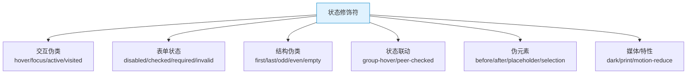

# TailwindCSS 速查手册：交互状态 — Hover / Focus / Group / Peer

> **TL;DR**
> Tailwind 的状态修饰符（Modifiers）让你直接在 class 中表达交互状态：`hover:`、`focus:`、`active:` 等伪类，以及 `group-*` / `peer-*` 实现父子/兄弟间的状态联动。这是 Tailwind 最强大也最需要熟练掌握的特性之一。

---

## 📊 1. 状态修饰符全景图



---

## 🖱️ 2. 交互伪类

### 鼠标 & 键盘

| 修饰符 | 触发条件 | 场景 |
|--------|---------|------|
| `hover:` | 鼠标悬停 | 按钮/链接/卡片 |
| `focus:` | 获得焦点（鼠标+键盘） | 输入框/按钮 |
| `focus-visible:` | 键盘导航获得焦点 | **推荐用于焦点样式** |
| `focus-within:` | 子元素获得焦点 | 表单容器高亮 |
| `active:` | 按下（mousedown） | 按钮点击效果 |
| `visited:` | 已访问链接 | 链接 |

```html
<!-- 按钮完整交互状态 -->
<button class="bg-blue-600 text-white rounded-md px-4 py-2
               hover:bg-blue-700
               active:bg-blue-800 active:scale-[0.98]
               focus-visible:ring-2 focus-visible:ring-blue-500 focus-visible:ring-offset-2
               focus-visible:outline-none
               transition-all duration-150">
  保存
</button>

<!-- 输入框聚焦效果 -->
<input class="rounded-md border border-gray-300 px-3 py-2
              focus:border-blue-500 focus:ring-2 focus:ring-blue-500/20
              focus:outline-none
              placeholder:text-gray-400" 
       placeholder="请输入..." />

<!-- focus-within：子输入框聚焦时父容器高亮 -->
<div class="rounded-lg border p-4
            focus-within:border-blue-500 focus-within:ring-1 focus-within:ring-blue-500">
  <label class="text-sm font-medium">搜索</label>
  <input class="mt-1 w-full border-none outline-none" />
</div>
```

### focus vs focus-visible

```html
<!-- focus: 鼠标点击和键盘 Tab 都会触发 -->
<button class="focus:ring-2">鼠标点击也显示焦点环（通常不希望）</button>

<!-- focus-visible: 只在键盘导航时显示 ✅ -->
<button class="focus-visible:ring-2">只有 Tab 键才显示焦点环</button>
```

---

## 📋 3. 表单状态

| 修饰符 | 触发条件 | 场景 |
|--------|---------|------|
| `disabled:` | `disabled` 属性 | 禁用态样式 |
| `enabled:` | 非禁用 | |
| `checked:` | 复选框/单选选中 | |
| `indeterminate:` | 不确定状态 | 部分选中 |
| `required:` | `required` 属性 | 必填标记 |
| `invalid:` | 校验不通过 | 错误样式 |
| `valid:` | 校验通过 | 成功样式 |
| `placeholder-shown:` | 显示 placeholder | |
| `read-only:` | `readonly` 属性 | |
| `autofill:` | 浏览器自动填充 | |

```html
<!-- 禁用按钮 -->
<button class="bg-primary text-white px-4 py-2 rounded
               disabled:opacity-50 disabled:cursor-not-allowed"
        disabled>
  提交中...
</button>

<!-- 自定义复选框 -->
<input type="checkbox" 
       class="size-4 rounded border-gray-300
              checked:bg-blue-600 checked:border-blue-600
              focus-visible:ring-2 focus-visible:ring-blue-500" />

<!-- 输入框校验状态 -->
<input class="rounded border px-3 py-2
              invalid:border-red-500 invalid:text-red-600
              invalid:focus:ring-red-500/20
              valid:border-green-500"
       type="email" required />

<!-- 浮动标签（placeholder-shown） -->
<div class="relative">
  <input class="peer w-full rounded border px-3 pt-5 pb-1
                placeholder-shown:pt-3 placeholder-shown:pb-3"
         placeholder=" " id="name" />
  <label class="absolute left-3 top-1 text-xs text-gray-500
                peer-placeholder-shown:top-3 peer-placeholder-shown:text-base
                transition-all duration-200"
         for="name">
    姓名
  </label>
</div>
```

---

## 🏗️ 4. 结构伪类

| 修饰符 | 触发条件 | 场景 |
|--------|---------|------|
| `first:` | 第一个子元素 | 首行特殊样式 |
| `last:` | 最后一个子元素 | 末行无底线 |
| `odd:` | 奇数行 | 斑马纹表格 |
| `even:` | 偶数行 | 斑马纹表格 |
| `only:` | 唯一子元素 | |
| `first-of-type:` | 同类型第一个 | |
| `last-of-type:` | 同类型最后一个 | |
| `empty:` | 无子元素 | 空状态 |

```html
<!-- 斑马纹表格 -->
<tbody>
  <tr class="odd:bg-gray-50 even:bg-white hover:bg-gray-100">
    <td>数据</td>
  </tr>
</tbody>

<!-- 列表项 — 最后一个无底线 -->
<ul class="divide-y">
  <li class="px-4 py-3 last:border-b-0">项目1</li>
  <li class="px-4 py-3 last:border-b-0">项目2</li>
  <li class="px-4 py-3 last:border-b-0">项目3</li>
</ul>

<!-- 空状态展示 -->
<div class="empty:flex empty:items-center empty:justify-center empty:h-32 empty:text-gray-400
            empty:before:content-['暂无数据']">
  <!-- 有内容时正常展示 -->
</div>
```

---

## 👥 5. Group — 父元素状态影响子元素

`group` 让你根据**父元素的状态**来改变**子元素的样式**。

### 基本用法

```html
<!-- 卡片 hover 时，标题变色 + 箭头移动 -->
<a href="#" class="group block rounded-lg border p-4 transition-shadow hover:shadow-md">
  <h3 class="font-semibold group-hover:text-blue-600 transition-colors">
    文章标题
  </h3>
  <p class="mt-1 text-sm text-gray-500">
    文章描述...
  </p>
  <span class="mt-2 inline-flex items-center text-sm text-blue-600">
    阅读更多 
    <svg class="ml-1 size-4 transition-transform group-hover:translate-x-1">→</svg>
  </span>
</a>
```

### 命名 Group

```html
<!-- 多层 group 嵌套时使用命名区分 -->
<div class="group/card rounded-lg border p-4 hover:shadow-md">
  <h3 class="group-hover/card:text-blue-600">卡片标题</h3>
  
  <button class="group/btn mt-2 flex items-center gap-1 rounded bg-blue-600 px-3 py-1 text-white">
    <span class="group-hover/btn:underline">点击</span>
    <svg class="size-4 group-hover/btn:translate-x-0.5 transition-transform">→</svg>
  </button>
</div>
```

### Group 常用变体

| 修饰符 | 说明 |
|--------|------|
| `group-hover:` | 父 hover |
| `group-focus:` | 父 focus |
| `group-active:` | 父 active |
| `group-focus-within:` | 父内有焦点 |
| `group-focus-visible:` | 父键盘焦点 |
| `group-[.is-open]:` | 父有 `.is-open` 类 |
| `group-data-[state=open]:` | 父有 `data-state="open"` |

### Admin 实战：侧边栏菜单项

```html
<nav>
  <a href="#" class="group flex items-center gap-3 rounded-md px-3 py-2
                     text-gray-600 hover:bg-gray-100 hover:text-gray-900">
    <svg class="size-5 text-gray-400 group-hover:text-gray-600 transition-colors">
      <!-- 图标 -->
    </svg>
    <span class="text-sm font-medium">仪表盘</span>
    <span class="ml-auto rounded-full bg-gray-100 px-2 py-0.5 text-xs
                 group-hover:bg-gray-200 transition-colors">
      12
    </span>
  </a>
</nav>
```

---

## 🔗 6. Peer — 兄弟元素状态联动

`peer` 让你根据**前一个兄弟元素的状态**来改变**后一个兄弟元素的样式**。

### 基本用法

```html
<!-- 输入框验证 → 显示错误信息 -->
<div>
  <input class="peer rounded border px-3 py-2
                invalid:border-red-500"
         type="email" required placeholder="输入邮箱" />
  <!-- 只在 input 校验失败时显示 -->
  <p class="mt-1 hidden text-sm text-red-500 peer-invalid:block">
    请输入有效的邮箱地址
  </p>
</div>
```

### 命名 Peer

```html
<div class="space-y-2">
  <input type="checkbox" id="agree" class="peer/agree" />
  <label for="agree">我同意条款</label>
  
  <input type="checkbox" id="newsletter" class="peer/newsletter" />
  <label for="newsletter">订阅通讯</label>
  
  <!-- 只有同意条款后才启用提交按钮 -->
  <button class="peer-checked/agree:bg-blue-600 peer-checked/agree:cursor-pointer
                 bg-gray-300 cursor-not-allowed rounded px-4 py-2 text-white">
    提交
  </button>
</div>
```

### Peer 常用变体

| 修饰符 | 说明 |
|--------|------|
| `peer-hover:` | 兄弟 hover |
| `peer-focus:` | 兄弟 focus |
| `peer-checked:` | 兄弟选中 |
| `peer-disabled:` | 兄弟禁用 |
| `peer-invalid:` | 兄弟校验失败 |
| `peer-placeholder-shown:` | 兄弟显示 placeholder |

### Admin 实战：浮动标签输入框

```html
<div class="relative">
  <input
    type="text"
    id="email"
    class="peer w-full rounded-md border border-gray-300 px-3 pb-2 pt-5
           focus:border-blue-500 focus:ring-1 focus:ring-blue-500
           placeholder-transparent"
    placeholder="邮箱地址"
  />
  <label
    for="email"
    class="absolute left-3 top-1 text-xs text-gray-500
           peer-placeholder-shown:top-3.5 peer-placeholder-shown:text-sm peer-placeholder-shown:text-gray-400
           peer-focus:top-1 peer-focus:text-xs peer-focus:text-blue-600
           transition-all duration-200 pointer-events-none"
  >
    邮箱地址
  </label>
</div>
```

---

## 🎭 7. 伪元素

| 修饰符 | 说明 |
|--------|------|
| `before:` | `::before` 伪元素 |
| `after:` | `::after` 伪元素 |
| `placeholder:` | `::placeholder` |
| `selection:` | `::selection` 文本选中 |
| `file:` | `::file-selector-button` |
| `marker:` | `::marker` 列表标记 |
| `first-line:` | `::first-line` |
| `first-letter:` | `::first-letter` |

```html
<!-- 必填标记 * -->
<label class="text-sm font-medium after:content-['*'] after:ml-0.5 after:text-red-500">
  用户名
</label>

<!-- 自定义文本选中颜色 -->
<p class="selection:bg-blue-200 selection:text-blue-900">
  选中这段文字看效果
</p>

<!-- 自定义文件上传按钮 -->
<input type="file" 
       class="file:mr-4 file:rounded-md file:border-0 file:bg-blue-50 file:px-4 file:py-2
              file:text-sm file:font-medium file:text-blue-700
              file:hover:bg-blue-100 file:cursor-pointer" />

<!-- placeholder 颜色 -->
<input class="placeholder:text-gray-400 placeholder:italic" 
       placeholder="搜索..." />
```

---

## ⚡ 8. 状态组合与叠加

Tailwind 修饰符可以叠加使用：

```html
<!-- hover + dark 组合 -->
<button class="bg-white dark:bg-gray-800
               hover:bg-gray-50 dark:hover:bg-gray-700">
  按钮
</button>

<!-- group-hover + 响应式 -->
<div class="group">
  <span class="hidden md:group-hover:block">
    桌面端 hover 时显示
  </span>
</div>

<!-- focus-visible + dark -->
<input class="focus-visible:ring-2 
              focus-visible:ring-blue-500 
              dark:focus-visible:ring-blue-400" />

<!-- first + odd + hover -->
<li class="first:rounded-t-lg last:rounded-b-lg 
           odd:bg-gray-50 hover:bg-blue-50">
  列表项
</li>
```

---

## 💣 9. 避坑指南

### 坑1: peer 必须在前面

```html
<!-- ❌ Bad — peer 在后面，不生效 -->
<p class="peer-checked:block">提示文字</p>
<input type="checkbox" class="peer" />

<!-- ✅ Good — peer 必须是前面的兄弟 -->
<input type="checkbox" class="peer" />
<p class="peer-checked:block hidden">提示文字</p>
```

### 坑2: group/peer 不能跨层级

```html
<!-- ❌ Bad — group 和 group-hover: 之间隔了多层 DOM -->
<div class="group">
  <div>
    <div>
      <div>
        <!-- 距离 group 太远，虽然技术上可以工作，
             但可读性差，建议重构 -->
        <span class="group-hover:text-blue-500">深层嵌套</span>
      </div>
    </div>
  </div>
</div>

<!-- ✅ Good — 保持结构扁平，或使用命名 group -->
```

---

## 🧠 10. 向 AI 提问的 Prompt 模板

```
请用 TailwindCSS 实现以下中后台交互效果：
1. 一个完整的按钮组件，包含所有交互状态（hover/active/focus/disabled）
2. 一个卡片组件，hover 时标题变色 + 箭头平移（使用 group）
3. 一个带浮动标签的输入框（使用 peer）
4. 一个表格，包含斑马纹、hover 行高亮、选中行样式
5. 所有交互都包含 dark: 暗色模式适配

请使用 React TSX + shadcn/ui 风格代码。
```

---

*👉 下一步预告：[响应式.md](./响应式.md) — breakpoints / dark 响应式与暗色模式速查*
