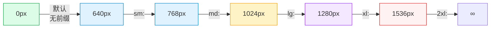
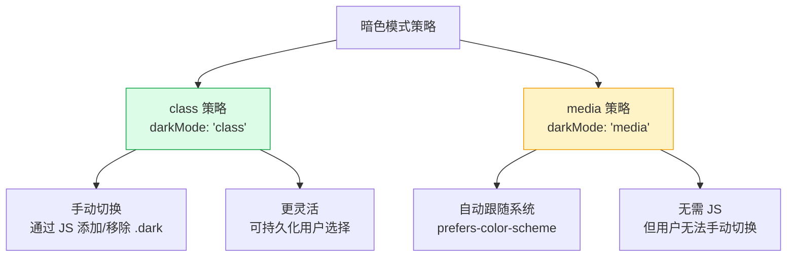

# TailwindCSS 速查手册：响应式 — Breakpoints / Dark Mode / Container Queries

> **TL;DR**
> Tailwind 采用 **Mobile-First（移动优先）** 的响应式策略：无前缀的样式作用于所有尺寸，`sm:` / `md:` / `lg:` / `xl:` / `2xl:` 前缀在对应断点**及以上**生效。暗色模式通过 `dark:` 前缀实现，支持 class 策略和 media 策略。

---

## 📊 1. 响应式系统全景图



---

## 📱 2. 断点系统

### 默认断点

| 前缀 | min-width | 典型设备 |
|------|-----------|---------|
| *(无前缀)* | 0px | 手机竖屏 |
| `sm:` | 640px | 手机横屏 / 小平板 |
| `md:` | 768px | 平板竖屏 |
| `lg:` | 1024px | 平板横屏 / 小桌面 |
| `xl:` | 1280px | 桌面 |
| `2xl:` | 1536px | 大桌面 / 外接显示器 |

### Mobile-First 核心理念

```html
<!-- ✅ 正确理解：无前缀 = 默认（最小屏幕），断点 = 向上覆盖 -->
<div class="text-sm md:text-base lg:text-lg">
  <!-- 手机：text-sm -->
  <!-- 平板：text-base -->
  <!-- 桌面：text-lg -->
</div>

<!-- 🧠 思维模型：从小到大逐步叠加 -->
<div class="
  w-full         /* 手机：全宽 */
  md:w-1/2       /* 平板：半宽 */
  lg:w-1/3       /* 桌面：三分之一 */
">
```

### 响应式网格布局

```html
<!-- Dashboard 卡片网格 -->
<div class="grid grid-cols-1 sm:grid-cols-2 lg:grid-cols-4 gap-4 p-4 sm:p-6">
  <div class="rounded-lg border p-4">卡片 1</div>
  <div class="rounded-lg border p-4">卡片 2</div>
  <div class="rounded-lg border p-4">卡片 3</div>
  <div class="rounded-lg border p-4">卡片 4</div>
</div>

<!-- 表单布局 -->
<form class="grid grid-cols-1 md:grid-cols-2 gap-4 md:gap-6">
  <div class="space-y-2">
    <label class="text-sm font-medium">姓名</label>
    <input class="w-full rounded-md border px-3 py-2" />
  </div>
  <div class="space-y-2">
    <label class="text-sm font-medium">邮箱</label>
    <input class="w-full rounded-md border px-3 py-2" />
  </div>
  <div class="col-span-1 md:col-span-2 space-y-2">
    <label class="text-sm font-medium">地址</label>
    <input class="w-full rounded-md border px-3 py-2" />
  </div>
</form>
```

### 响应式显示/隐藏

```html
<!-- 移动端显示、桌面端隐藏 -->
<div class="block lg:hidden">移动端菜单按钮</div>

<!-- 桌面端显示、移动端隐藏 -->
<div class="hidden lg:block">桌面端侧边栏</div>

<!-- 只在特定断点范围显示（用 max-* 限制） -->
<div class="hidden md:block xl:hidden">仅平板可见</div>
```

### 响应式 Admin 布局

```html
<div class="flex min-h-screen">
  <!-- 侧边栏：移动端隐藏，桌面端显示 -->
  <aside class="hidden lg:block lg:w-64 lg:shrink-0 border-r">
    侧边栏导航
  </aside>
  
  <div class="flex flex-1 flex-col">
    <!-- 顶栏 -->
    <header class="flex h-14 sm:h-16 items-center gap-4 border-b px-4 sm:px-6">
      <!-- 移动端汉堡菜单 -->
      <button class="lg:hidden p-2">☰</button>
      <h1 class="text-lg sm:text-xl font-semibold">仪表盘</h1>
    </header>
    
    <!-- 内容区 -->
    <main class="flex-1 p-4 sm:p-6 lg:p-8">
      内容
    </main>
  </div>
</div>
```

---

## 🌓 3. 暗色模式

### 两种策略



### class 策略（推荐）

```javascript
// tailwind.config.js
module.exports = {
  darkMode: 'class', // 或 'selector'（Tailwind v3.4+）
};
```

```html
<!-- HTML 根元素添加 dark 类 -->
<html class="dark">
  <body class="bg-white dark:bg-gray-950 text-gray-900 dark:text-gray-50">
    
    <!-- 卡片 -->
    <div class="rounded-lg border border-gray-200 dark:border-gray-800 
                bg-white dark:bg-gray-900 p-6">
      <h3 class="text-lg font-semibold text-gray-900 dark:text-gray-100">
        卡片标题
      </h3>
      <p class="mt-2 text-gray-600 dark:text-gray-400">
        描述文本
      </p>
    </div>
    
  </body>
</html>
```

### 主题切换实现

```tsx
// React 主题切换 Hook
function useTheme() {
  const [theme, setTheme] = useState<'light' | 'dark' | 'system'>(() => {
    if (typeof window === 'undefined') return 'system';
    return (localStorage.getItem('theme') as 'light' | 'dark') || 'system';
  });

  useEffect(() => {
    const root = document.documentElement;
    
    if (theme === 'system') {
      const isDark = window.matchMedia('(prefers-color-scheme: dark)').matches;
      root.classList.toggle('dark', isDark);
    } else {
      root.classList.toggle('dark', theme === 'dark');
    }
    
    localStorage.setItem('theme', theme);
  }, [theme]);

  return { theme, setTheme };
}
```

### 暗色模式颜色映射规范

| 场景 | 亮色 | 暗色 | Class |
|------|------|------|-------|
| 页面背景 | `white` | `gray-950` | `bg-white dark:bg-gray-950` |
| 卡片背景 | `white` | `gray-900` | `bg-white dark:bg-gray-900` |
| 主文本 | `gray-900` | `gray-50` | `text-gray-900 dark:text-gray-50` |
| 次文本 | `gray-600` | `gray-400` | `text-gray-600 dark:text-gray-400` |
| 辅助文本 | `gray-400` | `gray-500` | `text-gray-400 dark:text-gray-500` |
| 边框 | `gray-200` | `gray-800` | `border-gray-200 dark:border-gray-800` |
| hover 背景 | `gray-50` | `gray-800` | `hover:bg-gray-50 dark:hover:bg-gray-800` |

---

## 📦 4. 容器查询 @container

容器查询让组件根据**父容器宽度**（而非视口宽度）响应式变化。

### 配置

```javascript
// tailwind.config.js（Tailwind v3.2+）
module.exports = {
  plugins: [
    require('@tailwindcss/container-queries'),
  ],
};
```

### 使用

```html
<!-- 定义容器 -->
<div class="@container">
  <!-- 根据容器宽度响应 -->
  <div class="flex flex-col @md:flex-row @lg:gap-6 gap-3">
    
    <div>
      <h3 class="text-base @lg:text-xl font-semibold">标题</h3>
      <p class="text-sm @md:text-base text-gray-600">描述</p>
    </div>
  </div>
</div>
```

### 容器查询断点

| 前缀 | min-width |
|------|-----------|
| `@xs:` | 20rem (320px) |
| `@sm:` | 24rem (384px) |
| `@md:` | 28rem (448px) |
| `@lg:` | 32rem (512px) |
| `@xl:` | 36rem (576px) |
| `@2xl:` | 42rem (672px) |

### Admin 实战：自适应卡片

```html
<!-- 卡片在侧边栏中是竖排，在主区域中是横排 -->
<div class="@container">
  <article class="flex flex-col @sm:flex-row gap-4 rounded-lg border p-4">
    
    <div class="flex-1">
      <h3 class="font-semibold @sm:text-lg">文章标题</h3>
      <p class="mt-1 text-sm text-gray-500 @sm:line-clamp-2">文章摘要...</p>
      <div class="mt-2 flex gap-2">
        <span class="text-xs text-gray-400">2024-01-15</span>
      </div>
    </div>
  </article>
</div>
```

---

## 🖨️ 5. 其他媒体修饰符

| 修饰符 | 说明 |
|--------|------|
| `print:` | 打印模式 |
| `portrait:` | 竖屏 |
| `landscape:` | 横屏 |
| `motion-reduce:` | 系统减少动效 |
| `motion-safe:` | 系统允许动效 |
| `contrast-more:` | 系统高对比度 |
| `contrast-less:` | 系统低对比度 |

```html
<!-- 打印时隐藏不必要的元素 -->
<header class="print:hidden">导航栏</header>
<button class="print:hidden">操作按钮</button>

<!-- 打印时全宽显示 -->
<main class="max-w-7xl print:max-w-none">内容</main>
```

---

## 💣 6. 避坑指南

### 坑1: Desktop-First 思维错误

```html
<!-- ❌ Bad — 从大屏写起，层层缩小（反模式） -->
<div class="w-1/3 md:w-1/2 sm:w-full">
  <!-- 逻辑混乱，因为 sm 覆盖 md 覆盖默认 -->
</div>

<!-- ✅ Good — Mobile-First，从小到大 -->
<div class="w-full sm:w-1/2 lg:w-1/3">
  <!-- 手机全宽 → 平板半宽 → 桌面三分之一 -->
</div>
```

### 坑2: 暗色模式遗漏

```html
<!-- ❌ Bad — 忘记给 hover 状态添加 dark: -->
<button class="bg-gray-100 hover:bg-gray-200 text-gray-800">
  暗色模式下完全看不见！
</button>

<!-- ✅ Good — hover 也要适配暗色 -->
<button class="bg-gray-100 dark:bg-gray-800 
               hover:bg-gray-200 dark:hover:bg-gray-700 
               text-gray-800 dark:text-gray-200">
  暗色模式也正常
</button>
```

### 坑3: 断点方向搞反

```html
<!-- sm: 是 min-width: 640px，即 640px 及以上 -->
<!-- 不是"小于 640px" -->

<!-- 如果要"只在小于 md 时生效"，用 max-md: (Tailwind v3.2+) -->
<div class="max-md:flex-col flex flex-row">
  只在小于 768px 时垂直排列
</div>
```

---

## 🧠 7. 向 AI 提问的 Prompt 模板

```
请为一个中后台 Admin 系统设计完整的响应式方案（TailwindCSS），包含：
1. 三种屏幕布局策略：
   - 移动端（< 768px）：底部导航 + 全宽内容
   - 平板端（768-1024px）：可折叠侧边栏 + 内容区
   - 桌面端（> 1024px）：固定侧边栏 + 宽内容区
2. 暗色模式完整适配（使用 class 策略 + CSS 变量）
3. 主题切换组件的 React 实现
4. 容器查询实现自适应卡片组件
5. 打印样式适配

输出完整的布局代码和配置文件。
```

---

*👉 下一步预告：[../03-实战组件/导航栏.md](../03-实战组件/导航栏.md) — 用 Tailwind 构建生产级导航栏组件*
