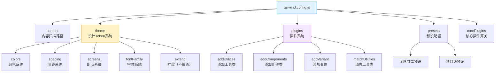
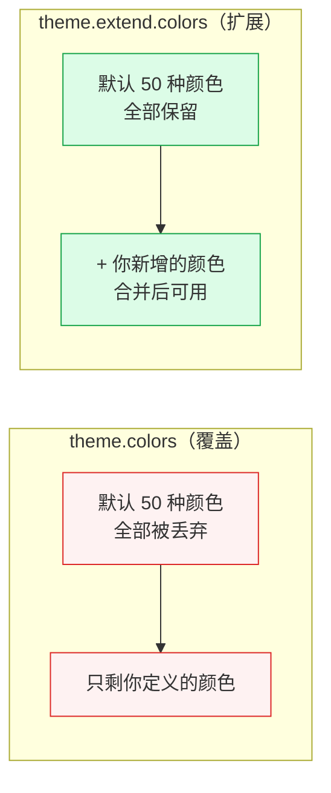
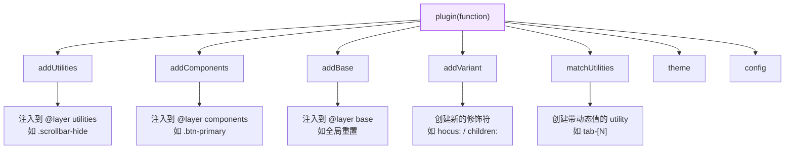

# TailwindCSS 配置篇：tailwind.config.js / Design Token / 插件系统

> **TL;DR**
> `tailwind.config.js` 是 Tailwind 的大脑——通过 `theme`、`extend`、`plugins` 三大核心配置项，你可以建立完整的 Design Token 体系，自定义每一个 utility class，甚至开发团队专属插件。掌握配置系统是从"用 Tailwind"到"驾驭 Tailwind"的关键跨越。

---

## 💡 1. 核心顿悟：配置文件就是你的设计系统

### 生动比喻：调色盘与画家

想象 Tailwind 是一家颜料工厂：
- **默认配置** = 工厂出厂的标准调色盘（400 种颜色、8 种间距、5 个断点）
- **`theme.extend`** = 你在标准盘上额外添加几种自定义色号
- **`theme` 覆写** = 直接丢掉工厂调色盘，完全用你自己调配的
- **`plugins`** = 请工厂帮你定制新品类的颜料（比如渐变、3D 效果）

### 底层剖析：配置的合并策略

```typescript
// Tailwind 内部配置合并逻辑（简化）
interface TailwindConfig {
  content: string[];
  theme: {
    colors?: Record<string, string>;
    spacing?: Record<string, string>;
    extend?: Partial<Theme>;  // extend 走深度合并
    // ...
  };
  plugins: Plugin[];
}

// 合并策略
function resolveConfig(userConfig: TailwindConfig): ResolvedConfig {
  const defaultTheme = require('tailwindcss/defaultTheme');
  
  // theme 下的直接属性：完全覆盖（Replace）
  // theme.extend 下的属性：深度合并（Deep Merge）
  return {
    ...defaultTheme,
    ...userConfig.theme,       // 覆盖默认值
    ...deepMerge(              // extend 合并到最终结果
      defaultTheme, 
      userConfig.theme?.extend ?? {}
    ),
  };
}
```

## 📊 2. 配置文件全景架构图



## 🏢 3. 完整配置文件解析

### 3.1 content — 内容扫描路径

```javascript
/** @type {import('tailwindcss').Config} */
module.exports = {
  content: {
    // 基础用法：glob 模式匹配
    files: [
      './src/**/*.{js,ts,jsx,tsx,mdx}',
      './index.html',
      // 如果使用了带 Tailwind class 的第三方库
      './node_modules/@tremor/**/*.{js,ts,jsx,tsx}',
    ],
    // 高级用法：自定义提取器
    extract: {
      // 针对特定文件类型使用自定义正则
      md: (content) => {
        return content.match(/[^<>"'`\s]*[^<>"'`\s:]/g) || [];
      },
    },
    // 安全列表：无论是否在源码中出现都会生成
    safelist: [
      'bg-red-500',       // 精确匹配
      'bg-green-500',
      {
        pattern: /bg-(red|green|blue)-(100|500|900)/, // 正则匹配
        variants: ['hover', 'focus'],                  // 同时生成变体
      },
    ],
  },
};
```

### 3.2 theme — 设计 Token 系统

```javascript
const defaultTheme = require('tailwindcss/defaultTheme');

module.exports = {
  theme: {
    // ========== 直接覆盖（Replace） ==========
    
    // 完全替换默认的屏幕断点
    screens: {
      'sm': '640px',
      'md': '768px',
      'lg': '1024px',
      'xl': '1280px',
      '2xl': '1536px',
      '3xl': '1920px',  // 大屏适配
    },

    // ========== 扩展（Extend） ==========
    extend: {
      // 在默认颜色基础上增加品牌色
      colors: {
        brand: {
          50:  '#eff6ff',
          100: '#dbeafe',
          200: '#bfdbfe',
          300: '#93c5fd',
          400: '#60a5fa',
          500: '#3b82f6',  // 主品牌色
          600: '#2563eb',
          700: '#1d4ed8',
          800: '#1e40af',
          900: '#1e3a8a',
          950: '#172554',
        },
        // 语义化颜色（推荐用 CSS 变量实现动态主题）
        surface: 'hsl(var(--surface))',
        primary: 'hsl(var(--primary))',
        muted:   'hsl(var(--muted))',
      },

      // 扩展间距系统
      spacing: {
        '4.5': '1.125rem',  // 18px
        '13':  '3.25rem',   // 52px
        '15':  '3.75rem',   // 60px
        '128': '32rem',     // 512px
      },

      // 扩展字体
      fontFamily: {
        sans: ['Inter', ...defaultTheme.fontFamily.sans],
        mono: ['JetBrains Mono', ...defaultTheme.fontFamily.mono],
        display: ['Cal Sans', 'Inter', 'sans-serif'],
      },

      // 扩展动画
      animation: {
        'fade-in': 'fadeIn 0.3s ease-out',
        'slide-up': 'slideUp 0.4s ease-out',
        'spin-slow': 'spin 3s linear infinite',
      },
      keyframes: {
        fadeIn: {
          '0%':   { opacity: '0' },
          '100%': { opacity: '1' },
        },
        slideUp: {
          '0%':   { transform: 'translateY(10px)', opacity: '0' },
          '100%': { transform: 'translateY(0)', opacity: '1' },
        },
      },

      // 扩展 z-index
      zIndex: {
        '60': '60',
        '70': '70',
        '80': '80',
        '90': '90',
        '100': '100',
      },
    },
  },
};
```

### 3.3 覆盖 vs 扩展的区别



> **铁律**：90% 的情况都应该用 `extend`。只有当你要完全重建某个 Token 系统（如品牌需要完全自定义的颜色盘）时才用覆盖。

## 💻 4. Design Token 体系实战

### 4.1 基于 CSS 变量的动态主题系统

```css
/* globals.css — shadcn/ui 风格的 Token 定义 */
@tailwind base;
@tailwind components;
@tailwind utilities;

@layer base {
  :root {
    /* 基础语义色 */
    --background: 0 0% 100%;
    --foreground: 222.2 84% 4.9%;
    --card: 0 0% 100%;
    --card-foreground: 222.2 84% 4.9%;
    --popover: 0 0% 100%;
    --popover-foreground: 222.2 84% 4.9%;
    --primary: 222.2 47.4% 11.2%;
    --primary-foreground: 210 40% 98%;
    --secondary: 210 40% 96%;
    --secondary-foreground: 222.2 47.4% 11.2%;
    --muted: 210 40% 96%;
    --muted-foreground: 215.4 16.3% 46.9%;
    --accent: 210 40% 96%;
    --accent-foreground: 222.2 47.4% 11.2%;
    --destructive: 0 84.2% 60.2%;
    --destructive-foreground: 210 40% 98%;
    --border: 214.3 31.8% 91.4%;
    --input: 214.3 31.8% 91.4%;
    --ring: 222.2 84% 4.9%;
    --radius: 0.5rem;
  }

  .dark {
    --background: 222.2 84% 4.9%;
    --foreground: 210 40% 98%;
    --card: 222.2 84% 4.9%;
    --card-foreground: 210 40% 98%;
    --primary: 210 40% 98%;
    --primary-foreground: 222.2 47.4% 11.2%;
    --secondary: 217.2 32.6% 17.5%;
    --secondary-foreground: 210 40% 98%;
    --muted: 217.2 32.6% 17.5%;
    --muted-foreground: 215 20.2% 65.1%;
    --accent: 217.2 32.6% 17.5%;
    --accent-foreground: 210 40% 98%;
    --destructive: 0 62.8% 30.6%;
    --destructive-foreground: 210 40% 98%;
    --border: 217.2 32.6% 17.5%;
    --input: 217.2 32.6% 17.5%;
    --ring: 212.7 26.8% 83.9%;
  }
}
```

对应的 Tailwind 配置：

```javascript
// tailwind.config.js
module.exports = {
  darkMode: 'class',  // 使用 class 策略切换暗色模式
  theme: {
    extend: {
      colors: {
        border: 'hsl(var(--border))',
        input: 'hsl(var(--input))',
        ring: 'hsl(var(--ring))',
        background: 'hsl(var(--background))',
        foreground: 'hsl(var(--foreground))',
        primary: {
          DEFAULT: 'hsl(var(--primary))',
          foreground: 'hsl(var(--primary-foreground))',
        },
        secondary: {
          DEFAULT: 'hsl(var(--secondary))',
          foreground: 'hsl(var(--secondary-foreground))',
        },
        destructive: {
          DEFAULT: 'hsl(var(--destructive))',
          foreground: 'hsl(var(--destructive-foreground))',
        },
        muted: {
          DEFAULT: 'hsl(var(--muted))',
          foreground: 'hsl(var(--muted-foreground))',
        },
        accent: {
          DEFAULT: 'hsl(var(--accent))',
          foreground: 'hsl(var(--accent-foreground))',
        },
        card: {
          DEFAULT: 'hsl(var(--card))',
          foreground: 'hsl(var(--card-foreground))',
        },
      },
      borderRadius: {
        lg: 'var(--radius)',
        md: 'calc(var(--radius) - 2px)',
        sm: 'calc(var(--radius) - 4px)',
      },
    },
  },
};
```

### 4.2 自定义 Preset 复用配置

```javascript
// presets/admin-preset.js — 团队共享的 Admin 预设
const defaultTheme = require('tailwindcss/defaultTheme');

module.exports = {
  theme: {
    extend: {
      colors: {
        brand: {
          50: '#f0f9ff',
          500: '#0ea5e9',
          900: '#0c4a6e',
        },
        sidebar: {
          DEFAULT: '#1e293b',
          foreground: '#e2e8f0',
          active: '#0ea5e9',
        },
      },
      fontFamily: {
        sans: ['Inter', ...defaultTheme.fontFamily.sans],
      },
      spacing: {
        sidebar: '16rem',      // 侧边栏宽度
        'sidebar-collapsed': '4rem',
        header: '4rem',        // 顶部导航高度
      },
      width: {
        sidebar: '16rem',
        'sidebar-collapsed': '4rem',
      },
      height: {
        header: '4rem',
      },
    },
  },
  plugins: [
    require('@tailwindcss/forms'),
    require('@tailwindcss/typography'),
  ],
};

// ===== 项目中使用预设 =====
// tailwind.config.js
module.exports = {
  presets: [require('./presets/admin-preset')],
  content: ['./src/**/*.{ts,tsx}'],
  theme: {
    extend: {
      // 项目特有的扩展会与 preset 深度合并
      colors: {
        success: '#10b981',
      },
    },
  },
};
```

## 🔌 5. 插件系统深度剖析

### 5.1 插件 API 全景



### 5.2 自定义 Utility 插件

```javascript
// plugins/scrollbar.js
const plugin = require('tailwindcss/plugin');

module.exports = plugin(function({ addUtilities }) {
  addUtilities({
    // 隐藏滚动条但保留滚动功能
    '.scrollbar-hide': {
      '-ms-overflow-style': 'none',
      'scrollbar-width': 'none',
      '&::-webkit-scrollbar': {
        display: 'none',
      },
    },
    // 细滚动条
    '.scrollbar-thin': {
      'scrollbar-width': 'thin',
      '&::-webkit-scrollbar': {
        width: '6px',
        height: '6px',
      },
      '&::-webkit-scrollbar-track': {
        'background': 'transparent',
      },
      '&::-webkit-scrollbar-thumb': {
        'background-color': 'rgb(156 163 175)',
        'border-radius': '3px',
      },
    },
  });
});

// 使用：<div class="scrollbar-hide overflow-y-auto">...</div>
```

### 5.3 自定义 Component 插件

```javascript
// plugins/admin-components.js
const plugin = require('tailwindcss/plugin');

module.exports = plugin(function({ addComponents, theme }) {
  addComponents({
    // Admin 系统常用的状态徽章
    '.badge': {
      display: 'inline-flex',
      alignItems: 'center',
      padding: `${theme('spacing.0.5')} ${theme('spacing.2')}`,
      fontSize: theme('fontSize.xs'),
      fontWeight: theme('fontWeight.medium'),
      borderRadius: theme('borderRadius.full'),
    },
    '.badge-success': {
      backgroundColor: theme('colors.green.100'),
      color: theme('colors.green.800'),
    },
    '.badge-warning': {
      backgroundColor: theme('colors.yellow.100'),
      color: theme('colors.yellow.800'),
    },
    '.badge-danger': {
      backgroundColor: theme('colors.red.100'),
      color: theme('colors.red.800'),
    },
  });
});

// 使用：<span class="badge badge-success">已上线</span>
```

### 5.4 自定义 Variant 插件

```javascript
// plugins/custom-variants.js
const plugin = require('tailwindcss/plugin');

module.exports = plugin(function({ addVariant }) {
  // hocus = hover + focus（Admin 中超常用）
  addVariant('hocus', ['&:hover', '&:focus']);
  
  // 选中子元素
  addVariant('children', '& > *');
  addVariant('children-hover', '& > *:hover');
  
  // 侧边栏收起状态
  addVariant('sidebar-collapsed', '.sidebar-collapsed &');
  
  // 暗色模式下的 hover
  addVariant('dark-hover', '.dark &:hover');
});

// 使用：
// <button class="hocus:bg-blue-600">按钮</button>
// <nav class="sidebar-collapsed:w-16 w-64">侧边栏</nav>
```

### 5.5 动态值插件（matchUtilities）

```javascript
// plugins/tab-size.js
const plugin = require('tailwindcss/plugin');

module.exports = plugin(function({ matchUtilities, theme }) {
  matchUtilities(
    {
      // 生成 tab-2, tab-4, tab-8 等
      tab: (value) => ({
        tabSize: value,
      }),
    },
    {
      values: theme('tabSize', {
        1: '1',
        2: '2',
        4: '4',
        8: '8',
      }),
    }
  );
});

// 使用：
// <pre class="tab-4">代码块</pre>
// 也支持任意值：<pre class="tab-[6]">代码块</pre>
```

## 💣 6. 避坑指南与反模式

### 坑1: theme 覆盖与 extend 混淆

```javascript
// ❌ Bad — 意外覆盖了所有默认颜色！
module.exports = {
  theme: {
    colors: {
      brand: '#0ea5e9', // 现在只有 brand 一种颜色可用
                        // text-gray-500, bg-blue-500 全部失效！
    },
  },
};

// ✅ Good — 使用 extend 保留默认值
module.exports = {
  theme: {
    extend: {
      colors: {
        brand: '#0ea5e9', // 所有默认颜色保留 + 新增 brand
      },
    },
  },
};
```

### 坑2: 插件中硬编码值而不使用 theme()

```javascript
// ❌ Bad — 硬编码导致无法跟随主题变化
addComponents({
  '.card': {
    padding: '24px',        // 硬编码
    color: '#374151',       // 硬编码
    borderRadius: '8px',    // 硬编码
  },
});

// ✅ Good — 使用 theme() 引用设计 Token
addComponents({
  '.card': {
    padding: theme('spacing.6'),
    color: theme('colors.gray.700'),
    borderRadius: theme('borderRadius.lg'),
  },
});
```

### 坑3: presets 和项目配置的合并顺序

```javascript
// 合并优先级（后者覆盖前者）：
// 1. Tailwind 默认配置
// 2. presets[0] → presets[1] → ...（按数组顺序）
// 3. 项目的 tailwind.config.js

// ⚠️ 注意：如果 preset 用了 theme 覆盖而非 extend，
// 后面的 preset 和项目配置的 extend 也会丢失被覆盖的部分！
```

## 🧠 7. 向 AI 提问的 Prompt 模板

### Prompt 1：设计 Token 系统

```
我要为一个中后台 Admin 系统设计 TailwindCSS 的 Design Token 体系。
要求：
1. 使用 CSS 变量实现亮/暗主题切换
2. 包含语义化颜色（primary/secondary/success/warning/danger）
3. 间距系统遵循 4px 基准网格
4. 字体系统支持中英文混排
5. 与 shadcn/ui 的 Token 命名兼容

请输出完整的 tailwind.config.js 和 globals.css 代码。
```

### Prompt 2：插件开发

```
请为我编写一个 TailwindCSS 插件，实现以下功能：
1. 添加 `.glass` 工具类（毛玻璃效果）
2. 添加 `hocus:` 变体（hover + focus 合并）
3. 添加 `.text-gradient` 组件类（文字渐变色）
4. 所有颜色值必须从 theme() 读取

请包含插件代码、配置方式和使用示例。
```

### Prompt 3：配置迁移

```
我要将一个使用 styled-components 的 Admin 项目迁移到 TailwindCSS。
当前设计系统有：
- 5 种品牌色（各 10 级色阶）
- 8 个间距级别
- 3 套字体
- 自定义断点

请帮我生成完整的 tailwind.config.js 配置文件，并说明迁移步骤。
```

## 📝 8. 实战练习

### 练习 1：从零搭建 Admin Design Token

基于 shadcn/ui 的 Token 方案，扩展以下内容：
- 添加 `sidebar`、`header`、`content` 三个区域的语义色
- 添加 `success`、`warning`、`info` 三种状态色
- 配置 `3xl: 1920px` 大屏断点

### 练习 2：编写团队 Preset

为你的团队编写一个可 npm 发布的 Tailwind preset，包含：
- 品牌色系统
- 统一的字体栈
- Admin 常用间距
- 至少 2 个自定义插件

### 练习 3：配置继承实验

创建三层配置：`base-preset.js → admin-preset.js → tailwind.config.js`，验证 `theme` 覆盖和 `extend` 在每一层的合并行为。

---

*👉 下一步预告：[02-速查手册/布局.md](./02-速查手册/布局.md) — 掌握 Flex / Grid / Position / Display 四大布局 Utility*
