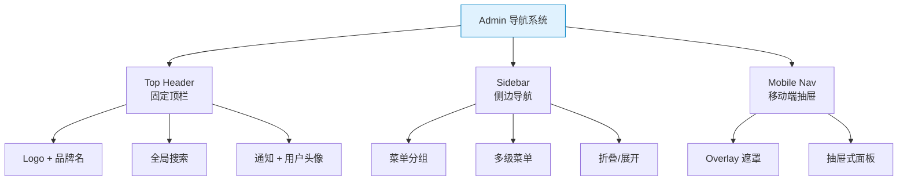

# TailwindCSS 实战组件：导航栏 — 响应式 Header + 侧边栏

> **TL;DR**
> 中后台系统的导航栏由**顶部 Header**（品牌/搜索/用户信息）和**侧边 Sidebar**（菜单/折叠）两部分组成。本文用纯 Tailwind utility class 构建完整的生产级导航组件，包含响应式适配和暗色模式。

---

## 📊 1. Admin 导航架构



---

## 💻 2. 固定顶栏 Header

```html
<header class="sticky top-0 z-50 w-full border-b bg-background/95 backdrop-blur supports-[backdrop-filter]:bg-background/60">
  <div class="flex h-14 items-center px-4 sm:px-6">
    <!-- 移动端菜单按钮 -->
    <button class="mr-2 inline-flex items-center justify-center rounded-md p-2 
                   text-muted-foreground hover:bg-accent hover:text-accent-foreground
                   lg:hidden">
      <svg class="size-5" fill="none" stroke="currentColor" viewBox="0 0 24 24">
        <path stroke-linecap="round" stroke-linejoin="round" stroke-width="2" d="M4 6h16M4 12h16M4 18h16"/>
      </svg>
    </button>

    <!-- Logo -->
    <a href="/" class="flex items-center gap-2 font-semibold">
      <div class="flex size-8 items-center justify-center rounded-lg bg-primary text-primary-foreground text-sm font-bold">
        A
      </div>
      <span class="hidden sm:inline-block">Admin Pro</span>
    </a>

    <!-- 全局搜索 -->
    <div class="ml-4 flex-1 md:ml-8 md:max-w-md">
      <div class="relative">
        <svg class="absolute left-2.5 top-2.5 size-4 text-muted-foreground" fill="none" stroke="currentColor" viewBox="0 0 24 24">
          <path stroke-linecap="round" stroke-linejoin="round" stroke-width="2" d="M21 21l-6-6m2-5a7 7 0 11-14 0 7 7 0 0114 0z"/>
        </svg>
        <input class="h-9 w-full rounded-md border border-input bg-transparent pl-8 pr-3 text-sm 
                      placeholder:text-muted-foreground 
                      focus:outline-none focus:ring-1 focus:ring-ring"
               placeholder="搜索菜单、功能..." />
        <kbd class="pointer-events-none absolute right-2.5 top-2 hidden h-5 select-none items-center gap-1 rounded border bg-muted px-1.5 text-[10px] font-medium text-muted-foreground sm:flex">
          ⌘K
        </kbd>
      </div>
    </div>

    <!-- 右侧操作 -->
    <div class="ml-auto flex items-center gap-1 sm:gap-2">
      <!-- 通知 -->
      <button class="relative inline-flex size-9 items-center justify-center rounded-md 
                     text-muted-foreground hover:bg-accent hover:text-accent-foreground">
        <svg class="size-5" fill="none" stroke="currentColor" viewBox="0 0 24 24">
          <path stroke-linecap="round" stroke-linejoin="round" stroke-width="2" d="M15 17h5l-1.405-1.405A2.032 2.032 0 0118 14.158V11a6.002 6.002 0 00-4-5.659V5a2 2 0 10-4 0v.341C7.67 6.165 6 8.388 6 11v3.159c0 .538-.214 1.055-.595 1.436L4 17h5m6 0v1a3 3 0 11-6 0v-1m6 0H9"/>
        </svg>
        <!-- 未读标记 -->
        <span class="absolute -top-0.5 -right-0.5 flex size-4 items-center justify-center rounded-full bg-destructive text-[10px] text-destructive-foreground">
          3
        </span>
      </button>

      <!-- 分割线 -->
      <div class="hidden h-6 w-px bg-border sm:block"></div>

      <!-- 用户头像 -->
      <button class="flex items-center gap-2 rounded-md p-1.5 hover:bg-accent">
        <div class="size-7 rounded-full bg-gradient-to-br from-blue-500 to-purple-600"></div>
        <span class="hidden text-sm font-medium md:inline-block">张三</span>
        <svg class="hidden size-4 text-muted-foreground md:block" fill="none" stroke="currentColor" viewBox="0 0 24 24">
          <path stroke-linecap="round" stroke-linejoin="round" stroke-width="2" d="M19 9l-7 7-7-7"/>
        </svg>
      </button>
    </div>
  </div>
</header>
```

---

## 💻 3. 侧边栏 Sidebar

```html
<!-- 桌面端侧边栏 -->
<aside class="hidden lg:flex lg:w-64 lg:flex-col lg:border-r lg:bg-muted/40">
  <!-- 顶部 Logo 区 -->
  <div class="flex h-14 items-center border-b px-4">
    <a href="/" class="flex items-center gap-2 font-semibold">
      <div class="flex size-7 items-center justify-center rounded-lg bg-primary text-primary-foreground text-xs font-bold">
        A
      </div>
      <span>Admin Pro</span>
    </a>
  </div>

  <!-- 菜单区域 -->
  <nav class="flex-1 overflow-y-auto px-3 py-4">
    <!-- 菜单分组标题 -->
    <p class="mb-2 px-2 text-xs font-semibold uppercase tracking-wider text-muted-foreground">
      概览
    </p>
    
    <!-- 菜单项 - 选中态 -->
    <a href="#" class="flex items-center gap-3 rounded-md bg-accent px-3 py-2 text-sm font-medium text-accent-foreground">
      <svg class="size-4" fill="none" stroke="currentColor" viewBox="0 0 24 24">
        <path stroke-linecap="round" stroke-linejoin="round" stroke-width="2" d="M3 12l2-2m0 0l7-7 7 7M5 10v10a1 1 0 001 1h3m10-11l2 2m-2-2v10a1 1 0 01-1 1h-3m-6 0a1 1 0 001-1v-4a1 1 0 011-1h2a1 1 0 011 1v4a1 1 0 001 1m-6 0h6"/>
      </svg>
      仪表盘
    </a>
    
    <!-- 菜单项 - 默认态 -->
    <a href="#" class="group flex items-center gap-3 rounded-md px-3 py-2 text-sm font-medium text-muted-foreground hover:bg-accent hover:text-accent-foreground transition-colors">
      <svg class="size-4 text-muted-foreground group-hover:text-accent-foreground transition-colors" fill="none" stroke="currentColor" viewBox="0 0 24 24">
        <path stroke-linecap="round" stroke-linejoin="round" stroke-width="2" d="M12 4.354a4 4 0 110 5.292M15 21H3v-1a6 6 0 0112 0v1zm0 0h6v-1a6 6 0 00-9-5.197M13 7a4 4 0 11-8 0 4 4 0 018 0z"/>
      </svg>
      用户管理
      <!-- 徽标 -->
      <span class="ml-auto rounded-full bg-primary/10 px-2 py-0.5 text-xs font-medium text-primary">
        128
      </span>
    </a>

    <!-- 可展开的子菜单 -->
    <div>
      <button class="group flex w-full items-center gap-3 rounded-md px-3 py-2 text-sm font-medium text-muted-foreground hover:bg-accent hover:text-accent-foreground transition-colors">
        <svg class="size-4" fill="none" stroke="currentColor" viewBox="0 0 24 24">
          <path stroke-linecap="round" stroke-linejoin="round" stroke-width="2" d="M9 12h6m-6 4h6m2 5H7a2 2 0 01-2-2V5a2 2 0 012-2h5.586a1 1 0 01.707.293l5.414 5.414a1 1 0 01.293.707V19a2 2 0 01-2 2z"/>
        </svg>
        内容管理
        <!-- 展开箭头 -->
        <svg class="ml-auto size-4 transition-transform duration-200 group-data-[state=open]:rotate-180" fill="none" stroke="currentColor" viewBox="0 0 24 24">
          <path stroke-linecap="round" stroke-linejoin="round" stroke-width="2" d="M19 9l-7 7-7-7"/>
        </svg>
      </button>
      <!-- 子菜单 -->
      <div class="ml-4 mt-1 space-y-1 border-l pl-3">
        <a href="#" class="block rounded-md px-3 py-1.5 text-sm text-muted-foreground hover:bg-accent hover:text-accent-foreground transition-colors">
          文章列表
        </a>
        <a href="#" class="block rounded-md px-3 py-1.5 text-sm text-muted-foreground hover:bg-accent hover:text-accent-foreground transition-colors">
          分类管理
        </a>
      </div>
    </div>

    <!-- 分组分隔 -->
    <div class="my-4 h-px bg-border"></div>
    
    <p class="mb-2 px-2 text-xs font-semibold uppercase tracking-wider text-muted-foreground">
      系统
    </p>

    <a href="#" class="group flex items-center gap-3 rounded-md px-3 py-2 text-sm font-medium text-muted-foreground hover:bg-accent hover:text-accent-foreground transition-colors">
      <svg class="size-4" fill="none" stroke="currentColor" viewBox="0 0 24 24">
        <path stroke-linecap="round" stroke-linejoin="round" stroke-width="2" d="M10.325 4.317c.426-1.756 2.924-1.756 3.35 0a1.724 1.724 0 002.573 1.066c1.543-.94 3.31.826 2.37 2.37a1.724 1.724 0 001.066 2.573c1.756.426 1.756 2.924 0 3.35a1.724 1.724 0 00-1.066 2.573c.94 1.543-.826 3.31-2.37 2.37a1.724 1.724 0 00-2.573 1.066c-.426 1.756-2.924 1.756-3.35 0a1.724 1.724 0 00-2.573-1.066c-1.543.94-3.31-.826-2.37-2.37a1.724 1.724 0 00-1.066-2.573c-1.756-.426-1.756-2.924 0-3.35a1.724 1.724 0 001.066-2.573c-.94-1.543.826-3.31 2.37-2.37.996.608 2.296.07 2.572-1.065z"/>
        <path stroke-linecap="round" stroke-linejoin="round" stroke-width="2" d="M15 12a3 3 0 11-6 0 3 3 0 016 0z"/>
      </svg>
      系统设置
    </a>
  </nav>

  <!-- 底部用户信息 -->
  <div class="border-t p-3">
    <div class="flex items-center gap-3 rounded-md p-2 hover:bg-accent transition-colors cursor-pointer">
      <div class="size-8 rounded-full bg-gradient-to-br from-blue-500 to-purple-600"></div>
      <div class="flex-1 min-w-0">
        <p class="text-sm font-medium truncate">张三</p>
        <p class="text-xs text-muted-foreground truncate">admin@example.com</p>
      </div>
      <svg class="size-4 text-muted-foreground shrink-0" fill="none" stroke="currentColor" viewBox="0 0 24 24">
        <path stroke-linecap="round" stroke-linejoin="round" stroke-width="2" d="M8 9l4-4 4 4m0 6l-4 4-4-4"/>
      </svg>
    </div>
  </div>
</aside>
```

---

## 📱 4. 移动端抽屉式导航

```html
<!-- Overlay 遮罩 -->
<div class="fixed inset-0 z-50 bg-black/50 backdrop-blur-sm lg:hidden
            transition-opacity duration-300"
     :class="open ? 'opacity-100' : 'opacity-0 pointer-events-none'">
</div>

<!-- 抽屉面板 -->
<div class="fixed inset-y-0 left-0 z-50 w-72 bg-background shadow-xl lg:hidden
            transition-transform duration-300 ease-out"
     :class="open ? 'translate-x-0' : '-translate-x-full'">
  
  <!-- 关闭按钮 -->
  <div class="flex h-14 items-center justify-between border-b px-4">
    <span class="font-semibold">Admin Pro</span>
    <button class="rounded-md p-1.5 hover:bg-accent" @click="open = false">
      <svg class="size-5" fill="none" stroke="currentColor" viewBox="0 0 24 24">
        <path stroke-linecap="round" stroke-linejoin="round" stroke-width="2" d="M6 18L18 6M6 6l12 12"/>
      </svg>
    </button>
  </div>
  
  <!-- 与桌面端侧边栏相同的菜单内容 -->
  <nav class="flex-1 overflow-y-auto p-4">
    <!-- 菜单项... -->
  </nav>
</div>
```

---

## 💣 5. 避坑指南

### 坑1: 固定侧边栏与内容区滚动冲突

```html
<!-- ✅ 正确的布局结构 -->
<div class="flex h-screen overflow-hidden">
  <aside class="w-64 shrink-0 overflow-y-auto border-r">
    侧边栏（独立滚动）
  </aside>
  <main class="flex-1 overflow-y-auto">
    内容区（独立滚动）
  </main>
</div>
```

### 坑2: z-index 管理混乱

```html
<!-- 建议的 z-index 层级 -->
<!-- z-10: Sticky 表头 -->
<!-- z-30: 侧边栏 -->
<!-- z-40: 顶栏 -->
<!-- z-50: 移动端遮罩 + 抽屉 -->
<!-- z-[60]: 模态框 -->
<!-- z-[70]: Toast 通知 -->
```

---

## 🧠 6. 向 AI 提问的 Prompt 模板

```
请用 TailwindCSS + React 实现一个完整的 Admin 导航系统，包含：
1. 固定顶栏：Logo / 全局搜索 / 通知徽标 / 用户下拉菜单
2. 侧边栏：分组菜单 / 可展开子菜单 / 选中高亮 / 折叠模式
3. 移动端：汉堡菜单触发抽屉式侧边栏 + 遮罩
4. 暗色模式完整适配
5. 使用 group/peer 实现菜单交互

代码需要可直接运行，不使用任何第三方 UI 库。
```

---

*👉 下一步预告：[卡片.md](./卡片.md) — 构建多种风格的 Admin 卡片组件*
