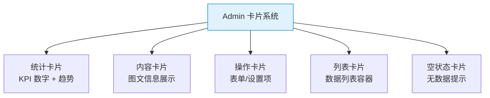

# TailwindCSS 实战组件：卡片 — Dashboard 统计卡 / 内容卡 / 操作卡

> **TL;DR**
> 卡片是中后台最高频的 UI 模块。本文覆盖统计卡片、内容卡片、操作卡片、列表卡片等多种变体，全部用纯 Tailwind class 实现，可直接复制使用。

---

## 📊 1. 卡片类型全景



---

## 📈 2. Dashboard 统计卡片

```html
<!-- 统计卡片组 -->
<div class="grid grid-cols-1 gap-4 sm:grid-cols-2 lg:grid-cols-4">
  
  <!-- 卡片1: 总收入 -->
  <div class="rounded-lg border bg-card p-6 shadow-sm">
    <div class="flex items-center justify-between">
      <p class="text-sm font-medium text-muted-foreground">总收入</p>
      <svg class="size-4 text-muted-foreground" fill="none" stroke="currentColor" viewBox="0 0 24 24">
        <path stroke-linecap="round" stroke-linejoin="round" stroke-width="2" d="M12 8c-1.657 0-3 .895-3 2s1.343 2 3 2 3 .895 3 2-1.343 2-3 2m0-8c1.11 0 2.08.402 2.599 1M12 8V7m0 1v8m0 0v1m0-1c-1.11 0-2.08-.402-2.599-1M21 12a9 9 0 11-18 0 9 9 0 0118 0z"/>
      </svg>
    </div>
    <div class="mt-2">
      <p class="text-2xl font-bold tabular-nums">¥45,231.89</p>
      <p class="mt-1 flex items-center text-xs">
        <span class="inline-flex items-center rounded-full bg-green-50 px-1.5 py-0.5 text-green-700 dark:bg-green-500/10 dark:text-green-400">
          <svg class="mr-0.5 size-3" fill="currentColor" viewBox="0 0 20 20"><path fill-rule="evenodd" d="M5.293 9.707a1 1 0 010-1.414l4-4a1 1 0 011.414 0l4 4a1 1 0 01-1.414 1.414L10 6.414l-3.293 3.293a1 1 0 01-1.414 0z"/></svg>
          +20.1%
        </span>
        <span class="ml-1.5 text-muted-foreground">vs 上月</span>
      </p>
    </div>
  </div>
  
  <!-- 卡片2: 新增用户 -->
  <div class="rounded-lg border bg-card p-6 shadow-sm">
    <div class="flex items-center justify-between">
      <p class="text-sm font-medium text-muted-foreground">新增用户</p>
      <svg class="size-4 text-muted-foreground" fill="none" stroke="currentColor" viewBox="0 0 24 24">
        <path stroke-linecap="round" stroke-linejoin="round" stroke-width="2" d="M17 20h5v-2a3 3 0 00-5.356-1.857M17 20H7m10 0v-2c0-.656-.126-1.283-.356-1.857M7 20H2v-2a3 3 0 015.356-1.857M7 20v-2c0-.656.126-1.283.356-1.857m0 0a5.002 5.002 0 019.288 0M15 7a3 3 0 11-6 0 3 3 0 016 0z"/>
      </svg>
    </div>
    <div class="mt-2">
      <p class="text-2xl font-bold tabular-nums">+2,350</p>
      <p class="mt-1 flex items-center text-xs">
        <span class="inline-flex items-center rounded-full bg-green-50 px-1.5 py-0.5 text-green-700 dark:bg-green-500/10 dark:text-green-400">
          +12.5%
        </span>
        <span class="ml-1.5 text-muted-foreground">vs 上月</span>
      </p>
    </div>
  </div>

  <!-- 卡片3: 下降趋势 -->
  <div class="rounded-lg border bg-card p-6 shadow-sm">
    <div class="flex items-center justify-between">
      <p class="text-sm font-medium text-muted-foreground">退款率</p>
      <svg class="size-4 text-muted-foreground" fill="none" stroke="currentColor" viewBox="0 0 24 24">
        <path stroke-linecap="round" stroke-linejoin="round" stroke-width="2" d="M13 17h8m0 0V9m0 8l-8-8-4 4-6-6"/>
      </svg>
    </div>
    <div class="mt-2">
      <p class="text-2xl font-bold tabular-nums">3.2%</p>
      <p class="mt-1 flex items-center text-xs">
        <span class="inline-flex items-center rounded-full bg-red-50 px-1.5 py-0.5 text-red-700 dark:bg-red-500/10 dark:text-red-400">
          <svg class="mr-0.5 size-3 rotate-180" fill="currentColor" viewBox="0 0 20 20"><path fill-rule="evenodd" d="M5.293 9.707a1 1 0 010-1.414l4-4a1 1 0 011.414 0l4 4a1 1 0 01-1.414 1.414L10 6.414l-3.293 3.293a1 1 0 01-1.414 0z"/></svg>
          +0.8%
        </span>
        <span class="ml-1.5 text-muted-foreground">需关注</span>
      </p>
    </div>
  </div>

  <!-- 卡片4 -->
  <div class="rounded-lg border bg-card p-6 shadow-sm">
    <div class="flex items-center justify-between">
      <p class="text-sm font-medium text-muted-foreground">活跃率</p>
      <svg class="size-4 text-muted-foreground" fill="none" stroke="currentColor" viewBox="0 0 24 24">
        <path stroke-linecap="round" stroke-linejoin="round" stroke-width="2" d="M9 19v-6a2 2 0 00-2-2H5a2 2 0 00-2 2v6a2 2 0 002 2h2a2 2 0 002-2zm0 0V9a2 2 0 012-2h2a2 2 0 012 2v10m-6 0a2 2 0 002 2h2a2 2 0 002-2m0 0V5a2 2 0 012-2h2a2 2 0 012 2v14a2 2 0 01-2 2h-2a2 2 0 01-2-2z"/>
      </svg>
    </div>
    <div class="mt-2">
      <p class="text-2xl font-bold tabular-nums">78.3%</p>
      <div class="mt-2 h-2 w-full overflow-hidden rounded-full bg-muted">
        <div class="h-full w-[78%] rounded-full bg-primary"></div>
      </div>
    </div>
  </div>
</div>
```

---

## 📄 3. 内容卡片

```html
<!-- 图文卡片 -->
<div class="group overflow-hidden rounded-lg border bg-card shadow-sm transition-shadow hover:shadow-md">
  <div class="aspect-video overflow-hidden">
    
  </div>
  <div class="p-4">
    <div class="flex items-center gap-2">
      <span class="rounded-full bg-blue-100 px-2 py-0.5 text-xs font-medium text-blue-700 dark:bg-blue-500/10 dark:text-blue-400">
        技术
      </span>
      <span class="text-xs text-muted-foreground">5 分钟前</span>
    </div>
    <h3 class="mt-2 font-semibold leading-snug group-hover:text-primary transition-colors">
      TailwindCSS v4 正式发布
    </h3>
    <p class="mt-1.5 text-sm text-muted-foreground line-clamp-2">
      全新的 CSS-First 配置方式，更快的构建速度，更小的产物体积...
    </p>
    <div class="mt-3 flex items-center gap-3">
      <div class="flex items-center gap-1.5">
        <div class="size-5 rounded-full bg-gray-300"></div>
        <span class="text-xs text-muted-foreground">张三</span>
      </div>
      <span class="text-xs text-muted-foreground">·</span>
      <span class="text-xs text-muted-foreground">128 阅读</span>
    </div>
  </div>
</div>
```

---

## ⚙️ 4. 设置/操作卡片

```html
<!-- 设置项卡片 -->
<div class="rounded-lg border bg-card">
  <div class="border-b p-4">
    <h3 class="font-semibold">通知设置</h3>
    <p class="mt-1 text-sm text-muted-foreground">配置您的通知偏好</p>
  </div>
  <div class="divide-y">
    <div class="flex items-center justify-between p-4">
      <div>
        <p class="text-sm font-medium">邮件通知</p>
        <p class="text-sm text-muted-foreground">新订单时发送邮件</p>
      </div>
      <!-- Toggle -->
      <button class="relative inline-flex h-6 w-11 shrink-0 cursor-pointer rounded-full border-2 border-transparent bg-primary transition-colors">
        <span class="pointer-events-none inline-block size-5 translate-x-5 rounded-full bg-white shadow-lg ring-0 transition-transform"></span>
      </button>
    </div>
    <div class="flex items-center justify-between p-4">
      <div>
        <p class="text-sm font-medium">短信通知</p>
        <p class="text-sm text-muted-foreground">紧急事项短信提醒</p>
      </div>
      <button class="relative inline-flex h-6 w-11 shrink-0 cursor-pointer rounded-full border-2 border-transparent bg-muted transition-colors">
        <span class="pointer-events-none inline-block size-5 translate-x-0 rounded-full bg-white shadow-lg ring-0 transition-transform"></span>
      </button>
    </div>
  </div>
  <div class="flex justify-end border-t p-4">
    <button class="rounded-md bg-primary px-4 py-2 text-sm font-medium text-primary-foreground hover:bg-primary/90">
      保存更改
    </button>
  </div>
</div>
```

---

## 📋 5. 空状态卡片

```html
<div class="flex flex-col items-center justify-center rounded-lg border border-dashed p-12 text-center">
  <div class="flex size-12 items-center justify-center rounded-full bg-muted">
    <svg class="size-6 text-muted-foreground" fill="none" stroke="currentColor" viewBox="0 0 24 24">
      <path stroke-linecap="round" stroke-linejoin="round" stroke-width="2" d="M20 13V6a2 2 0 00-2-2H6a2 2 0 00-2 2v7m16 0v5a2 2 0 01-2 2H6a2 2 0 01-2-2v-5m16 0h-2.586a1 1 0 00-.707.293l-2.414 2.414a1 1 0 01-.707.293h-3.172a1 1 0 01-.707-.293l-2.414-2.414A1 1 0 006.586 13H4"/>
    </svg>
  </div>
  <h3 class="mt-4 text-lg font-semibold">暂无数据</h3>
  <p class="mt-1 text-sm text-muted-foreground">尚未创建任何内容，点击下方按钮开始</p>
  <button class="mt-4 inline-flex items-center gap-2 rounded-md bg-primary px-4 py-2 text-sm font-medium text-primary-foreground hover:bg-primary/90">
    <svg class="size-4" fill="none" stroke="currentColor" viewBox="0 0 24 24">
      <path stroke-linecap="round" stroke-linejoin="round" stroke-width="2" d="M12 4v16m8-8H4"/>
    </svg>
    新建内容
  </button>
</div>
```

---

## 🧠 6. 向 AI 提问的 Prompt 模板

```
请用 TailwindCSS 实现以下 Admin 卡片组件：
1. Dashboard 统计卡片（4列，带趋势箭头和进度条）
2. 带图片的内容卡片（hover 图片放大 + 标题变色）
3. 设置项卡片（包含 Toggle 开关和保存按钮）
4. 空状态卡片（图标 + 描述 + CTA 按钮）

所有组件需要：暗色模式适配、响应式布局、hover 过渡动画。
输出可直接复制使用的 HTML 代码。
```

---

*👉 下一步预告：[表格.md](./表格.md) — 构建高级数据表格组件*
