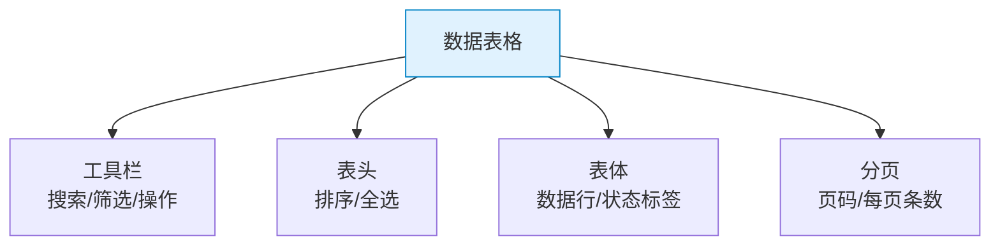

# TailwindCSS 实战组件：表格 — 数据表格 / 筛选 / 分页

> **TL;DR**
> 数据表格是中后台最核心的 UI 组件。本文用 Tailwind 构建包含表头排序、斑马纹、选中行、Sticky 表头、响应式适配和分页的完整表格组件。

---

## 📊 1. 表格架构



---

## 💻 2. 完整数据表格

```html
<div class="rounded-lg border bg-card">
  <!-- 工具栏 -->
  <div class="flex flex-col gap-3 border-b p-4 sm:flex-row sm:items-center sm:justify-between">
    <div class="flex items-center gap-2">
      <div class="relative">
        <svg class="absolute left-2.5 top-2.5 size-4 text-muted-foreground" fill="none" stroke="currentColor" viewBox="0 0 24 24">
          <path stroke-linecap="round" stroke-linejoin="round" stroke-width="2" d="M21 21l-6-6m2-5a7 7 0 11-14 0 7 7 0 0114 0z"/>
        </svg>
        <input class="h-9 w-64 rounded-md border bg-transparent pl-8 pr-3 text-sm placeholder:text-muted-foreground focus:outline-none focus:ring-1 focus:ring-ring" 
               placeholder="搜索用户..." />
      </div>
      <select class="h-9 rounded-md border bg-transparent px-3 text-sm focus:outline-none focus:ring-1 focus:ring-ring">
        <option>全部状态</option>
        <option>活跃</option>
        <option>禁用</option>
      </select>
    </div>
    <div class="flex items-center gap-2">
      <button class="inline-flex h-9 items-center gap-1.5 rounded-md border px-3 text-sm font-medium hover:bg-accent">
        <svg class="size-4" fill="none" stroke="currentColor" viewBox="0 0 24 24">
          <path stroke-linecap="round" stroke-linejoin="round" stroke-width="2" d="M4 16v1a3 3 0 003 3h10a3 3 0 003-3v-1m-4-4l-4 4m0 0l-4-4m4 4V4"/>
        </svg>
        导出
      </button>
      <button class="inline-flex h-9 items-center gap-1.5 rounded-md bg-primary px-3 text-sm font-medium text-primary-foreground hover:bg-primary/90">
        <svg class="size-4" fill="none" stroke="currentColor" viewBox="0 0 24 24">
          <path stroke-linecap="round" stroke-linejoin="round" stroke-width="2" d="M12 4v16m8-8H4"/>
        </svg>
        新增用户
      </button>
    </div>
  </div>

  <!-- 表格容器 -->
  <div class="overflow-x-auto">
    <table class="w-full min-w-[700px]">
      <!-- 表头 -->
      <thead>
        <tr class="border-b bg-muted/50">
          <th class="w-12 px-4 py-3">
            <input type="checkbox" class="size-4 rounded border-gray-300" />
          </th>
          <th class="px-4 py-3 text-left text-sm font-medium text-muted-foreground">
            <button class="inline-flex items-center gap-1 hover:text-foreground">
              用户名
              <svg class="size-3.5" fill="none" stroke="currentColor" viewBox="0 0 24 24">
                <path stroke-linecap="round" stroke-linejoin="round" stroke-width="2" d="M7 11l5-5m0 0l5 5m-5-5v12"/>
              </svg>
            </button>
          </th>
          <th class="px-4 py-3 text-left text-sm font-medium text-muted-foreground">邮箱</th>
          <th class="px-4 py-3 text-left text-sm font-medium text-muted-foreground">角色</th>
          <th class="px-4 py-3 text-left text-sm font-medium text-muted-foreground">状态</th>
          <th class="px-4 py-3 text-left text-sm font-medium text-muted-foreground">创建时间</th>
          <th class="w-20 px-4 py-3 text-right text-sm font-medium text-muted-foreground">操作</th>
        </tr>
      </thead>
      
      <!-- 表体 -->
      <tbody class="divide-y">
        <!-- 数据行 -->
        <tr class="hover:bg-muted/50 transition-colors">
          <td class="px-4 py-3">
            <input type="checkbox" class="size-4 rounded border-gray-300" />
          </td>
          <td class="px-4 py-3">
            <div class="flex items-center gap-3">
              <div class="size-8 rounded-full bg-gradient-to-br from-blue-500 to-purple-600"></div>
              <div>
                <p class="text-sm font-medium">张三</p>
                <p class="text-xs text-muted-foreground">ID: 10001</p>
              </div>
            </div>
          </td>
          <td class="px-4 py-3 text-sm">zhangsan@example.com</td>
          <td class="px-4 py-3">
            <span class="rounded-full bg-purple-100 px-2 py-0.5 text-xs font-medium text-purple-700 dark:bg-purple-500/10 dark:text-purple-400">
              管理员
            </span>
          </td>
          <td class="px-4 py-3">
            <span class="inline-flex items-center gap-1 rounded-full bg-green-100 px-2 py-0.5 text-xs font-medium text-green-700 dark:bg-green-500/10 dark:text-green-400">
              <span class="size-1.5 rounded-full bg-green-500"></span>
              活跃
            </span>
          </td>
          <td class="px-4 py-3 text-sm text-muted-foreground tabular-nums">2024-01-15</td>
          <td class="px-4 py-3 text-right">
            <button class="inline-flex size-8 items-center justify-center rounded-md hover:bg-accent">
              <svg class="size-4" fill="none" stroke="currentColor" viewBox="0 0 24 24">
                <path stroke-linecap="round" stroke-linejoin="round" stroke-width="2" d="M12 5v.01M12 12v.01M12 19v.01M12 6a1 1 0 110-2 1 1 0 010 2zm0 7a1 1 0 110-2 1 1 0 010 2zm0 7a1 1 0 110-2 1 1 0 010 2z"/>
              </svg>
            </button>
          </td>
        </tr>

        <!-- 禁用状态行 -->
        <tr class="hover:bg-muted/50 transition-colors">
          <td class="px-4 py-3">
            <input type="checkbox" class="size-4 rounded border-gray-300" />
          </td>
          <td class="px-4 py-3">
            <div class="flex items-center gap-3">
              <div class="size-8 rounded-full bg-gray-300"></div>
              <div>
                <p class="text-sm font-medium">李四</p>
                <p class="text-xs text-muted-foreground">ID: 10002</p>
              </div>
            </div>
          </td>
          <td class="px-4 py-3 text-sm">lisi@example.com</td>
          <td class="px-4 py-3">
            <span class="rounded-full bg-blue-100 px-2 py-0.5 text-xs font-medium text-blue-700 dark:bg-blue-500/10 dark:text-blue-400">
              编辑
            </span>
          </td>
          <td class="px-4 py-3">
            <span class="inline-flex items-center gap-1 rounded-full bg-gray-100 px-2 py-0.5 text-xs font-medium text-gray-600 dark:bg-gray-500/10 dark:text-gray-400">
              <span class="size-1.5 rounded-full bg-gray-400"></span>
              已禁用
            </span>
          </td>
          <td class="px-4 py-3 text-sm text-muted-foreground tabular-nums">2024-02-20</td>
          <td class="px-4 py-3 text-right">
            <button class="inline-flex size-8 items-center justify-center rounded-md hover:bg-accent">
              <svg class="size-4" fill="none" stroke="currentColor" viewBox="0 0 24 24">
                <path stroke-linecap="round" stroke-linejoin="round" stroke-width="2" d="M12 5v.01M12 12v.01M12 19v.01M12 6a1 1 0 110-2 1 1 0 010 2zm0 7a1 1 0 110-2 1 1 0 010 2zm0 7a1 1 0 110-2 1 1 0 010 2z"/>
              </svg>
            </button>
          </td>
        </tr>
      </tbody>
    </table>
  </div>

  <!-- 分页 -->
  <div class="flex flex-col gap-3 border-t px-4 py-3 sm:flex-row sm:items-center sm:justify-between">
    <p class="text-sm text-muted-foreground">
      共 <span class="font-medium text-foreground">248</span> 条，已选择 <span class="font-medium text-foreground">2</span> 条
    </p>
    <div class="flex items-center gap-2">
      <select class="h-8 rounded-md border bg-transparent px-2 text-sm">
        <option>10 条/页</option>
        <option>20 条/页</option>
        <option>50 条/页</option>
      </select>
      <nav class="flex items-center gap-1">
        <button class="inline-flex size-8 items-center justify-center rounded-md border hover:bg-accent disabled:opacity-50" disabled>
          <svg class="size-4" fill="none" stroke="currentColor" viewBox="0 0 24 24">
            <path stroke-linecap="round" stroke-linejoin="round" stroke-width="2" d="M15 19l-7-7 7-7"/>
          </svg>
        </button>
        <button class="inline-flex size-8 items-center justify-center rounded-md bg-primary text-sm font-medium text-primary-foreground">1</button>
        <button class="inline-flex size-8 items-center justify-center rounded-md border text-sm hover:bg-accent">2</button>
        <button class="inline-flex size-8 items-center justify-center rounded-md border text-sm hover:bg-accent">3</button>
        <span class="px-1 text-muted-foreground">...</span>
        <button class="inline-flex size-8 items-center justify-center rounded-md border text-sm hover:bg-accent">25</button>
        <button class="inline-flex size-8 items-center justify-center rounded-md border hover:bg-accent">
          <svg class="size-4" fill="none" stroke="currentColor" viewBox="0 0 24 24">
            <path stroke-linecap="round" stroke-linejoin="round" stroke-width="2" d="M9 5l7 7-7 7"/>
          </svg>
        </button>
      </nav>
    </div>
  </div>
</div>
```

---

## 📌 3. Sticky 表头表格

```html
<div class="max-h-[500px] overflow-y-auto rounded-lg border">
  <table class="w-full">
    <thead class="sticky top-0 z-10 bg-background shadow-[0_1px_0_0_hsl(var(--border))]">
      <tr>
        <th class="px-4 py-3 text-left text-sm font-medium text-muted-foreground">名称</th>
        <th class="px-4 py-3 text-left text-sm font-medium text-muted-foreground">状态</th>
        <th class="px-4 py-3 text-right text-sm font-medium text-muted-foreground">金额</th>
      </tr>
    </thead>
    <tbody class="divide-y">
      <!-- 大量数据行 -->
    </tbody>
  </table>
</div>
```

---

## 💣 4. 避坑指南

### 坑1: 表格在小屏幕上溢出

```html
<!-- ✅ 正确：外层 overflow-x-auto + 最小宽度 -->
<div class="overflow-x-auto rounded-lg border">
  <table class="w-full min-w-[700px]">...</table>
</div>
```

### 坑2: Sticky 表头边框消失

```html
<!-- border-bottom 在 sticky 时会"穿透"，用 shadow 模拟 -->
<thead class="sticky top-0 bg-background shadow-[0_1px_0_0_hsl(var(--border))]">
```

---

## 🧠 5. 向 AI 提问的 Prompt 模板

```
请用 TailwindCSS + React 实现一个生产级数据表格组件，包含：
1. 工具栏：搜索框 + 筛选下拉 + 导出按钮
2. 表头：全选复选框 + 排序按钮
3. 表体：斑马纹 + hover 高亮 + 状态标签 + 操作菜单
4. 分页：页码导航 + 每页条数选择 + 选中计数
5. Sticky 表头 + 水平滚动

需要暗色模式适配和完整的响应式方案。
```

---

*👉 下一步预告：[表单.md](./表单.md) — 构建表单组件系统*
