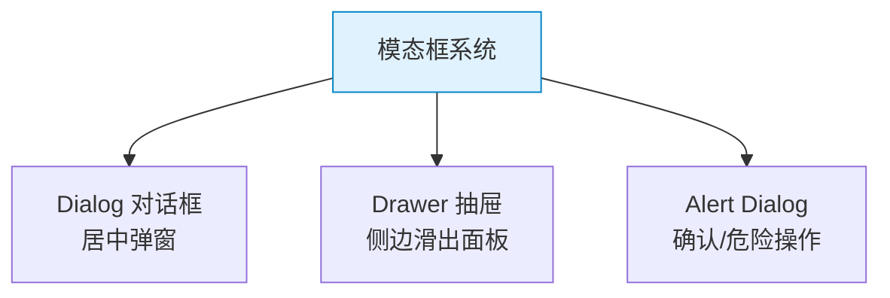

# TailwindCSS 实战组件：模态框 — Dialog / Drawer / Confirm

> **TL;DR**
> 模态框是中后台的核心交互模式，包括居中对话框（Dialog）、侧边抽屉（Drawer）和确认弹窗（Confirm）。本文用纯 Tailwind class 实现这三种变体，包含进出动画和无障碍支持。

---

## 📊 1. 模态框类型



---

## 💻 2. 居中对话框 Dialog

```html
<!-- 遮罩层 -->
<div class="fixed inset-0 z-50 bg-black/50 backdrop-blur-sm
            flex items-center justify-center p-4">
  
  <!-- 对话框 -->
  <div class="w-full max-w-lg rounded-xl bg-background shadow-xl
              animate-in fade-in-0 zoom-in-95" 
       role="dialog" aria-modal="true">
    
    <!-- Header -->
    <div class="flex items-center justify-between border-b px-6 py-4">
      <div>
        <h2 class="text-lg font-semibold">编辑用户</h2>
        <p class="text-sm text-muted-foreground">修改用户基本信息</p>
      </div>
      <button class="inline-flex size-8 items-center justify-center rounded-md hover:bg-accent transition-colors">
        <svg class="size-4" fill="none" stroke="currentColor" viewBox="0 0 24 24">
          <path stroke-linecap="round" stroke-linejoin="round" stroke-width="2" d="M6 18L18 6M6 6l12 12"/>
        </svg>
      </button>
    </div>
    
    <!-- Body -->
    <div class="max-h-[60vh] overflow-y-auto px-6 py-4">
      <div class="space-y-4">
        <div class="space-y-2">
          <label class="text-sm font-medium">姓名</label>
          <input class="h-10 w-full rounded-md border px-3 text-sm focus:outline-none focus:ring-2 focus:ring-ring" value="张三" />
        </div>
        <div class="space-y-2">
          <label class="text-sm font-medium">邮箱</label>
          <input class="h-10 w-full rounded-md border px-3 text-sm focus:outline-none focus:ring-2 focus:ring-ring" value="zhangsan@example.com" />
        </div>
      </div>
    </div>
    
    <!-- Footer -->
    <div class="flex justify-end gap-3 border-t px-6 py-4">
      <button class="h-9 rounded-md border px-4 text-sm font-medium hover:bg-accent transition-colors">
        取消
      </button>
      <button class="h-9 rounded-md bg-primary px-4 text-sm font-medium text-primary-foreground hover:bg-primary/90 transition-colors">
        保存
      </button>
    </div>
  </div>
</div>
```

---

## 📐 3. 侧边抽屉 Drawer

```html
<!-- 遮罩 -->
<div class="fixed inset-0 z-50 bg-black/50 transition-opacity duration-300">
</div>

<!-- 右侧抽屉 -->
<div class="fixed inset-y-0 right-0 z-50 w-full max-w-md bg-background shadow-xl
            transition-transform duration-300 ease-out translate-x-0">
  
  <!-- Header -->
  <div class="flex items-center justify-between border-b px-6 py-4">
    <h2 class="text-lg font-semibold">用户详情</h2>
    <button class="inline-flex size-8 items-center justify-center rounded-md hover:bg-accent">
      <svg class="size-4" fill="none" stroke="currentColor" viewBox="0 0 24 24">
        <path stroke-linecap="round" stroke-linejoin="round" stroke-width="2" d="M6 18L18 6M6 6l12 12"/>
      </svg>
    </button>
  </div>
  
  <!-- Body（可滚动） -->
  <div class="flex-1 overflow-y-auto px-6 py-4">
    <div class="space-y-6">
      <!-- 用户信息 -->
      <div class="flex items-center gap-4">
        <div class="size-16 rounded-full bg-gradient-to-br from-blue-500 to-purple-600"></div>
        <div>
          <h3 class="font-semibold">张三</h3>
          <p class="text-sm text-muted-foreground">admin@example.com</p>
        </div>
      </div>
      
      <!-- 信息列表 -->
      <dl class="space-y-3">
        <div class="flex justify-between">
          <dt class="text-sm text-muted-foreground">角色</dt>
          <dd class="text-sm font-medium">管理员</dd>
        </div>
        <div class="h-px bg-border"></div>
        <div class="flex justify-between">
          <dt class="text-sm text-muted-foreground">状态</dt>
          <dd class="inline-flex items-center gap-1">
            <span class="size-1.5 rounded-full bg-green-500"></span>
            <span class="text-sm font-medium">活跃</span>
          </dd>
        </div>
        <div class="h-px bg-border"></div>
        <div class="flex justify-between">
          <dt class="text-sm text-muted-foreground">创建时间</dt>
          <dd class="text-sm font-medium tabular-nums">2024-01-15</dd>
        </div>
      </dl>
    </div>
  </div>
  
  <!-- Footer -->
  <div class="flex gap-3 border-t px-6 py-4">
    <button class="h-9 flex-1 rounded-md border text-sm font-medium hover:bg-accent">编辑</button>
    <button class="h-9 flex-1 rounded-md bg-destructive text-sm font-medium text-destructive-foreground hover:bg-destructive/90">删除</button>
  </div>
</div>
```

---

## ⚠️ 4. 确认对话框 Alert Dialog

```html
<div class="fixed inset-0 z-50 flex items-center justify-center bg-black/50 p-4">
  <div class="w-full max-w-sm rounded-lg bg-background p-6 shadow-xl">
    <!-- 警告图标 -->
    <div class="mx-auto flex size-12 items-center justify-center rounded-full bg-destructive/10">
      <svg class="size-6 text-destructive" fill="none" stroke="currentColor" viewBox="0 0 24 24">
        <path stroke-linecap="round" stroke-linejoin="round" stroke-width="2" d="M12 9v2m0 4h.01m-6.938 4h13.856c1.54 0 2.502-1.667 1.732-3L13.732 4c-.77-1.333-2.694-1.333-3.464 0L3.34 16c-.77 1.333.192 3 1.732 3z"/>
      </svg>
    </div>
    
    <h3 class="mt-4 text-center text-lg font-semibold">确认删除？</h3>
    <p class="mt-2 text-center text-sm text-muted-foreground">
      此操作将永久删除用户 <span class="font-medium text-foreground">张三</span> 及其所有数据，且无法恢复。
    </p>
    
    <div class="mt-6 flex gap-3">
      <button class="h-9 flex-1 rounded-md border text-sm font-medium hover:bg-accent transition-colors">
        取消
      </button>
      <button class="h-9 flex-1 rounded-md bg-destructive text-sm font-medium text-destructive-foreground hover:bg-destructive/90 transition-colors">
        确认删除
      </button>
    </div>
  </div>
</div>
```

---

## 🧠 5. 向 AI 提问的 Prompt 模板

```
请用 TailwindCSS + React 实现以下模态框组件：
1. 通用 Dialog：Header + Body(可滚动) + Footer，支持不同尺寸 (sm/md/lg/xl/full)
2. 右侧 Drawer：滑入动画 + 遮罩 + 关闭按钮
3. Alert Dialog：居中确认框 + 危险操作警告
4. 所有组件需要：ESC 关闭、点击遮罩关闭、焦点锁定（focus trap）
5. 进出动画使用 transition-transform + opacity

请包含无障碍支持（role/aria-modal/aria-labelledby）。
```

---

*👉 下一步预告：[仪表盘布局.md](./仪表盘布局.md) — 完整的 Dashboard 页面布局*
